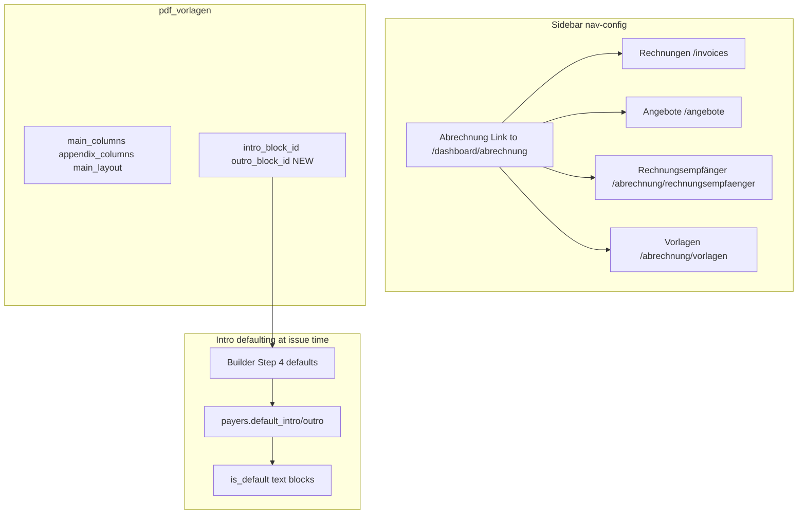

# Abrechnung navigation restructure and dashboard

## Scope (source of truth)

This plan follows [implementation-suggestions/abrechnung_nav_restructure_plan.md](implementation-suggestions/abrechnung_nav_restructure_plan.md) with these **codebase-aligned adjustments**:

1. **Frozen invoices (§14 snapshot):** PDFs and `getInvoiceDetail` already load intro/outro via `invoices.intro_block_id` / `outro_block_id` and joined `intro_block` / `outro_block` ([`src/features/invoices/api/invoices.api.ts`](src/features/invoices/api/invoices.api.ts) ~181–199, [`InvoicePdfDocument`](src/features/invoices/components/invoice-pdf/InvoicePdfDocument.tsx) ~138–139). **Do not** override persisted invoice rows at PDF time. New `pdf_vorlagen.intro_block_id` / `outro_block_id` apply to **default resolution before issue** (invoice builder Step 4 / [`step-4-confirm.tsx`](src/features/invoices/components/invoice-builder/step-4-confirm.tsx) defaults) and to **live preview** in the unified Vorlagen editor—not to rewriting historical invoices.

2. **Text authoring vs unified route:** The doc redirects `/dashboard/settings/invoice-templates` and `/dashboard/settings/pdf-vorlagen` to the **same** URL but also says text CRUD stays on a “dedicated” page linked from Brieftext. **Resolution:** On [`/dashboard/abrechnung/vorlagen`](src/app/dashboard/abrechnung/vorlagen/page.tsx) (new), use a **two-area layout**: primary = existing PanelList + unified PDF/text editor; secondary = **embedded** existing [`InvoiceTemplatesSettingsPage`](src/features/invoices/components/invoice-templates-settings-page.tsx) behind a clear “Brieftexte verwalten” collapsible or **tabs** (`Layout` | `Textbausteine`). “Texte verwalten →” then scrolls to that section or switches tab—**no** dead link to a route that only redirects back. Old bookmarks to `invoice-templates` still `permanentRedirect` to `/dashboard/abrechnung/vorlagen` (same as PDF old URL).

3. **KBar:** [`src/components/kbar/index.tsx`](src/components/kbar/index.tsx) already emits a parent action when `url !== '#'` plus child actions (lines 37–65). Once Abrechnung has a real `url`, **no structural kbar change** is required; verify shortcuts do not duplicate broken combos (existing `t`+`t` overlap between Fahrten and “Neue Fahrt” is pre-existing).

4. **Account icon:** Keep `icon: 'account'` unless you explicitly want the doc’s `user` key—both exist in [`src/components/icons.tsx`](src/components/icons.tsx).

---

## Architecture (after change)

---

## 1. Database migration

- Add new migration under [`supabase/migrations/`](supabase/migrations/) (use a timestamp **after** the latest file in repo, not necessarily `20260412120000` from the doc).
- `ALTER TABLE pdf_vorlagen ADD COLUMN intro_block_id uuid REFERENCES invoice_text_blocks(id) ON DELETE SET NULL` and same for `outro_block_id`, with `COMMENT ON COLUMN` as in the suggestion doc.
- RLS: same table; no new policies unless Supabase policies reference column lists explicitly (unlikely).

---

## 2. Types and API

- Extend [`PdfVorlageRow`](src/features/invoices/types/pdf-vorlage.types.ts) and [`PdfVorlageUpdatePayload`](src/features/invoices/types/pdf-vorlage.types.ts) with `intro_block_id` / `outro_block_id`.
- Update [`rowFromDb`](src/features/invoices/api/pdf-vorlagen.api.ts), [`createPdfVorlage`](src/features/invoices/api/pdf-vorlagen.api.ts) (explicit `null` for new cols), and [`updatePdfVorlage`](src/features/invoices/api/pdf-vorlagen.api.ts) patch object to read/write both FKs.

---

## 3. Intro/outro resolution (builder + preview only)

- Add a small helper (e.g. `resolveDefaultTextBlockIdsForInvoiceDraft`) used from invoice builder Step 4: order = **resolved `PdfVorlageRow` for payer/company** (reuse logic from [`enrich-invoice-detail-column-profile.ts`](src/features/invoices/lib/enrich-invoice-detail-column-profile.ts) / [`resolve-pdf-column-profile.ts`](src/features/invoices/lib/resolve-pdf-column-profile.ts)) → Vorlage `intro_block_id`/`outro_block_id` if non-null → else payer `default_*` → else company default block(s) from `listInvoiceTextBlocks` or targeted query.
- Wire [`step-4-confirm.tsx`](src/features/invoices/components/invoice-builder/step-4-confirm.tsx) default `intro_block_id` / `outro_block_id` form values to this helper when Vorlage supplies IDs.
- Update [`docs/invoice-text-templates.md`](docs/invoice-text-templates.md) priority list to document Vorlage-level FKs **for defaults**, with persisted invoice FKs still the legal snapshot.

---

## 4. Navigation config

- Edit [`src/config/nav-config.ts`](src/config/nav-config.ts): remove top-level Abrechnung + Angebote as in doc; nest **Rechnungen**, **Angebote**, **Rechnungsempfänger**, **Vorlagen** under Abrechnung with `url: '/dashboard/abrechnung'`; strip Rechnungsempfänger from Account; remove Rechnungsvorlagen + PDF-Vorlagen from Einstellungen; top comment block per doc.

---

## 5. Sidebar expand-and-navigate

- Update [`src/components/layout/app-sidebar.tsx`](src/components/layout/app-sidebar.tsx):
  - Detect `item.url && item.url !== '#' && item.items?.length`.
  - Render **Link** `SidebarMenuButton` + [`SidebarMenuAction`](src/components/ui/sidebar.tsx) + `CollapsibleTrigger` for chevron only (doc snippet; fix icon usage to match current `const Icon = Icons[item.icon]` pattern).
  - **Controlled open state** (or `defaultOpen` derived): expand when `pathname` is under `/dashboard/abrechnung` or matches a child route, so deep links are not hidden.

---

## 6. New Abrechnung dashboard

- Add [`src/app/dashboard/abrechnung/page.tsx`](src/app/dashboard/abrechnung/page.tsx) (metadata + auth shell consistent with other dashboard pages).
- New feature folder [`src/features/invoices/components/abrechnung-overview/`](src/features/invoices/components/abrechnung-overview/) (or `features/abrechnung/` if you prefer separation—doc says under invoices; either is fine if imports stay tidy):
  - **`use-abrechnung-kpis.ts`:** `useQuery` for `listInvoices({})` + `listAngebote({})` (or dedicated keys), compute: open = `status === 'sent'` and not overdue; overdue = `sent` and `addDays(created_at, payment_due_days) < startOfToday` (local TZ as per doc); this month = `sent_at` in current calendar month; pending Angebote = `status === 'sent'`. Document volume caveat (client-side full list) in JSDoc.
  - **`abrechnung-kpi-cards.tsx`:** Reuse [`StatsCard`](src/features/dashboard/components/stats-card.tsx) styling from [`src/app/dashboard/overview/layout.tsx`](src/app/dashboard/overview/layout.tsx).
  - **`abrechnung-recent-invoices.tsx`:** Last 10 by `created_at`; columns including derived “Fällig”; quick-pay for `sent` using `updateInvoiceStatus` from [`invoices.api.ts`](src/features/invoices/api/invoices.api.ts) with **React Query `onMutate` / `onError`** rollback on [`invoiceKeys`](src/query/keys/invoices.ts).
- **KPI card navigation:** Invoice list filters are local state today ([`invoice-list-table/index.tsx`](src/features/invoices/components/invoice-list-table/index.tsx)). Add optional **URL search params** (e.g. `?status=sent`) read as initial filter in `InvoiceListTable` or pass from [`src/app/dashboard/invoices/page.tsx`](src/app/dashboard/invoices/page.tsx) so KPI clicks can deep-link.

---

## 7. Routes and redirects

- **Rechnungsempfänger:** Add [`src/app/dashboard/abrechnung/rechnungsempfaenger/page.tsx`](src/app/dashboard/abrechnung/rechnungsempfaenger/page.tsx) (same shell as current [`src/app/dashboard/rechnungsempfaenger/page.tsx`](src/app/dashboard/rechnungsempfaenger/page.tsx)). Replace old page with `permanentRedirect` to new path.
- **Unified Vorlagen:** Add [`src/app/dashboard/abrechnung/vorlagen/page.tsx`](src/app/dashboard/abrechnung/vorlagen/page.tsx) composing new `vorlagen-page.tsx` (list + [`VorlageEditorPanel`](src/features/invoices/components/pdf-vorlagen/vorlage-editor-panel.tsx) extended or wrapped by `vorlage-text-section.tsx` for intro/outro selects bound to `updatePdfVorlage`).
- **Redirects:** [`src/app/dashboard/settings/invoice-templates/page.tsx`](src/app/dashboard/settings/invoice-templates/page.tsx) and [`src/app/dashboard/settings/pdf-vorlagen/page.tsx`](src/app/dashboard/settings/pdf-vorlagen/page.tsx) → `permanentRedirect('/dashboard/abrechnung/vorlagen')`.
- **Internal links:** Update [`payer-details-sheet.tsx`](src/features/payers/components/payer-details-sheet.tsx) (~719) and [`rechnungsempfaenger-page.tsx`](src/features/rechnungsempfaenger/components/rechnungsempfaenger-page.tsx) file header path comment; grep for any other hardcoded old paths.

---

## 8. Unified Vorlagen UI (implementation sketch)

- New [`src/features/invoices/components/vorlagen/`](src/features/invoices/components/vorlagen/) (names from doc): reuse [`PdfVorlagenSettingsPage`](src/features/invoices/components/pdf-vorlagen/pdf-vorlagen-settings-page.tsx) patterns but point routes at new app path; add `vorlage-text-section.tsx` (Selects + “Keine (Kostenträger-Standard)” = null FK); optional live PDF preview only if scope allows—doc mentions `usePDF` like builder; if too large, ship **text preview** first and PDF preview as follow-up.
- Invalidate [`invoiceKeys.pdfVorlagen.list`](src/query/keys/invoices.ts) after saves; text blocks [`invoiceKeys.textBlocks`](src/query/keys/invoices.ts) when editing blocks in embedded section.

---

## 9. Documentation

- Create [`docs/navigation.md`](docs/navigation.md) and [`docs/abrechnung-overview.md`](docs/abrechnung-overview.md) per doc outline.
- Update [`docs/invoice-text-templates.md`](docs/invoice-text-templates.md), [`docs/pdf-vorlagen.md`](docs/pdf-vorlagen.md), [`docs/rechnungsempfaenger.md`](docs/rechnungsempfaenger.md), [`docs/invoices-module.md`](docs/invoices-module.md) routes/sections.
- Inline comments: nav-config, app-sidebar, migration, KPI hook, recent invoices, unified editor, resolution helper (per doc table).

---

## 10. Verification

- `bun run build`
- `bun run test` (if configured)
- Manual smoke: expand-and-navigate, redirects, Vorlage save → builder default picks new intro, quick-pay optimistic UI, Cmd+K “Abrechnung” → overview
