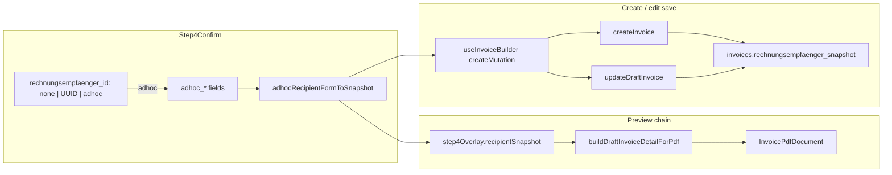

# Ad-hoc Rechnungsempfänger („Einmalig eingeben")

## Architecture



**Snapshot SSOT:** [`adhocRecipientFormToSnapshot()`](src/features/rechnungsempfaenger/api/rechnungsempfaenger.service.ts) — called only in Step 4 (overlay + submit). Hook receives the built snapshot; it never rebuilds ad-hoc JSON itself.

**File path note:** Step 4 lives at [`src/features/invoices/components/invoice-builder/step-4-confirm.tsx`](src/features/invoices/components/invoice-builder/step-4-confirm.tsx) (not under `steps/`).

---

## Step 1 — Snapshot helper

**File:** [`src/features/rechnungsempfaenger/api/rechnungsempfaenger.service.ts`](src/features/rechnungsempfaenger/api/rechnungsempfaenger.service.ts)

Add below `rechnungsempfaengerRowToSnapshot()`:

- `AdhocRecipientFormValues` interface (fields per spec)
- `adhocRecipientFormToSnapshot(form)` returning same snake_case keys as catalog snapshot
- Synthesise `name` (company_name → first+last → city) for [`recipientFromRechnungsempfaengerSnapshot`](src/features/invoices/components/invoice-pdf/lib/rechnungsempfaenger-pdf.ts) L106–121
- `id: null` explicit — no FK resolve
- **Why comments** on `name` synthesis and `id: null`

**Build gate:** `bun run build`

---

## Step 2 — Preview chain

### 2a — Overlay type

**File:** [`src/features/invoices/components/invoice-builder/use-invoice-builder-pdf-preview.tsx`](src/features/invoices/components/invoice-builder/use-invoice-builder-pdf-preview.tsx)

Extend `InvoiceBuilderStep4PdfOverlay`:

```ts
recipientSnapshot?: Record<string, unknown> | null | undefined; // ad-hoc only
```

Before `buildDraftInvoiceDetailForPdf` call (~L252–277):

```ts
const resolvedRecipientSnapshot =
  useStep4Overlay && step4Overlay?.recipientSnapshot != null
    ? step4Overlay.recipientSnapshot
    : undefined;
```

Pass `recipientSnapshot: resolvedRecipientSnapshot` into draft builder. Add `resolvedRecipientSnapshot` to `draftInvoice` useMemo deps and Category A effect deps (~L411, L433).

### 2b — Draft builder

**File:** [`src/features/invoices/components/invoice-pdf/build-draft-invoice-detail-for-pdf.ts`](src/features/invoices/components/invoice-pdf/build-draft-invoice-detail-for-pdf.ts)

Add optional param `recipientSnapshot?: Record<string, unknown> | null`.

Replace L283–285 snapshot block:

```ts
const empfaengerSnapshot =
  params.recipientSnapshot !== undefined
    ? params.recipientSnapshot
    : params.recipientRow
      ? rechnungsempfaengerRowToSnapshot(params.recipientRow)
      : null;
```

- `rechnungsempfaenger_id: params.recipientRow?.id ?? null` unchanged
- **Why comment:** snapshot param takes precedence over catalog row

**Invariant:** `recipientSnapshot === undefined` → identical to today.

**Build gate:** `bun run build`

---

## Step 3 — Create path

**File:** [`src/features/invoices/api/invoices.api.ts`](src/features/invoices/api/invoices.api.ts)

Extend `CreateInvoicePayload`:

```ts
rechnungsempfaengerSnapshot?: Record<string, unknown> | null;
```

Replace L257–265:

```ts
let empId = payload.rechnungsempfaengerId ?? null;
let empfaengerSnapshot: Record<string, unknown> | null = null;

if (payload.rechnungsempfaengerSnapshot !== undefined) {
  empfaengerSnapshot = payload.rechnungsempfaengerSnapshot;
  empId = null;
} else if (empId) {
  const row = await RechnungsempfaengerService.getById(empId);
  empfaengerSnapshot = row ? rechnungsempfaengerRowToSnapshot(row) : null;
}
```

**Why comment:** branch on `!== undefined` (not `!= null`) — `null` snapshot is an explicit ad-hoc empty state; `undefined` means use getById path.

**Build gate:** `bun run build`

---

## Step 4 — Step 4 UI

**File:** [`src/features/invoices/components/invoice-builder/step-4-confirm.tsx`](src/features/invoices/components/invoice-builder/step-4-confirm.tsx)

### 4a — Schema

Extend `step4Schema` with `adhoc_*` optional fields + `superRefine` when `rechnungsempfaenger_id === 'adhoc'`:

- Require `adhoc_company_name` OR `adhoc_last_name`
- Require `adhoc_address_line1`, `adhoc_postal_code`, `adhoc_city`

Export `AdhocRecipientFormValues` type from service for props reuse.

### 4b — Props / submit signature

```ts
defaultAdhocValues?: Partial<AdhocRecipientFormValues>;
onConfirm: (values: Step4Values, adhocSnapshot: Record<string, unknown> | null) => void;
```

### 4c — Form defaults

Populate `adhoc_*` from `defaultAdhocValues`; set `rechnungsempfaenger_id: 'adhoc'` when hydrating ad-hoc draft.

### 4d — Mode watch

`isAdhocMode = recipientMode === 'adhoc'`. Update `effectiveRecipientId` / `effectiveRow` logic: when ad-hoc, skip catalog lookup (`effectiveRow` undefined).

### 4e — Overlay emission (L259–274)

- **Ad-hoc:** watch `adhoc_*` fields; build snapshot via `adhocRecipientFormToSnapshot` when `address_line1` + `city` filled; emit `{ recipientRow: null, recipientSnapshot: adhocSnap }`
- **Catalog:** existing `{ recipientRow: effectiveRow, recipientSnapshot: undefined }`

### 4f — Segmented control UI

**Pre-flight:** Read [`src/components/ui/toggle-group.tsx`](src/components/ui/toggle-group.tsx) before implementing — confirm it exists and note its API (`type='single'`, `value` / `onValueChange`, `variant='outline'`, `ToggleGroupItem` children; reference usage in [`shift-reconciliation-filters.tsx`](src/features/shift-reconciliations/components/shift-reconciliation-filters.tsx) L68–88). If absent or incompatible, fall back to a `button` group with the same visual pattern as existing segmented controls in the builder.

Replace single Select with three-mode control (`ToggleGroup` preferred):

| Value | Label |
|---|---|
| `none` | Automatisch |
| catalog UUID | Aus Katalog |
| `adhoc` | Einmalig |

- `none` / catalog: keep existing catalog Select + description (unchanged copy)
- `adhoc`: hide catalog Select, show inline form

**Field preservation on mode switch:** when the user switches away from `'adhoc'`, do **not** reset `adhoc_*` fields. Preserve them so switching back restores typed values. Only clear on full form reset (e.g. new invoice flow restart).

### 4g — Inline form

Fields: Anrede, Vorname, Nachname, Firma, Abteilung, Straße (required), Adresszusatz, PLZ+Stadt (grid), Telefon. Map to `adhoc_*` keys.

### 4h — Read-only summary block (L398–453)

When `isAdhocMode` and minimum fields present, show address from ad-hoc form values (not catalog `effectiveRow`). Extend amber warning for incomplete ad-hoc required fields.

### 4i — Submit

```ts
form.handleSubmit((values) => {
  const adhocSnapshot = values.rechnungsempfaenger_id === 'adhoc'
    ? adhocRecipientFormToSnapshot({ ... })
    : null;
  onConfirm(values, adhocSnapshot);
})
```

**Build gate:** `bun run build`

---

## Step 5 — Hook + shell wiring

### 5a — [`index.tsx`](src/features/invoices/components/invoice-builder/index.tsx)

Update onConfirm (~L814):

```ts
onConfirm={(step4Values, adhocSnapshot) => {
  const snapshotOverride = { ... }; // unchanged pdf column payload
  if (isEditMode) {
    updateInvoice(step4Values, snapshotOverride, adhocSnapshot);
  } else {
    createInvoice(step4Values, snapshotOverride, adhocSnapshot);
  }
}}
```

Pass `defaultAdhocValues={defaultAdhocValues}` from hook to `Step4Confirm`.

### 5b — [`use-invoice-builder.ts`](src/features/invoices/hooks/use-invoice-builder.ts)

**State:** `defaultAdhocValues` — set during edit hydration.

**Initial value:** `undefined` for new invoices (never an empty object). Pass `undefined` — not `{}` — to `Step4Confirm` when not hydrating an ad-hoc draft, because Step 4c sets `rechnungsempfaenger_id: 'adhoc'` when `defaultAdhocValues` is truthy. An empty object would incorrectly activate ad-hoc mode on new invoices.

**createMutation** — extend args with `adhocSnapshot`:

```ts
if (empRaw === 'adhoc') {
  rechnungsempfaengerId = null;
  rechnungsempfaengerSnapshot = adhocSnapshot;
} else {
  rechnungsempfaengerId = empRaw === 'none' || ... ? catalogRecipientId ?? null : empRaw;
  // snapshot undefined → createInvoice uses getById
}
```

Pass `rechnungsempfaengerSnapshot` to `createInvoice()`.

**updateMutation** — explicit ad-hoc branch (differs from create):

```ts
let rechnungsempfaengerId: string | null | undefined;
let rechnungsempfaengerSnapshot: Record<string, unknown> | null | undefined;

if (empRaw === 'adhoc') {
  // Ad-hoc draft save: omit BOTH recipient fields from UpdateDraftInvoicePayload.
  // Do NOT pass a catalog UUID. Do NOT pass adhocSnapshot until re-freeze ships.
  // Step 6 sees neither ID nor snapshot → omits columns → DB snapshot preserved.
  rechnungsempfaengerId = undefined;
  rechnungsempfaengerSnapshot = undefined;
} else {
  rechnungsempfaengerId =
    empRaw === 'none' || empRaw === undefined || empRaw === null
      ? catalogRecipientId ?? null
      : empRaw;
  rechnungsempfaengerSnapshot = undefined; // catalog rebuild via getById when ID set
}

await updateDraftInvoice({
  ...,
  ...(rechnungsempfaengerId !== undefined && { rechnungsempfaengerId }),
  ...(rechnungsempfaengerSnapshot !== undefined && { rechnungsempfaengerSnapshot }),
});
```

When `empRaw !== 'adhoc'`, behaviour is unchanged (catalog ID → Step 6 getById rebuild).

**Draft hydration** (~L332):

```ts
const isAdhocDraft =
  detail.rechnungsempfaenger_id == null &&
  detail.rechnungsempfaenger_snapshot != null;
```

Map snapshot → `setDefaultAdhocValues({...})`. **Why comment:** null ID alone matches legacy invoices; snapshot presence distinguishes ad-hoc.

Export `defaultAdhocValues` from hook return.

Extend public `createInvoice` / `updateInvoice` signatures with optional third arg `adhocSnapshot`.

**Build gate:** `bun run build` + `bun test`

---

## Step 6 — `updateDraftInvoice` snapshot preservation (user-specified)

**File:** [`src/features/invoices/api/invoices.api.ts`](src/features/invoices/api/invoices.api.ts)

Extend `UpdateDraftInvoicePayload`:

```ts
rechnungsempfaengerSnapshot?: Record<string, unknown> | null;
```

Replace unconditional snapshot rebuild (L392–404) with conditional update object:

```ts
const updateFields: Record<string, unknown> = {
  intro_block_id: payload.introBlockId,
  outro_block_id: payload.outroBlockId,
  payment_due_days: payload.paymentDueDays,
  pdf_column_override: pdfColumnOverrideForUpdate,
  updated_at: new Date().toISOString(),
};

if (payload.rechnungsempfaengerId != null) {
  const row = await RechnungsempfaengerService.getById(payload.rechnungsempfaengerId);
  updateFields.rechnungsempfaenger_snapshot = row
    ? rechnungsempfaengerRowToSnapshot(row)
    : null;
  updateFields.rechnungsempfaenger_id = payload.rechnungsempfaengerId;
} else if (payload.rechnungsempfaengerSnapshot !== undefined) {
  updateFields.rechnungsempfaenger_snapshot = payload.rechnungsempfaengerSnapshot;
  updateFields.rechnungsempfaenger_id = null;
}
// else: omit snapshot + id columns — DB values survive untouched
```

**Principle:** omit columns from update payload; never write `null` over an existing ad-hoc snapshot unless explicitly intended.

**Manual test:** open ad-hoc draft → save without changes → re-open → snapshot + address still present.

**Build gate:** `bun run build`

---

## Step 7 — Validation

Rely on Zod `superRefine` — form won't call `onConfirm` with incomplete ad-hoc fields. Extend amber warnings in the read-only recipient block:

1. **Incomplete ad-hoc fields** (preview cannot render): existing „Kein Rechnungsempfänger" pattern — prompt user to fill required fields.
2. **Edit-mode ad-hoc deferral** (show when `isEditMode && isAdhocMode`): pass `isEditMode` from [`index.tsx`](src/features/invoices/components/invoice-builder/index.tsx) into `Step4Confirm`. Inform user that address edits on a saved ad-hoc draft are **not** persisted on save yet:

   > „Änderungen an der Adresse eines einmaligen Empfängers werden beim Speichern des Entwurfs noch nicht übernommen. Löschen Sie den Entwurf und erstellen Sie eine neue Rechnung, um eine andere Adresse zu verwenden."

   Preview may reflect typed edits; DB snapshot stays frozen until re-freeze ships.

No extra `submitDisabled` wiring in `index.tsx` unless needed after manual QA.

---

## Step 8 — Docs + comments (mandatory)

**File:** [`docs/rechnungsempfaenger.md`](docs/rechnungsempfaenger.md)

Add section **„Ad-hoc Empfänger (Einmalig)"**:

- Three-mode segmented control (`none` / UUID / `adhoc`)
- Snapshot contract (same keys as catalog; `id: null` valid)
- Create: pre-built snapshot, no `getById`
- Draft hydration: `rechnungsempfaenger_id == null && snapshot != null`
- Draft save: snapshot preserved when neither ID nor new snapshot passed

Add **why comments** at all new branch points (listed in user spec Hard Rules).

---

## Hard rules (every step)

1. Catalog path (`none` / UUID) functionally and visually identical — regression-test after each gate
2. `adhocRecipientFormToSnapshot` is the only snapshot builder (Step 4 overlay + submit)
3. Snapshot keys must match `rechnungsempfaengerRowToSnapshot` output exactly
4. `id: null` in ad-hoc snapshot — never FK-resolve
5. `createInvoice` / `updateDraftInvoice` branch on `rechnungsempfaengerSnapshot !== undefined`

## Deferred (out of scope)

- Re-freeze ad-hoc snapshot from **edited** form fields on draft save (interface ready via optional payload)
- Hard block when neither catalog nor ad-hoc recipient present
- Anrede Select (Herr/Frau) vs free text
- `country` field in ad-hoc form
- Storno / branch draft (already copy snapshot as-is)
- Catalog CRUD changes

## Test plan

| Scenario | Expected |
|---|---|
| Automatisch + catalog default | Unchanged behaviour + PDF |
| Catalog UUID override | Unchanged + „Manuell überschrieben" |
| Einmalig → fill form → preview | PDF shows ad-hoc address |
| Create with Einmalig | `rechnungsempfaenger_id = null`, snapshot JSONB populated |
| Re-open ad-hoc draft | Form hydrated, mode = Einmalig |
| Save ad-hoc draft unchanged | Snapshot preserved in DB |
| Edit ad-hoc address + save | Form/preview show edits; **DB snapshot unchanged** — amber warning shown; user must create new invoice to change address (deferred re-freeze) |
