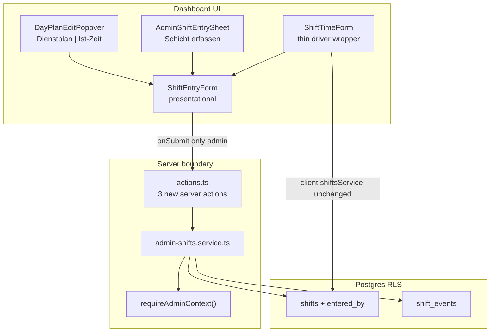

# Phase 4 — Admin Shift Entry (Payroll Actuals)

## Product rules (confirmed)

| Rule | Implementation |
| --- | --- |
| Admin authoritative | Overwrite ended shifts silently after inline notice |
| Block live shifts | Throw `ACTIVE_SHIFT_BLOCKED` when `existing.status !== SHIFT_STATUSES.ENDED` (`active` or `on_break`) — use constant, not string literal |
| One shift / driver / Berlin day | DB unique index + service overwrite-before-insert |
| Audit trail | `shifts.entered_by = admin userId`; driver self-entry stays `NULL` |
| Two entry points | Popover **Ist-Zeit** tab + toolbar **Schicht erfassen** Sheet |

**Out of scope:** Ist roster overlay (4B), `calcWeekHours` net-of-break, `/driver/shift` behaviour change, `shift_reconciliations`.

---

## Architecture



---

## Step 1 — Migration: schema + RLS

**File:** [`supabase/migrations/20260608130000_admin_shift_entry.sql`](supabase/migrations/20260608130000_admin_shift_entry.sql)

Use `20260608130000` (next after latest `20260605120200`; avoids collision if Phase 3B lands at `20260608120000`).

**1a.** `entered_by uuid REFERENCES accounts(id) ON DELETE SET NULL` + COMMENT (per spec).

**1b.** Unique index (note: spec comment says "partial" but SQL is a **full** unique index — correct for enforcing one row per driver per Berlin calendar date):

```sql
CREATE UNIQUE INDEX IF NOT EXISTS shifts_driver_berlin_date_unique
  ON public.shifts (
    driver_id,
    ((started_at AT TIME ZONE 'Europe/Berlin')::date)
  );
```

**Pre-migration risk:** If production already has duplicate `(driver_id, Berlin date)` rows, migration fails — resolve duplicates manually before apply.

**1c–1d.** Admin RLS policies on `shifts` (INSERT/UPDATE/DELETE) and `shift_events` (INSERT/DELETE) — mirror spec; add `TO authenticated` to match [`20260319100000_add_shifts_shift_events_rls.sql`](supabase/migrations/20260319100000_add_shifts_shift_events_rls.sql). Existing driver policies unchanged.

**Types:** Run `bun run db:types` after `supabase db push` — adds `entered_by: string | null` to [`src/types/database.types.ts`](src/types/database.types.ts) shifts Row/Insert/Update (~1299–1340).

**BUILD GATE:** `bun run build`

---

## Step 2 — Server service: `admin-shifts.service.ts`

**New file:** [`src/features/driver-planning/api/admin-shifts.service.ts`](src/features/driver-planning/api/admin-shifts.service.ts)

### Prerequisite: export `requireAdminContext`

Currently **private** in [`driver-planning.service.ts`](src/features/driver-planning/api/driver-planning.service.ts) (L30–52). Export it (or move to `admin-context.ts`) so `admin-shifts.service.ts` can import without duplicating auth logic.

### Timezone (critical deviation from driver client code)

Do **not** copy `shifts.service.ts` L179–184 (`new Date(...).toISOString()` — browser-local, wrong on server).

Use canonical Berlin helpers:

- **Write:** [`buildScheduledAt(ymd, hm)`](src/features/trips/lib/trip-time.ts) for `started_at`, `ended_at`, break timestamps
- **Read / duplicate lookup:** [`getZonedDayBoundsIso(date)`](src/features/trips/lib/trip-business-date.ts) + `.gte('started_at', startISO).lt('started_at', endExclusiveISO)` — same pattern as [`confirmShift`](src/features/shift-reconciliations/api/shift-reconciliations.service.ts) L229–237
- **Pre-fill times:** [`parseScheduledAt(iso)`](src/features/trips/lib/trip-time.ts) → `{ hm }` for form fields

PostgREST cannot filter on `(started_at AT TIME ZONE ...)::date` in JS client — use bounds, not raw SQL expression in `.eq()`.

### Functions

**`getAdminShiftForDriverDate(driverId, date)`**

- `requireAdminContext()` → filter by `company_id`, `driver_id`, zoned day bounds
- Select shift + nested `shift_events(event_type, timestamp, metadata)` ordered by timestamp
- Return mapped type (add to [`driver-planning/types.ts`](src/features/driver-planning/types.ts)):

```typescript
export type AdminShiftForDate = {
  id: string;
  status: string;
  startedAt: string;
  endedAt: string | null;
  vehicleId: string | null;
  startTime: string;  // HH:mm Berlin
  endTime: string;
  breaks: Array<{ start: string; end: string }>;
};
```

**Break parsing (explicit pairing logic):**

Import `SHIFT_EVENT_TYPES` and `SHIFT_STATUSES` from [`driver-portal/types.ts`](src/features/driver-portal/types.ts) — confirmed values: `SHIFT_STATUSES.ACTIVE = 'active'`, `SHIFT_STATUSES.ON_BREAK = 'on_break'`, `SHIFT_STATUSES.ENDED = 'ended'`.

1. Fetch `shift_events` ordered by `timestamp` ascending (PostgREST `.order('timestamp', { ascending: true })` on nested select, or sort in TS after fetch).
2. Walk the ordered list sequentially — **zip adjacent pairs**, do not index-match across the full array:
   - When event is `break_start`, peek next event: if it is `break_end`, emit `{ start: parseScheduledAt(break_start.timestamp).hm, end: parseScheduledAt(break_end.timestamp).hm }` and advance past both.
   - If next event is not `break_end` (unmatched / partial break — driver started break but never ended), **skip** that `break_start` for pre-fill (do not emit a break slot). Do not throw; partial breaks are ignored in the returned `breaks` array.
   - Orphan `break_end` without preceding `break_start`: skip silently.
3. `shift_start` / `shift_end` are used for `startTime` / `endTime` via `parseScheduledAt`, not included in `breaks`.

**`createAdminShiftForDriver(params)`** — no `companyId` in params (server resolves)

1. `requireAdminContext()` → `{ supabase, companyId, userId }`
2. Lookup existing via same bounds query
3. **ACTIVE_SHIFT_BLOCKED (D2):** use constant comparison — not a string literal:

```typescript
if (existing && existing.status !== SHIFT_STATUSES.ENDED) {
  throw new Error('ACTIVE_SHIFT_BLOCKED');
}
```

Blocks both `SHIFT_STATUSES.ACTIVE` and `SHIFT_STATUSES.ON_BREAK` (live shift on the road).

4. If found && `existing.status === SHIFT_STATUSES.ENDED` → delete events then shift (overwrite)
5. Insert shift: `{ driver_id, company_id, vehicle_id, started_at, ended_at, status: SHIFT_STATUSES.ENDED, entered_by: userId }`
6. Insert events using `SHIFT_EVENT_TYPES`: `shift_start`, break pairs (`metadata: { reason: 'Pause' }`), `shift_end`
7. Return `{ shiftId }`

Sequential awaits OK for MVP; document orphan-event risk in comment (Phase 4B RPC).

**`deleteAdminShift(shiftId)`**

- Verify shift exists with `company_id = companyId` before delete
- Delete events, then shift

**BUILD GATE:** `bun run build`

---

## Step 3 — Server actions

**File:** [`src/features/driver-planning/actions.ts`](src/features/driver-planning/actions.ts)

Add thin delegates (existing planning actions untouched):

| Action | Behaviour |
| --- | --- |
| `getAdminShiftForDriverDateAction(driverId, date)` | Returns `AdminShiftForDate \| null` |
| `createAdminShiftAction(params)` | Maps `ACTIVE_SHIFT_BLOCKED` → `{ success: false, error: 'ACTIVE_SHIFT_BLOCKED' }`; success → `revalidatePath('/dashboard/fahrerschichtplanung')` |
| `deleteAdminShiftAction(shiftId)` | Same result envelope |

Import from `admin-shifts.service.ts`, not `driver-planning.service.ts`.

**BUILD GATE:** `bun run build`

---

## Step 4 — Extract `ShiftEntryForm`

**New file:** [`src/features/driver-portal/components/shift-entry-form.tsx`](src/features/driver-portal/components/shift-entry-form.tsx)

Extract from [`shift-time-form.tsx`](src/features/driver-portal/components/shift-time-form.tsx):

- Move `parseTimeToMinutes`, `formatPaidDuration`, zod schema, field UI, Bezahlte Zeit display
- **Props:** `defaultDate?`, `defaultVehicleId?`, `existingShift?`, `vehicles?`, `onSubmit`, `onCancel?`, `isSubmitting?`, `submitError?`, `showDateField?` (default true; popover hides date — fixed from cell context)
- **No** `driverId` / `companyId` / `supabase.auth` — caller owns identity and persistence
- **No** duplicate AlertDialog

**Update** [`shift-time-form.tsx`](src/features/driver-portal/components/shift-time-form.tsx):

- Keep auth `useEffect` (L187–207), overwrite AlertDialog, Collapsible Card chrome
- Render `<ShiftEntryForm>` with `onSubmit={handleDriverSubmit}` closing over `driverId`/`companyId`
- Driver path unchanged: `getShiftForDriverByDate` → dialog → `deleteShift` + `createManualShift` via client `shiftsService`

**Invariant:** `/driver/shift` visually and behaviourally identical.

**BUILD GATE:** `bun run build`

---

## Step 5 — `AdminShiftEntryForm`

**New file:** [`src/features/driver-planning/components/admin-shift-entry-form.tsx`](src/features/driver-planning/components/admin-shift-entry-form.tsx)

**Props:** `{ driverId, date, onSaved, onCancel? }` — **no `companyId`** (server resolves)

On mount: `getAdminShiftForDriverDateAction` → map to `existingShift` pre-fill

- Existing shift: inline warning **"Schicht vorhanden — wird überschrieben"** (no AlertDialog — D/admin UX comment)
- Submit → `createAdminShiftAction`; map errors to German:
  - `ACTIVE_SHIFT_BLOCKED` → **"Fahrer hat eine aktive Schicht — Eintrag nicht möglich."**
  - else → **"Speichern fehlgeschlagen."**
- Delete button when shift exists → `deleteAdminShiftAction`
- Load vehicles client-side (same pattern as [`day-plan-edit-form.tsx`](src/features/driver-planning/components/day-plan-edit-form.tsx) L85–98)
- Pass `showDateField={false}` when `date` prop is fixed (popover); Sheet passes editable date via wrapper

**BUILD GATE:** `bun run build`

---

## Step 6 — UI integration (two entry points)

### 6a. Cell popover — **Ist-Zeit** tab

**File:** [`day-plan-edit-popover.tsx`](src/features/driver-planning/components/day-plan-edit-popover.tsx)

- Add shadcn `Tabs`: **Dienstplan** (existing `DayPlanEditForm`) | **Ist-Zeit** (`AdminShiftEntryForm`)
- Default tab: Dienstplan
- `PopoverContent`: add `max-h-[80vh] overflow-y-auto`; width stays `w-80`
- Tab comment: two tabs = two write targets (`driver_day_plans` vs `shifts`)
- `onSaved` on Ist-Zeit closes popover

**[`driver-roster-grid.tsx`](src/features/driver-planning/components/driver-roster-grid.tsx):** No structural change required — popover already receives `driverId` + `planDate` from `editTarget` (L297–308).

### 6b. Toolbar Sheet — **Schicht erfassen**

**File:** [`driver-planning-filters.tsx`](src/features/driver-planning/components/driver-planning-filters.tsx) (+ optional new [`admin-shift-entry-sheet.tsx`](src/features/driver-planning/components/admin-shift-entry-sheet.tsx))

**Correction vs FILES CHANGED table:** Do **not** add shift tab to [`day-plan-create-dialog.tsx`](src/features/driver-planning/components/day-plan-create-dialog.tsx) — spec Step 6b explicitly keeps plan and shift entry separate.

- Second toolbar button **"Schicht erfassen"** (Clock icon; label hidden on mobile)
- Sheet `side="right"`: driver Select (required) + DatePicker (default `todayYmdInBusinessTz()`) → `AdminShiftEntryForm` when both set
- Optional trivial UX: pre-select driver from `?driver=` filter param
- On save: close Sheet only (no week navigation)

**BUILD GATE:** `bun run build`

---

## Step 7 — Docs + required inline comments

**7a.** [`docs/driver-planning.md`](docs/driver-planning.md) — new **Phase 4 (shipped)** section: architecture, entry points, RLS policy names, `entered_by`, unique index, ACTIVE_SHIFT_BLOCKED, product decisions D1–D4, deferred 4B items. Update feature tree.

**7b.** [`docs/driver-portal.md`](docs/driver-portal.md) — note `ShiftEntryForm` extraction; driver route unchanged.

**7c.** Required WHY comments at locations specified in user brief (`admin-shifts.service.ts`, `admin-shift-entry-form.tsx`, `day-plan-edit-popover.tsx`, `shift-entry-form.tsx` header).

---

## Files changed (corrected)

| File | Change |
| --- | --- |
| `supabase/migrations/20260608130000_admin_shift_entry.sql` | NEW |
| `src/types/database.types.ts` | Regenerated (`entered_by`) |
| `src/features/driver-planning/api/driver-planning.service.ts` | Export `requireAdminContext` |
| `src/features/driver-planning/api/admin-shifts.service.ts` | NEW |
| `src/features/driver-planning/actions.ts` | 3 shift actions |
| `src/features/driver-planning/types.ts` | `AdminShiftForDate`, action payloads |
| `src/features/driver-portal/components/shift-entry-form.tsx` | NEW |
| `src/features/driver-portal/components/shift-time-form.tsx` | Thin wrapper |
| `src/features/driver-planning/components/admin-shift-entry-form.tsx` | NEW |
| `src/features/driver-planning/components/admin-shift-entry-sheet.tsx` | NEW (optional extract from filters) |
| `src/features/driver-planning/components/day-plan-edit-popover.tsx` | Ist-Zeit tab |
| `src/features/driver-planning/components/driver-planning-filters.tsx` | Sheet trigger |
| `docs/driver-planning.md` | Phase 4 |
| `docs/driver-portal.md` | ShiftEntryForm note |

**Not changed:** `day-plan-create-dialog.tsx`, `driver-roster-grid.tsx` (unless minor prop pass-through), `shift_reconciliations/*`, existing planning reads.

---

## Hard rules checklist

- `bun run build` after every step
- Admin paths: **never** `shiftsService` (browser client)
- Admin actions: **never** accept `companyId` from client
- `/driver/shift` unchanged after Step 4
- Berlin timezone: `buildScheduledAt` + `getZonedDayBoundsIso` (not `new Date(local)`)
- German UI for all admin errors (no raw codes)
- **ACTIVE_SHIFT_BLOCKED:** compare with `SHIFT_STATUSES.ENDED` from [`driver-portal/types.ts`](src/features/driver-portal/types.ts) — never `'ended'` string literal; import `SHIFT_STATUSES` + `SHIFT_EVENT_TYPES` in `admin-shifts.service.ts`
- **Break pre-fill:** sequential adjacent-pair zip on timestamp-ordered events; unmatched `break_start` → skip (no break slot), do not fail lookup

---

## Manual test plan (from spec)

1. Toolbar Sheet backfill → `entered_by` + break events
2. Cell Ist-Zeit overwrite → events replaced
3. Active shift block → German error, no write
4. Unique index → second concurrent insert fails gracefully
5. Dienstplan tab regression
6. `/driver/shift` regression
7. Optional: `?driver=` pre-fills Sheet
