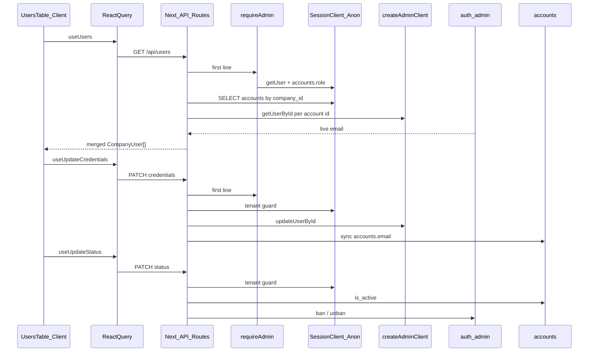

# Admin User Management — `/dashboard/users`

## Prerequisites

Read before coding (per your spec): [`src/lib/supabase/client.ts`](src/lib/supabase/client.ts), [`server.ts`](src/lib/supabase/server.ts), [`service-factory.ts`](src/lib/supabase/service-factory.ts), [`require-admin.ts`](src/lib/api/require-admin.ts), [`drivers/create/route.ts`](src/app/api/drivers/create/route.ts), [`drivers/[id]/route.ts`](src/app/api/drivers/[id]/route.ts), [`proxy.ts`](src/proxy.ts), [`dashboard/layout.tsx`](src/app/dashboard/layout.tsx), driver-management API/form, [`database.types.ts`](src/types/database.types.ts), [`access-control.md`](docs/access-control.md), [`accounts-table.md`](docs/accounts-table.md), [`user-management-audit.md`](docs/plans/user-management-audit.md).

**Build gate:** Run `bun run build` after each step; do not proceed until green.

---

## Pre-implementation verification

### `@supabase/supabase-js` version

| Source | Value |
| --- | --- |
| [`package.json`](package.json) | `"@supabase/supabase-js": "^2.58.0"` |
| **Resolved** (`node_modules/@supabase/supabase-js/package.json`) | **`2.98.0`** |

Well above v2.39+. GoTrue `ban_duration` on `auth.admin.updateUserById` is supported (Go duration string; units up to `h` — do **not** use `100y`).

### Step 5 — confirmed ban values

Define in [`src/app/api/users/[id]/status/route.ts`](src/app/api/users/[id]/status/route.ts) (or shared `src/lib/auth/ban-constants.ts` if preferred):

```ts
/** Permanent ban (~100 years). GoTrue rejects year suffixes like `100y`. */
export const AUTH_BAN_DURATION_PERMANENT = '876000h' as const;
/** Clears ban (reactivate auth login). */
export const AUTH_BAN_DURATION_UNBAN = '0s' as const;
```

| Action | `updateUserById` attributes |
| --- | --- |
| Deactivate (`is_active: false`) | `{ ban_duration: AUTH_BAN_DURATION_PERMANENT }` |
| Reactivate (`is_active: true`) | `{ ban_duration: AUTH_BAN_DURATION_UNBAN }` |

**Do not use** `ban_duration: 'none'` — that is not the documented permanent-ban value and was incorrect in the original spec.

Types: `ban_duration` may not appear in generated `@supabase/auth-js` typings in 2.98.0; pass via `AdminUserAttributes` / satisfies the admin API body — acceptable at call site with a short comment.

---

## Architecture



---

## Corrections vs your draft spec

| Topic | Adjustment |
| --- | --- |
| **Nav** | Add entry in [`src/config/nav-config.ts`](src/config/nav-config.ts) under **Account** (after **Fahrer**), not [`use-nav.ts`](src/hooks/use-nav.ts). `useFilteredNavItems` already returns `[]` for drivers—no nav hook change needed unless you want an explicit `access` field later. |
| **Proxy** | [`src/proxy.ts`](src/proxy.ts) matcher already covers `/dashboard/users`—**no proxy change**. |
| **Page admin guard** | `requireAdmin()` returns `NextResponse` (API-only). Add a small server helper, e.g. `assertAdminOrRedirect()` in [`src/lib/api/require-admin.ts`](src/lib/api/require-admin.ts), mirroring [`dashboard/layout.tsx`](src/app/dashboard/layout.tsx) (`redirect` on non-admin). Layout already blocks drivers; this is belt-and-suspenders for the new page only. |
| **Live auth email (GET)** | Your spec uses `listUsers()` (global, paginated). **Recommended:** `auth.admin.getUserById(id)` in parallel for each company `accounts` row—same outcome, no risk of processing other tenants’ auth records in memory. If you keep `listUsers`, you **must** paginate (`page` / `perPage`) until exhausted and merge **only** ids from the accounts query. |
| **Ban API** | **Verified** — see [Pre-implementation verification](#pre-implementation-verification) below. Use named constants `AUTH_BAN_DURATION_PERMANENT` / `AUTH_BAN_DURATION_UNBAN`; never `'none'`. |
| **Page guard** | **`assertAdminOrRedirect()`** — exact signature in [Step 7](#step-7--page--navigation); use `redirect()` from `next/navigation`, never `NextResponse.redirect`. |
| **Credentials errors** | Success → `toast.success` only. Failure → **inline** error in dialog (dialog stays open); **no** error toast. |
| **Query keys** | Add [`src/query/keys/users.ts`](src/query/keys/users.ts) with `userKeys.list()` → `['users', 'list']` per [`src/query/README.md`](src/query/README.md); export from [`src/query/keys/index.ts`](src/query/keys/index.ts). On status mutation, also `invalidateQueries({ queryKey: referenceKeys.drivers() })` so Fahrer lists respect `is_active`. |

---

## Step 1 — `createAdminClient()`

**Create** [`src/lib/supabase/admin.ts`](src/lib/supabase/admin.ts):

```ts
// Server-only. Never import from client components or feature modules.
export function createAdminClient(): SupabaseClient<Database> {
  const url = process.env.NEXT_PUBLIC_SUPABASE_URL;
  const key = process.env.SUPABASE_SERVICE_ROLE_KEY;
  if (!url || !key) throw new Error('Missing Supabase admin configuration');
  return createClient<Database>(url, key, {
    auth: { autoRefreshToken: false, persistSession: false }
  });
}
```

- No barrel file exists today—do not add `src/lib/supabase/index.ts`.
- **Optional follow-up (out of scope):** refactor [`drivers/create/route.ts`](src/app/api/drivers/create/route.ts) and export/cron routes to use this factory later.

---

## Step 2 — Fix driver PATCH IDOR

**Modify** [`src/app/api/drivers/[id]/route.ts`](src/app/api/drivers/[id]/route.ts) immediately after `requireAdmin()`:

- Use **session** `createClient()` (already imported).
- `select('company_id').eq('id', id).maybeSingle()` — **404** if missing, **403** if `company_id !== auth.companyId`.
- Then call `update_driver` unchanged.

Add audit-reference comment (why guard exists despite RLS + SECURITY DEFINER).

---

## Step 3 — `GET /api/users`

**Create** [`src/app/api/users/route.ts`](src/app/api/users/route.ts):

1. `requireAdmin()` first.
2. Session client: `from('accounts').select('id, name, first_name, last_name, role, is_active, created_at, phone').eq('company_id', auth.companyId).order('name')` — include **inactive** users (no `is_active` filter).
3. Admin client: resolve live email per id (`getUserById` recommended).
4. Merge → typed DTO in [`src/features/user-management/types.ts`](src/features/user-management/types.ts):

```ts
export type CompanyUser = {
  id: string;
  name: string;
  first_name: string | null;
  last_name: string | null;
  email: string | null; // from auth
  role: string;
  is_active: boolean | null;
  created_at: string | null;
  phone: string | null;
};
```

5. If auth user missing for an account id, return `email: null` (orphan edge case—do not drop row).

`export const dynamic = 'force-dynamic'`.

---

## Step 4 — `PATCH /api/users/[id]/credentials`

**Create** [`src/app/api/users/[id]/credentials/route.ts`](src/app/api/users/[id]/credentials/route.ts):

| Rule | Implementation |
| --- | --- |
| Auth | `requireAdmin()` first |
| Body | `{ email?: string; password?: string }` — at least one required |
| Validation | Email regex; `MIN_PASSWORD_LENGTH = 8` for password |
| Tenant guard | Session lookup + `company_id` match (404/403) |
| Order | `auth.admin.updateUserById` **first**; only on success, `accounts.email` update via admin client if email changed |
| Secrets | Never log or return password |

---

## Step 5 — `PATCH /api/users/[id]/status`

**Create** [`src/app/api/users/[id]/status/route.ts`](src/app/api/users/[id]/status/route.ts):

1. `requireAdmin()` + body `{ is_active: boolean }`.
2. Tenant guard (same as Step 4).
3. **400** if `params.id === auth.userId` — `"Eigenes Konto kann nicht deaktiviert werden"`.
4. **Order with rollback:**
   - Read current `is_active` (for rollback).
   - Update `accounts.is_active` via admin client.
   - Call `updateUserById` with `AUTH_BAN_DURATION_PERMANENT` (`'876000h'`) or `AUTH_BAN_DURATION_UNBAN` (`'0s'`) — see [Pre-implementation verification](#pre-implementation-verification).
   - If auth step fails → revert `accounts.is_active` to previous value → **500** with safe message.
5. No `deleteUser`.

---

## Step 6 — Feature module (UI + hooks)

**Create** under `src/features/user-management/`:

| File | Responsibility |
| --- | --- |
| [`types.ts`](src/features/user-management/types.ts) | `CompanyUser` |
| [`api/users.service.ts`](src/features/user-management/api/users.service.ts) | `fetchUsers()`, `patchCredentials()`, `patchStatus()` + hooks `useUsers`, `useUpdateCredentials`, `useUpdateStatus` |
| [`components/users-table.tsx`](src/features/user-management/components/users-table.tsx) | `'use client'` — shadcn `Table`, badges (Admin/Fahrer, Aktiv/Inaktiv), actions |
| [`components/edit-credentials-dialog.tsx`](src/features/user-management/components/edit-credentials-dialog.tsx) | Dialog; email pre-filled from API; password empty; German copy |

**UI patterns to mirror:** [`driver-management/components/drivers-table/columns.tsx`](src/features/driver-management/components/drivers-table/columns.tsx), [`DataTableSkeleton`](src/components/ui/table/data-table-skeleton.tsx), [`PageContainer`](src/components/layout/page-container.tsx).

**German strings:** Benutzerverwaltung, Keine Benutzer gefunden, E-Mail-Adresse, Neues Passwort, Leer lassen = unverändert, etc.

**Credentials dialog — feedback (mandatory):**

| Outcome | UX |
| --- | --- |
| **Success** | `toast.success('Zugangsdaten wurden aktualisiert.')` (or similar), then close dialog |
| **Failure** | **Inline only** — e.g. shadcn `Alert` variant `destructive` at top of dialog body, or `FormMessage` under the relevant field; show API `error` text from JSON. **Keep dialog open.** |
| **Failure** | **Do not** call `toast.error` — toasts auto-dismiss; auth validation errors must stay visible until the user fixes input |

Clear `credentialsError` state on dialog open / field change.

**Constraints:** Do not touch `driver-management/**`. Password never pre-filled. Submit disabled if both fields empty/unchanged.

---

## Step 7 — Page + navigation

### `assertAdminOrRedirect()` (add to [`src/lib/api/require-admin.ts`](src/lib/api/require-admin.ts))

Server Component helper — **not** for API routes (those keep `requireAdmin()` → `NextResponse`).

```ts
import { createClient } from '@/lib/supabase/server';
import { redirect } from 'next/navigation';

/** For dashboard pages that must be admin-only. Uses redirect(), not NextResponse. */
export async function assertAdminOrRedirect(): Promise<{
  companyId: string;
  userId: string;
}> {
  const supabase = await createClient();
  const {
    data: { user }
  } = await supabase.auth.getUser();

  if (!user) {
    redirect('/auth/sign-in');
  }

  const { data: account } = await supabase
    .from('accounts')
    .select('role, company_id')
    .eq('id', user.id)
    .maybeSingle();

  if (!account?.role) {
    redirect('/auth/sign-in');
  }

  if (
    account.role !== 'admin' ||
    account.company_id == null ||
    account.company_id === ''
  ) {
    // Match dashboard/layout.tsx — drivers go to portal, not overview
    redirect('/driver/shift');
  }

  return { companyId: account.company_id, userId: user.id };
}
```

**Important:** Use `redirect()` from `next/navigation` only — **never** `NextResponse.redirect()` in a Server Component page.

**Create** [`src/app/dashboard/users/page.tsx`](src/app/dashboard/users/page.tsx):

- First line of default export: `await assertAdminOrRedirect()` (return value optional unless needed later).
- `PageContainer` title **Benutzerverwaltung**.
- Render client `UsersTable` (or thin `users-page-content.tsx` wrapper).

**Modify** [`src/config/nav-config.ts`](src/config/nav-config.ts):

```ts
{
  title: 'Benutzer',
  url: '/dashboard/users',
  icon: 'users', // add Icons.users = IconUsers in icons.tsx
  shortcut: ['b', 'n']
}
```

Place after **Fahrer** in Account group. Add `users: IconUsers` to [`src/components/icons.tsx`](src/components/icons.tsx) (avoid reusing `teams` used by Fahrgäste).

---

## Step 8 — Documentation (mandatory)

| File | Content |
| --- | --- |
| **CREATE** [`docs/user-management.md`](docs/user-management.md) | Module overview, routes, auth admin methods, data-flow diagram, security (tenant guard + ban), deferred items |
| **MODIFY** [`docs/access-control.md`](docs/access-control.md) | `createAdminClient` inventory; three new routes; tenant-guard pattern for all admin mutations |

**Inline “why” comments** on: `admin.ts`, credentials route, status route, driver `[id]` guard, edit-credentials dialog.

---

## Files summary

| File | Action |
| --- | --- |
| `src/lib/supabase/admin.ts` | CREATE |
| `src/lib/api/require-admin.ts` | MODIFY (+ `assertAdminOrRedirect`) |
| `src/app/api/drivers/[id]/route.ts` | MODIFY (tenant guard) |
| `src/app/api/users/route.ts` | CREATE |
| `src/app/api/users/[id]/credentials/route.ts` | CREATE |
| `src/app/api/users/[id]/status/route.ts` | CREATE |
| `src/query/keys/users.ts` + `keys/index.ts` | CREATE / MODIFY |
| `src/features/user-management/**` | CREATE |
| `src/app/dashboard/users/page.tsx` | CREATE |
| `src/config/nav-config.ts` + `src/components/icons.tsx` | MODIFY |
| `docs/user-management.md` | CREATE |
| `docs/access-control.md` | MODIFY |

**Not in scope (explicit):** invite admin, delete users, role UI, sign-up fix, `update_driver` SQL, `GRANT TO anon`, last-admin guard.

---

## Hard rules checklist

1. `requireAdmin()` first in every new API handler  
2. Tenant guard on every write / `auth.admin.*` by id  
3. `createAdminClient()` only in `src/app/api/**` and `scripts/**`  
4. `MIN_PASSWORD_LENGTH = 8` constant  
5. `bun run build` after each step  
6. German UI only  
7. No driver-management edits  
8. No new DELETE/INSERT RLS on `accounts`
