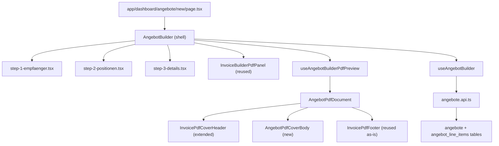

# Angebote Module Build

## Architecture overview




## Critical pre-work note — migration timestamp

The latest migration is `20260409130000`. The user-specified filename `20260408220000_create_angebote.sql` predates two existing migrations and risks ordering issues. **Use `20260409150000_create_angebote.sql`** instead. All other content from the spec is correct.

## Critical pre-work note — `InvoicePdfCoverHeader` extension

The header's right-side meta grid has hardcoded labels (`Rechnungsdaten`, `Rechnungsnr.`, `Rechnungsdatum`, `Leistungszeitraum`, `St.-Nr.`, `USt-IdNr.`). The offer needs different labels. Add an **optional, backward-compatible `metaConfig` prop** to `[src/features/invoices/components/invoice-pdf/invoice-pdf-cover-header.tsx](src/features/invoices/components/invoice-pdf/invoice-pdf-cover-header.tsx)`:

```typescript
export interface PdfCoverHeaderMetaConfig {
  heading?: string;          // default: 'Rechnungsdaten'
  numberLabel?: string;      // default: 'Rechnungsnr.'
  dateLabel?: string;        // default: 'Rechnungsdatum'
  showTaxIds?: boolean;      // default: true — hides St.-Nr. / USt-IdNr. rows when false
  periodLabel?: string;      // default: 'Leistungszeitraum'
  periodValue?: string;      // when set, renders as single line instead of from–to range
}
```

All existing invoice callers pass nothing → zero regression. `AngebotPdfDocument` passes `{ heading: 'Angebotsdaten', numberLabel: 'Angebotsnr.', dateLabel: 'Angebotsdatum', showTaxIds: false, periodLabel: 'Gültig bis', periodValue: formatted valid_until }`.

---

## Phase 1 — Database migration

**File:** `supabase/migrations/20260409150000_create_angebote.sql`

Content mirrors the spec SQL with two corrections:

- RLS uses `public.current_user_is_admin()` and `public.current_user_company_id()` (existing helpers from `20260318130000_rename_users_to_accounts.sql`) instead of raw `accounts` subquery — consistent with all existing RLS policies
- Add SECURITY DEFINER RPC `angebot_numbers_max_for_prefix(p_prefix text)` — mirrors `invoice_numbers_max_for_prefix` exactly (same pattern from `20260401180000_invoices_invoice_line_items_rls.sql`)

RPC pattern to follow:

```sql
CREATE OR REPLACE FUNCTION public.angebot_numbers_max_for_prefix(p_prefix text)
RETURNS text LANGUAGE plpgsql STABLE SECURITY DEFINER SET search_path = public
AS $$ BEGIN
  IF NOT public.current_user_is_admin() THEN RAISE EXCEPTION 'not authorized' USING ERRCODE = '42501'; END IF;
  RETURN (SELECT a.angebot_number FROM public.angebote a WHERE a.angebot_number LIKE p_prefix || '%' ORDER BY a.angebot_number DESC LIMIT 1);
END; $$;
GRANT EXECUTE ON FUNCTION public.angebot_numbers_max_for_prefix(text) TO authenticated;
```

---

## Phase 2 — Types, API, query keys, number lib

**New files:**

- `[src/features/angebote/types/angebot.types.ts](src/features/angebote/types/angebot.types.ts)` — `AngebotStatus`, `AngebotRow`, `AngebotLineItemRow`, `AngebotWithLineItems`, `AngebotColumnKey`, `AngebotColumnProfile` exactly as specified in the prompt
- `[src/features/angebote/api/angebote.api.ts](src/features/angebote/api/angebote.api.ts)` — `listAngebote`, `getAngebot`, `createAngebot`, `updateAngebot`, `deleteAngebot`, `updateAngebotStatus` — mirror `[src/features/invoices/api/invoices.api.ts](src/features/invoices/api/invoices.api.ts)` pattern; `createAngebot` calls `generateNextAngebotNumber()` and inserts header + line items in sequence
- `[src/features/angebote/lib/angebot-number.ts](src/features/angebote/lib/angebot-number.ts)` — mirror `[src/features/invoices/lib/invoice-number.ts](src/features/invoices/lib/invoice-number.ts)` exactly; prefix `AG`; calls RPC `angebot_numbers_max_for_prefix`; format `AG-{YYYY}-{MM}-{NNNN}`. Required JSDoc:

```typescript
/**
 * Generates the next Angebotsnummer in the format AG-{YYYY}-{MM}-{NNNN}.
 *
 * Sequence resets to 0001 at the start of each calendar month.
 * The RPC `angebot_numbers_max_for_prefix` is SECURITY DEFINER — it bypasses RLS
 * to find the MAX existing number for the current month prefix without leaking
 * other companies' data (it still enforces admin-only access).
 *
 * Mirror of src/features/invoices/lib/invoice-number.ts — keep in sync if the
 * invoice number format ever changes.
 */
```

- `[src/query/keys/angebote.ts](src/query/keys/angebote.ts)` — query key factory following the pattern in `[src/query/keys/invoices.ts](src/query/keys/invoices.ts)`; export `angebotKeys = { all, list, detail(id) }`
- Update `[src/query/keys/index.ts](src/query/keys/index.ts)` to re-export `angebotKeys`

---

## Phase 3 — PDF components

**New files:**

- `[src/features/angebote/components/angebot-pdf/angebot-pdf-columns.ts](src/features/angebote/components/angebot-pdf/angebot-pdf-columns.ts)` — define `ANGEBOT_COLUMN_DEFS` for the 5 fixed columns (`position`, `leistung`, `anfahrtkosten`, `price_first_5km`, `price_per_km_after_5`) with label, widths, align, format; `calcAngebotColumnWidths()` mirrors the `calcColumnWidths` signature from `[src/features/invoices/components/invoice-pdf/pdf-column-layout.ts](src/features/invoices/components/invoice-pdf/pdf-column-layout.ts)` but hardcoded to portrait (515pt usable)
- `[src/features/angebote/components/angebot-pdf/AngebotPdfCoverBody.tsx](src/features/angebote/components/angebot-pdf/AngebotPdfCoverBody.tsx)` — renders: subject line → salutation (4 cases) → intro text → line items table (no totals row) → outro text; imports `styles` from `pdf-styles.ts`; imports column defs from `angebot-pdf-columns.ts`. Required JSDoc:

```typescript
/**
 * Renders the offer body: subject → salutation → intro → line items table → outro.
 *
 * Salutation logic:
 *   Herr  + name → "Sehr geehrter Herr [name],"
 *   Frau  + name → "Sehr geehrte Frau [name],"
 *   null anrede + name → "Sehr geehrte/r [name],"
 *   no name at all  → "Sehr geehrte Damen und Herren,"
 *
 * No totals row — offers are informational pricing documents, not tax invoices.
 * Tax calculation (§14 UStG) is the invoice's responsibility, not the offer's.
 */
```

- `[src/features/angebote/components/angebot-pdf/AngebotPdfDocument.tsx](src/features/angebote/components/angebot-pdf/AngebotPdfDocument.tsx)` — root `Document`/`Page`; composes `InvoicePdfCoverHeader` (with `metaConfig` for offer labels) + `AngebotPdfCoverBody` + `InvoicePdfFooter`; builds `senderFit` via `fitSenderLine`; maps `angebot.recipient_*` fields to the header `recipient` shape. Required JSDoc:

```typescript
/**
 * Root PDF document for Angebote (offers).
 *
 * Reuses InvoicePdfCoverHeader and InvoicePdfFooter from the invoices module
 * unchanged — only the metaConfig prop is used to relabel the meta grid
 * (Angebotsnr., Angebotsdatum, Gültig bis) and hide tax ID rows.
 *
 * The body is fully separate (AngebotPdfCoverBody) — offers have no trip line
 * items, no tax totals, and no SEPA QR block.
 *
 * WHY reuse the invoice header/footer: visual consistency across all PDF
 * documents sent to customers. When company branding changes (logo, slogan,
 * footer legal text), both invoice and offer PDFs update automatically.
 */
```

**Modified file:**

- `[src/features/invoices/components/invoice-pdf/invoice-pdf-cover-header.tsx](src/features/invoices/components/invoice-pdf/invoice-pdf-cover-header.tsx)` — add optional `metaConfig?: PdfCoverHeaderMetaConfig` prop with all defaults matching current output; no existing behavior changes. Add the following JSDoc above the `metaConfig` interface:

```typescript
/**
 * Optional metaConfig prop — all fields default to invoice label values.
 * When not passed (all existing invoice callers), output is identical to before.
 * Used by AngebotPdfDocument to relabel the meta grid without duplicating
 * this component.
 *
 * IMPORTANT: Do not add offer-specific logic to this file. Pass data via
 * metaConfig only. This component belongs to the invoices module —
 * Angebote is a consumer, not an owner.
 */
```

---

## Phase 4a — Extract `BuilderSectionCard` (isolated, verified first)

**New file:** `[src/components/ui/builder-section-card.tsx](src/components/ui/builder-section-card.tsx)`

Extract `BuilderSectionCard` + `BuilderSectionCardProps` verbatim from `[src/features/invoices/components/invoice-builder/index.tsx](src/features/invoices/components/invoice-builder/index.tsx)` lines 147–245. Keep the same `Collapsible`/shadcn dependencies. Add the JSDoc:

```typescript
/**
 * Extracted from invoice-builder/index.tsx — shared by InvoiceBuilder and
 * AngebotBuilder.
 *
 * If you modify this component, verify both builders visually — they share
 * the same shell pattern but have different section counts and labels.
 */
```

**Modified file:**

- `[src/features/invoices/components/invoice-builder/index.tsx](src/features/invoices/components/invoice-builder/index.tsx)` — replace inline definition with `import { BuilderSectionCard } from '@/components/ui/builder-section-card'`; zero behavior change

**Verification gate — do not proceed to Phase 4b until:**

- `bun run build` passes with zero TypeScript errors
- Invoice builder renders identically: section cards, progress dots, lock/complete states all unchanged

---

## Phase 4b — Use `BuilderSectionCard` in `AngebotBuilder`

Only after Phase 4a is confirmed: `[src/features/angebote/components/angebot-builder/index.tsx](src/features/angebote/components/angebot-builder/index.tsx)` imports `BuilderSectionCard` from `@/components/ui/builder-section-card`.

---

## Phase 5 — Offer builder hooks

**New files:**

- `[src/features/angebote/hooks/use-angebote.ts](src/features/angebote/hooks/use-angebote.ts)` — `useAngeboteList`, `useAngebotDetail` using `angebotKeys`
- `[src/features/angebote/hooks/use-angebot-builder.ts](src/features/angebote/hooks/use-angebot-builder.ts)` — manages local `AngebotLineItemRow[]` state (add/delete/reorder/update), recipient fields via `useState`, and `createAngebot` mutation; returns all state + handlers to the shell

---

## Phase 6 — Offer builder shell + steps

**New files under `src/features/angebote/components/angebot-builder/`:**

- `index.tsx` — shell; same `flex h-full min-h-0 gap-0 overflow-hidden` split as invoice builder; left column `w-[480px] shrink-0 border-r`; right column `hidden lg:flex flex-1`; 3 `BuilderSectionCard` sections + 5-dot progress bar; mobile `Sheet` preview; saves on confirm and navigates to `/dashboard/angebote/[id]`
- `step-1-empfaenger.tsx` — RHF form: Firma, Ansprechperson, Anrede (Select: Herr/Frau/keine Angabe), Adresse (`AddressAutocomplete` from `src/features/trips/components/trip-address-passenger/address-autocomplete.tsx` — fills street/nr/zip/city via `onSelectCallback`), E-Mail, Telefon, Kundennummer
- `step-2-positionen.tsx` — `@dnd-kit/sortable` reorderable table of line items; columns: Pos (auto), Leistung (Input), Anfahrtkosten (number Input), erste 5km (number Input), nach 5km (number Input), × delete button; "+ Zeile hinzufügen" button; cannot delete last row. Add inline comment above the delete guard:

```typescript
// Cannot delete the last row — an offer must always have at least one Leistung.
// This is a UX guard only; the DB has no min-row constraint.
```

- `step-3-details.tsx` — Betreff (Input), Angebotsdatum (DatePicker, default today), Gültig bis (DatePicker, optional), Einleitung (Textarea + template picker using `useAllInvoiceTextBlocks`), Schlussformel (Textarea + template picker), Angebotsvorlage (single "Standard" preset for now)
- `use-angebot-builder-pdf-preview.tsx` — mirrors `use-invoice-builder-pdf-preview.tsx`; debounce 600ms; builds draft `AngebotWithLineItems` from form state → runs `usePDF(<AngebotPdfDocument />)`; resolves logo signed URL via `resolveCompanyAssetUrl` (same pattern); returns `{ pdf, draftAngebot }`. Required JSDoc:

```typescript
/**
 * Drives the live PDF preview in the Angebot builder right panel.
 *
 * Debounce is intentionally 600ms (vs 300ms in invoice builder) because the
 * offer form has more free-text fields (subject, recipient name, intro/outro)
 * where rapid keystroke re-renders would be jarring.
 *
 * Pattern mirrors use-invoice-builder-pdf-preview.tsx exactly:
 * form state → draft AngebotWithLineItems → usePDF(AngebotPdfDocument) → blob URL
 */
```

---

## Phase 7 — Routes

- `[src/app/dashboard/angebote/page.tsx](src/app/dashboard/angebote/page.tsx)` — server component; fetches list via `listAngebote`; renders table with columns: Angebotsnr., Empfänger, Betreff, Datum, Gültig bis, Status badge; "Neues Angebot" → `/dashboard/angebote/new`
- `[src/app/dashboard/angebote/new/page.tsx](src/app/dashboard/angebote/new/page.tsx)` — server component; fetches `companyProfile` + `defaultPaymentDays`; renders `AngebotBuilder`; blocks with Alert if company profile missing (same pattern as invoice builder)
- `[src/app/dashboard/angebote/[id]/page.tsx](src/app/dashboard/angebote/[id]/page.tsx)` — server component; fetches `AngebotWithLineItems`; shows offer details + `PDFViewer` (`AngebotPdfDocument`); status action buttons (gesendet / angenommen / abgelehnt); download PDF button

---

## Phase 8 — Navigation and icon

- `[src/components/icons.tsx](src/components/icons.tsx)` — add `angebot: IconFilePen` (import `IconFilePen` from `@tabler/icons-react`)
- `[src/config/nav-config.ts](src/config/nav-config.ts)` — add top-level entry after `Abrechnung`:

```typescript
{
  title: 'Angebote',
  url: '/dashboard/angebote',
  icon: 'angebot',
  shortcut: ['g', 'g'],
  isActive: false,
  items: []
}
```

---

## Phase 9 — Documentation

`[docs/angebote-module.md](docs/angebote-module.md)` — create with all of the following sections:

- **Architecture overview** — module scope, feature-based folder layout, data flow diagram
- **DB schema reference** — `angebote` and `angebot_line_items` table columns, types, RLS policy summary
- **Offer number format** — `AG-YYYY-MM-NNNN`, per-month reset, RPC `angebot_numbers_max_for_prefix`, retry-on-conflict note
- **Status lifecycle** — `draft → sent → accepted / declined`; which transitions are allowed from the detail page
- **PDF structure** — reused header/footer + new body; `metaConfig` label overrides used; no SEPA QR, no totals row
- **Salutation logic** — all 4 cases (Herr + name, Frau + name, null anrede + name, no name)
- **Column profile system** — currently hardcoded "Standard" 5-column preset; `AngebotColumnProfile` type; see "Future" section for Vorlagen
- **Shared infrastructure** — explicitly list what is borrowed from the invoices module:
  - `InvoicePdfCoverHeader` (with `metaConfig` extension)
  - `InvoicePdfFooter`
  - `InvoiceBuilderPdfPanel`
  - `invoice_text_blocks` table (intro/outro templates)
  - `BuilderSectionCard`
  State the ownership rule: *Angebote is a consumer of invoices infrastructure, never an owner. Any modification to a shared component must be backward-compatible and must not break existing invoice behavior.*
- **Future: Angebotsvorlagen** — note that the column profile is currently hardcoded to the "Standard" 5-column preset and a full Vorlagen settings page (mirroring `/dashboard/settings/pdf-vorlagen`) is the planned next step. When implemented, it should follow the exact same 4-tier cascade pattern as `resolvePdfColumnProfile`.

---

## Complete file change summary

**New files (28):**

- `supabase/migrations/20260409150000_create_angebote.sql`
- `src/features/angebote/types/angebot.types.ts`
- `src/features/angebote/api/angebote.api.ts`
- `src/features/angebote/lib/angebot-number.ts`
- `src/features/angebote/hooks/use-angebote.ts`
- `src/features/angebote/hooks/use-angebot-builder.ts`
- `src/features/angebote/components/angebot-pdf/angebot-pdf-columns.ts`
- `src/features/angebote/components/angebot-pdf/AngebotPdfCoverBody.tsx`
- `src/features/angebote/components/angebot-pdf/AngebotPdfDocument.tsx`
- `src/features/angebote/components/angebot-builder/index.tsx`
- `src/features/angebote/components/angebot-builder/step-1-empfaenger.tsx`
- `src/features/angebote/components/angebot-builder/step-2-positionen.tsx`
- `src/features/angebote/components/angebot-builder/step-3-details.tsx`
- `src/features/angebote/components/angebot-builder/use-angebot-builder-pdf-preview.tsx`
- `src/app/dashboard/angebote/page.tsx`
- `src/app/dashboard/angebote/new/page.tsx`
- `src/app/dashboard/angebote/[id]/page.tsx`
- `src/query/keys/angebote.ts`
- `src/components/ui/builder-section-card.tsx`
- `docs/angebote-module.md`

**Modified files (5):**

- `src/features/invoices/components/invoice-pdf/invoice-pdf-cover-header.tsx` — add optional `metaConfig` prop
- `src/features/invoices/components/invoice-builder/index.tsx` — import extracted `BuilderSectionCard`
- `src/query/keys/index.ts` — re-export `angebotKeys`
- `src/components/icons.tsx` — add `angebot` icon
- `src/config/nav-config.ts` — add Angebote nav item

---

## Verification checklist

- **Phase 4a gate:** `bun run build` passes after `BuilderSectionCard` extraction before any Angebote code is written
- **Invoice builder unchanged:** section cards, progress dots, lock/complete states render identically after extraction
- `**InvoicePdfCoverHeader` regression:** with no `metaConfig` passed, header output is byte-for-byte identical to before the extension
- **Offer number sequence:** `AG-2026-04-0001` on first offer, `AG-2026-04-0002` on second, `AG-2026-05-0001` on first offer in May
- **PDF preview:** live preview updates as user types in left panel (debounced 600ms)
- **Salutation:** all 4 cases render correctly (Herr + name, Frau + name, null anrede + name, no name)
- **Address autocomplete:** fills street, street_number, zip, city via `onSelectCallback`
- **Line items:** add row, delete row, reorder via drag, cannot delete last row
- **Intro/outro template picker:** populates textarea on selection
- **Status transitions:** gesendet / angenommen / abgelehnt buttons work from detail page
- **Final build:** `bun run build` passes with zero TypeScript errors across the full codebase

