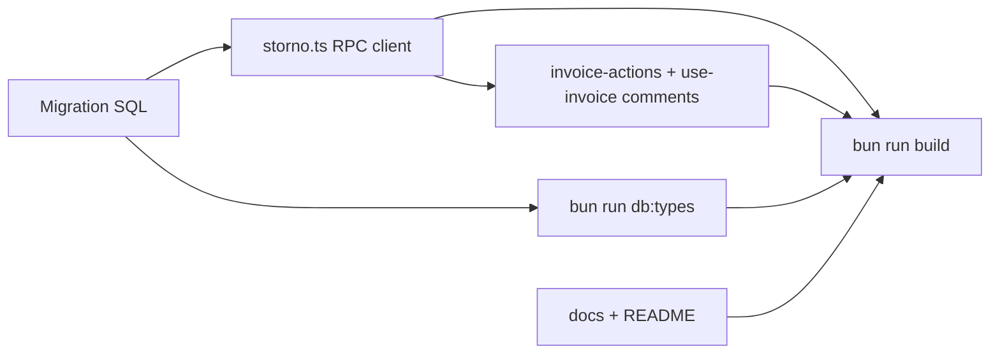

# Atomic Storno via Postgres RPC

## Phase 0 — File and sequence inventory

### Files to **create**

| Path                                                                                                                   | One-line purpose                                                                                                                                          |
| ---------------------------------------------------------------------------------------------------------------------- | --------------------------------------------------------------------------------------------------------------------------------------------------------- |
| `[supabase/migrations/20260411120000_storno_atomic_rpc.sql](supabase/migrations/20260411120000_storno_atomic_rpc.sql)` | Defines `public.create_storno_invoice(...)`, grants, comment, and (recommended) auth/validation guards aligned with existing `SECURITY DEFINER` patterns. |

Timestamp `**20260411120000`** is chosen to sort **after** the latest invoice-related migrations in the repo (e.g. `20260410160000_`*). Rename if your branch already has a newer migration.

### Files to **modify**

| Path                                                                                                                                         | One-line purpose                                                                                                                                                                                                                                                      |
| -------------------------------------------------------------------------------------------------------------------------------------------- | --------------------------------------------------------------------------------------------------------------------------------------------------------------------------------------------------------------------------------------------------------------------- |
| `[src/features/invoices/lib/storno.ts](src/features/invoices/lib/storno.ts)`                                                                 | Replace three Supabase table calls with one `supabase.rpc('create_storno_invoice', …)`; keep `generateNextInvoiceNumber`, `negatePriceResolutionSnapshot`, `stornoNote`, and TS-side line-item shaping; update top-of-file JSDoc (remove non-atomic / Phase 2+ note). |
| `[src/features/invoices/components/invoice-detail/invoice-actions.tsx](src/features/invoices/components/invoice-detail/invoice-actions.tsx)` | Remove `updateStatus.mutateAsync('cancelled')` and `'cancelling'` branch; narrow `stornoStep` to `'idle'                                                                                                                                                              |
| `[src/features/invoices/hooks/use-invoice.ts](src/features/invoices/hooks/use-invoice.ts)`                                                   | Update module JSDoc (lines 10–14 today) and `useCreateStornorechnung` usage comment (lines 118–120): no prior `cancelled` step; Storno is one RPC. Hooks/invalidation/toasts unchanged.                                                                               |
| `[src/types/database.types.ts](src/types/database.types.ts)`                                                                                 | Regenerated via `bun run db:types` so `Database['public']['Functions']['create_storno_invoice']` exists with args/returns.                                                                                                                                            |

### Files to **delete**

- None.

### Documentation (.md) to **update** (Storno / cancellation / `storno.ts` / two-step flow)

| Path                                                                         | Why                                                                                                                                                               |
| ---------------------------------------------------------------------------- | ----------------------------------------------------------------------------------------------------------------------------------------------------------------- |
| `[docs/invoices-module.md](docs/invoices-module.md)`                         | §1.2 Storno flow still describes `cancelled` then new invoice; replace with atomic RPC + direct `corrected` on original; fix any numbering that contradicts code. |
| `[docs/pdf-vorlagen.md](docs/pdf-vorlagen.md)`                               | Storno section references `storno.ts` only — add one sentence that persistence is atomic via `create_storno_invoice` RPC.                                         |
| `[docs/anfahrtspreis.md](docs/anfahrtspreis.md)`                             | Storno line still points at negation in `storno.ts` — clarify TS builds payload, RPC persists atomically (optional short line).                                   |
| `[src/features/invoices/lib/README.md](src/features/invoices/lib/README.md)` | Bullet for `storno.ts`: mention RPC-backed atomic transaction.                                                                                                    |

Remove or rewrite phrases such as **“not an atomic DB transaction”**, **“Phase 2+”**, and **“acceptable for the current phase”** in `[storno.ts](src/features/invoices/lib/storno.ts)` and docs as applicable.

### Tests

- **Grep result:** No test files reference `createStornorechnung`, `useCreateStornorechnung`, `useUpdateInvoiceStatus`, or `handleStorno`. Existing invoice tests under `[src/features/invoices/lib/__tests__/](src/features/invoices/lib/__tests__/)` cover pricing/display only.
- **Action:** No test file updates **required**; optional follow-up would be a small RPC integration test (out of scope unless you add it later).

### `useUpdateInvoiceStatus` must remain

- In `[invoice-actions.tsx](src/features/invoices/components/invoice-detail/invoice-actions.tsx)`, `updateStatus` is still used for `**mutate('sent')`** (draft) and `**mutate('paid')`** (sent) — lines 92 and 108 in the current file.
- **Do not** remove the hook import or `useUpdateInvoiceStatus(invoice.id)`; only remove the `**cancelled`** path from `handleStorno`.

### Apply order

1. **Migration** (local Supabase apply or push) so the function exists.
2. `**storno.ts`** — call RPC with the payload shape the function expects.
3. `**invoice-actions.tsx`** + `**use-invoice.ts`** comments/JSDoc.
4. `**bun run db:types`** (requires local DB reflecting the migration).
5. **Documentation** updates.
6. `**bun run build`** — fix any TS errors before considering the task done.

---

## Phase 1 — Migration (`create_storno_invoice`)

**Filename:** `[supabase/migrations/20260411120000_storno_atomic_rpc.sql](supabase/migrations/20260411120000_storno_atomic_rpc.sql)`

**Plain English:** One Postgres function inserts the Storno **invoice** row (`status = 'draft'`, `cancels_invoice_id` set), inserts all **line items** from a JSONB array, then **updates** the original invoice to `status = 'corrected'` with `cancelled_at` / `updated_at`. All steps run in a **single implicit transaction**; any error aborts and rolls back the whole function.

**Header comment (required):** Document atomicity / §14 UStG intent; state that **TypeScript** is responsible for invoice number (`generateNextInvoiceNumber`), negated header totals, negated line amounts, `negatePriceResolutionSnapshot`, and `stornoNote`; SQL does **not** re-derive business rules. Document rollback: automatic on exception.

**Implementation notes (critical, beyond the snippet you provided):**

1. `**SET search_path = public`** on the function (same pattern as `[invoice_numbers_max_for_prefix](supabase/migrations/20260401180000_invoices_invoice_line_items_rls.sql)` lines 71–76) to reduce search-path hijacking risk for `SECURITY DEFINER`.
2. **Authorization:** Your draft `GRANT … TO authenticated` comment claims “RLS still applies” — for `**SECURITY DEFINER`**, the definer often bypasses RLS on underlying tables. To match `**invoice_numbers_max_for_prefix`** (lines 79–81), add at the start of the function body:
  - `IF NOT public.current_user_is_admin() THEN RAISE EXCEPTION … END IF;`
  - Plus a guard that `**p_original_invoice_id**` exists, `**company_id = p_company_id**`, and `**status IN ('draft','sent')**` (parity with UI: no Storno button for `paid`). Optionally assert `p_cancels_invoice_id = p_original_invoice_id` for consistency.
3. `**REVOKE ALL … FROM PUBLIC**` then `**GRANT EXECUTE … TO authenticated**` (mirror lines 92–93 of the same migration).
4. **Empty `p_line_items`:** `INSERT … SELECT … FROM jsonb_array_elements(p_line_items)` inserts **zero** rows for `[]` — matches previous behavior when `originalLineItems.length === 0` (no line insert, but original still updated).
5. **NULL JSON keys:** Use casts compatible with nulls (e.g. `(item->>'approach_fee_net')::NUMERIC` yields NULL when absent). For `trip_id`, null JSON → NULL UUID is fine.
6. `**COMMENT ON FUNCTION`** describing purpose and security model.

**Rollback behavior:** Any exception in the function body causes PostgreSQL to roll back all writes from that invocation; no partial Storno header without lines or without original update.

---

## Phase 2 — `[storno.ts](src/features/invoices/lib/storno.ts)`

- Implement the structure you specified: build `stornoNumber`, `stornoNote`, `stornoLineItems` in TS; single `supabase.rpc('create_storno_invoice', { … })`.
- Pass `**p_line_items`** as a **JSON-serializable array** (PostgREST sends JSONB). Ensure `line_date` ISO strings and nested JSON (`price_resolution_snapshot`, `trip_meta_snapshot`) round-trip; if PostgREST is strict, cast snapshots to plain objects where needed.
- Map `**p_client_reference_fields_snapshot`** / `**p_rechnungsempfaenger_snapshot`** / `**p_pdf_column_override`** to JSON-compatible values (same as current insert payloads).
- **Throw** on `error` or missing `data` (single failure surface; no more log-and-continue on line items or original update).
- Remove obsolete “three separate calls / non-atomic” commentary; add the inline reasons you listed (number + JSON negation + notes in TS; RPC atomicity).

---

## Phase 3 — `[invoice-actions.tsx](src/features/invoices/components/invoice-detail/invoice-actions.tsx)`

- Apply your simplified `stornoStep`, `isWorking`, and `handleStorno` (single `createStorno.mutateAsync`).
- Update Storno button label JSX: only **default** vs `**creating`**.
- Update file header comment (lines 16–19): remove “two-step” / `updateInvoiceStatus('cancelled')`.
- **Keep** `useUpdateInvoiceStatus` for sent/paid.

---

## Phase 4 — Types

- After migration is applied locally: run `**bun run db:types`** (`[package.json](package.json)` script `db:types`) to refresh `[src/types/database.types.ts](src/types/database.types.ts)`.
- Optionally narrow `createStornorechnung` to use generated `Args` for the RPC parameter object (if it improves maintainability); not strictly required if `rpc` infers.

---

## Phase 5 — Documentation

- Update the files listed in Phase 0 so they state:
  - Storno persistence is **atomic** via `**public.create_storno_invoice`**.
  - The UI **no longer** calls `updateInvoiceStatus('cancelled')` before Storno; the original moves to `**corrected`** with `**cancelled_at`** set inside the RPC (single transition from the user’s perspective after confirm).
- Remove outdated “Phase 2+” / “non-atomic acceptable” language wherever it appeared (primarily `storno.ts` and `docs/invoices-module.md` §1.2).

---

## Phase 6 — Build

- Run `**bun run build`**; resolve any TypeScript errors (RPC name typing, unused imports in `invoice-actions.tsx` if any, etc.).

---

## Risk summary

| Risk                              | Mitigation in plan                                                                                 |
| --------------------------------- | -------------------------------------------------------------------------------------------------- |
| `SECURITY DEFINER` without checks | Add `current_user_is_admin()` + company/status checks on the original invoice inside the function. |
| Malformed JSONB line items        | Keep TS builder identical to current field set; test one Storno manually after deploy.             |
| `db:types` without local DB       | Apply migration to local Supabase before codegen, or document manual type patch if CI has no DB.   |

