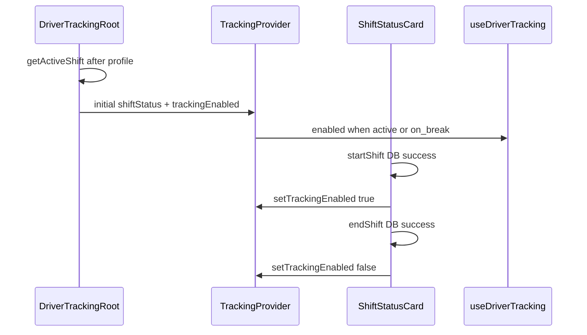

# Auto-tracking tied to shift status

## Context

Today tracking is gated by **sessionStorage consent** restored in [`TrackingProvider`](src/lib/tracking/tracking-context.tsx) and toggled on [`/driver/tracking`](src/app/driver/tracking/page.tsx). Shift lifecycle lives in [`ShiftStatusCard`](src/features/driver-portal/components/startseite/shift-status-card.tsx) with **no link to GPS**.

Per [`docs/plans/auto-tracking-audit.md`](docs/plans/auto-tracking-audit.md): profile loads in `DriverTrackingRoot`; shift mutations only fire from `ShiftStatusCard` in production (`shift-tracker.tsx` is **deprecated**). Admin [`nav-config.ts`](src/config/nav-config.ts) has no driver routes — nav change is **driver-header only**.



---

## 1. Constants — [`src/lib/tracking/constants.ts`](src/lib/tracking/constants.ts)

- **Remove** `TRACKING_CONSENT_STORAGE_KEY` and its comment
- **Add**:

```typescript
export const TRACKING_ACTIVE_SHIFT_STATUSES = ['active', 'on_break'] as const;

export function isShiftTrackable(status: string | null | undefined): boolean {
  return (TRACKING_ACTIVE_SHIFT_STATUSES as readonly string[]).includes(status ?? '');
}
```

---

## 2. Tracking context — [`src/lib/tracking/tracking-context.tsx`](src/lib/tracking/tracking-context.tsx)

### Remove consent

- Delete `hasSessionConsent()`, `TRACKING_CONSENT_STORAGE_KEY` import, and the `useEffect` that restores consent in `TrackingProvider`
- Update file header comment (tracking page no longer controls start/stop)

### Extend `TrackingContextValue`

Add:

```typescript
shiftStatus: string | null;
setShiftStatus: (status: string | null) => void;
```

(`setShiftStatus` needed so `ShiftStatusCard` keeps layout context in sync on break start/end without a layout re-fetch.)

### Bootstrap shift in `DriverTrackingRoot`

After profile resolves successfully, **before** mounting `TrackingProvider`:

```typescript
const shift = await shiftsService.getActiveShift(profile.id);
const shiftStatus = shift?.status ?? null;
setInitialShiftStatus(shiftStatus);
setInitialTrackingEnabled(isShiftTrackable(shiftStatus));
```

Hold `initialShiftStatus` / `initialTrackingEnabled` in `DriverTrackingRoot` state (or pass inline once profile + shift fetch complete). Extend profile `useEffect` — do not mount `TrackingProvider` until shift bootstrap finishes (keep single loading phase; optional: reuse `profileLoading` for shift fetch too).

### `TrackingProvider` props

Add optional initial values from root:

```typescript
initialTrackingEnabled: boolean;
initialShiftStatus: string | null;
```

Initialize state:

```typescript
const [trackingEnabled, setTrackingEnabled] = useState(initialTrackingEnabled);
const [shiftStatus, setShiftStatus] = useState(initialShiftStatus);
```

Remove the old consent `useEffect`. Pass `shiftStatus` / `setShiftStatus` through `useMemo` context value.

### Stub providers (loading / error)

Add `shiftStatus: null` and no-op `setShiftStatus` to stub context values (lines 133–166).

### `setTrackingEnabled` call sites (hard rule)

| Location | When |
| --- | --- |
| `DriverTrackingRoot` bootstrap | `useState(initialTrackingEnabled)` from `isShiftTrackable(shift?.status)` — not a runtime `setTrackingEnabled` call |
| `ShiftStatusCard` handlers | After successful DB mutation only |

No other files call `setTrackingEnabled`.

---

## 3. ShiftStatusCard — [`shift-status-card.tsx`](src/features/driver-portal/components/startseite/shift-status-card.tsx)

At component top:

```typescript
const { setTrackingEnabled, setShiftStatus } = useTracking();
```

After **successful** mutations (inside `try`, after service call succeeds):

| Handler | `setTrackingEnabled` | `setShiftStatus` |
| --- | --- | --- |
| `handleStartShift` | `true` | `'active'` |
| `handleStartBreak` | *(none — stays true)* | `'on_break'` |
| `handleEndBreak` | `true` (idempotent) | `'active'` |
| `handleEndShift` | `false` | `'ended'` |

Add **why comment** above the first `setTrackingEnabled` call:

> Tracking toggle lives here (not layout) because shift DB writes only happen in this component; GPS must not start if the mutation fails.

Keep existing `getActiveShift` init fetch — card still needs full `Shift` row (`id`, `started_at`) for UI timers and mutation IDs. Context `shiftStatus` keeps layout/tracking page in sync.

---

## 4. Tracking page — [`src/app/driver/tracking/page.tsx`](src/app/driver/tracking/page.tsx)

**Delete:** consent gate, all sessionStorage logic, `setTrackingEnabled` usage, start/stop buttons, unused imports (`useCallback`, `useEffect`, `useState` for consent, `TRACKING_CONSENT_STORAGE_KEY`).

**Keep (read-only):**

- Profile loading / error states (error can keep “Zur Startseite” link)
- Status dot: green when `trackingEnabled && status === 'tracking'`, grey otherwise
- Label: `"Tracking aktiv"` vs `"Kein aktiver Dienst"` (use `trackingEnabled` or `shiftStatus` via `isShiftTrackable`)
- Speed + accuracy from `lastPosition`
- Error when `status === 'error'`

**Add copy:**

- Title: `Standort & Tempo`
- Subtitle: `Tracking läuft automatisch während deines Dienstes.`

Update file header comment to reflect read-only status screen.

---

## 5. Nav — [`driver-header.tsx`](src/features/driver-portal/components/driver-header.tsx)

- Remove `/driver/tracking` entry from `NAV_ITEMS` (Standort / `IconMapPin`)
- Remove unused `IconMapPin` import
- **Keep** `getPageTitle` branch for `/driver/tracking` → e.g. `"Standort & Tempo"` so direct URL visits still show a sensible header title
- Update header comment (nav list no longer includes Standort)

**No change** to [`nav-config.ts`](src/config/nav-config.ts) — admin-only nav, no driver tracking entry.

**Minor:** [`driver-layout-client.tsx`](src/app/driver/driver-layout-client.tsx) — update comment line 6–7 (remove sessionStorage mention); no logic change.

---

## 6. Docs — [`docs/modules/driver-tracking.md`](docs/modules/driver-tracking.md)

- Remove consent / sessionStorage sections and Phase 1 consent limitation (#3)
- Document implicit consent (company-owned devices)
- Document `TRACKING_ACTIVE_SHIFT_STATUSES` and tracking during `on_break`
- Update data flow: Schicht starten → `setTrackingEnabled(true)` → `watchPosition` → `live_locations`
- Note `/driver/tracking` is read-only speed/accuracy display (no nav entry; URL still works)
- Phase 2: remove `tracking_consented` / consent recovery items; keep Broadcast, PWA, replay, etc.
- Update code layout table (tracking page role, constants)
- Confirm zero `TRACKING_CONSENT_STORAGE_KEY` references in `src/`

**In scope for this PR:** [`docs/modules/driver-tracking.md`](docs/modules/driver-tracking.md) only.

---

## Backlog (post-ship — stale consent docs)

These files are **out of scope** for this PR but will mislead readers until updated. Track as follow-up after auto-tracking ships:

| File | Stale content | Update to |
| --- | --- | --- |
| [`docs/driver-portal.md`](docs/driver-portal.md) | Route table: `/driver/tracking` described as “consent + live_locations” | Read-only speed/accuracy display; tracking auto-starts on shift |
| [`docs/driver-portal.md`](docs/driver-portal.md) | Nav table lists “Standort” → `/driver/tracking` as primary nav | Remove or note URL-only (no drawer link); link to driver-tracking module |
| [`docs/accounts-table.md`](docs/accounts-table.md) | `tracking_consented` + “Phase 1 uses sessionStorage only” | Implicit consent on company devices; no sessionStorage; defer/remove `tracking_consented` Phase 2 note or mark as cancelled |

Also check [`docs/plans/auto-tracking-audit.md`](docs/plans/auto-tracking-audit.md) — historical audit, no change required unless you want a “superseded by auto-tracking” note.

---

## 7. Verification

```bash
bun run build
```

Post-change grep (must be zero in `src/`):

```bash
rg TRACKING_CONSENT_STORAGE_KEY src/
rg sessionStorage.*tracking src/
```

Manual smoke:

1. No active shift → no GPS upserts (grey on fleet map after stale timeout)
2. Startseite → Schicht starten → tracking starts without visiting `/driver/tracking`
3. Pause → tracking continues (`on_break` still trackable)
4. Schicht beenden → tracking stops
5. Reload with active shift → bootstrap resumes tracking
6. `/driver/tracking` shows speed only, no buttons
7. Driver drawer has no Standort link; direct URL still works

---

## Hard rules checklist

| Rule | How |
| --- | --- |
| `setTrackingEnabled` only 2 places | Initial state from root bootstrap; runtime calls only in `ShiftStatusCard` after DB success |
| No sessionStorage | Remove key + all reads/writes; verify grep |
| No hook/fleet changes | `use-driver-tracking.ts`, `use-fleet-map.ts`, `fleet-map.tsx` untouched |
| Mutations before GPS | `setTrackingEnabled` only after `shiftsService.*` succeeds |
| Build passes | `bun run build` |

## Known limitation (acceptable)

- No shift realtime — remount/bootstrap re-syncs; mutations on Startseite update immediately via handlers
- First GPS still triggers browser geolocation permission prompt when shift starts (no custom consent UI)
