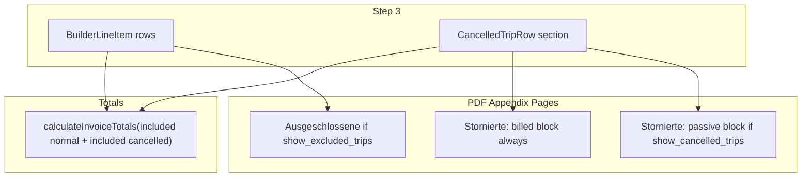

# Trip Billing Inclusion Control (Feature 1 + 1b)

## Product rules (confirmed)

| Trip type | Default | Opted out | Opted in |
|-----------|---------|-----------|----------|
| Normal `BuilderLineItem` | **Included** in totals + main PDF | Excluded from totals; persisted with `billing_exclusion_reason`; shown in **Ausgeschlossene Fahrten** appendix when Step 4 `show_excluded_trips` is on | Re-included immediately (no dialog); reason cleared |
| `CancelledTripRow` | **Excluded** from totals | Passive €0 row with `canceled_reason_notes`; gated by existing **`show_cancelled_trips`** checkbox (unchanged label/semantics) | Always in **Stornierte Fahrten** appendix (no checkbox); real gross + amber **billing reason**; included in totals; full km/gross editing in Step 3 |

**Stornierte Fahrten PDF layout (both groups may appear):**
1. **Billed cancelled** (opted-in) — always rendered when any exist; sub-header e.g. `"Abgerechnete stornierte Fahrten"`; columns include Begründung (billing reason, amber) + real gross
2. **Divider / sub-header** when both groups present
3. **Passive cancelled** (opted-out) — existing €0 table gated by `show_cancelled_trips`; uses `canceled_reason_notes` as today



**Out of scope (unchanged):** `TODO(issued-cancelled-rows)` re-download; appendix column customisation; Feature 2 draft edit.

---

## Path corrections vs draft spec

| Draft path | Actual path |
|------------|-------------|
| `components/pdf/invoice-pdf-appendix.tsx` | [`src/features/invoices/components/invoice-pdf/invoice-pdf-appendix.tsx`](src/features/invoices/components/invoice-pdf/invoice-pdf-appendix.tsx) |
| `components/pdf/invoice-pdf-document.tsx` | [`src/features/invoices/components/invoice-pdf/InvoicePdfDocument.tsx`](src/features/invoices/components/invoice-pdf/InvoicePdfDocument.tsx) |

---

## Step 1 — Database migration

New file: `supabase/migrations/YYYYMMDDHHMMSS_invoice_line_items_billing_inclusion.sql`

```sql
ALTER TABLE public.invoice_line_items
  ADD COLUMN billing_included BOOLEAN NOT NULL DEFAULT TRUE,
  ADD COLUMN billing_exclusion_reason TEXT,
  ADD COLUMN is_cancelled_trip BOOLEAN NOT NULL DEFAULT FALSE,
  ADD COLUMN cancelled_billing_reason TEXT;

ALTER TABLE public.invoice_line_items
  ADD CONSTRAINT chk_exclusion_reason_required
  CHECK (billing_included = TRUE OR billing_exclusion_reason IS NOT NULL);

ALTER TABLE public.invoice_line_items
  ADD CONSTRAINT chk_cancelled_billing_reason_required
  CHECK (is_cancelled_trip = FALSE OR billing_included = FALSE OR cancelled_billing_reason IS NOT NULL);
```

Also update **`create_storno_invoice`** RPC ([`20260411120000_storno_atomic_rpc.sql`](supabase/migrations/20260411120000_storno_atomic_rpc.sql)) — its `INSERT INTO invoice_line_items` uses an explicit column list; new columns must be copied (negated totals unchanged; inclusion flags copied as-is).

Run `bun run db:types` (`npx supabase gen types typescript --local > src/types/database.types.ts`) to regenerate [`src/types/database.types.ts`](src/types/database.types.ts) for PostgREST typing.

`show_excluded_trips` lives in **`invoices.pdf_column_override` JSONB** (no new DB column) — extend Zod schema only.

**Build gate:** `bun run db:types`, then `bun run build`

---

## Step 2 — Types

[`invoice.types.ts`](src/features/invoices/types/invoice.types.ts):

```ts
export type BillingInclusionState = {
  included: boolean;
  reason: string; // exclusion reason (normal opt-out) OR billing reason (cancelled opt-in)
};
```

- **`BuilderLineItem`**: add `billingInclusion: BillingInclusionState` — default `{ included: true, reason: '' }` in `buildLineItemsFromTrips`
- **`InvoiceLineItemRow`**: add DB mirror fields `billing_included`, `billing_exclusion_reason`, `is_cancelled_trip`, `cancelled_billing_reason`
- **`CancelledTripRow`**: extend beyond today's narrow shape:
  - `billingInclusion` default `{ included: false, reason: '' }`
  - When opted-in, hold pricing state (reuse subset of `BuilderLineItem` fields): `price_resolution`, `unit_price`, `tax_rate`, `quantity`, `approach_fee_net`, `effective_distance_km`, `manual_km_enabled`, override fields, etc.
  - Helper type optional: `CancelledBillableFields` to avoid duplicating entire `BuilderLineItem`
- **`ExcludedTripRow`** (PDF-only minimal):
  ```ts
  { line_date, client_name, pickup_address, dropoff_address, billing_exclusion_reason }
  ```

[`pdf-vorlage.types.ts`](src/features/invoices/types/pdf-vorlage.types.ts):

- Add `show_excluded_trips` to `pdfColumnOverrideSchema`, `PdfColumnOverridePayload`, `PdfColumnProfile` (default `false`)
- **Do not change** `show_cancelled_trips` semantics in schema — still passive-list gate

**Build gate:** `bun run build`

---

## Step 3 — Fetch + pricing for cancelled opt-in

[`fetchCancelledTripsForBuilder`](src/features/invoices/api/invoice-line-items.api.ts) must select **pricing fields** needed by `resolveTripPrice` / `buildLineItemsFromTrips` (mirror [`fetchTripsForBuilder`](src/features/invoices/api/invoice-line-items.api.ts) select: `billing_variant`, `net_price`, `manual_gross_price`, `driving_distance_km`, `kts_document_applies`, `payer.manual_km_enabled`, client price tags path, etc.).

Add pure helper (e.g. `buildCancelledTripBillingState(trip, rules, tags, kmOverrides)`) that runs the same cascade as `buildLineItemsFromTrips` for a single cancelled trip — called from hook on opt-in.

Initialize after fetch in [`use-invoice-builder.ts`](src/features/invoices/hooks/use-invoice-builder.ts):
```ts
cancelledTrips.map(t => ({ ...t, billingInclusion: { included: false, reason: '' } }))
```

**Build gate:** `bun run build`

---

## Step 4 — Builder hook

[`use-invoice-builder.ts`](src/features/invoices/hooks/use-invoice-builder.ts):

| Handler | Behavior |
|---------|----------|
| `handleLineItemInclusionChange(position, included, reason)` | Find by **`position`** (not array index); update `billingInclusion`; re-run validators |
| `handleCancelledTripInclusionChange(tripId, included, reason)` | On `included=true`: run pricing helper; on `false`: clear pricing fields |
| `handleCancelledTripGrossOverride` / `handleCancelledTripKmOverride` | Mirror existing `applyGrossOverride` / `applyKmOverride` patterns on cancelled row |

**Totals:** Refactor [`calculateInvoiceTotals`](src/features/invoices/api/invoice-line-items.api.ts) to accept included rows only:

```ts
calculateInvoiceTotals(
  lineItems.filter(i => i.billingInclusion.included),
  cancelledTrips.filter(c => c.billingInclusion.included).map(toBillableShape)
)
```

Extract `toBillableShape(cancelled)` so `lineItemGrossTotalForDisplay` / existing net-bucket logic reuse unchanged math.

Hook exposes: `excludedTripCount`, `hasInclusionValidationErrors`, updated `totals`, `missingPrices` (include opted-in cancelled with null price).

**Build gate:** `bun run build`

---

## Step 5 — Validators

[`invoice-validators.ts`](src/features/invoices/lib/invoice-validators.ts):

- `hasOptedOutTripWithoutReason(lineItems)` — `!included && !reason.trim()`
- `hasOptedInCancelledWithoutReason(cancelledTrips)` — `included && !reason.trim()`
- Export combined `hasInclusionReasonErrors(...)`

Step 3 **Weiter zu PDF-Vorlage** disabled when: `missingPrices || hasInclusionReasonErrors || lineItems.length === 0`

Tooltip priority: inclusion reason message `"Bitte Begründung für alle ausgeschlossenen / stornierten Fahrten eintragen."` when that fires; keep existing missing-price tooltip otherwise.

**Build gate:** `bun run build`

---

## Step 6 — Step 3 UI

[`step-3-line-items.tsx`](src/features/invoices/components/invoice-builder/step-3-line-items.tsx):

**6a Normal rows** — grid becomes `[auto_1fr_auto_auto]`:
- Leftmost **Checkbox** (checked = included)
- Uncheck → shadcn **Dialog** with required `Textarea`; confirm disabled until non-whitespace; `onInteractOutside` prevented when textarea has content
- Opted-out: `opacity-60` + amber `"Ausgeschlossen"` badge
- Re-check: immediate, clears reason
- **Do not alter** existing price/km/badge/map-icon behavior for included rows

**6b Cancelled section** — below line-items scroll area when `cancelledTrips.length > 0`:
- Collapsible `"Stornierte Fahrten"` (always visible in Step 3)
- Per row: checkbox, date/client/route summary
- Opt-in: amber `Textarea` for billing reason; km + gross inputs wired to new handlers; reuse `Input` / commit patterns from normal rows. Km input visibility must respect the existing `manual_km_enabled` payer flag — source it from the same hook context as normal rows.

New props per spec (plus `hasInclusionReasonErrors` for button state).

**Build gate:** `bun run build`

---

## Step 7 — Step 4 UI

[`step-4-vorlage.tsx`](src/features/invoices/components/invoice-builder/step-4-vorlage.tsx):

- **Keep** existing `showCancelledTrips` checkbox + copy unchanged (passive €0 list only)
- **Add** conditional `showExcludedTrips` block when `excludedTripCount > 0` (prop from `index.tsx`)
- Emit both flags via `onColumnProfileChange` / `onPdfOverrideChange` / snapshot in [`index.tsx`](src/features/invoices/components/invoice-builder/index.tsx) `snapshotOverride`

[`resolve-pdf-column-profile.ts`](src/features/invoices/lib/resolve-pdf-column-profile.ts): pass through `show_excluded_trips` from override JSON (default `false`); `show_cancelled_trips` unchanged.

Update test [`pdf-column-override-cancelled.test.ts`](src/features/invoices/lib/__tests__/pdf-column-override-cancelled.test.ts) + add cases for `show_excluded_trips`.

**Build gate:** `bun run build`

---

## Step 8 — PDF pipeline

Add named constant in [`pdf-styles.ts`](src/features/invoices/components/invoice-pdf/pdf-styles.ts):
```ts
export const PDF_COLORS = { ..., billingReason: 'rgb(180, 83, 9)' }
```

[`invoice-pdf-appendix.tsx`](src/features/invoices/components/invoice-pdf/invoice-pdf-appendix.tsx):

| Section | Gate | Content |
|---------|------|---------|
| `renderCancelledBilledSection` | `billedCancelled.length > 0` (always) | Real gross, billing reason in amber, optional amount column |
| `renderCancelledPassiveSection` | `show_cancelled_trips && passiveCancelled.length > 0` | Existing fixed 5-col €0 table + `canceled_reason_notes` |
| `renderExcludedSection` | `show_excluded_trips && excludedTrips.length > 0` | Datum, Fahrgast, Von, Nach, Begründung (amber); no amount |

Split `cancelledTrips` prop into billed vs passive in parent, or filter inside appendix by `billingInclusion.included`.

[`InvoicePdfDocument.tsx`](src/features/invoices/components/invoice-pdf/InvoicePdfDocument.tsx):
- New prop `excludedTrips?: ExcludedTripRow[]`
- **`cancelledRowsForPdf` logic change:** do NOT gate all cancelled by `show_cancelled_trips`; instead pass billed always + passive when flag true
- Main cover [`line_items`](src/features/invoices/components/invoice-pdf/build-draft-invoice-detail-for-pdf.ts): filter **`billing_included === true && !is_cancelled_trip`** for Haupttabelle; opted-in cancelled contribute to header totals but render only in Stornierte billed block (avoid double-listing on cover)
- Apply the same `billing_included` + `is_cancelled_trip` filter in `use-invoice-builder-pdf-preview` — live preview and final PDF must filter identically.

[`use-invoice-builder-pdf-preview.tsx`](src/features/invoices/components/invoice-builder/use-invoice-builder-pdf-preview.tsx): pass `excludedTrips` + split cancelled groups.

**Build gate:** `bun run build`

---

## Step 9 — Persist + wire

[`insertLineItems`](src/features/invoices/api/invoice-line-items.api.ts):
- All normal rows inserted (included + excluded) with `billing_included`, `billing_exclusion_reason`, `is_cancelled_trip=false`
- Append opted-in cancelled as additional rows: `is_cancelled_trip=true`, `billing_included=true`, `cancelled_billing_reason`, full pricing snapshot
- Positions: normal rows keep builder positions; cancelled billed append after max position
- Position column must not render in PDF or Step 3 UI for opted-in cancelled rows — their identity is date + client name only.

[`createInvoice`](src/features/invoices/api/invoices.api.ts): totals from hook (included-only); `pdf_column_override` includes `show_excluded_trips` + existing `show_cancelled_trips`

[`index.tsx`](src/features/invoices/components/invoice-builder/index.tsx): derive `excludedTrips`, `excludedTripCount`; wire all new props/handlers

Trip writeback in `createMutation`: extend to opted-in cancelled trips (same fire-and-forget pattern as normal lines)

**Build gate:** `bun run build` + extend [`calculate-invoice-totals.test.ts`](src/features/invoices/api/__tests__/calculate-invoice-totals.test.ts) for inclusion filtering

---

## Step 10 — Docs

- Inline `// why` on handlers, PDF split logic, totals filter
- Update [`docs/invoices-module.md`](docs/invoices-module.md) — Step 3 inclusion UX, Step 4 dual checkboxes, PDF appendix sections
- Update [`docs/plans/invoice-builder-features-audit.md`](docs/plans/invoice-builder-features-audit.md) — mark Feature 1 + 1b implemented; note deferred items

---

## Hard rules (unchanged)

1. Never remove/replace existing `showCancelledTrips` passive-list behavior or label
2. Opted-out normal rows stay in `lineItems[]` — never spliced
3. Opt-out dialog cannot confirm with empty reason
4. `bun run build` after each step
5. PDF amber via `PDF_COLORS.billingReason` only
6. Included normal row UI (price/km/badges/map icon) must remain identical

---

## Merge-conflict hotspots (parallel work)

Highest touch overlap: [`step-3-line-items.tsx`](src/features/invoices/components/invoice-builder/step-3-line-items.tsx), [`use-invoice-builder.ts`](src/features/invoices/hooks/use-invoice-builder.ts), [`invoice-line-items.api.ts`](src/features/invoices/api/invoice-line-items.api.ts). Ship Feature 3 (Maps icon) before or after this branch to avoid grid-column conflicts in Step 3.
