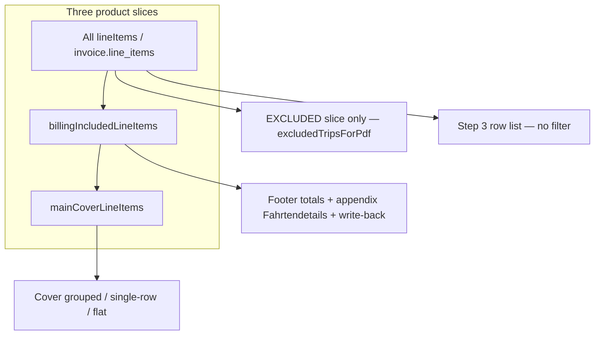

# Billing Inclusion Helper + PDF Cover Fix

## Strategic context

Dispatchers opt out trips in Step 3 via `billingInclusion.included`. Opted-out rows must not affect **cover km/amounts**, **footer totals**, or **trip write-back**. The rule is duplicated inline in ~15 TS sites; two sites omit it entirely:

| Bug | Location | Symptom |
|-----|----------|---------|
| **BUG 1** | [`InvoicePdfDocument.tsx`](src/features/invoices/components/invoice-pdf/InvoicePdfDocument.tsx) L349–351 `mainLineItems` | Cover summary includes opted-out rows (km + net/gross); footer is correct. Hidden in live preview because [`use-invoice-builder-pdf-preview.tsx`](src/features/invoices/components/invoice-builder/use-invoice-builder-pdf-preview.tsx) pre-filters before draft build. Surfaces on **saved PDFs / invoice detail**. |
| **BUG 2** | [`invoice-pdf-cover-body.tsx`](src/features/invoices/components/invoice-pdf/invoice-pdf-cover-body.tsx) L142–246 `coercedFlatLineItems` | Flat `main_layout` renders all `invoice.line_items` — opted-out normals **and** opted-in cancelled rows on cover. |

**Root cause:** no authoritative predicate. **Fix philosophy:** PDF bugs first (Phase 2), builder dedup second (Phase 3), never mixed in one commit.

**Out of scope:** SQL RPCs (document parity only), already-saved invoice data (no migration — re-open + re-save required), Step 4 position table, Step 3 advisory counts, KTS alerts, large-invoice threshold, persist path (`insertLineItems` keeps all rows).



Original design intent: [`.cursor/plans/billing_inclusion_control_6944ad7b.plan.md`](.cursor/plans/billing_inclusion_control_6944ad7b.plan.md) — Haupttabelle = `billing_included` + `!is_cancelled_trip`. Audits: [`docs/plans/excluded-trips-totals-audit.md`](docs/plans/excluded-trips-totals-audit.md), [`docs/plans/billing-included-helper-scope-audit.md`](docs/plans/billing-included-helper-scope-audit.md).

---

## Lib conventions (from [`src/features/invoices/lib/`](src/features/invoices/lib/))

- Pure functions, minimal imports, no component/hook dependencies
- Unit tests live under **`lib/__tests__/`** (e.g. [`trip-write-back.test.ts`](src/features/invoices/lib/__tests__/trip-write-back.test.ts)) — place new tests at **`lib/__tests__/billing-inclusion.test.ts`** (not lib root)
- [`build-invoice-pdf-summary.ts`](src/features/invoices/components/invoice-pdf/lib/build-invoice-pdf-summary.ts) has **no internal** `billing_included` filter — caller supplies the correct slice (confirmed L257 `invoice.line_items.forEach`)

---

## Phase 1 — Helper library (no existing files touched)

### Step 1 — Create [`src/features/invoices/lib/billing-inclusion.ts`](src/features/invoices/lib/billing-inclusion.ts)

**Three exports only:**

1. **`isBillingIncludedRow(row)`**
   - If `'billingInclusion' in row` → `row.billingInclusion.included` (strict)
   - Else → `row.billing_included !== false` (null/undefined → included)
   - Import `BillingInclusionState` from [`invoice.types.ts`](src/features/invoices/types/invoice.types.ts) only

2. **`billingIncludedLineItems<T>(items)`** — `items.filter(isBillingIncludedRow)`
   - Billable slice: footer totals, appendix Fahrtendetails, write-back, preview draft input
   - **Includes** opted-in cancelled rows

3. **`mainCoverLineItems<T>(items)`** — `items.filter(li => isBillingIncludedRow(li) && !(li.is_cancelled_trip ?? false))`
   - Haupttabelle only: grouped, single-row, flat cover

**Module JSDoc must include:**
- Two representations (builder vs persisted)
- Predicate table for null / undefined / false
- SQL parity: `COALESCE(billing_included, true) = true` equivalent; SQL unchanged
- **Known limitation (verbatim):** *"Invoices saved before this fix was deployed may have incorrect cover table data. These can only be corrected by re-opening the invoice in the builder and re-saving. No automated migration is provided."*

Per-export JSDoc: purpose, exclusions, consumer files (by name, not line numbers), SSOT rule.

**Gate:** `bun run build` passes before Phase 2.

### Step 2 — Unit tests [`src/features/invoices/lib/__tests__/billing-inclusion.test.ts`](src/features/invoices/lib/__tests__/billing-inclusion.test.ts)

Table-driven cases per spec (persisted null/undefined/false, builder shape, mixed arrays, `mainCoverLineItems` cancelled + opted-out scenarios).

**Gate:** `bun test` green, no existing tests broken, `bun run build` before Phase 2.

---

## Phase 2 — PDF path (bug fixes + dedup; separate commit from Phase 3)

### Step 3 — [`InvoicePdfDocument.tsx`](src/features/invoices/components/invoice-pdf/InvoicePdfDocument.tsx)

| Variable | Change |
|----------|--------|
| `mainLineItems` | **BUG FIX:** `mainCoverLineItems(invoice.line_items)` — add inline **why** comment (billing + cancelled rules) |
| `appendixLineItems` | Replace inline `billing_included !== false` with `billingIncludedLineItems(invoice.line_items).sort(...)` — behaviour unchanged |
| `lineItemsForCalc` | Replace filter with `billingIncludedLineItems(invoice.line_items).map(...)` — `.map()` unchanged |

Summary builders (L409–423) already consume `mainLineItems` — no further changes once `mainLineItems` is fixed.

**Gate:** `bun run build` before Step 4.

### Step 4 — [`invoice-pdf-cover-body.tsx`](src/features/invoices/components/invoice-pdf/invoice-pdf-cover-body.tsx)

Replace input only:

```typescript
const coercedFlatLineItems = mainCoverLineItems(invoice.line_items).map(
  coerceLineItemJsonbSnapshots
);
```

**Pre-check (audit finding):** Flat path has no separate aggregation — only L142 map + L246 render. Grouped mode uses `summaryItems` from parent; no mixed filtered/unfiltered refs in this file after change.

**Gate:** `bun run build`, Phase 1 tests still green.

### Step 5 — PDF regression tests

**Location:** extend [`components/invoice-pdf/lib/__tests__/build-invoice-pdf-summary-billing-label.test.ts`](src/features/invoices/components/invoice-pdf/lib/__tests__/build-invoice-pdf-summary-billing-label.test.ts) or add `build-invoice-pdf-summary-inclusion.test.ts` in same folder (prefer new file if tests grow large).

Extend `minimalLine()` helper with `billing_included`, `is_cancelled_trip`.

| Test | Assert |
|------|--------|
| Opted-out row (`billing_included: false`, km + price) | `buildInvoicePdfGroupedByBillingType(mainCoverLineItems(...))` → `total_km` / net excludes it |
| Opted-in cancelled (`is_cancelled_trip: true`) | `mainCoverLineItems` output length 0 for that row |
| 1 included + 1 excluded | Cover `total_km` = included km only |
| Footer path | `calculateInvoiceTotals(billingIncludedLineItems(rows))` includes opted-in cancelled, excludes opted-out normal |

No full `InvoicePdfDocument` render needed — test helpers + `calculateInvoiceTotals` from [`invoice-line-items.api.ts`](src/features/invoices/api/invoice-line-items.api.ts).

**Gate:** `bun test`, `bun run build` before Phase 3.

---

## Phase 3 — Builder dedup + `hasMissingPrices` (separate commit)

### Step 6 — [`use-invoice-builder.ts`](src/features/invoices/hooks/use-invoice-builder.ts) + [`invoice-validators.ts`](src/features/invoices/lib/invoice-validators.ts)

**6a.** `includedNormal` → `billingIncludedLineItems(lineItems)`

**6b.** Leave `includedCancelled` guard unchanged:

```typescript
cancelledTrips.filter((c) => c.billingInclusion.included && c.price_resolution != null)
```

(pricing readiness ≠ inclusion)

**6c.** `excludedTripCount` — use explicit EXCLUDED-direction negation (not length subtraction):

```typescript
const excludedTripCount = lineItems.filter((i) => !isBillingIncludedRow(i)).length;
```

Import `isBillingIncludedRow` alongside `billingIncludedLineItems`. The negation form reads as intent ("count excluded rows"), not arithmetic.

**6d.** **`hasMissingPrices`** in [`invoice-validators.ts`](src/features/invoices/lib/invoice-validators.ts) L97–98:

```typescript
export function hasMissingPrices(items: BuilderLineItem[]): boolean {
  return billingIncludedLineItems(items).some((item) =>
    item.warnings.includes('missing_price')
  );
}
```

Call site at hook L916 stays `hasMissingPrices(lineItems)` — scope fix is internal. **Why comment:** opted-out missing price must not block Step 3.

**Gate:** `bun run build` before Step 7.

### Step 7 — Preview, index, write-back

| File | Change |
|------|--------|
| [`use-invoice-builder-pdf-preview.tsx`](src/features/invoices/components/invoice-builder/use-invoice-builder-pdf-preview.tsx) L298 | `billingIncludedLineItems(lineItems)` |
| [`index.tsx`](src/features/invoices/components/invoice-builder/index.tsx) L413–424 | **Do not** flip to included helper — keep `!li.billingInclusion.included`; add comment citing `billing-inclusion.ts` as authoritative predicate for EXCLUDED appendix slice |
| [`index.tsx`](src/features/invoices/components/invoice-builder/index.tsx) L430, L435 | Verify cancelled-trip splits; leave unchanged if consistent (they operate on `cancelledTrips`, not `lineItems`) |
| [`trip-write-back.ts`](src/features/invoices/lib/trip-write-back.ts) L62 | `item.trip_id !== null && isBillingIncludedRow(item)` |

**7d. Required test** — add to [`trip-write-back.test.ts`](src/features/invoices/lib/__tests__/trip-write-back.test.ts):

- **`executeTripWriteBack` skips opted-out trips:** pass a mix of included + excluded `BuilderLineItem` rows (mock `tripsService.updateTrip`); assert `updateTrip` is called only for included rows with `trip_id !== null`. Opted-out rows must never receive a price write-back — incorrect write-back would corrupt source trip data.

**Gate:** `bun test`, `bun run build` — Step 7 is not complete without the write-back test.

### Step 8 — Full gate

```bash
bun run build
bun test
```

All Phase 1 + Phase 2 tests must pass before documentation.

---

## Phase 4 — Documentation (mandatory)

| File | Update |
|------|--------|
| [`billing-inclusion.ts`](src/features/invoices/lib/billing-inclusion.ts) | Confirm module JSDoc complete (limitation verbatim) |
| [`docs/invoices-module.md`](docs/invoices-module.md) | Three slices, helper names, SSOT rule, SQL parity, saved-invoice limitation |
| [`.cursor/plans/billing_inclusion_control_6944ad7b.plan.md`](.cursor/plans/billing_inclusion_control_6944ad7b.plan.md) | Status: *Fix applied — 2026-06-08*; list closed gaps |
| [`lib/README.md`](src/features/invoices/lib/README.md) | One-line pointer to `billing-inclusion.ts` under "Other" |

Inline **why** comments at: `mainLineItems`, `coercedFlatLineItems`, `hasMissingPrices`, `excludedTripsForPdf`.

---

## Hard rules (enforced every step)

1. **Phase 2 and Phase 3 = separate commits** — PDF fixes reviewable alone
2. No SQL, migrations, Vorlage schema, persist path, Step 3 UI list, Step 4 table, preview threshold changes
3. After completion: **no new inline** `billing_included !== false` or `.billingInclusion.included` filters outside `billing-inclusion.ts` (validators may use `!isBillingIncludedRow` for exclusion checks)
4. **`bun run build` mandatory between steps** — never proceed on failure
5. Document saved-invoice limitation — no silent data repair

---

## Commit structure (recommended)

| Commit | Phase | Message theme |
|--------|-------|---------------|
| 1 | Phase 1 | `feat(invoices): add billing-inclusion helper + tests` |
| 2 | Phase 2 | `fix(invoices): filter opted-out rows from PDF cover summary` |
| 3 | Phase 3 | `refactor(invoices): dedupe billing inclusion filters; fix missing-price gate` |
| 4 | Phase 4 | `docs(invoices): document billing-inclusion helpers and limitation` |

Phases 2+3 may be one PR with two commits; never one commit mixing PDF bug fix and builder refactor.
