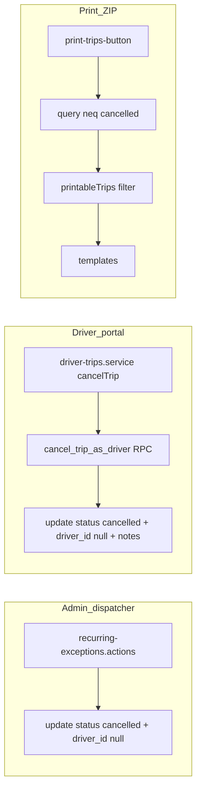

# Trip cancellation: clear `driver_id` + exclude from print

## Preconditions

- Product: drivers intentionally lose portal visibility for cancelled trips (no SELECT/policy/query follow-up).
- Deferred: SQL backfill for legacy cancelled rows; `shift_id` clearing.
- After each logical step below, run **`bun run build`** before continuing (see split gates for Steps 2 / 2b / 3).

## Step 1 — Admin/dispatcher payloads

**File:** [src/features/trips/api/recurring-exceptions.actions.ts](src/features/trips/api/recurring-exceptions.actions.ts)

Add `driver_id: null` to every `.update({ status: 'cancelled', ... })` (five call sites: `cancelNonRecurringTrip`, `skipRecurringOccurrence`, paired-leg update in `skipRecurringOccurrenceAndPaired`, both bulk updates in `cancelRecurringSeries`). Paired non-recurring already funnels through `cancelNonRecurringTrip`, so one change there covers both legs.

After each added field, add the mandated inline comment:

`// Clear driver assignment on cancel — trip must show as "Nicht zugewiesen"`

Keep literals, filters, and error handling unchanged; use `'cancelled'` as today.

**Build gate:** `bun run build`.

## Step 2 — Migration: `cancel_trip_as_driver` (SQL only)

### Migration filename and ordering (Flag 1)

Supabase applies migrations in **lexicographic order of the full `YYYYMMDDHHMMSS` prefix**, not by the calendar date you author the file.

- As of plan review, the latest migration in [supabase/migrations](supabase/migrations) is **`20260502120000_get_shift_day_summaries.sql`**.
- A prefix like **`20260427…`** is **invalid**: it sorts *before* `20260502120000`, so this RPC would run **before** `get_shift_day_summaries` and reorder history incorrectly.
- A far-future prefix (e.g. `20260527120000`) is technically ordered correctly but leaves a large, confusing gap and increases the chance someone inserts a timestamp **between** existing migrations and this file, which is harder to reason about in CI.

**Rule:** Immediately before creating the file, confirm the current max with `ls supabase/migrations/*.sql | sort | tail -1`. New migration name must use a prefix **strictly greater than** that max, with **minimal increment**, e.g. **`20260502120001_add_cancel_trip_as_driver_rpc.sql`** (same “day” as the current tail, next serial) or **`20260503000000_add_cancel_trip_as_driver_rpc.sql`** if you prefer a clean next-day stamp—**not** calendar “today” when today sorts before the repo max.

**Style reference:** [supabase/migrations/20260411120000_storno_atomic_rpc.sql](supabase/migrations/20260411120000_storno_atomic_rpc.sql) — `LANGUAGE plpgsql`, `SECURITY DEFINER`, `SET search_path = public`, `RAISE EXCEPTION ... USING ERRCODE`, header comment block.

**Function contract:**

- `CREATE OR REPLACE FUNCTION public.cancel_trip_as_driver(p_trip_id uuid, p_notes text) RETURNS void` (or `boolean` if you prefer `FOUND`; `void` is enough).
- Read the row by `p_trip_id`; if missing, `RAISE` (e.g. `ERRCODE 'P0001'` or `'23514'` consistent with nearby migrations).
- If `driver_id IS DISTINCT FROM auth.uid()`, `RAISE` not authorized (`42501` per storno pattern).
- If `status IN ('completed', 'cancelled')`, `RAISE` (invalid state / double-cancel).
- Single `UPDATE public.trips SET status = 'cancelled', driver_id = NULL, notes = p_notes WHERE id = p_trip_id` (and optionally `AND driver_id = auth.uid()` as a safety belt); check `GET DIAGNOSTICS` / `IF NOT FOUND` after update.
- **Grants:** `REVOKE ALL ON FUNCTION public.cancel_trip_as_driver(uuid, text) FROM PUBLIC;` then `GRANT EXECUTE ... TO authenticated;` (mirror storno; no `anon` grant). Signature must match exactly in `REVOKE` / `GRANT` / `COMMENT`.
- `COMMENT ON FUNCTION` documenting RLS rationale.

Do **not** alter existing RLS policies.

**Build gate:** `bun run build` (types may still reference missing RPC in TS until Step 2b—if build fails only on `rpc` typing, proceed to Step 2b next).

## Step 2b — Database types (Flag 2 — own build gate)

**File:** [src/types/database.types.ts](src/types/database.types.ts)

Under `public.Functions`, add `cancel_trip_as_driver` with `Args: { p_trip_id: string; p_notes: string }` and `Returns: undefined` (or the actual return type chosen in Step 2). Matches the manual pattern used for `get_shift_day_summaries`.

**Why a separate step:** `supabase.rpc('cancel_trip_as_driver', …)` is typed against `Database['public']['Functions']`. Adding the entry and verifying **`bun run build`** **before** editing the driver service catches signature or `Returns` mistakes in isolation.

**Build gate:** `bun run build` must pass before Step 3.

## Step 3 — Driver portal client

**File:** [src/features/driver-portal/api/driver-trips.service.ts](src/features/driver-portal/api/driver-trips.service.ts)

In `cancelTrip`, replace `.from('trips').update(...)` with:

```ts
const { error } = await supabase.rpc('cancel_trip_as_driver', {
  p_trip_id: tripId,
  p_notes: updatedNotes
});
```

Preserve existing `updatedNotes` assembly and `throw` behavior. Add the mandated inline comment above the RPC call about `trips_update_own_driver` / `WITH CHECK`.

Do not touch `startTrip`, `completeTrip`, or reads.

**Build gate:** `bun run build`.

## Step 4 — Print export (empty-state parity — minor note)

**File:** [src/features/trips/components/print-trips-button.tsx](src/features/trips/components/print-trips-button.tsx)

**Current behavior (do not change UX pattern):** After fetch, if `!trips || trips.length === 0`, the code shows **`toast.error('Keine Fahrten für diesen Tag gefunden.')`**, sets `isGenerating` false, and returns. There is no silent empty ZIP.

1. On the trips query chain, after `scheduled_at` range filters, add `.neq('status', 'cancelled')` with the mandated comment `// Cancelled trips must not appear in the Fahrtenplan export`.
2. After a successful fetch, compute `printableTrips` with the mandated defense-in-depth comment: `// Defense-in-depth: ensure cancelled trips are excluded even if the query changes`.
3. **Empty-state:** If `printableTrips.length === 0`, use the **same** early-return path as today: **`toast.error('Keine Fahrten für diesen Tag gefunden.')`**, `setIsGenerating(false)`, `return`. Do not add a new message, toast variant, or silent success. (Covers: query returned rows but all were cancelled, or any edge case where the client filter empties the list.)
4. Use `printableTrips` (not `trips`) for: `buildColumns`, `buildItemsByColumn`, overview `itemsByColumn` construction, the `groups` reduce, and downstream template rendering.

Do not modify [src/features/trips/lib/kanban-columns.ts](src/features/trips/lib/kanban-columns.ts) or the print template components.

**Build gate:** `bun run build`.

## Step 5 — Documentation

1. [docs/trip-linking-and-cancellation.md](docs/trip-linking-and-cancellation.md): New subsection under cancellation (e.g. after §5): admin paths set `driver_id = NULL`; driver path uses `cancel_trip_as_driver` and why; product note that cancelled trips disappear from driver portal.
2. [docs/print-trips-export.md](docs/print-trips-export.md): Note query excludes `status = 'cancelled'` plus client-side filter.
3. [docs/plans/cancel-trip-audit.md](docs/plans/cancel-trip-audit.md): Short **Implementation status** block at top: implemented, date `2026-04-27` (or actual merge date).

**Build gate:** `bun run build`.

## Verification checklist

- `bun run build` after Step 1; after Step 2; after Step 2b; after Step 3; after Step 4; after Step 5.
- Manual smoke: admin cancel (single, paired, recurring skip, series); driver cancel; generate ZIP on a day with mixed active/cancelled trips; day with only cancelled trips → same error toast as empty day.
- Confirm no new constants introduced unless already present in touched files.


