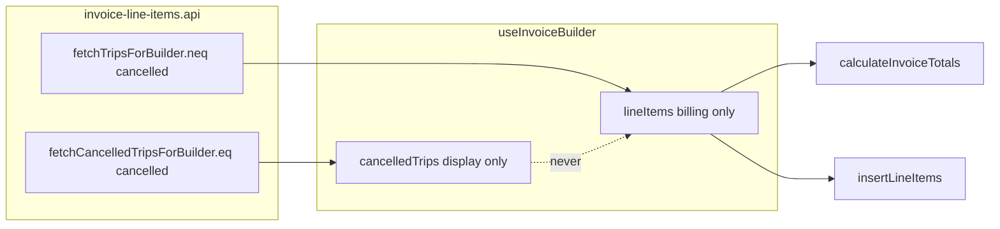

# Cancelled trips: billing guard + PDF-Vorlage checkbox

## Preconditions (already in your spec)

Read in full before implementation: [`src/features/invoices/api/invoice-line-items.api.ts`](src/features/invoices/api/invoice-line-items.api.ts), [`src/features/invoices/hooks/use-invoice-builder.ts`](src/features/invoices/hooks/use-invoice-builder.ts), [`src/features/invoices/components/invoice-builder/step-4-vorlage.tsx`](src/features/invoices/components/invoice-builder/step-4-vorlage.tsx), [`src/features/invoices/components/invoice-builder/index.tsx`](src/features/invoices/components/invoice-builder/index.tsx), [`src/features/invoices/types/invoice.types.ts`](src/features/invoices/types/invoice.types.ts), [`src/features/invoices/types/pdf-vorlage.types.ts`](src/features/invoices/types/pdf-vorlage.types.ts), [`src/features/invoices/components/invoice-pdf/invoice-pdf-cover-body.tsx`](src/features/invoices/components/invoice-pdf/invoice-pdf-cover-body.tsx), [`src/features/invoices/components/invoice-pdf/invoice-pdf-appendix.tsx`](src/features/invoices/components/invoice-pdf/invoice-pdf-appendix.tsx) (unchanged behaviour), [`src/features/invoices/api/invoices.api.ts`](src/features/invoices/api/invoices.api.ts), [`src/lib/trip-status.ts`](src/lib/trip-status.ts).

---

## Architecture (data flow)

- **Billing path:** [`fetchTripsForBuilder`](src/features/invoices/api/invoice-line-items.api.ts) gains `.neq('status', CANCELLED_STATUS)` + include `status` in the select list for [`TripForInvoice`](src/features/invoices/types/invoice.types.ts). Do **not** call `buildLineItemsFromTrips` / totals / inserts with cancelled rows.

- **Display path:** [`fetchCancelledTripsForBuilder`](src/features/invoices/api/invoice-line-items.api.ts) mirrors the **same payer / date / variant / client filters**, `.eq('status', CANCELLED_STATUS)`, narrow select mapped to **`CancelledTripRow`**.

---

## Corrective additions versus your “Files changed” table

Your list is mostly complete; implementation **requires** touching these adjacent pieces:

| File | Why |
|------|-----|
| [`src/features/invoices/lib/resolve-pdf-column-profile.ts`](src/features/invoices/lib/resolve-pdf-column-profile.ts) | [`PdfColumnProfile`](src/features/invoices/types/pdf-vorlage.types.ts) grows `show_cancelled_trips`. Resolver must propagate **only from parsed `PdfColumnOverridePayload`** when `override` is non-null: `show_cancelled_trips: override.show_cancelled_trips ?? false` (Zod `.default(false)` fills missing DB JSON). Ensures [`enrichInvoiceDetailWithColumnProfile`](src/features/invoices/lib/enrich-invoice-detail-column-profile.ts) attaches the flag onto `invoice.column_profile` without editing that helper. |
| [`src/features/invoices/components/invoice-pdf/InvoicePdfDocument.tsx`](src/features/invoices/components/invoice-pdf/InvoicePdfDocument.tsx) | New optional prop `cancelledTrips?: CancelledTripRow[]` (default `[]`). Pass through to [`InvoicePdfCoverBody`](src/features/invoices/components/invoice-pdf/invoice-pdf-cover-body.tsx). **Issued-detail route:** omit prop → treated as empty unless you later fetch trips (explicitly deferred below). Totals remain `calculateInvoiceTotals(line_items)` only (unchanged). |
| [`src/features/invoices/components/invoice-builder/use-invoice-builder-pdf-preview.tsx`](src/features/invoices/components/invoice-builder/use-invoice-builder-pdf-preview.tsx) | Extend params with `cancelledTrips`; pass `<InvoicePdfDocument … cancelledTrips={…} />`. Thread from [`index.tsx`](src/features/invoices/components/invoice-builder/index.tsx) alongside existing `columnProfile`. |

[`step-4-vorlage.tsx`](src/features/invoices/components/invoice-builder/step-4-vorlage.tsx) today resolves columns via `resolvePdfColumnProfile(customizePayload | null, …)` and passes the result upward. When **customize is off**, `override` argument is **`null`** so the resolver alone **cannot** represent the checkbox. **Mitigation:** after each resolve (same `useEffect` dependencies as today), emit:

`onColumnProfileChange({ ...resolved, show_cancelled_trips: showCancelledTrips })`.

**Avoid stale UX:** Reset local `showCancelledTrips` when the payer/context changes — simplest **no-lift fix:** `<Step4Vorlage key={step2Values?.payer_id ?? 'no-payer'} … />` in `index.tsx` so the checkbox resets on payer change without extra props.

---

## Step-by-step alignment with your numbering

**Step 1 — Types ([`invoice.types.ts`](src/features/invoices/types/invoice.types.ts))**

- Extend `TripForInvoice` with `status: TripStatus` (import [`TripStatus`](src/lib/trip-status.ts)).
- Add exported **`CancelledTripRow`** `{ id; scheduled_at; pickup_address; dropoff_address; client?; driver? }` shaped to match the narrow cancelled query — **never** compatible with `TripForInvoice` misuse for billing if you keep `TripForInvoice` fields stricter than needed for display-only (optional: omit `pricing` fields from `CancelledTripRow` explicitly).

**Step 2 — API ([`invoice-line-items.api.ts`](src/features/invoices/api/invoice-line-items.api.ts))**

- `export const CANCELLED_STATUS = 'cancelled' as const` at top; **every new filter literal** goes through this (per your Rule 1). Type-only `'cancelled'` inside `trip-status.ts` union remains OK.
- `fetchCancelledTripsForBuilder(params): Promise<CancelledTripRow[]>`.
- `fetchTripsForBuilder`: append `.neq('status', CANCELLED_STATUS)`, add **`status`** to selected fields, short “billing guard” comment.

**Step 3 — Hook ([`use-invoice-builder.ts`](src/features/invoices/hooks/use-invoice-builder.ts))**

- `useState` for `cancelledTrips` (empty when step2 not ready — mirror `lineItems` reset in existing `useEffect` when [`step2ValuesReadyForTripsFetch`](src/features/invoices/lib/invoice-builder-section-guards.ts) is false).
- `queryFn`: `Promise.all([fetchTripsForBuilder(...), fetchCancelledTripsForBuilder(...)])`; `setLineItems(buildLineItemsFromTrips(nonCancelled...))`; `setCancelledTrips(cancelled...)` with an inline “billing vs display” comment at `setLineItems`.
- Return `cancelledTrips`; **do not** pass into `calculateInvoiceTotals` / `insertLineItems` / `createMutation` besides preview wiring.

**Step 4 — Zod + profile ([`pdf-vorlage.types.ts`](src/features/invoices/types/pdf-vorlage.types.ts) + resolver)**

- `pdfColumnOverrideSchema`: `show_cancelled_trips: z.boolean().optional().default(false)` (or `.default(false)` on boolean — ensure **missing key** ⇒ false for legacy rows).
- `PdfColumnProfile`: `show_cancelled_trips: boolean`.
- [`resolvePdfColumnProfile`](src/features/invoices/lib/resolve-pdf-column-profile.ts): spread into return object **`show_cancelled_trips: override?.show_cancelled_trips ?? false`** (combined with Step4 Vorlage overlay for builder — see resolver note below).

**Resolver nuance for builder preview:** Parsed DB override is irrelevant while drafting. **Recommended pattern:** pure helper `mergePdfProfileWithShowCancelled(profile: PdfColumnProfile, flag: boolean): PdfColumnProfile` **or** only merge in **`Step4Vorlage`** (always passes `resolved + showCancelledTrips` to parent). Persisted **`column_profile`** on issued invoices via enrich reads flag from **`override`** JSON only; **`Step4`** overlay still drives preview (`builderColumnProfile` state). Prefer **single source**: parent holds `builderColumnProfile` already merged from Step4; submit snapshot reads `builderColumnProfile.show_cancelled_trips`.

**Step 5 — UI ([`step-4-vorlage.tsx`](src/features/invoices/components/invoice-builder/step-4-vorlage.tsx))**

- Checkbox + exact German strings from your spec; helper paragraph underneath.
- `showCancelledTrips` local state default `false`.
- Placement: immediately **below** the “Spalten für diese Rechnung anpassen” block / column editor (covers “below main column controls”); clarify in code comment that sticky preview lives in **`index.tsx`**, so “above preview trigger” is not a sibling in this file — same section as Vorlage/select/customize only.

**Step 6 — Shell ([`index.tsx`](src/features/invoices/components/invoice-builder/index.tsx))**

- Read `cancelledTrips` from hook; pass to [`useInvoiceBuilderPdfPreview`](src/features/invoices/components/invoice-builder/use-invoice-builder-pdf-preview.tsx).
- Extend `snapshotOverride` (~671–688) with `show_cancelled_trips: builderColumnProfile.show_cancelled_trips` (already default-false).

**Step 7 — PDF rows ([`invoice-pdf-cover-body.tsx`](src/features/invoices/components/invoice-pdf/pdf-column-layout.ts) + catalogue)**

- New props `cancelledTrips`, `showCancelledTrips`.
- Implementation strategy (keep totals untouched):
  - Reuse **`mainTableKeys`** (same filtering as billed section).
  - For each **`CancelledTripRow`**, build cell strings by key using [`PDF_COLUMN_MAP`](src/features/invoices/lib/pdf-column-catalog.ts) + small local map (date via same German locale convention as elsewhere in PDF helpers, `'—'` for unknowns, **`Storniert`** in description/route-style column preferentially — if ambiguous, follow “first text column wins” heuristic with comment).
  - Amount / currency [`format`](src/features/invoices/components/invoice-pdf/lib/invoice-pdf-format.ts)**:** `€ 0,00` for numeric currency columns (`col.format === 'currency'`).
  - Styling: reuse [`PDF_COLORS.muted`](src/features/invoices/components/invoice-pdf/pdf-styles.ts) / appendix KTS muted patterns for consistency (`['#888']` only if nothing matches catalogue).
  - Separator: lightweight `borderTop` or `marginTop` on first cancelled row.
  - Alternate rows: optional subtle uniform background (avoid `tableRowAlt` zebra mismatch).
- Applies to **flat** and **grouped** main layouts alike; **`single_row`** likewise (one billed summary row then cancelled flat rows).

**Step 8 — Persist ([`invoices.api.ts`](src/features/invoices/api/invoices.api.ts))**

- No structural insert change beyond payload already storing `payload.pdfColumnOverride`; ensure **Zod `.parse`** in mutation ([`use-invoice-builder.ts`](src/features/invoices/hooks/use-invoice-builder.ts)) carries `show_cancelled_trips`.

**Deferred (explicit TODO in Step8 / code):** When `show_cancelled_trips === true` on **stored** invoices, **`InvoicePdfDocument` has no cancelled trip rows unless** callers pass `cancelledTrips` from a future **trip refetch by `invoice.period_*`, `payer_id`, `billing_variant_id`, etc.** Invoice detail [`PDFDownloadLink`](src/features/invoices/components/invoice-detail/index.tsx) currently does not fetch trips — leave `// TODO` as you specified.

**Step 9 — Docs**

- Update [`docs/invoices-module.md`](docs/invoices-module.md): dual fetch, `cancelledTrips` state, `show_cancelled_trips`, PDF-only rows, issuer TODO.
- Update [`docs/plans/cancelled-trips-invoice-audit.md`](docs/plans/cancelled-trips-invoice-audit.md): Implemented + date.

**Testing**

- Your spec requires **`bun test`** at end; repo today has sparse invoice PDF tests (`src/features/invoices/lib/__tests__`). **Add** targeted tests minimum:
  - **`pdf_column_override` parsing:** `pdfColumnOverrideSchema` missing `show_cancelled_trips` ⇒ `false`.
  - **`resolvePdfColumnProfile`:** when override includes `show_cancelled_trips: true`, reflected on returned profile.
  - Optionally: pure helper that maps **`CancelledTripRow` + PdfColumnKey** → cell string snapshot (thin test).

---

## Risks / constraints called out once

| Item | Mitigation |
|------|-------------|
| `CANCELLED_STATUS` “import everywhere” vs type unions | Reserve the **constant export** for **Supabase filters** only; TS `TripStatus` union literals stay where they are. |
| Checkbox state vs `resolvePdfColumnProfile(null, …)` | Always **`{...resolved, show_cancelled_trips}`** before `setBuilderColumnProfile`. |
| Payer switch leaves checkbox stuck | **`key={step2Values?.payer_id}`** on `Step4Vorlage`. |
| Issued PDF missing rows when flag true | Documented deferred TODO until detail page fetches trips. |
| “Byte identical” baseline | Checkbox default false + no cancelled append when false or empty list. |
