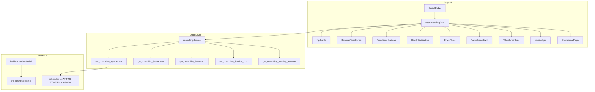

# CFO Controlling Dashboard Implementation Plan

## Senior Recommendations (pre-implementation notes)

```text
1. Charts: Recharts ^2.15.1 is already installed and used via ChartContainer
   (src/features/overview/components/bar-graph.tsx). No new chart library.

2. KPI cards: Reuse StatsCard from src/features/dashboard/components/stats-card.tsx
   (same pattern as overview @stats_cards). Wrap with controlling-specific delta badges.

3. PeriodPicker: shadcn ToggleGroup exists (src/components/ui/toggle-group.tsx).
   Match Fahrten filter bar style (src/features/trips/components/trips-filters-bar.tsx).
   Custom range: reuse DateRangePicker from src/components/ui/date-time-picker.tsx.

4. Naming: src/features/controlling/ is collision-free. Add controllingKeys in
   src/query/keys/. Do NOT import stats-utils.ts or occupancy-utils.ts.

5. Invoice KPIs: Add 4th RPC get_controlling_invoice_kpis in the same migration
   (recommended over client-side invoices table queries). Keeps Berlin period bounds,
   DSO/overdue/fakturierungsgrad logic in one place, scales with invoice volume.

6. Plan adjustments vs spec:
   - Nav: user confirmed Dashboard → Fahrten → Controlling → Regelfahrten
   - Icons: project uses Tabler via src/components/icons.tsx — add controlling: IconChartBar
     (not Lucide BarChart2)
   - 12-month bar chart vs period picker: RPC 1 only returns selected period days.
     Add optional 5th param p_include_trailing_months integer DEFAULT 0 OR a dedicated
     get_controlling_monthly_series(company, months=12) call from RevenueTimeSeries only.
     Recommended: extend RPC 1 with generate_series for daily rows in range (sparkline zeros)
     + separate lightweight RPC get_controlling_monthly_revenue(p_company_id, p_months=12)
     for the fixed 12-month chart (independent of period picker).
   - RPC 2 GROUP BY must include billing_variant_id (spec lists variant columns but says
     payer/billing_type/driver — insufficient for PayerBreakdown accordion).
   - RPC 2 active_days: computed in driver_active_days CTE (driver-level DISTINCT Berlin days),
     LEFT JOINed into breakdown rows — NOT COUNT DISTINCT within each payer/billing group.
   - RPC security: add current_user_is_admin() AND p_company_id = current_user_company_id()
     guards (shift RPC only filters by param; controlling is admin-only analytics).
   - KpiCards Δ%: second RPC 1 fetch for previous period via buildControllingPeriod shift.
   - Page data fetching: client page ('use client') + useControllingData hook; service resolves
     company_id from accounts (same pattern as other client Supabase features).
```

---

## Architecture



---

## Step 1 — Migration (BLOCKING GATE)

**File:** [`supabase/migrations/20260530120000_controlling_rpcs.sql`](supabase/migrations/20260530120000_controlling_rpcs.sql)

Follow SQL style from [`get_shift_day_summaries`](supabase/migrations/20260502120002_billing_type_accepts_self_payment.sql):

- Top comment block explaining Berlin TZ bucketing pattern + link to [`docs/plans/timezone-bug-audit-v2.md`](docs/plans/timezone-bug-audit-v2.md) Part 5 Q12
- `RETURNS TABLE (...)` + `LANGUAGE sql STABLE SECURITY DEFINER SET search_path = public`
- Guard: `IF NOT current_user_is_admin() OR p_company_id IS DISTINCT FROM current_user_company_id() THEN RETURN; END IF;` (or equivalent early exit)
- Date bucketing: `(t.scheduled_at AT TIME ZONE 'Europe/Berlin')::date`
- Km: `COALESCE(t.manual_distance_km, t.driving_distance_km)`
- Heatmap DOW: `EXTRACT(ISODOW FROM t.scheduled_at AT TIME ZONE 'Europe/Berlin')::int - 1` (0=Mo)

### RPC 1: `get_controlling_operational`

- `generate_series(p_date_from, p_date_to, '1 day'::interval)::date AS trip_date` LEFT JOIN aggregated trips
- Ensures sparkline gets zero-trip days
- Aggregations per spec (cancelled counted only in `cancelled_trips`; other metrics exclude cancelled unless noted)

### RPC 2: `get_controlling_breakdown`

- GROUP BY `payer_id, billing_type_id, billing_variant_id, driver_id`
- JOINs: `payers`, `billing_types`, `billing_variants`, `accounts` (role = 'driver')
- **`active_days` is driver-level only** — not per breakdown group. Implement via CTE + LEFT JOIN:

```sql
-- CTE: total working days per driver in the period (all payers combined)
driver_active_days AS (
  SELECT
    driver_id,
    COUNT(DISTINCT (scheduled_at AT TIME ZONE 'Europe/Berlin')::date) AS active_days
  FROM trips
  WHERE company_id = p_company_id
    AND status <> 'cancelled'
    AND (scheduled_at AT TIME ZONE 'Europe/Berlin')::date BETWEEN p_date_from AND p_date_to
    AND driver_id IS NOT NULL
  GROUP BY driver_id
)
-- Main breakdown query LEFT JOINs driver_active_days ON trips.driver_id = driver_active_days.driver_id
-- so every row for the same driver carries the same active_days value.
```

- **Why:** Auslastungsindex = driver trip_count / driver active_days must reflect total working days across all payers, not days working for one payer/billing_type/variant slice.
- Rows with `driver_id IS NULL` (Nicht zugewiesen): `active_days` is NULL; DriverTable handles separately.

### RPC 3: `get_controlling_heatmap`

- GROUP BY `(ISODOW - 1), hour` where hour = `EXTRACT(HOUR FROM scheduled_at AT TIME ZONE 'Europe/Berlin')`
- Filter: non-cancelled trips

### RPC 4: `get_controlling_invoice_kpis` (recommended addition)

Single row return:

| Field | Logic |
|-------|-------|
| open_count / open_amount | status IN open states (match [`invoice.types.ts`](src/features/invoices/types/invoice.types.ts)) |
| overdue_count / overdue_amount | status = 'sent' AND due date passed |
| dso_days | AVG days paid_at - sent_at for paid invoices |
| invoicing_rate_pct | trips in period with line item / total non-cancelled trips in period |

Period for fakturierungsgrad: trip `scheduled_at` Berlin date in `[p_date_from, p_date_to]`.

### RPC 5: `get_controlling_monthly_revenue` (recommended for 12-month chart)

- Last 12 Berlin calendar months ending current month
- Returns: `month_start date`, `revenue_net`, `trip_count`
- Called independently of period picker from `RevenueTimeSeries`

**Gate:** Developer runs `supabase db push` and regenerates/updates [`src/types/database.types.ts`](src/types/database.types.ts) before Step 2.

---

## Step 2 — Types, Utils, Service

| File | Purpose |
|------|---------|
| [`src/features/controlling/types/controlling.types.ts`](src/features/controlling/types/controlling.types.ts) | RPC row interfaces + `ControllingPeriod` / `ControllingPeriodKey` |
| [`src/features/controlling/lib/controlling-utils.ts`](src/features/controlling/lib/controlling-utils.ts) | `buildControllingPeriod`, `formatEuro/Km/Percent`, period shift for Δ%, named constants |
| [`src/features/controlling/api/controlling.service.ts`](src/features/controlling/api/controlling.service.ts) | One function per RPC; resolves `p_company_id` from session account |

**Date invariants:** All boundaries via [`todayYmdInBusinessTz()`](src/features/trips/lib/trip-business-date.ts) + `buildControllingPeriod` — never `new Date()` for boundaries.

**Utils period keys:**

- `today` → single Berlin day
- `this_week` → ISO week Mon–Sun in Berlin
- `this_month` / `last_month` → Berlin calendar month bounds
- `custom` → validated YYYY-MM-DD inputs

**Service pattern:** Mirror [`src/features/shift-reconciliations/api/shift-reconciliations.service.ts`](src/features/shift-reconciliations/api/shift-reconciliations.service.ts) RPC calls with typed returns; add "why RPC" comments.

**Query keys:** Add [`src/query/keys/controlling.ts`](src/query/keys/controlling.ts) and export from keys index.

**Gate:** `bun run build`

---

## Step 3 — React Query Hook

[`src/features/controlling/hooks/use-controlling-data.ts`](src/features/controlling/hooks/use-controlling-data.ts)

- 5 parallel `useQuery` calls (operational, breakdown, heatmap, invoiceKpis, monthlyRevenue)
- Keys include `period.dateFrom`, `period.dateTo`
- `staleTime: 5 * 60 * 1000`
- Separate loading/error per query for independent section skeletons
- KpiCards Δ%: optional 6th query for previous-period operational OR derive via `buildPreviousPeriod(period)` helper

**Gate:** `bun run build`

---

## Step 4 — PeriodPicker

[`src/features/controlling/components/PeriodPicker.tsx`](src/features/controlling/components/PeriodPicker.tsx)

- ToggleGroup: Heute | Diese Woche | Dieser Monat | Letzter Monat | Benutzerdefiniert
- Default: `this_month`
- Custom reveals date range (DateRangePicker or paired date inputs)
- Emits `ControllingPeriod` via `buildControllingPeriod` only

---

## Steps 5–10 — Components

All in [`src/features/controlling/components/`](src/features/controlling/components/):

| Component | Key implementation notes |
|-----------|-------------------------|
| **KpiCards** | 5× `StatsCard`; aggregate operational rows; Δ% badge on Netto-Umsatz vs previous period |
| **RevenueTimeSeries** | 12-month bars from RPC 5; daily sparkline from RPC 1; Recharts + ChartContainer; heights 220px / 80px |
| **PrimetimeHeatmap** | 7×24 CSS grid; metric toggle Fahrtenanzahl/Umsatz; explicit Mo=0 mapping comment; horizontal scroll on mobile |
| **HourlyDistribution** | Aggregate heatmap by hour; peak hour label |
| **DriverTable** | Client sort; aggregate RPC 2 rows by `driver_id` (sum trips/revenue/km); Auslastungsindex = total driver trips / `active_days` from any row (same value per driver via CTE); "Nicht zugewiesen" row; responsive column hide |
| **PayerBreakdown** | Data-driven accordion: payer → billing_type → billing_variant from RPC 2; no hardcoded hierarchy |
| **WheelchairStats** | Rollstuhl + KTS cards + monthly mini chart from operational |
| **InvoiceKpis** | 4 cards from RPC 4; empty state when zero invoices in period |
| **OperationalFlags** | Amber banner from aggregated operational flags (unpriced, unassigned, fremdfirma) |

Each component: skeleton while loading; format via `controlling-utils` only.

**Gates:** `bun run build` after each step batch (5–6, 7, 8, 9, 10).

---

## Step 11 — Page + Nav

### Page

[`src/app/dashboard/controlling/page.tsx`](src/app/dashboard/controlling/page.tsx)

- `'use client'` assembling all sections in spec layout
- shadcn `Card` wrappers with German section titles
- Page-level error card when all RPC queries fail
- h1: "Controlling"

### Nav

[`src/config/nav-config.ts`](src/config/nav-config.ts) — insert after Fahrten:

```typescript
{
  title: 'Controlling',
  url: '/dashboard/controlling',
  icon: 'controlling',
  shortcut: ['c', 'o'],
  access: { requireOrg: true, role: 'admin' } // match admin-only pattern from docs/access-control.md
}
```

[`src/components/icons.tsx`](src/components/icons.tsx) — add `controlling: IconChartBar` (Tabler)

**Gate:** `bun run build`

---

## Step 12 — Documentation (mandatory)

1. **Create** [`docs/controlling-module.md`](docs/controlling-module.md) — scope, RPC catalog, Berlin TZ, payer hierarchy, `active_days` driver-level CTE rationale, limitations, deferred Tier 3 items
2. **Update** [`docs/plans/cfo-dashboard-audit.md`](docs/plans/cfo-dashboard-audit.md) — "Implementation Status" section
3. **Inline "why" comments** in every new file (RPC migration, utils, hook, PayerBreakdown, PrimetimeHeatmap, service)

---

## Hard Rules Checklist

- No `stats-utils.ts` / `occupancy-utils.ts` / `overview/layout.tsx` changes
- No full-table trip fetches
- No inline `toFixed()` / scattered `toLocaleString()`
- All sections have skeletons
- Migration pushed before TypeScript work begins

---

## Schema References (from audit)

Key trip columns used in RPCs ([`database.types.ts`](src/types/database.types.ts)):

- `scheduled_at`, `status`, `net_price`, `gross_price`, `manual_distance_km`, `driving_distance_km`
- `driver_id`, `payer_id`, `billing_type_id`, `billing_variant_id`
- `is_wheelchair`, `kts_document_applies`, `fremdfirma_id`, `fremdfirma_cost`

Invoice fields ([`invoice.types.ts`](src/features/invoices/types/invoice.types.ts)): `status`, `payment_due_days`, `sent_at`, `paid_at`, `created_at`

Payer hierarchy: [`docs/billing-families-variants.md`](docs/billing-families-variants.md)
