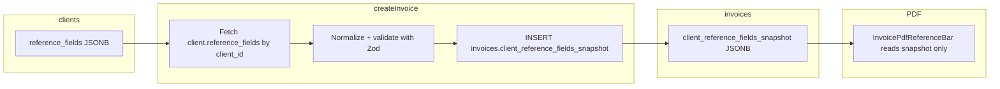

# Client reference fields (Bezugszeichen) on invoice PDF

## Data flow

---

## Part A — DB: `clients.reference_fields`

- **Migration** (new file under `[supabase/migrations/](supabase/migrations/)`):  
`ALTER TABLE public.clients ADD COLUMN IF NOT EXISTS reference_fields jsonb;`  
**Comment (Part G):** document ordered array of `{ label, value }`, UI/PDF usage; **persistence convention:** when there are no valid rows after cleaning, store `**null`**, not `**[]`** (see Part C).
- **Zod** — new module (recommended path: `[src/features/clients/lib/client-reference-fields.schema.ts](src/features/clients/lib/client-reference-fields.schema.ts)` next to the feature, not inside `components/ui`):
  - `ClientReferenceFieldSchema = z.object({ label: z.string().min(1), value: z.string() })`
  - `ClientReferenceFieldsSchema = z.array(ClientReferenceFieldSchema)` (optional `.max(6)` **not** applied per requirements; UI hint only)
  - Export helpers: `parseClientReferenceFields(json: unknown): { label: string; value: string }[]` (return `[]` on null/invalid if desired, or strict throw—align with how `pdf_column_override` is parsed elsewhere).
- `**database.types.ts`**: add `reference_fields: Json | null` (or a narrower type if you prefer) to `clients` Row/Insert/Update in `[src/types/database.types.ts](src/types/database.types.ts)`, or regenerate from Supabase and reconcile.
- `**Client` type**: already `Database['public']['Tables']['clients']['Row']` in `[src/features/clients/api/clients.service.ts](src/features/clients/api/clients.service.ts)`; after types update it includes `reference_fields`. Optionally add a small **domain type** `ClientReferenceField[]` re-export from the schema file for UI/PDF props.

---

## Part B — DB: `invoices.client_reference_fields_snapshot`

- **Migration**: `ALTER TABLE public.invoices ADD COLUMN IF NOT EXISTS client_reference_fields_snapshot jsonb;`  
**Comment (Part G):** frozen at invoice creation per §14 UStG; same immutability story as `[rechnungsempfaenger_snapshot](supabase/migrations/20260405100003_invoices_recipient_snapshot.sql)`.
- **Types**: extend `[InvoiceRow](src/features/invoices/types/invoice.types.ts)` with  
`client_reference_fields_snapshot: { label: string; value: string }[] | null`  
(or `Json | null` at row level + parse at boundaries—prefer typed array + parse on read/write for consistency with `pdf_column_override` patterns).
- `**createInvoice`** (`[src/features/invoices/api/invoices.api.ts](src/features/invoices/api/invoices.api.ts)`):
  - **Source of client at create time:** the builder’s `[use-invoice-builder.ts](src/features/invoices/hooks/use-invoice-builder.ts)` only passes `formValues` into `createInvoice` (**lines 214–222**); it does **not** pass the prefetched `clients` array. **Recommended:** inside `createInvoice`, when `payload.formValues.client_id` is non-null, run a focused Supabase read:  
  `from('clients').select('reference_fields').eq('id', client_id).single()`  
  (scoped by RLS like other admin calls). Parse with `ClientReferenceFieldsSchema` after normalizing DB JSON (**snapshot is `null` when there is nothing to render**—e.g. column `null`, invalid JSON, or no rows with non-empty labels after the same strip logic as Part C; never persist `[]` on the invoice for “empty”).
  - When `client_id` is **null** (monthly / single_trip today), set `client_reference_fields_snapshot: null`.
  - **Comment (Part G):** mirror the §14 block above `rechnungsempfaenger_snapshot` assignment (**~228–260**): explain compliance + that values come from `clients.reference_fields` at insert time only.
  - **Future-proofing:** logic is **keyed on `client_id`**, not `mode`, so when other modes gain `client_id`, snapshot populates automatically.

---

## Part C — Client form UI

- File: `[src/features/clients/components/client-form.tsx](src/features/clients/components/client-form.tsx)`.
- **Placement:** new section **“Bezugszeichen / Referenzfelder”** after **“Weitere Angaben”** (after the block that ends ~`[L474](src/features/clients/components/client-form.tsx) `/ before the **“Einstellungen”** separator ~`L476`).
- **Behavior:**
  - Local state or `useFieldArray`-style pattern: each row = Label (`Input`) + Value (`Input`) + Remove.
  - **“Feld hinzufügen”** appends `{ label: '', value: '' }` (or empty label placeholder).
  - **Save / persistence (no blocking, no field-level errors for in-progress rows):** **silently strip** any row whose **label** is empty/whitespace-only **before** writing to `clients.reference_fields`. Do **not** block save and do **not** show per-field validation errors for empty labels while the user may still be typing. **After stripping:** if **no rows remain**, persist `**reference_fields: null`** (not `**[]`**), consistent with Part A. If one or more rows remain, persist the cleaned array and run `**ClientReferenceFieldsSchema`** (or equivalent) only on that cleaned array so stored data always satisfies `label.min(1)`.
  - **Hint text:** “max. 6 Felder empfohlen” (no hard limit).
- **Reordering:** no `@dnd-kit` (or similar) in `[src/features/clients](src/features/clients)`; **skip reorder** per constraints.

---

## Part D — PDF: reference bar

- **New file:** `[src/features/invoices/components/invoice-pdf/invoice-pdf-reference-bar.tsx](src/features/invoices/components/invoice-pdf/invoice-pdf-reference-bar.tsx)`
  - **Props:** `fields: { label: string; value: string }[]`
  - **Comment (Part G):** two-row grid (labels row bold/muted small, values row normal); **data from invoice snapshot only**, not `invoice.client`.
  - **Layout:** full width (`width: '100%'` inside page padding); table-like `View` + `flexDirection: 'row'` columns with **equal flex** (`flex: 1` per column); top/bottom border using `[PDF_COLORS](src/features/invoices/components/invoice-pdf/pdf-styles.ts)` / existing border styles; font sizes from `PDF_FONT_SIZES`. The bar’s root `View` must include `**marginTop: 8`** to separate it from the Rechnungsdaten block above and `**marginBottom: 8`** before the subject line / cover body below; prefer reusing or mirroring spacing patterns from `[pdf-styles.ts](src/features/invoices/components/invoice-pdf/pdf-styles.ts)` (e.g. inline `8` where that file already uses the same for adjacent blocks, or a small shared style if one fits).
  - **Guard:** if `fields.length === 0`, return `null`.
- `**InvoicePdfDocument.tsx`** (`[src/features/invoices/components/invoice-pdf/InvoicePdfDocument.tsx](src/features/invoices/components/invoice-pdf/InvoicePdfDocument.tsx)`): between `<InvoicePdfCoverHeader />` (**~300–311**) and `<InvoicePdfCoverBody />` (**~313**), render the bar **only** when parsed snapshot is non-empty. Parse `invoice.client_reference_fields_snapshot` with the same Zod schema (safe parse → `[]`).
- **Draft preview:** `[build-draft-invoice-detail-for-pdf.ts](src/features/invoices/components/invoice-pdf/build-draft-invoice-detail-for-pdf.ts)`: when building the synthetic `InvoiceDetail`, set `client_reference_fields_snapshot` from the **matched client** in `params.clients` by `step2.client_id` (parse `reference_fields` with Zod). If no client or no fields, `null`. Ensures preview matches post-create PDF without reading live DB in the document.

---

## Part E — Wire `reference_fields` through fetches and types

| Location                                                                      | Change                                                                                                                                             |
| ----------------------------------------------------------------------------- | -------------------------------------------------------------------------------------------------------------------------------------------------- |
| `[getInvoiceDetail](src/features/invoices/api/invoices.api.ts)`               | Add `reference_fields` to `client:clients(...)` select (~126–128).                                                                                 |
| `[fetchTripsForBuilder](src/features/invoices/api/invoice-line-items.api.ts)` | Extend `client:clients(...)` (~149) with `reference_fields` for draft/client resolution.                                                           |
| `[new/page.tsx](src/app/dashboard/invoices/new/page.tsx)`                     | Add `reference_fields` to clients select string (~90).                                                                                             |
| `[InvoiceDetail](src/features/invoices/types/invoice.types.ts)`               | Add `reference_fields?` to nested `client` object (~~168–181) and optionally `InvoiceWithPayer.client` (~~134–146) if you want list/detail parity. |

**PDF:** continues to use `**client_reference_fields_snapshot` only**; joined `client.reference_fields` is for builder/preview and admin consistency, not for issued PDF.

---

## Part F — Storno

- `[src/features/invoices/lib/storno.ts](src/features/invoices/lib/storno.ts)`: in `createStornorechnung` insert payload (**~74–107**), add  
`client_reference_fields_snapshot: originalInvoice.client_reference_fields_snapshot ?? null`  
with a short comment mirroring the `pdf_column_override` / `rechnungsempfaenger_snapshot` rationale (**~99–106**).

---

## Part G — Inline comments (summary)

- Clients migration: shape + purpose.
- Invoices migration: freeze at creation / §14.
- `createInvoice`: compliance + fetch path.
- `invoice-pdf-reference-bar.tsx`: layout + snapshot-only.

---

## Part H — Docs

- **Invoices:** extend `[docs/invoices-module.md](docs/invoices-module.md)` with a section: column names, snapshot timing (`createInvoice`), PDF placement (below header, above subject/body), mode behavior (`client_id` null → no snapshot), Storno copy.
- **Clients:** **no** dedicated `docs/*client`* file was found. Options: add `**docs/clients.md`** (short: `reference_fields`, editor location, JSON shape) **or** a short subsection in an existing overview doc if you prefer one file. Mention in the plan that the repo has no prior clients doc.

---

## Testing / verification checklist (manual)

- Client with 0 / 1 / N reference fields; PDF bar visibility.
- Create invoice with `client_id` → DB row has snapshot; change client `reference_fields` later → **re-open PDF** unchanged.
- Storno PDF matches original bar.
- Draft builder preview shows bar when client has fields.

---

## Files touched (expected)

- New: migration ×2, `client-reference-fields.schema.ts`, `invoice-pdf-reference-bar.tsx`
- Edit: `invoice.types.ts`, `invoices.api.ts`, `invoice-line-items.api.ts`, `InvoicePdfDocument.tsx`, `build-draft-invoice-detail-for-pdf.ts`, `storno.ts`, `client-form.tsx`, `new/page.tsx`, `database.types.ts`, `docs/invoices-module.md`, new or updated clients doc

