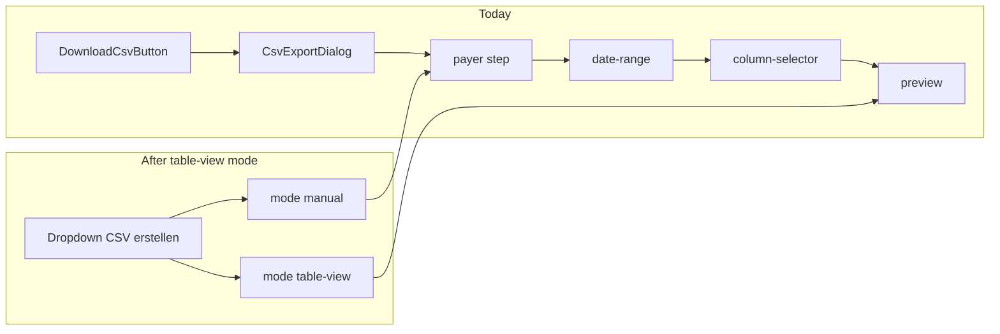

# CSV Export Dropdown — Tabellenansicht exportieren

## Context

Today [`download-csv-button.tsx`](src/features/trips/components/csv-export/download-csv-button.tsx) renders a single outline button that opens one [`CsvExportDialog`](src/features/trips/components/csv-export/csv-export-dialog.tsx) at step `'payer'`. URL prefill already works via [`useExportFilterPrefill`](src/features/trips/hooks/use-export-filter-prefill.ts) (including `scheduled_at` → `dateFrom`/`dateTo`). All exportable column keys live in [`EXPORT_COLUMN_DEFS`](src/features/trips/lib/export-columns.registry.ts).



## Files to change

| File | Change |
|------|--------|
| [`csv-export.types.ts`](src/features/trips/types/csv-export.types.ts) | Add `ExportMode` type |
| [`csv-export-dialog.tsx`](src/features/trips/components/csv-export/csv-export-dialog.tsx) | `mode` prop, branching open effect, preview description, pass `showBack` |
| [`preview-step.tsx`](src/features/trips/components/csv-export/preview-step.tsx) | `showBack?: boolean`; confirm loading UI; disable Export during `isLoadingPreview` |
| [`download-csv-button.tsx`](src/features/trips/components/csv-export/download-csv-button.tsx) | Single dropdown trigger + two dialog instances |
| [`docs/features/csv-export.md`](docs/features/csv-export.md) | Export Modes section |

No changes to [`export-query.ts`](src/features/trips/lib/export-query.ts) — `buildExportPreviewSearchParams` **already exists** (line 183) and is already imported by `csv-export-dialog.tsx`.

No changes to [`trips-header-actions.tsx`](src/app/dashboard/trips/trips-header-actions.tsx), prefill hook, or registry beyond reading `EXPORT_COLUMN_DEFS`.

---

## Step 1 — `ExportMode` type

In [`csv-export.types.ts`](src/features/trips/types/csv-export.types.ts), add after `ExportStep`:

```ts
export type ExportMode = 'manual' | 'table-view';
```

Build gate: `bun run build`

---

## Step 2 — `CsvExportDialog` mode behaviour

### Props

```ts
interface CsvExportDialogProps {
  open: boolean;
  onOpenChange: (open: boolean) => void;
  mode?: ExportMode; // default 'manual'
}
```

Destructure with default: `mode = 'manual'`.

### Module-level column keys

Import `EXPORT_COLUMN_DEFS` from [`export-columns.registry.ts`](src/features/trips/lib/export-columns.registry.ts):

```ts
const ALL_EXPORT_COLUMN_KEYS = EXPORT_COLUMN_DEFS.map((col) => col.key);
```

Add **why comment** at assignment site in the open effect (table-view branch):

> Columns are set in the same `useEffect` as `setStep('preview')`, before the preview step mounts. The Export button stays disabled until preview loading completes (`isLoadingPreview`), so `handleExport` cannot run with stale empty `selectedColumns`.

### Refactor `loadPreviewCount` (stale-state fix)

Current implementation reads `filters` from React state. When called inside the open `useEffect` immediately after `setFilters(prefillFilters)`, state is still stale.

Change signature to accept an optional override:

```ts
const loadPreviewCount = async (filtersOverride?: ExportFilters) => {
  const activeFilters = filtersOverride ?? filters;
  const params = buildExportPreviewSearchParams(activeFilters);
  // ... rest unchanged
};
```

### Gap 1 — `buildExportPreviewSearchParams` (verified)

**Already implemented** in [`export-query.ts`](src/features/trips/lib/export-query.ts) at line 183:

```ts
export function buildExportPreviewSearchParams(
  filters: ExportFilters
): URLSearchParams
```

`csv-export-dialog.tsx` already imports and calls it inside `loadPreviewCount`. **No extraction or new helper needed.** Implementation step: only add the `filtersOverride` parameter — do not duplicate param-building logic.

### Open effect (replace lines 77–86)

Branch on `mode` when `open === true`:

**`mode === 'manual'` (unchanged):**
- `setStep('payer')`
- `setFilters(prefillFilters)`
- `setSelectedColumns([])`
- clear preview/export result state

**`mode === 'table-view'`:**
- clear preview/export result state (`setPreviewCount(null)`, `setSampleTrips([])`, etc.)
- `setFilters(prefillFilters)`
- `setSelectedColumns(ALL_EXPORT_COLUMN_KEYS)` — with why comment (see above)
- **`setIsLoadingPreview(true)` before `setStep('preview')`** — see Gap 2 ordering note below
- `setStep('preview')`
- `void loadPreviewCount(prefillFilters)` — pass prefill directly

**Effect ordering (Gap 2):** Manual flow calls `loadPreviewCount()` *before* `setStep('preview')` (`handleNextFromColumnSelector`), so `setIsLoadingPreview(true)` runs synchronously before `PreviewStep` mounts. Table-view must mirror this: set loading flag true (or call `loadPreviewCount` first) **before** switching to the preview step. Otherwise one render can show badge `"Unbekannt"` + amber empty state (`!isLoadingPreview && sampleTrips.length === 0`) even though fetch is about to start.

Add `mode` to the effect dependency array: `[open, prefillFilters, mode]`.

Add a **why comment** above the table-view branch: admins already filtered the table; skip configuration and export all registry columns.

### Dialog description

Update `DialogDescription` preview branch:

```tsx
{step === 'preview' && mode === 'table-view'
  ? 'Export basiert auf der aktuellen Tabellenansicht.'
  : step === 'preview'
    ? 'Überprüfen Sie die Export-Einstellungen vor dem Download.'
    : /* existing step descriptions unchanged */}
```

Step titles (`stepTitle` memo) stay unchanged.

### Preview step — hide Back in table-view

Pass to `PreviewStep`:

```tsx
showBack={mode !== 'table-view'}
onBack={handleBack}
```

Manual mode behaviour for `handleBack` stays identical.

Build gate: `bun run build`

---

## Step 2b — `PreviewStep` updates

In [`preview-step.tsx`](src/features/trips/components/csv-export/preview-step.tsx):

### Back button

- Add `showBack?: boolean` to `PreviewStepProps` (default `true` via destructuring)
- Wrap the "Zurück" button: `{showBack ? ( <Button ...>Zurück</Button> ) : null}`
- When hidden, Export button keeps `flex-1`

### Gap 2 — Loading state on table-view cold-open (code audit + ordering fix)

**PreviewStep conditions (no navigation flag):** Loading UI is driven purely by `isLoadingPreview` — there is no `userNavigatedHere` or similar gate.

| UI region | Condition | When `isLoadingPreview === false`, `previewCount === null`, `sampleTrips === []` |
|-----------|-----------|-------------------------------------------------------------------------------------|
| Badge (~153) | `isLoadingPreview ? spinner : previewCount !== null ? count : 'Unbekannt'` | Shows **"Unbekannt"** |
| Main area (~170) | `isLoadingPreview ? spinner : sampleTrips.length > 0 ? table : empty` | Shows **amber "Keine Fahrten gefunden"** |

So if `PreviewStep` mounts before `isLoadingPreview` becomes `true`, the user briefly sees a false empty state — exactly the table-view cold-open risk.

**Manual flow avoids this** because `handleNextFromColumnSelector` calls `void loadPreviewCount()` first; its first line is `setIsLoadingPreview(true)` (sync), then `setStep('preview')`.

**Table-view must not** `setStep('preview')` before the loading flag is true. Required in the open effect:

```ts
setIsLoadingPreview(true);
setStep('preview');
void loadPreviewCount(prefillFilters);
```

(or call `loadPreviewCount` before `setStep`, matching manual order — do not rely on async timing).

**No new skeleton needed** if ordering is correct — existing badge spinner + main-area spinner already react to `isLoadingPreview`.

**Mandatory cold-open test:** Open "Tabellenansicht exportieren" on a filtered Fahrten view; on **first paint** confirm badge shows "Lade..." spinner (not "Unbekannt") and main area shows "Lade Vorschau-Daten..." (not amber empty). Throttle network in DevTools if needed to hold loading visible.

### Gap 3 — Export button disabled during preview loading

Current Export button (line ~261):

```tsx
disabled={isExporting || previewCount === 0 || previewCount === null}
```

`previewCount === null` implicitly covers loading, but add **`isLoadingPreview`** explicitly for clarity and race safety:

```tsx
disabled={
  isLoadingPreview ||
  isExporting ||
  previewCount === 0 ||
  previewCount === null
}
```

Add brief **why comment**: prevents `handleExport` from firing before `selectedColumns` state settles (low risk in table-view because columns are set in the same effect, but loading guard is the explicit gate).

Build gate: `bun run build`

---

## Step 3 — Single dropdown trigger in `DownloadCsvButton`

**Correction:** No split button. One `DropdownMenuTrigger` button; Radix manages dropdown open/close.

Follow [`ansichten-dropdown.tsx`](src/features/trips/components/ansichten-dropdown.tsx) import pattern:

```ts
import {
  DropdownMenu,
  DropdownMenuContent,
  DropdownMenuItem,
  DropdownMenuSeparator,
  DropdownMenuTrigger
} from '@/components/ui/dropdown-menu';
```

Icons: `FileDown`, `ChevronDown`, `Table2` from `lucide-react`.

### State

```ts
const [manualOpen, setManualOpen] = React.useState(false);
const [tableViewOpen, setTableViewOpen] = React.useState(false);
```

Add **why comment**: separate dialog state avoids reset conflicts between the two `CsvExportDialog` instances.

### Layout (exact structure)

```tsx
<DropdownMenu>
  <DropdownMenuTrigger asChild>
    <Button variant='outline' className='gap-2'>
      <FileDown className='h-4 w-4 shrink-0' />
      <span className='hidden sm:inline'>CSV erstellen</span>
      <ChevronDown className='h-4 w-4 shrink-0' />
    </Button>
  </DropdownMenuTrigger>
  <DropdownMenuContent align='end'>
    <DropdownMenuItem onClick={() => setManualOpen(true)}>
      <FileDown className='mr-2 h-4 w-4' />
      CSV Export
    </DropdownMenuItem>
    <DropdownMenuSeparator />
    <DropdownMenuItem onClick={() => setTableViewOpen(true)}>
      <Table2 className='mr-2 h-4 w-4' />
      Tabellenansicht exportieren
    </DropdownMenuItem>
  </DropdownMenuContent>
</DropdownMenu>
```

No `rounded-r-none`, no `border-r-0`, no separate chevron-only button.

Update dynamic import loading skeleton label width if needed (~"CSV erstellen" text).

### Two dialog instances

```tsx
<CsvExportDialog open={manualOpen} onOpenChange={setManualOpen} mode='manual' />
<CsvExportDialog open={tableViewOpen} onOpenChange={setTableViewOpen} mode='table-view' />
```

Build gate: `bun run build`

---

## Step 4 — Documentation

Update [`docs/features/csv-export.md`](docs/features/csv-export.md):

- New **Export Modes** section:
  - `manual` — full wizard (filter → date → columns → preview); opened via dropdown item "CSV Export"
  - `table-view` — URL prefill + all `EXPORT_COLUMN_DEFS` keys + preview only; opened via "Tabellenansicht exportieren"
- Entry point: **"CSV erstellen"** dropdown in page header (`DownloadCsvButton`)
- Document `CsvExportDialog` `mode?: ExportMode` prop (defaults to `'manual'`)
- Note deferred: `invoice_status` not mapped to export filters (no warning banner yet)

---

## Invariants / out of scope

- `mode` optional; callers without `mode` behave exactly as today
- No new npm dependencies
- [`trips-header-actions.tsx`](src/app/dashboard/trips/trips-header-actions.tsx) unchanged
- [`export-query.ts`](src/features/trips/lib/export-query.ts) unchanged — helper already exists
- Deferred: invoice_status warning, "Letzten Export wiederholen"

## Manual test checklist

1. "CSV erstellen" dropdown opens; "CSV Export" → filter step, empty columns, full wizard
2. **Table-view cold-open (Gap 2):** "Tabellenansicht exportieren" → first paint shows badge "Lade..." + main-area spinner (NOT "Unbekannt" or amber empty); no Back button; count loads after fetch
3. With Fahrten URL filters active → table-view preview reflects prefill (payer, dates from `scheduled_at`, etc.)
4. Export button disabled while preview loading; enabled after count loads
5. Export from table-view downloads CSV with all registry columns
6. `bun run build` passes after each step
