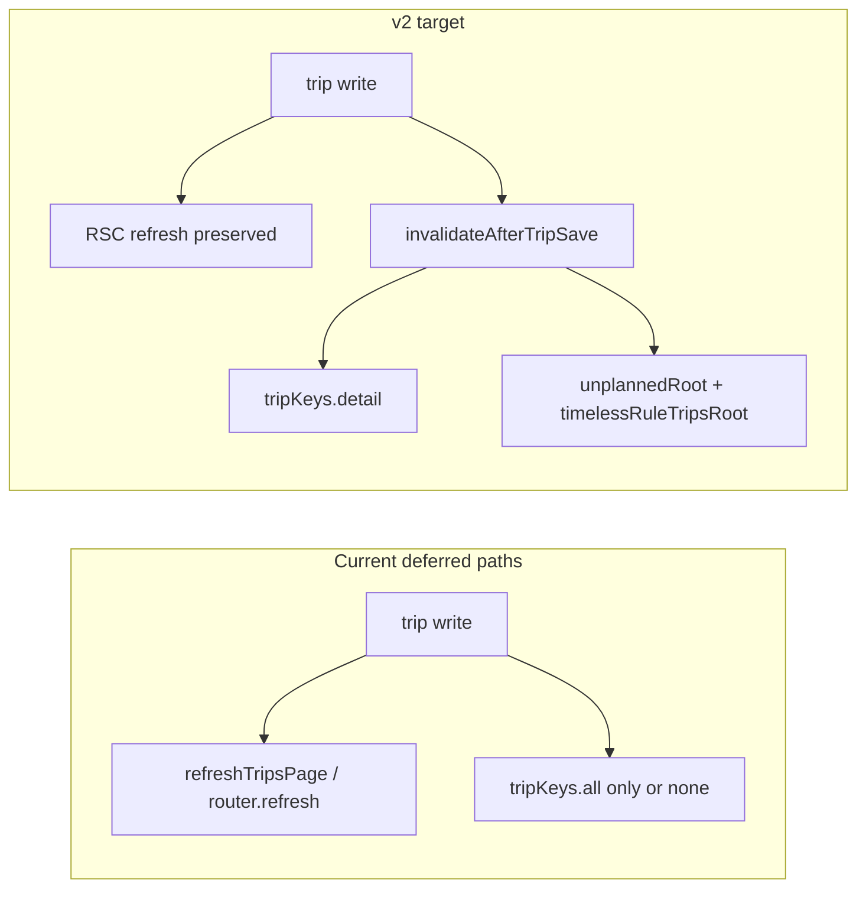

# v2: Migrate All Deferred Trip Save Paths

## Current state (v1 complete)

The helper at [`src/features/trips/lib/invalidate-after-trip-save.ts`](src/features/trips/lib/invalidate-after-trip-save.ts) is stable and already used by Trip Detail Sheet + both dashboard widgets. All seven deferred paths still invalidate only `tripKeys.all` (or nothing) and miss `tripKeys.unplannedRoot` / `tripKeys.timelessRuleTripsRoot`.



## Hard constraints (from spec)

- **Do not edit** [`invalidate-after-trip-save.ts`](src/features/trips/lib/invalidate-after-trip-save.ts)
- **Do not edit** [`recurring-rules.actions.ts`](src/features/trips/api/recurring-rules.actions.ts) — server action; invalidation stays in panel/sheet clients
- **Do not edit** [`create-linked-return.ts`](src/features/trips/lib/create-linked-return.ts) — add invalidation in [`create-return-trip-dialog.tsx`](src/features/trips/components/return-trip/create-return-trip-dialog.tsx) where `useQueryClient` is available
- Preserve all `refreshTripsPage()` / `router.refresh()` calls; when RSC refresh already invalidates `tripKeys.all`, pass `includeTripList: false` to the helper to avoid redundant list busts (same pattern as [`use-trip-detail-save-refresh.ts`](src/features/trips/trip-detail-sheet/hooks/use-trip-detail-save-refresh.ts))
- `bun run build` after each step; one-line **WHY** comment on every helper call

## Step 1 — Reschedule dialog

**File:** [`trip-reschedule-dialog.tsx`](src/features/trips/trip-reschedule/components/trip-reschedule-dialog.tsx)

**Current success handler (lines 277–287):** toast → close → `onSuccess` → RSC refresh **or** `router.refresh()` + `queryClient.invalidateQueries(tripKeys.all)`.

**Change after `result.ok`:**

1. **Define `legToPatch` as a module-level pure function above the component, not inside it.** Build patch objects from the already-computed `primaryLeg` / `partnerLeg` (mirror `rowFromLeg` in [`reschedule.actions.ts`](src/features/trips/trip-reschedule/api/reschedule.actions.ts)):

```ts
function legToPatch(leg: LegScheduleInput) {
  return leg.scheduledAt
    ? { scheduled_at: leg.scheduledAt.toISOString(), requested_date: null }
    : { scheduled_at: null, requested_date: leg.requestedDate?.trim() || null };
}
```

**Type note:** `LegScheduleInput` is exported from [`reschedule.actions.ts`](src/features/trips/trip-reschedule/api/reschedule.actions.ts) and may be imported for the `legToPatch` parameter. If it is not exported or import fails, infer the patch shape directly from `primaryLeg` / `partnerLeg` variables in the success handler (they have `scheduledAt` and `requestedDate` fields) rather than importing the type.

2. Call helper **after** existing RSC refresh block:

```ts
await invalidateAfterTripSave(queryClient, {
  tripIds: paired ? [trip.id, paired.id] : [trip.id],
  patch: paired
    ? [legToPatch(primaryLeg), legToPatch(partnerLeg!)]
    : legToPatch(primaryLeg),
  includePlanningWidgets: true,
  includeTripList: false
});
// WHY: reschedule always writes scheduled_at/requested_date — always bust widgets
```

3. Remove the standalone `queryClient.invalidateQueries({ queryKey: tripKeys.all })` in the non-RSC branch (RSC path + helper cover list/detail/widgets).

**Build gate:** `bun run build`

---

## Step 2 — Trip cancellation

**File:** [`use-trip-cancellation.ts`](src/features/trips/hooks/use-trip-cancellation.ts)

**Current:** RSC refresh or `router.refresh()` + `tripKeys.all` only (lines 88–93).

**Change after success toasts:**

```ts
const pairedModes = new Set([
  'cancel-nonrecurring-and-paired',
  'skip-occurrence-and-paired'
]);
const tripIds =
  pairedModes.has(mode) && trip.linked_trip_id
    ? [trip.id, trip.linked_trip_id]
    : [trip.id];

await invalidateAfterTripSave(queryClient, {
  tripIds,
  patch: { status: 'cancelled' },
  includePlanningWidgets: true,
  includeTripList: false
});
// WHY: cancelled trips must leave planning widgets immediately
```

- Call helper **directly** (hook is not detail-sheet scoped; no `useTripDetailSaveRefresh` import needed)
- Remove redundant `tripKeys.all` invalidation in the else branch
- Keep existing RSC refresh block above the helper call

**Build gate:** `bun run build`

---

## Step 3 — Kanban board staged save

**File:** [`kanban-board.tsx`](src/features/trips/components/kanban/kanban-board.tsx)

**Current `handleSave` (lines 500–537):** builds payload inside `Promise.all` map, then `tripKeys.all` + `refreshTripsPage()`.

**Refactor `handleSave`:**

1. Before `Promise.all`, map `Object.entries(pendingChanges)` to `{ id, payload }[]` using **today's payload-building logic unchanged** (lines 506–528).
2. `await Promise.all(entries.map(({ id, payload }) => tripsService.updateTrip(id, payload)))`
3. Replace `void queryClient.invalidateQueries({ queryKey: tripKeys.all })` with:

```ts
await invalidateAfterTripSave(queryClient, {
  tripIds: entries.map((e) => e.id),
  patch: entries.map((e) => e.payload),
  includePlanningWidgets: 'auto',
  includeTripList: false
});
// WHY: 'auto' — Kanban saves may be reorder-only; inspect the patch
```

4. Keep `await refreshTripsPage()` and `clearPendingChanges()` as-is.

**Build gate:** `bun run build`

---

## Step 4 — Pending assignments

**File:** [`use-pending-assignments.ts`](src/features/trips/components/pending-assignments/use-pending-assignments.ts)

**Current `handleAssign` (line 292):** `tripsService.updateTrip` then local state `filter` / `load()` — **no React Query invalidation**.

**Change:**

1. **Verify `useDispatchInbox` (exported from this file) is a React hook** — it is called from components and may use `useQueryClient()` at the top of the hook body. If the invalidation logic were ever moved to a plain (non-hook) function, `useQueryClient()` could not be called there; pass `queryClient` as a parameter from the calling component instead.
2. Add `useQueryClient` + import `invalidateAfterTripSave` inside the hook
3. After successful `updateTrip`, **before** local state updates:

```ts
await invalidateAfterTripSave(queryClient, {
  tripIds: [tripId],
  patch: updates,
  includePlanningWidgets: 'auto'
});
// WHY: 'auto' — assignment writes scheduled_at/driver_id when present
```

3. Do **not** remove `setUnassignedToday` / `load()` logic — helper is additive.

**Build gate:** `bun run build`

**Smoke test (step 4):** Assign a driver to a trip via the pending assignments UI. Confirm the trip disappears from the unplanned widget without reload. Document result in audit doc under **## V2 Smoke Tests**.

---

## Step 5 — Create linked return

**File:** [`create-return-trip-dialog.tsx`](src/features/trips/components/return-trip/create-return-trip-dialog.tsx) *(not the lib)*

**Current:** loops `createLinkedReturnForOutbound`, then toast + `onSuccess`.

**Pre-flight:** Before writing the `createdReturns` collection, **read [`create-linked-return.ts`](src/features/trips/lib/create-linked-return.ts)** and confirm the return type. The function returns `Promise<Trip>` (the created return leg); use `created.id` for `linked_trip_id`. If the return shape differs, adjust the collection logic accordingly.

**Change inside the save loop** — capture return value:

```ts
const createdReturns: Array<{ outboundId: string; returnId: string; outboundPatch: UpdateTrip }> = [];
for (const row of eligible) {
  const created = await createLinkedReturnForOutbound(row.outbound as Trip, { ... });
  createdReturns.push({
    outboundId: row.outbound.id,
    returnId: created.id,
    // Mirror the outbound patch written inside create-linked-return.ts — do not invent values in the dialog
    outboundPatch: { linked_trip_id: created.id, link_type: 'outbound' }
  });
}
```

Read [`create-linked-return.ts`](src/features/trips/lib/create-linked-return.ts) lines 58–61 for the exact outbound patch the lib writes (`linked_trip_id`, `link_type`). Use those same field values in the invalidation patch — **do not hardcode `'outbound'` in the dialog without confirming it matches the lib**. The lib currently sets `link_type: 'outbound'` on the outbound leg; if that changes in the lib, the invalidation patch must stay in sync.

After loop, before toast:

```ts
await invalidateAfterTripSave(queryClient, {
  tripIds: createdReturns.map((r) => r.outboundId),
  patch: createdReturns.map((r) => r.outboundPatch),
  includePlanningWidgets: true
});
// WHY: link metadata is planning-affecting — always bust widgets
```

- Add `useQueryClient` import

**Build gate:** `bun run build`

---

## Step 6 — Recurring rule panel + sheet

**Files:**
- [`recurring-rule-panel.tsx`](src/features/clients/components/recurring-rule-panel.tsx) — line 271–273
- [`recurring-rule-sheet.tsx`](src/features/clients/components/recurring-rule-sheet.tsx) — line 243–245

**Current:** when `resynced > 0`, `void queryClient.invalidateQueries({ queryKey: tripKeys.all })`.

**Replace with:**

```ts
await invalidateAfterTripSave(queryClient, {
  includePlanningWidgets: true
});
// WHY: batch resync updates scheduled_at on unknown trip set — bust widgets broadly
```

- No `tripIds` / `patch` — intentional; helper skips detail keys, invalidates `tripKeys.all` + both widget roots
- Keep `resynced > 0` guard (billing-only saves still skip invalidation)
- **Bonus in same files:** `handleShortenConfirm` currently has **no** cache invalidation after trip deletions. **Read `handleShortenConfirm` in both files first** and use the actual destructured variable name for the deletion count (currently `{ deleted }` from `runUpdateWithCleanup` — do not assume the name without reading). When that count is `> 0`, add the same helper call with `includePlanningWidgets: true` so deleted generated trips disappear from widgets.

**Do not modify** [`recurring-rules.actions.ts`](src/features/trips/api/recurring-rules.actions.ts).

**Build gate:** `bun run build`

---

## Step 7 — Bulk upload client resolution

**File:** [`resolve-clients-step.tsx`](src/features/trips/components/bulk-upload/resolve-clients-step.tsx)

**Current (line 195):** direct `supabase.from('trips').update(tripPatch)` — no invalidation.

**Change after successful update:**

```ts
await invalidateAfterTripSave(queryClient, {
  tripIds: [current.tripId],
  patch: tripPatch,
  includePlanningWidgets: false
});
// WHY: client/address only — widgets unaffected; explicit opt-out
```

- Add `useQueryClient` + helper import

**Build gate:** `bun run build`

---

## Step 8 — Documentation

### [`docs/trips/invalidation-contract.md`](docs/trips/invalidation-contract.md)

- Extend **Current Callers** table with rows for steps 1–7 (`File | Function | includePlanningWidgets | Notes`)
- In **Deferred Paths**, append `MIGRATED IN V2 (2026-06-23)` to each of the seven rows; keep table as historical record
- Add **## V3 Planned** section listing: `useUpdateTripMutation.onSettled` migration, ESLint rule, `useTripDetailSaveRefresh` simplification
- Leave still-deferred v1 entries explicitly documented: fremdfirma section, widget assignment hook, invoice write-back (`trip-write-back.ts`), KTS paths (`kts.service.ts`, `use-update-kts-mutation.ts`), and global `useUpdateTripMutation.onSettled` — each with low/medium risk rationale

### [`docs/plans/widget-cache-staleness-audit.md`](docs/plans/widget-cache-staleness-audit.md)

- Mark plan status **COMPLETE (v2)**
- Mark each deferred-path entry **MIGRATED IN V2**
- Add **## V2 Summary** (date + list of migrated paths)
- Add **## V2 Smoke Tests** checklist (reschedule, cancel, Kanban, pending assignments) with pass/fail placeholders

**Build gate:** `bun run build`

---

## Step 9 — Completeness grep (mandatory)

After step 8, run:

```bash
grep -r "queryClient.invalidateQueries" src/ --include="*.ts" --include="*.tsx"
grep -r "tripKeys.unplannedRoot\|tripKeys.timelessRuleTripsRoot" src/ --include="*.ts" --include="*.tsx"
```

For the widget-root grep, **exclude** [`invalidate-after-trip-save.ts`](src/features/trips/lib/invalidate-after-trip-save.ts) (the canonical owner). List any remaining direct `tripKeys.unplannedRoot` or `tripKeys.timelessRuleTripsRoot` invalidations outside the helper in [`docs/plans/widget-cache-staleness-audit.md`](docs/plans/widget-cache-staleness-audit.md) under a new **## Unresolved direct widget invalidations** section. If none exist, note "None found — contract complete for widget roots."

This closes the loop on the v1+v2 effort without requiring an ESLint rule.

---

## Verification checklist

| Step | Manual smoke test |
| --- | --- |
| 1 | Reschedule a trip visible in both widgets → rows disappear without reload |
| 2 | Cancel a widget-visible trip → row disappears without reload |
| 3 | Kanban save with `scheduled_at` change → widgets update without reload |
| 4 | Assign a driver via pending assignments UI → trip disappears from unplanned widget without reload |
| 5–7 | Covered by build + lint; no dedicated smoke test required |
| 9 | Grep completeness check documented in audit doc |

Run `ReadLints` on all edited source files after each step.

## Out of scope (unchanged in v2)

Per spec **Deferred to V3** and v1 deferred table entries not in the seven steps:

- [`trip-fremdfirma-section.tsx`](src/features/fremdfirmen/components/trip-fremdfirma-section.tsx) — Fremdfirma assignment; sheet calls `refreshAfterTripSave()` without planning options; medium risk
- [`use-widget-trip-assignment.ts`](src/features/trips/hooks/use-widget-trip-assignment.ts) — dashboard widget assignment; only invalidates `tripKeys.all` today
- [`use-update-trip-mutation.ts`](src/features/trips/hooks/use-update-trip-mutation.ts) — global mutation `onSettled`; deferred to v3 (separate audit required)
- [`trip-write-back.ts`](src/features/invoices/lib/trip-write-back.ts) — `executeTripWriteBack` / `retryTripWriteBack`; invoice price fields only; **low risk**, widgets unaffected; not migrated in v2 (document explicitly in contract)
- [`kts.service.ts`](src/features/kts/kts.service.ts) (`updateTripKts`) and [`use-update-kts-mutation.ts`](src/features/kts/hooks/use-update-kts-mutation.ts) — KTS fields only; **low risk**, widgets unaffected; not migrated in v2 (document explicitly in contract)

**Note:** Invoice/KTS paths could adopt `includePlanningWidgets: false` in a future contract-completeness pass (same treatment as bulk upload step 7) but are intentionally out of v2 scope to keep the diff focused on planning-affecting writes.
