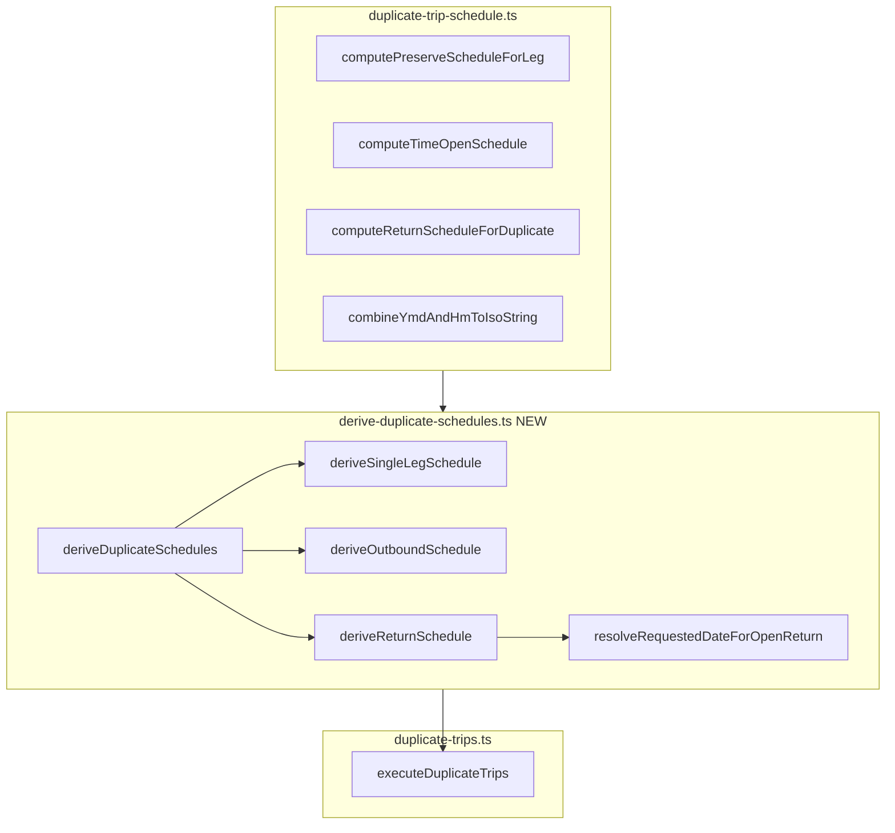

# Step 2: Introduce `derive-duplicate-schedules.ts`

## Current state (post Step 1)

[`duplicate-trips.ts`](src/features/trips/lib/duplicate-trips.ts) still owns two layers:

- **Partial extraction:** `deriveReturnScheduleForDuplicatePair` + `computeOpenReturnScheduleAlignedToOutbound` (Step 1 guard for detail per-leg open return)
- **Inline matrix:** `executeDuplicateTrips` lines ~520–541 (single) and ~572–603 (pair outbound + call to return helper)

[`duplicate-trips.test.ts`](src/features/trips/lib/__tests__/duplicate-trips.test.ts) has 5 schedule tests against `deriveReturnScheduleForDuplicatePair` and 3 price-invariant tests.

## Target architecture



**Ownership after refactor:**

| Layer | File | Owns |
|-------|------|------|
| Primitives | [`duplicate-trip-schedule.ts`](src/features/trips/lib/duplicate-trip-schedule.ts) | Wall-clock math, delta, payload parse — **unchanged** |
| Decisions | `derive-duplicate-schedules.ts` | `scheduleMode` × `DuplicateUnit` semantics |
| I/O | [`duplicate-trips.ts`](src/features/trips/lib/duplicate-trips.ts) | Expansion, partition, inserts, pricing, metrics, linking |

---

## Step 1 — Types + stub (`derive-duplicate-schedules.ts`)

Create [`src/features/trips/lib/derive-duplicate-schedules.ts`](src/features/trips/lib/derive-duplicate-schedules.ts) with exported types and a compiling stub:

```typescript
import type { DuplicateTripsPayload } from '@/features/trips/lib/duplicate-trip-schedule';
import type { DuplicateUnit } from '@/features/trips/lib/duplicate-trips';

export interface DuplicateLegSchedule {
  scheduled_at: string | null;
  requested_date: string | null;
}

export interface DuplicateSchedulesResult {
  outbound: DuplicateLegSchedule;
  return?: DuplicateLegSchedule;
}

export function deriveDuplicateSchedules(
  payload: DuplicateTripsPayload,
  unit: DuplicateUnit
): DuplicateSchedulesResult {
  throw new Error('not implemented');
}
```

**Build gate:** `bun run build` must pass.

**Circular import note (must watch):** In Step 4, [`duplicate-trips.ts`](src/features/trips/lib/duplicate-trips.ts) will import `deriveDuplicateSchedules` (runtime), while this file imports `DuplicateUnit`. Keep the `DuplicateUnit` import **type-only** (`import type`) so it erases at runtime. After Step 4’s build gate, explicitly watch for any circular-module complaints from Next/Bun; if they occur, move `DuplicateUnit` into a third file (e.g. `src/features/trips/lib/duplicate-trips.types.ts`) that both modules can import without a cycle.

---

## Step 2 — Implement decision logic (no `duplicate-trips.ts` changes yet)

Implement four **private** helpers + the exported orchestrator. Transplant logic verbatim from current `executeDuplicateTrips` and Step 1 helpers — do not rewrite semantics.

### `resolveRequestedDateForOpenReturn(outboundSchedule, targetDateYmd)`

Move body of today's `computeOpenReturnScheduleAlignedToOutbound` (lines 420–434 in `duplicate-trips.ts`):

- Outbound untimed → `{ scheduled_at: null, requested_date: targetDateYmd }`
- Outbound timed → `scheduled_at: null`, `requested_date` = `outboundSchedule.requested_date ?? instantToYmdInBusinessTz(outbound.scheduled_at)`

### `deriveSingleLegSchedule(sourceLeg, payload)`

Transplant single branch (lines 525–541):

| Mode | Behavior |
|------|----------|
| `time_open` | `computeTimeOpenSchedule(targetDateYmd)` |
| `unified_time` | ISO **required** — throw `Bitte eine Abholzeit festlegen.` if missing; else ISO + `instantToYmdInBusinessTz` |
| `preserve_original_time` | `computePreserveScheduleForLeg(sourceLeg, targetDateYmd)` |

### `deriveOutboundSchedule(origOutbound, payload)`

Transplant pair outbound branch (lines 576–597):

| Mode | Behavior |
|------|----------|
| `time_open` | `computeTimeOpenSchedule` |
| `unified_time` | ISO present → timed; **missing ISO allowed** (detail pair) → `{ scheduled_at: null, requested_date: targetDateYmd }` |
| `preserve_original_time` | `computePreserveScheduleForLeg(origOutbound, …)` |

### `deriveReturnSchedule(origOutbound, origReturn, outboundSchedule, payload)`

Transplant `deriveReturnScheduleForDuplicatePair` verbatim, including the Step 1 **why-comment** and guard:

```typescript
// WHY: In the detail-sheet unified-time pair flow (`explicitPerLegUnifiedTimes`),
// a missing return ISO means "leave this leg open". Bulk unified-time uses a
// missing return ISO to mean "compute from the Vorlage delta".
if (
  payload.scheduleMode === 'unified_time' &&
  payload.explicitPerLegUnifiedTimes === true &&
  payload.unifiedReturnScheduledAtIso === undefined
) {
  return resolveRequestedDateForOpenReturn(outboundSchedule, payload.targetDateYmd);
}
// explicit return ISO shortcut → computeReturnScheduleForDuplicate fallback
```

### `deriveDuplicateSchedules(payload, unit)`

```typescript
if (unit.kind === 'single') {
  return { outbound: deriveSingleLegSchedule(unit.trip, payload) };
}
const outbound = deriveOutboundSchedule(unit.outbound, payload);
const ret = deriveReturnSchedule(unit.outbound, unit.ret, outbound, payload);
return { outbound, return: ret };
```

**Imports in new file only from:**
- [`duplicate-trip-schedule.ts`](src/features/trips/lib/duplicate-trip-schedule.ts) — primitives + `DuplicateTripsPayload`
- [`duplicate-trips.ts`](src/features/trips/lib/duplicate-trips.ts) — `DuplicateUnit` type only
- [`trip-business-date.ts`](src/features/trips/lib/trip-business-date.ts) — `instantToYmdInBusinessTz`

**Build gate:** `bun run build` must pass. `duplicate-trips.ts` unchanged in this step.

---

## Step 3 — Test suite (`derive-duplicate-schedules.test.ts`)

Create [`src/features/trips/lib/__tests__/derive-duplicate-schedules.test.ts`](src/features/trips/lib/__tests__/derive-duplicate-schedules.test.ts) testing `deriveDuplicateSchedules` in isolation (no Supabase).

Reuse `tripStub` pattern from existing tests. All timestamps as named constants.

### Single unit (`{ kind: 'single', trip }`) — 5 cases

1. `time_open` → `scheduled_at: null`, `requested_date: TARGET_DATE_YMD`
2. `preserve_original_time`, source has `scheduled_at` → preserved wall clock on target date
3. `preserve_original_time`, source ohne `scheduled_at` → open
4. `unified_time`, ISO provided → uses ISO + business-day `requested_date`
5. `unified_time`, no ISO → **throws** `Bitte eine Abholzeit festlegen.` (confirmed: preserve current behavior)

### Pair unit — outbound (3 cases)

6. `time_open` outbound → open
7. `preserve_original_time` outbound → preserves source outbound time
8. `unified_time` + `explicitPerLegUnifiedTimes` + no outbound ISO → outbound open on `targetDateYmd`

### Pair unit — return (7 cases)

9. `time_open` → return open on `targetDateYmd`
10. `preserve_original_time`, source return ohne Zeit → return open
11. `preserve_original_time`, source return mit Zeit → preserved on target date
12. `unified_time` + `explicitPerLegUnifiedTimes` + explicit return ISO → uses ISO exactly
13. **Bug case:** `explicitPerLegUnifiedTimes` + return ISO absent + both source legs timed → `scheduled_at: null`, `requested_date` aligned to outbound business day
14. **Bulk regression:** no `explicitPerLegUnifiedTimes`, both source timed, single unified ISO → delta-computed return `scheduled_at`
15. **Day alignment:** return open, outbound timed, outbound ISO on business-day boundary → return `requested_date` matches outbound's business day (not raw `targetDateYmd` if they differ)

**Build gate:** `bun test src/features/trips/lib/__tests__/derive-duplicate-schedules.test.ts` — all passing before Step 4.

---

## Step 4 — Simplify `executeDuplicateTrips`

Update [`duplicate-trips.ts`](src/features/trips/lib/duplicate-trips.ts):

**Add import:**
```typescript
import { deriveDuplicateSchedules } from '@/features/trips/lib/derive-duplicate-schedules';
```

**Replace single branch schedule block** with:
```typescript
const { outbound: schedule } = deriveDuplicateSchedules(payload, unit);
```

**Replace pair outbound + return blocks** with:
```typescript
const { outbound: outSchedule, return: retSchedule } =
  deriveDuplicateSchedules(payload, unit);
```

**Runtime invariant (no non-null assertion):** `DuplicateSchedulesResult.return` is optional, but `unit.kind === 'pair'` requires it. Add an explicit runtime assertion right after the call:\n+\n+```typescript\n+if (!retSchedule) {\n+  throw new Error('Internal error: deriveDuplicateSchedules returned no return schedule for a pair.');\n+}\n+```\n+\n+Do **not** use `retSchedule!`.

**Remove entirely:**
- `computeOpenReturnScheduleAlignedToOutbound`
- `deriveReturnScheduleForDuplicatePair` (logic now private in new file)
- Inline `if (scheduleMode === …)` branches for schedules
- Unused imports: `computePreserveScheduleForLeg`, `computeReturnScheduleForDuplicate`, `computeTimeOpenSchedule` (keep `instantToYmdInBusinessTz` — still used by `findPartnerAmongTrips`)

**Add why-comment** at call site explaining schedule derivation was extracted so I/O layer cannot drift from dialog/docs semantics.

**Consumer check before removal (mandatory):** before deleting `computeOpenReturnScheduleAlignedToOutbound` / `deriveReturnScheduleForDuplicatePair`, search the repo for references/imports of those identifiers and confirm they are unused outside tests. If any external consumer exists, do not remove them until the consumer is migrated.

**Unchanged:** `explicitPerLegUnifiedTimes` pair-only validation, insert order `[outboundId, returnId]`, link backfill, pricing, metrics, expansion.

**Build gate:** `bun run build` must pass.

---

## Step 5 — Trim `duplicate-trips.test.ts`

In [`duplicate-trips.test.ts`](src/features/trips/lib/__tests__/duplicate-trips.test.ts):

- **Remove** entire `describe('duplicate pair return schedule derivation')` block (5 tests) — now covered by `derive-duplicate-schedules.test.ts`
- **Remove** imports: `deriveReturnScheduleForDuplicatePair`, `instantToYmdInBusinessTz`, `tripStub`
- **Keep** all 3 `duplicate trip price invariant` tests

**Build gate:** `bun test src/features/trips/lib/__tests__/duplicate-trips.test.ts src/features/trips/lib/__tests__/derive-duplicate-schedules.test.ts` — all passing.

---

## Step 6 — Docs + comments (mandatory)

Update [`docs/trips-duplicate.md`](docs/trips-duplicate.md):

1. Add **Module boundary** section documenting three-layer architecture (primitives → decisions → I/O)
2. Update **Technische Dateien** table to include `derive-duplicate-schedules.ts` with role "schedule semantics (`deriveDuplicateSchedules`)"
3. Confirm Step 1 open-return rule (`explicitPerLegUnifiedTimes` + absent return ISO) remains accurate — already documented at line 48; add pointer to `deriveReturnSchedule` owning that rule server-side

**Why-comments only (no what-comments):**
- `deriveDuplicateSchedules` — owns normative schedule contract; prevents I/O layer drift
- Each private helper — separation rationale / invariant enforced
- `executeDuplicateTrips` call site — why schedules are delegated

---

## Risk surface / invariants checklist

| Invariant | How preserved |
|-----------|---------------|
| Insert order `[outboundId, returnId]` | No change to insert/link loop |
| Step 1 open-return guard | Verbatim transplant into `deriveReturnSchedule` |
| Bulk delta return | Still via `computeReturnScheduleForDuplicate` when guard does not fire |
| Single `unified_time` ohne ISO | Still throws (not null) |
| Pair `unified_time` ohne outbound ISO | Still open (detail `explicitPerLeg`) |
| `parseDuplicateTripsPayload` | Untouched |
| Dialog / detail sheet | Untouched |

## Explicitly deferred (Step 3 separate plan)

- [`build-trip-details-patch.ts`](src/features/trips/trip-detail-sheet/lib/build-trip-details-patch.ts) — no path to clear `scheduled_at` when user empties time field
