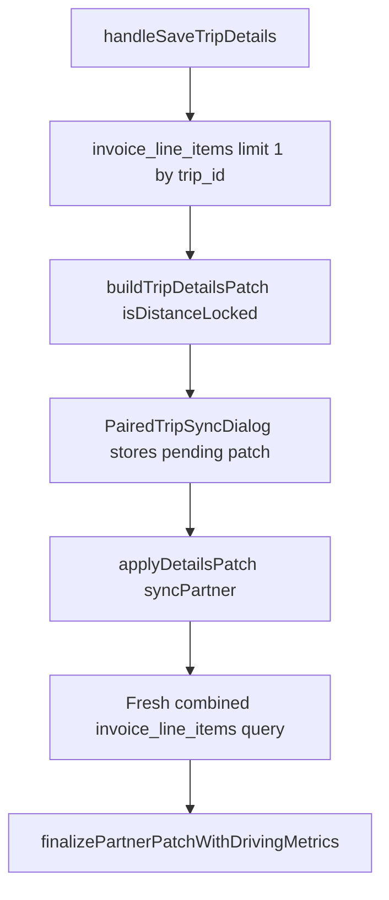

# Plan A — Distance Freeze Guard

## Step 0 — Call-site facts (replaces “comment block in implementation notes”)

- **Only consumer** of `buildTripDetailsPatch` and `finalizePartnerPatchWithDrivingMetrics` is [`src/features/trips/trip-detail-sheet/trip-detail-sheet.tsx`](src/features/trips/trip-detail-sheet/trip-detail-sheet.tsx) (client component; `createClient` from [`@/lib/supabase/client`](src/lib/supabase/client) is already imported).
- **`buildTripDetailsPatch`** is invoked in `handleSaveTripDetails` **~887–911**; the result can be **stored** in `pendingDetailsPatchRef` when the paired dialog opens (**~922**), then later applied via **`applyDetailsPatch(p, true|false)`** from [`PairedTripSyncDialog`](src/features/trips/trip-detail-sheet/dialogs/paired-trip-sync-dialog.tsx) **~1901–1921** **without rebuilding** the patch. Therefore **`isDistanceLocked` must be resolved before the first `buildTripDetailsPatch` call**, and the **same lock decision** must be available when **`applyDetailsPatch(..., true)`** runs (minutes later) — use a **ref** (e.g. `pendingDistanceLockRef`) set alongside `pendingDetailsPatchRef`, cleared when the patch is applied or the dialog closes (mirror **`pendingDetailsPatchRef` lifecycle ~691, ~1884**).
- **`finalizePartnerPatchWithDrivingMetrics`** is called inside **`applyDetailsPatch`** **~750–751** only when **`syncPartner && linkedPartner`**. It needs the lock flag there — **not** only inside `handleSaveTripDetails`.

## Implementation outline

### 1. Extend [`BuildTripDetailsPatchInput`](src/features/trips/trip-detail-sheet/lib/build-trip-details-patch.ts)

- Add optional **`isDistanceLocked?: boolean`** at the **end** of the interface (defaults to falsy when omitted — backward compatible).
- At **start** of `buildTripDetailsPatch`, destructure `isDistanceLocked` from `input`.
- When **`isDistanceLocked`** is true:
  - **Do not** enter the block that calls **`fetchDrivingMetrics`** (today **~243–259**); skip it entirely.
  - **`delete` / omit** `driving_distance_km` and `driving_duration_seconds` from `patch` if they would have been set (defensive: ensure they never appear when locked even if other code paths add them later).
- When locked and the **would-have-been** metrics path would have run (same condition as today: four numeric coords and pickup/dropoff lat in patch — **~243–248**), emit **`console.warn`** with prefix **`[distance-freeze]`** and **`trip.id`**, per prompt wording.
- Inline comment: explain **why** the Directions call is skipped (quota + discarded result), not only result stripping.

### 2. Extend [`finalizePartnerPatchWithDrivingMetrics`](src/features/trips/trip-detail-sheet/lib/paired-trip-sync.ts)

- Add optional second argument **`isDistanceLocked?: boolean`** (default false).
- When true: skip **`fetchDrivingMetrics`**, do not add distance/duration keys; **`console.warn`** with **`[distance-freeze]`**, **`linkedPartner.id`** as partner id and **`trip.id`** as primary id (pass primary id as an optional third param if needed for log body — keeps signature backward compatible for any future callers).

### 3. Wire [`trip-detail-sheet.tsx`](src/features/trips/trip-detail-sheet/trip-detail-sheet.tsx)

- Add a small helper **`checkDistanceLocked(supabase, tripId)`** or inline query using existing browser Supabase client:
  - `from('invoice_line_items').select('id').eq('trip_id', tripId).limit(1)` — **fail-open**: on error, **`console.error('[distance-freeze] Failed to check invoice linkage for trip', tripId, error)`** and return **`false`**.
- **Before** `buildTripDetailsPatch` in `handleSaveTripDetails`:
  - Compute **`isDistanceLocked`** for the **open** trip (`trip.id`) per prompt Step 4.
  - Pass **`isDistanceLocked`** into **`buildTripDetailsPatch({ ...input, isDistanceLocked })`**.
  - When storing **`pendingDetailsPatchRef.current`**, also set **`pendingDistanceLockRef.current`** to the same boolean (and clear when patch applied / dialog closes, same as pending patch).
- In **`applyDetailsPatch`** when **`syncPartner && linkedPartner`** — **partner lock decision (resolved)**:
  - The partner lock check must **ALWAYS** use a **fresh combined query** — **never** `pendingDistanceLockRef` for the partner leg.
  - Query:

    ```typescript
    from('invoice_line_items')
      .select('id')
      .in('trip_id', [trip.id, linkedPartner.id])
      .limit(1)
    ```

  - **Fail-open:** on query error, log  
    `console.error('[distance-freeze] Failed to check partner invoice linkage', { tripId: trip.id, partnerId: linkedPartner.id }, error)`  
    and proceed with **`isPartnerDistanceLocked = false`**.
  - Pass the resulting boolean into **`finalizePartnerPatchWithDrivingMetrics(partnerPatch, isPartnerDistanceLocked, trip.id, linkedPartner.id)`** (exact signature TBD in code).

  **WHY:** The paired-leg dialog can remain open for several minutes while the dispatcher reviews changes. During that window, another user could add either trip to an invoice. A ref set at dialog-open time would be **stale** and would silently miss that state change. A **fresh query at apply time** guarantees the lock decision is always current. **`pendingDistanceLockRef` remains required and unchanged** — it carries **`isDistanceLocked`** for the **primary** leg patch that was already built and **cannot be rebuilt** at apply time.

### 4. Documentation

- **[`docs/driving-metrics-api.md`](docs/driving-metrics-api.md):** new section **“Distance Freeze Guard”** — trigger (**any** `invoice_line_items` row for the trip id(s) in scope), functions involved, grep key **`[distance-freeze]`**, fail-open on query error, Plan A vs B/C note.
- **[`docs/plans/geocoding-strategy-brainstorm.md`](docs/plans/geocoding-strategy-brainstorm.md):** under **Phase Approach Review**, short bullet that **Plan A (distance freeze)** is implemented (date optional).

## Observability limitation

Both **`buildTripDetailsPatch`** and **`trip-detail-sheet.tsx`** run in the browser (`'use client'`). **`console.warn`** and **`console.error`** go to the **browser console**, not to Vercel server logs. The **`[distance-freeze]`** grep key is therefore **only visible in DevTools during a session**, not in production log tooling. This is **accepted for Plan A**. A server-side logging endpoint for freeze events is a **follow-up task**, tracked as deferred in Plan B.

## Build / test gates (per prompt)

- After Steps 2–3: **`bun run build`**.
- After Step 4: **`bun run build`** and **`bun test`** (project script targets [`src/features/invoices/lib/__tests__`](src/features/invoices/lib/__tests__) and [`src/features/trips/lib/__tests__`](src/features/trips/lib/__tests__) per [`package.json`](package.json)).

## Out of scope (unchanged)

- No schema, geocoding, `route_metrics_cache`, or create-trip/bulk/cron paths — per prompt hard rules.



## Completed — May 3, 2026. All build gates passed (bun run build exit 0, bun test 88 passed). Implementation verified.
