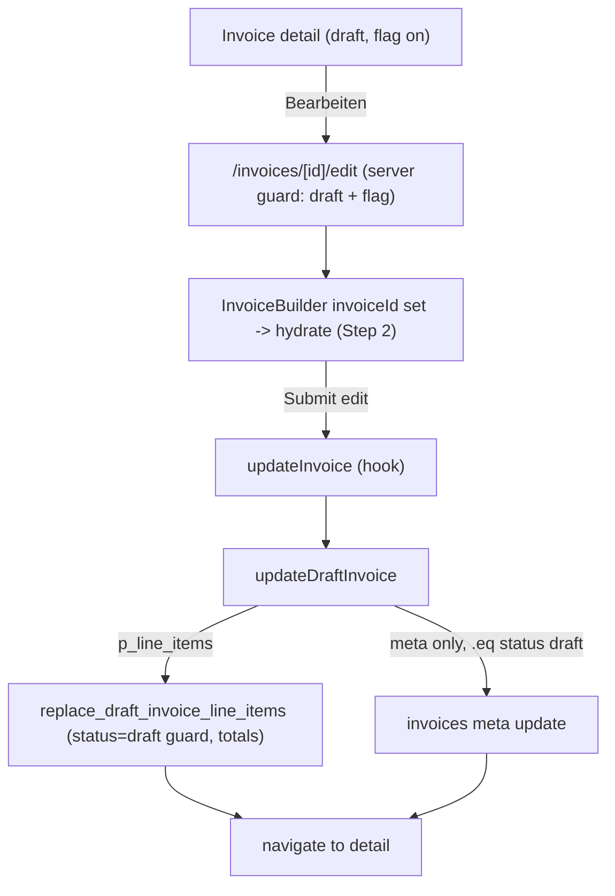

## Draft Invoice Editing - Step 3: Save Path, Edit Route, UI Entry Points

Scope is Step 3 only. No new status, no Storno changes, no inline detail-page editing. Create flow stays functionally unchanged.

### Note on current repo state
Two edits were already applied to [src/types/database.types.ts](src/types/database.types.ts) before plan mode (the D2 prerequisite): `revision_invoices_enabled` added to the `payers` Row/Insert/Update, and a `replace_draft_invoice_line_items` entry added to `Functions`. If you prefer these reverted and redone as part of execution, say so; otherwise they satisfy task item "types" below.

### 1. Generated types (D2 prerequisite) - DONE pending your approval
- `payers.revision_invoices_enabled: boolean` (Row) + optional (Insert/Update).
- `replace_draft_invoice_line_items: { Args: { p_invoice_id: string; p_line_items: Json }; Returns: undefined }`.
- why: without these, reading the flag and calling the RPC are TS errors. Surgical patch matches how the file is already hand-maintained (existing `// TODO: regenerate` markers).

### 2. Update API - [src/features/invoices/api/invoices.api.ts](src/features/invoices/api/invoices.api.ts)
Add `updateDraftInvoice(payload)`:
- Inputs: `invoiceId`, draft-safe meta (`introBlockId`, `outroBlockId`, `paymentDueDays`, `rechnungsempfaengerId`, `pdfColumnOverride`), and pre-serialized `lineItemRows: Record<string, unknown>[]`.
- Step A: `supabase.rpc('replace_draft_invoice_line_items', { p_invoice_id, p_line_items: lineItemRows })`. This enforces `status='draft'` + company ownership and recomputes `subtotal/tax_amount/total` server-side. Totals are never sent from the client (hard rule).
- Step B: re-freeze `rechnungsempfaenger_snapshot` from the recipient row (drafts aren't issued yet; reflect latest edit), then `update` ONLY meta fields with `.eq('id', invoiceId).eq('status','draft')` (defence-in-depth so a non-draft cannot be mutated via RLS).
- Never touches `invoice_number`, `payer_id`, `company_id`, `mode`, `billing_*`, `period_*`, `client_id`, `status`, or totals.
- Also: add `revision_invoices_enabled` to the `payer:payers(...)` select in `getInvoiceDetail`.

Type: add `revision_invoices_enabled?: boolean` to `InvoiceDetail['payer']` in [src/features/invoices/types/invoice.types.ts](src/features/invoices/types/invoice.types.ts).

Build gate: `bun run build`.

### 3. Builder save branch - [src/features/invoices/hooks/use-invoice-builder.ts](src/features/invoices/hooks/use-invoice-builder.ts)
- Add `updateMutation` (parallel to `createMutation`). In its `mutationFn`: resolve step-4 meta (intro/outro `'none'`->null, recipient fallback to `catalogRecipientId`, parse pdf override) exactly like create, serialize rows with the already-exported `lineItemToInsertRow` (all normal items, incl. excluded) + `cancelledTripToInsertRow` (opted-in cancelled, appended after `lineItems.length`), then call `updateDraftInvoice`. Keep the same fire-and-forget trip writeback as create (consistent behaviour).
- `onSuccess`: invalidate `invoiceKeys.all`, `invoiceKeys.full(invoiceId)`, `invoiceKeys.revenueTotal`; toast; navigate via `onCreated(invoiceId)`.
  - why (confirmed): `onCreated` is a navigation-only callback — `index.tsx` passes `(id) => router.push('/dashboard/invoices/' + id)`. The edit-success target is the same detail page, so reuse is functionally correct. NOT renamed to `onSaved` because that would change the hook signature shared with the create flow (which must stay unchanged). A `why` comment at the reuse site will document the intentional reuse.
- Expose `updateInvoice(step4Values, pdfColumnOverride)` and `isSaving`.
- Create flow (`createMutation`, `createInvoice`, `isCreating`) left functionally identical.

Build gate: `bun run build` + `bun test`.

### 4. Builder shell - [src/features/invoices/components/invoice-builder/index.tsx](src/features/invoices/components/invoice-builder/index.tsx)
- Read `updateInvoice`, `isSaving` from the hook; `const isSubmitting = isCreating || isSaving`.
- Step4Confirm `onConfirm`: branch `isEditMode ? updateInvoice(step4Values, snapshotOverride) : createInvoice(...)` (snapshotOverride build unchanged).
- Section 5 footer submit button (edit mode), `disabled={isSubmitting || !section4Unlocked}`:
  - Idle label: `Änderungen speichern` (correct umlaut). Create mode unchanged (`Rechnung erstellen`).
  - Loading label: `Speichere Änderungen…` (verb-first, mirroring the existing `Erstelle Rechnung…` pattern exactly, same `…` ellipsis char).

Build gate: `bun run build`.

### 5. Edit route - [src/app/dashboard/invoices/[id]/edit/page.tsx](src/app/dashboard/invoices/[id]/edit/page.tsx) (new)
- Server component mirroring [new/page.tsx](src/app/dashboard/invoices/new/page.tsx) (companyId, companyProfile, payers, clients).
- Guard query: fetch invoice `id, status, payer:payers(revision_invoices_enabled)`; if not found, `status !== 'draft'`, or flag not true -> `redirect('/dashboard/invoices/[id]')`. RLS already scopes to company.
- Render `<InvoiceBuilder ... invoiceId={id} />`.
- why: server-side guard so the capability is never reachable client-only; aligns with the RPC's own `status='draft'` constraint.

Build gate: `bun run build`.

### 6. Entry point - [src/features/invoices/components/invoice-detail/invoice-actions.tsx](src/features/invoices/components/invoice-detail/invoice-actions.tsx)
- In the `status === 'draft'` block only, when `invoice.payer?.revision_invoices_enabled === true`, render a `Bearbeiten` button (Pencil icon) that routes to `/dashboard/invoices/${invoice.id}/edit`.
- Never shown for sent/paid/cancelled/corrected (existing terminal-state guard already returns early for paid/cancelled/corrected; the flag+draft check covers the rest). Non-draft layouts stay identical.
- `getInvoiceDetail` change in step 2 supplies the flag to `InvoiceActions` via the existing `invoice` prop.

Build gate: `bun run build`.

### 7. Docs (mandatory) - [docs/invoices-module.md](docs/invoices-module.md) + [docs/plans/revision-invoice-audit.md](docs/plans/revision-invoice-audit.md)
- invoices-module.md: new subsection "Draft invoice re-open (Phase C): save path + edit route + entry point" (updateDraftInvoice contract, RPC-authoritative totals, payer-gated Bearbeiten, edit-route guard).
- revision-invoice-audit.md: mark Step 3 done; mark D2 resolved (types patched).
- Inline "why" comments on every new/changed path.

### Hard rules honored
No new status, no Storno changes, no inline detail editing; invoice number / payer / company / status never mutated on save; totals recomputed only by the RPC; route + API both enforce draft-only (no client-only protection); non-draft behaviour unchanged.

