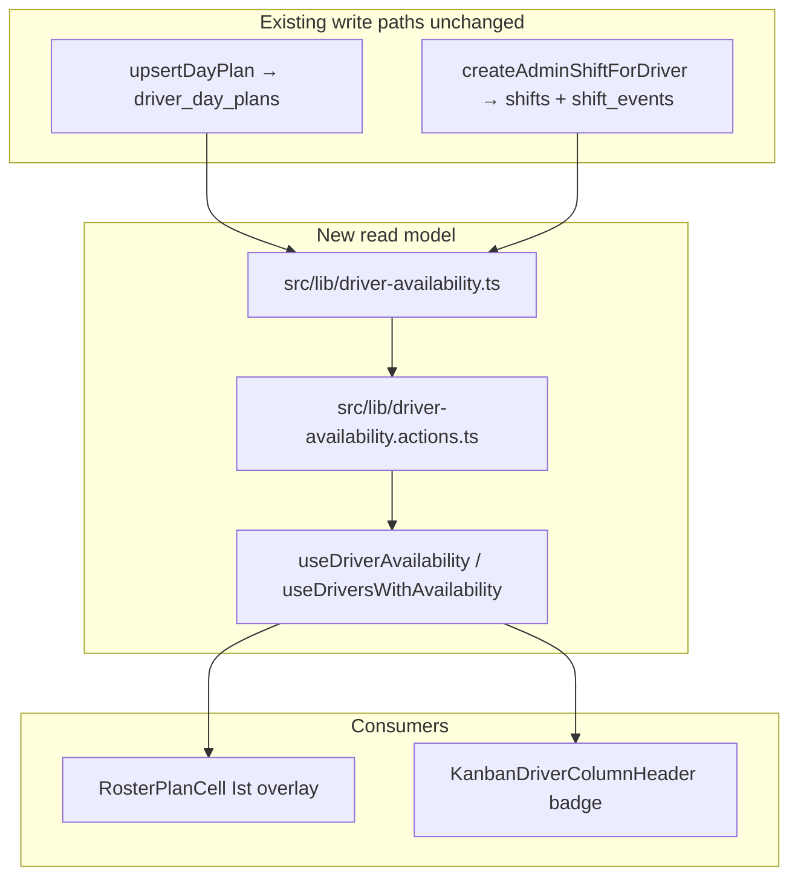

# Driver Availability Read Model

## Context and path corrections

The spec references some paths that differ from the current codebase:

| Spec path | Actual path |
| --- | --- |
| `components/roster/RosterPlanCell.tsx` | [`src/features/driver-planning/components/roster-plan-cell.tsx`](src/features/driver-planning/components/roster-plan-cell.tsx) |
| `components/roster/DriverRosterGrid.tsx` | [`src/features/driver-planning/components/driver-roster-grid.tsx`](src/features/driver-planning/components/driver-roster-grid.tsx) |
| `hooks/useCompanyWeekPlan.ts` | [`src/features/driver-planning/hooks/use-driver-week-plan.ts`](src/features/driver-planning/hooks/use-driver-week-plan.ts) (`useCompanyWeekPlan` exported here) |
| `actions/admin-shift.actions.ts` | [`src/features/driver-planning/actions.ts`](src/features/driver-planning/actions.ts) |
| `actions/saveIstZeitInlineAction.ts` | [`src/features/shift-reconciliations/actions.ts`](src/features/shift-reconciliations/actions.ts) (`saveIstZeitInlineAction`) |

Kanban lives on `/dashboard/trips?view=kanban`, not a separate route ([`docs/kanban-view.md`](docs/kanban-view.md)).

## Architecture



**Design principle:** Writes stay in existing feature services. The new module is **read-only** + derived `availability` / `isDispatchable`.

---

## Step 1 — Types and constants

**Create** [`src/lib/driver-availability.ts`](src/lib/driver-availability.ts) (types + constants only; no fetch logic yet).

- Import `PlanStatus` from [`src/features/driver-planning/types.ts`](src/features/driver-planning/types.ts) — do **not** duplicate status keys.
- Define `DriverAvailability` as spec describes, with explicit mapping:
  - `PlanStatus 'working'` → `'available'`
  - Other plan keys map 1:1 (`vacation`, `sick`, …)
  - No plan row → `'unknown'`
- Export `UNAVAILABLE_STATUSES` exactly as spec (excludes `half_day_vacation` and `overtime` — add inline comment: half-day remains dispatchable unless product changes the list).
- Export `DriverDayContext` shape as spec.
- Export helper `planStatusToAvailability(status: PlanStatus): DriverAvailability` and `deriveIsDispatchable(availability: DriverAvailability): boolean`.
- Export `ShiftSummary` type for roster overlay: `{ id, startedAt, endedAt, breakMinutes, startHm, endHm }`.

**Build gate:** `bun run build`

---

## Step 2 — Server read functions

**Extend** [`src/lib/driver-availability.ts`](src/lib/driver-availability.ts) with fetch + derive logic.

### Admin context

Reuse [`requireAdminContext()`](src/features/driver-planning/api/driver-planning.service.ts) (already provides `supabase`, `companyId`, `userId`). Public entry points:

```typescript
getDriverDayContext(driverId: string, dateYmd: string): Promise<DriverDayContext>
getDriversDayContext(driverIds: string[], dateYmd: string): Promise<DriverDayContext[]>
```

Both call internal helpers with admin context — **no raw supabase passed from callers** (simpler than spec pseudocode, same RLS boundary as other admin services).

### Queries (Berlin-safe)

1. **Plan:** `driver_day_plans` where `company_id`, `driver_id`, `plan_date = dateYmd` (DATE string — no UTC midnight).
2. **Shift:** Same pattern as [`findShiftForDriverDate`](src/features/driver-planning/api/admin-shifts.service.ts):
   - `getZonedDayBoundsIso(dateYmd)` → `startISO` / `endExclusiveISO`
   - Filter `shifts` by `driver_id`, `company_id`, `started_at` in bounds
   - Include `shift_events (event_type, timestamp)` for break pairing
   - Reuse break-pair logic from `admin-shifts.service.ts` (extract shared `parseBreakMinutesFromEvents` into `driver-availability.ts` or a tiny `src/lib/shift-event-breaks.ts` to avoid circular imports — prefer extracting to `driver-availability.ts` as private helpers first).

3. **Batch (`getDriversDayContext`):** Two queries with `.in('driver_id', driverIds)` for plans (single date) and shifts (week bounds if needed — for single date use same day bounds). Merge in memory per driverId.

### Derivation rules

- `availability`: from plan status via `planStatusToAvailability`, else `'unknown'`
- `isDispatchable`: `!UNAVAILABLE_STATUSES.includes(availability)`
- Shift block populated when row exists (include ended and active shifts for display; overlay shows times regardless of `shifts.status`)

**Create** [`src/lib/driver-availability.actions.ts`](src/lib/driver-availability.actions.ts) (`'use server'`):

- `getDriverDayContextAction(driverId, dateYmd)` → delegates to `getDriverDayContext`
- `getDriversDayContextAction(driverIds, dateYmd)` → delegates to `getDriversDayContext`
- `getActiveDriversDayContextAction(dateYmd)` → fetches active driver ids (same filter as [`fetchActiveDrivers`](src/features/trips/api/trip-reference-data.ts)) then batch context — used by Kanban hook

No business logic in actions.

**Build gate:** `bun run build`

---

## Step 3 — Query keys and TanStack hooks

**Create** [`src/query/keys/driver-availability.ts`](src/query/keys/driver-availability.ts):

```typescript
export const driverAvailabilityKeys = {
  root: ['driver-availability'] as const,
  day: (driverId: string, dateYmd: string) =>
    [...driverAvailabilityKeys.root, driverId, dateYmd] as const,
  driversDay: (dateYmd: string) =>
    ['drivers-availability', dateYmd] as const,
};
```

Export from [`src/query/keys/index.ts`](src/query/keys/index.ts). Update [`src/query/README.md`](src/query/README.md) with invalidation table row.

**Create** [`src/hooks/useDriverAvailability.ts`](src/hooks/useDriverAvailability.ts):

- `'use client'`
- `useDriverAvailability(driverId, dateYmd)` — key `driverAvailabilityKeys.day`, staleTime 2 min, enabled when both args present
- Query fn: `getDriverDayContextAction`

**Create** [`src/hooks/useDriversWithAvailability.ts`](src/hooks/useDriversWithAvailability.ts):

- `useDriversWithAvailability(dateYmd)` — key `driverAvailabilityKeys.driversDay`
- Query fn: `getActiveDriversDayContextAction`
- Returns `Map<string, DriverDayContext>` via `useMemo` on query data
- **`retry: false`** and treat errors as empty map in consumer (graceful degradation)

### Invalidation (add to existing mutation success handlers)

| Mutation site | Invalidate |
| --- | --- |
| [`useUpsertDayPlan` / `useDeleteDayPlan`](src/features/driver-planning/hooks/use-driver-week-plan.ts) | `driverAvailabilityKeys.root` + `drivers-availability` for affected date |
| [`createAdminShiftAction`](src/features/driver-planning/actions.ts) | same + `companyWeekPlanKeys` unchanged |
| [`deleteAdminShiftAction`](src/features/driver-planning/actions.ts) | same |
| [`saveIstZeitInlineAction`](src/features/shift-reconciliations/actions.ts) | same |
| [`useSaveIstZeitInline` / `useDeleteIstZeitInline`](src/features/shift-reconciliations/hooks/) | same (client-side, mirrors actions) |

Use prefix invalidation: `queryClient.invalidateQueries({ queryKey: driverAvailabilityKeys.root })` and `queryClient.invalidateQueries({ queryKey: ['drivers-availability'] })`.

**Build gate:** `bun run build`

---

## Step 4 — Bug A: Ist-Zeit overlay on planning roster

### 4a — Company week shift batch fetch

**Modify** [`src/features/driver-planning/api/driver-planning.service.ts`](src/features/driver-planning/api/driver-planning.service.ts):

Add `getCompanyWeekShifts(weekStartYmd)`:

- Uses `requireAdminContext`, `getWeekEndYmd`, `getZonedDayBoundsIso` for week bounds
- Selects `shifts` + `shift_events` for all company drivers in range (same fields as admin shift read)
- Returns `Map<string, Map<string, ShiftSummary>>` keyed by `driverId → plan_date YMD`
- Berlin date key via `instantToYmdInBusinessTz(started_at)` (matches unique index logic)
- Refactor or deprecate unused `getActualShiftDatesForWeek` — either remove or implement as thin wrapper over new batch function

Add `getCompanyWeekShiftsAction` in [`actions.ts`](src/features/driver-planning/actions.ts).

**Modify** [`use-driver-week-plan.ts`](src/features/driver-planning/hooks/use-driver-week-plan.ts):

- Add `companyWeekShiftsKeys.week(weekStartYmd)`
- Add `useCompanyWeekShifts(weekStartYmd, { initialData? })` parallel to `useCompanyWeekPlan`
- Invalidate shifts key on shift mutations (via shared invalidation helper)

**Modify** [`driver-roster-grid.tsx`](src/features/driver-planning/components/driver-roster-grid.tsx):

- Call `useCompanyWeekShifts(weekStartYmd)` alongside `useCompanyWeekPlan`
- Pass `shiftSummary={shiftsMap.get(driverId)?.get(date)}` into each cell
- No fetch in leaf components

Optional RSC prefetch in [`page.tsx`](src/app/dashboard/fahrerschichtplanung/page.tsx): prefetch shifts alongside plans for first paint (same pattern as `initialPlans`).

### 4b — RosterPlanCell overlay

**Modify** [`roster-plan-cell.tsx`](src/features/driver-planning/components/roster-plan-cell.tsx):

Add optional prop `shiftSummary?: ShiftSummary`.

Display rules (preserve existing plan badge/colors exactly):

| Plan | Shift | Display |
| --- | --- | --- |
| yes | yes | Status label + planned time + muted `Ist: HH:MM – HH:MM` |
| yes | no | unchanged (status + planned time) |
| no | yes | muted `Ist: HH:MM – HH:MM` only (no plus icon) |
| no | no | unchanged empty cell |

Format Ist line using `parseScheduledAtOrFallback` from [`trip-time.ts`](src/features/trips/lib/trip-time.ts) — same Berlin wall-clock as shift entry forms. Style: `text-muted-foreground font-mono text-[10px]`.

Keep `min-h-[3.25rem]` — allow natural height growth only when Ist line present (no reflow for cells without shift).

### 4c — Cross-invalidate from reconciliation

**Modify** [`saveIstZeitInlineAction`](src/features/shift-reconciliations/actions.ts):

After existing `revalidatePath(RECONCILIATIONS_PATH)`, add:

```typescript
revalidatePath('/dashboard/fahrerschichtplanung');
```

**Build gate:** `bun run build`

---

## Step 5 — Bug B: Kanban availability badges

### 5a — Kanban business date helper

**Add** `resolveTripsFilterDateYmd(scheduledAt: string | null | undefined): string` to [`src/lib/driver-availability.ts`](src/lib/driver-availability.ts) (or [`trip-business-date.ts`](src/features/trips/lib/trip-business-date.ts) if preferred):

Mirror [`trips-listing.tsx`](src/features/trips/components/trips-listing.tsx) single-day resolution:

- `isYmdString(raw)` → use as-is
- Numeric timestamp → `instantToYmdInBusinessTz`
- Range `from,to` → use **start** YMD (document limitation for multi-day filters)
- Empty → `todayYmdInBusinessTz()`

### 5b — Extend kanban column types and builder

**Modify** [`kanban-types.ts`](src/features/trips/lib/kanban-types.ts):

```typescript
export type KanbanColumn = {
  id: string;
  title: string;
  subtitle?: string;
  dayContext?: DriverDayContext; // optional — Kanban driver columns only
};
```

**Modify** [`kanban-columns.ts`](src/features/trips/lib/kanban-columns.ts):

```typescript
buildColumns(trips, groupBy, drivers, availabilityMap?: Map<string, DriverDayContext>)
```

- When `groupBy === 'driver'` and `availabilityMap` has entry: attach `dayContext` to column
- **Do not remove columns** when `isDispatchable === false` (trips may already be assigned)
- All other groupBy modes unchanged
- Existing callers without 4th arg remain valid

### 5c — KanbanDriverColumnHeader

**Create** [`src/features/trips/components/kanban/kanban-driver-column-header.tsx`](src/features/trips/components/kanban/kanban-driver-column-header.tsx):

Props: `title`, `subtitle?`, `tripCount`, `dayContext?: DriverDayContext`, drag handle props (listeners/attributes), `isColumnDropTarget`.

- Default: same layout as current header in [`kanban-column.tsx`](src/features/trips/components/kanban/kanban-column.tsx) (grip, title, count badge)
- When `dayContext && !dayContext.isDispatchable`:
  - Header background tint via existing tokens (`bg-destructive/5` for sick, `bg-amber-500/10` for vacation/day_off/special_leave/training — map using `PLAN_STATUSES` labels from [`plan-status-badge.tsx`](src/features/driver-planning/components/plan-status-badge.tsx) / `STATUS_VARIANT` patterns)
  - shadcn `Badge` with German label from `PLAN_STATUSES[plan.status]` when plan exists, else fallback from `availability`
- **No badge** when dispatchable (including `half_day_vacation`, `overtime`, `available`, `unknown`)

### 5d — Wire kanban-board

**Modify** [`kanban-board.tsx`](src/features/trips/components/kanban/kanban-board.tsx):

- Read `scheduled_at` from URL via `useSearchParams()` (same param as filters bar)
- `const dateYmd = resolveTripsFilterDateYmd(searchParams.get('scheduled_at'))`
- `const { data: availabilityMap, isLoading, isError } = useDriversWithAvailability(dateYmd)`
- Pass `availabilityMap` to `buildColumns` **only when** `groupBy === 'driver'` and data loaded without error; otherwise `undefined` (graceful degradation — board renders normally)
- DnD: **no changes** to `handleDragEnd`, column ids, or pending store

**Modify** [`kanban-column.tsx`](src/features/trips/components/kanban/kanban-column.tsx):

- When `groupBy === 'driver'` and column has context, render `KanbanDriverColumnHeader`; else keep inline header (status/payer columns unchanged)

**Modify** [`trip-reference-data.ts`](src/features/trips/api/trip-reference-data.ts):

- Add thin export `fetchDriversWithDayAvailability(dateYmd)` only if needed for non-hook server paths; prefer server action as primary path per spec. If added, it must call server action or shared lib — **not** duplicate query logic in browser client.

**Build gate:** `bun run build`

---

## Step 6 — Documentation and comments (mandatory)

**Create** [`docs/driver-availability.md`](docs/driver-availability.md):

- Purpose, scope, deferred items (drag block, Zod, DB types regen, trip form guard)
- `DriverDayContext` field reference
- `UNAVAILABLE_STATUSES` with reasoning per value
- How to add a new consumer (3-step guide)
- Berlin date invariant (shifts index is Berlin-date-keyed)
- Query keys and invalidation triggers

**Update** [`docs/driver-planning.md`](docs/driver-planning.md):

- Mark Phase 4B Ist overlay as **shipped**
- Note cross-invalidation from reconciliation save

**Update** [`docs/kanban-view.md`](docs/kanban-view.md):

- Availability badge behavior, date scoping via `scheduled_at`, graceful degradation on fetch failure
- Explicit note: columns are **not hidden** for unavailable drivers

**Inline comments** at:

- `UNAVAILABLE_STATUSES` (half_day_vacation exclusion)
- Shift date bounds query (Berlin vs UTC)
- `buildColumns` optional 4th param (backwards compatibility)
- Kanban graceful degradation branch

**Build gate:** `bun run build` (final)

---

## Files changed (summary)

| File | Action |
| --- | --- |
| `src/lib/driver-availability.ts` | Create — types, derivation, server reads, date helper |
| `src/lib/driver-availability.actions.ts` | Create — thin server actions |
| `src/query/keys/driver-availability.ts` | Create |
| `src/query/keys/index.ts` | Modify — export |
| `src/query/README.md` | Modify — document keys |
| `src/hooks/useDriverAvailability.ts` | Create |
| `src/hooks/useDriversWithAvailability.ts` | Create |
| `src/features/driver-planning/api/driver-planning.service.ts` | Modify — `getCompanyWeekShifts` |
| `src/features/driver-planning/actions.ts` | Modify — shift week action + invalidation hooks |
| `src/features/driver-planning/hooks/use-driver-week-plan.ts` | Modify — shifts query + invalidation |
| `src/features/driver-planning/components/roster-plan-cell.tsx` | Modify — Ist overlay |
| `src/features/driver-planning/components/driver-roster-grid.tsx` | Modify — pass shift data |
| `src/app/dashboard/fahrerschichtplanung/page.tsx` | Modify (optional) — RSC prefetch shifts |
| `src/features/shift-reconciliations/actions.ts` | Modify — revalidate planning path |
| `src/features/shift-reconciliations/hooks/use-save-ist-zeit-inline.ts` | Modify — invalidate availability keys |
| `src/features/shift-reconciliations/hooks/use-delete-ist-zeit-inline.ts` | Modify — invalidate availability keys |
| `src/features/trips/lib/kanban-types.ts` | Modify — optional `dayContext` |
| `src/features/trips/lib/kanban-columns.ts` | Modify — optional availability map |
| `src/features/trips/components/kanban/kanban-driver-column-header.tsx` | Create |
| `src/features/trips/components/kanban/kanban-column.tsx` | Modify — use header component |
| `src/features/trips/components/kanban/kanban-board.tsx` | Modify — fetch + pass availability |
| `docs/driver-availability.md` | Create |
| `docs/driver-planning.md` | Modify |
| `docs/kanban-view.md` | Modify |

---

## Hard rules checklist

- All status strings from `PLAN_STATUSES`, `UNAVAILABLE_STATUSES`, or typed consts
- Leaf components receive props only — no fetching in `RosterPlanCell` or `KanbanDriverColumnHeader`
- `buildColumns` 4th param optional — backwards compatible
- Shift date queries use `getZonedDayBoundsIso` — never UTC midnight ranges
- Kanban never blocks on availability loading/error
- `bun run build` after each step

## Out of scope (explicit)

- Drag-assign blocking on unavailable drivers
- Zod schemas for plan status
- `supabase gen types` regeneration
- Trip assignment form availability guard
