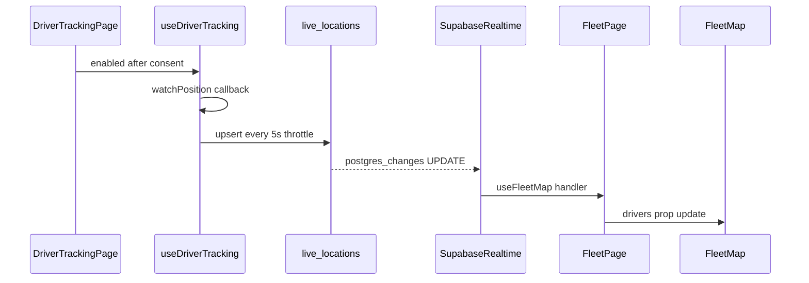

# Driver Location Tracking — Phase 1 Implementation Plan

## Context from codebase (read files)

| Area | Finding |
| --- | --- |
| Auth / role | `accounts.role` (`admin` \| `driver`); client uses [`src/lib/supabase/client.ts`](src/lib/supabase/client.ts) singleton + `getUser()` then `accounts` query (see [`shift-status-card.tsx`](src/features/driver-portal/components/startseite/shift-status-card.tsx)) |
| Route guards | [`src/proxy.ts`](src/proxy.ts) (not `middleware.ts`) + [`src/app/dashboard/layout.tsx`](src/app/dashboard/layout.tsx) + [`src/app/driver/layout.tsx`](src/app/driver/layout.tsx) |
| Realtime pattern | [`trips-realtime-sync.tsx`](src/features/trips/components/trips-realtime-sync.tsx): `channel().on('postgres_changes', …).subscribe()` + cleanup `removeChannel`; optional debounce via [`realtime-bridge.ts`](src/query/realtime-bridge.ts) |
| `live_locations` today | Present in [`database.types.ts`](src/types/database.types.ts) (`status`, `vehicle_id`, nullable `lat`/`lng`) but **no migration in repo** and **no app reads/writes** — Phase 1 migration must be idempotent (create or alter) |
| FK convention | Other driver FKs use `public.accounts(id)` (e.g. `shift_reconciliations`) — prefer that over `auth.users` (same UUID) |
| Dependencies | `leaflet`, `@types/leaflet`, `nosleep.js` already in [`package.json`](package.json); unused in `src/` today |
| Admin page pattern | Thin RSC + `assertAdminOrRedirect()` + `PageContainer` + client child ([`users/page.tsx`](src/app/dashboard/users/page.tsx)) |



---

## Pre-execution verifications (before Step 4)

### 1. FK join alias for `accounts` embed

Step 4 uses an explicit constraint hint:

```typescript
accounts!live_locations_driver_id_fkey ( first_name, last_name )
```

Postgres auto-names FKs as `{table}_{column}_fkey` when `driver_id` references `accounts(id)`, so **`live_locations_driver_id_fkey` is the expected name** for a fresh create — but do **not** assume it until Step 1 has run.

**Gate between Step 1 and Step 4:**

1. After migration + `bun run db:types`, open [`src/types/database.types.ts`](src/types/database.types.ts) → `live_locations` → `Relationships`.
2. Copy the exact `foreignKeyName` for the `accounts` relation (e.g. `live_locations_driver_id_fkey`).
3. Use that string in the `.select()` embed in `use-fleet-map.ts`. If the name differs (legacy DB, manual rename), update the hint or omit the hint and use the inferred embed: `accounts ( first_name, last_name )` only if PostgREST resolves it unambiguously.
4. **Smoke-test the initial fetch** in dev: if the join fails, Supabase often still returns rows but `accounts` is `null` → every driver shows as **"Unbekannt"** with no thrown error. Log or assert `accounts` presence during development.

Optional hardening in Step 4: if embed is null, run a one-time `accounts` lookup by `driver_id` for missing names (fallback only; prefer correct FK hint).

### 2. `sessionStorage` consent on iOS Safari (Phase 1 expectation)

Consent uses `TRACKING_CONSENT_STORAGE_KEY` in `sessionStorage` (not `localStorage`). **Known limitation:** iOS Safari may clear `sessionStorage` when the tab is backgrounded for extended periods (app switch, phone call, etc.). The driver may return to the **consent screen** and must tap **"Tracking starten"** again — tracking does not resume automatically.

- **Not a Phase 1 blocker** — acceptable for dispatch MVP.
- **Driver comms:** set expectation that brief app switches may require re-tapping start (GPS permission usually persists; only consent flag is lost).
- **Module doc (Step 8):** document under "Known Phase 1 limitations" alongside foreground-only tracking and 5s upsert latency.
- **Phase 2 fix:** persistent `tracking_consented` on `accounts` (or `localStorage` + DB sync).

---

## Step 1 — Migration: `live_locations`

**File:** `supabase/migrations/20260520120000_live_locations.sql` (timestamp after latest [`20260519103000_angebot_default_tax_rate.sql`](supabase/migrations/20260519103000_angebot_default_tax_rate.sql))

**Format:** Match recent migrations — leading `-- WHY:` comment, `public.` schema, idempotent DDL.

**Schema (Phase 1 target):**

```sql
-- live_locations: one row per driver, upserted during active tracking (~5s)
-- WHY: history via updated_at; snapshots / Broadcast deferred to Phase 2
```

**Idempotent strategy (critical — table may already exist in remote DB per generated types):**

1. `CREATE TABLE IF NOT EXISTS public.live_locations (...)` with columns from spec: `driver_id`, `company_id`, `lat`, `lng`, `speed_kmh`, `accuracy_m`, `updated_at`.
2. If table pre-exists with legacy columns (`status`, `vehicle_id`):
   - `ALTER TABLE … ADD COLUMN IF NOT EXISTS speed_kmh`, `accuracy_m`
   - Do **not** drop legacy columns in Phase 1 (avoid breaking remote data); app ignores `status`/`vehicle_id`
3. **FK adjustments:**
   - `driver_id uuid PRIMARY KEY REFERENCES public.accounts(id) ON DELETE CASCADE` (aligns with [`database.types.ts`](src/types/database.types.ts) FK to `accounts`, not raw `auth.users`)
   - `company_id uuid NOT NULL REFERENCES public.companies(id) ON DELETE CASCADE` — **`companies` name verified** in multiple migrations (e.g. [`20260409150000_create_angebote.sql`](supabase/migrations/20260409150000_create_angebote.sql))
4. `updated_at timestamptz NOT NULL DEFAULT now()` + optional trigger `SET updated_at = now()` on UPDATE (or rely on upsert payload setting it client-side)
5. **RLS** (enable + drop/recreate policies if re-running):
   - Driver: `FOR ALL` / separate INSERT+UPDATE using `auth.uid() = driver_id` + `WITH CHECK` including `company_id` matches driver's `accounts.company_id` (defense in depth)
   - Admin SELECT: use helpers from [`20260409180000_fix_rls_helper_recursion.sql`](supabase/migrations/20260409180000_fix_rls_helper_recursion.sql):

```sql
USING (
  public.current_user_is_admin()
  AND company_id = public.current_user_company_id()
)
```

   Avoid raw `EXISTS (SELECT 1 FROM accounts …)` in policies per [`access-control.md`](docs/access-control.md) RLS lessons.

6. **Realtime publication** (required for `postgres_changes`):

```sql
ALTER PUBLICATION supabase_realtime ADD TABLE public.live_locations;
```

   (Wrap in `DO $$ … EXCEPTION WHEN duplicate_object` if publication already includes table.)

7. `GRANT SELECT, INSERT, UPDATE, DELETE ON public.live_locations TO authenticated;`

**Post-migration:**

1. Run `bun run db:types` to refresh [`src/types/database.types.ts`](src/types/database.types.ts) (`speed_kmh`, `accuracy_m`; legacy columns may remain until Phase 2 cleanup).
2. **Verify FK name** in `live_locations.Relationships[].foreignKeyName` for the `accounts` link — required input for Step 4 embed (see [Pre-execution verifications](#pre-execution-verifications-before-step-4)).

**Build gate:** `bun run build` — do **not** start Step 4 until FK name is confirmed.

---

## Step 2 — Constants

**File:** [`src/lib/tracking/constants.ts`](src/lib/tracking/constants.ts)

Implement exactly as specified (all tunables in one file). Add one extra constant if needed for consent storage key (e.g. `TRACKING_CONSENT_STORAGE_KEY`) — still in constants file, not inline in components.

**Build gate:** `bun run build`

---

## Step 3 — Driver hook: `use-driver-tracking.ts`

**File:** [`src/lib/tracking/use-driver-tracking.ts`](src/lib/tracking/use-driver-tracking.ts)

**API:** `useDriverTracking({ driverId, companyId, enabled })`

**Implementation notes:**

- `'use client'` at top
- `watchPosition` with options from constants: `enableHighAccuracy: TRACKING_HIGH_ACCURACY`, `maximumAge: TRACKING_MAX_AGE_MS`, `timeout: TRACKING_TIMEOUT_MS`
- **Upsert cadence:** No `setInterval`. In each position callback, upsert only when `Date.now() - lastUpsertAt >= TRACKING_UPDATE_INTERVAL_MS` (first fix always upserts)
- Payload: `{ driver_id, company_id, lat, lng, speed_kmh, accuracy_m, updated_at: new Date().toISOString() }`
- Speed: `coords.speed != null ? +(coords.speed * TRACKING_SPEED_MS_TO_KMH).toFixed(1) : null`
- `supabase.from(TRACKING_TABLE).upsert(row, { onConflict: 'driver_id' })` — surface errors → `status: 'error'`, `error` message
- Cleanup: `navigator.geolocation.clearWatch(watchId)` when `enabled` false or unmount
- **NoSleep:** dynamic `import('nosleep.js')` inside `useEffect` when `enabled`; guard `typeof window !== 'undefined'`; `enable()` only when `enabled` true; `disable()` on cleanup
- German `GeolocationPositionError` messages per spec (codes 1/2/3)
- Return type includes `lastPosition` for UI (lat, lng, speed_kmh, accuracy_m)

**Build gate:** `bun run build`

---

## Step 4 — Admin hook: `use-fleet-map.ts`

**File:** [`src/lib/tracking/use-fleet-map.ts`](src/lib/tracking/use-fleet-map.ts)

**Type:** Export `DriverPosition` as specified.

**Initial load:**

```typescript
.from(TRACKING_TABLE)
.select(`
  driver_id, company_id, lat, lng, speed_kmh, accuracy_m, updated_at,
  accounts!<FK_NAME_FROM_db_types> ( first_name, last_name )
`)
```

Replace `<FK_NAME_FROM_db_types>` with the verified `foreignKeyName` from Step 1 (expected: `live_locations_driver_id_fkey`). Do not copy the placeholder literally.

Map rows → `DriverPosition` with `name` from `first_name`/`last_name` (fallback `accounts.name` or `'Unbekannt'` if embed is null — treat all-`Unbekannt` as a join misconfiguration signal).

**Realtime** (mirror [`trips-realtime-sync.tsx`](src/features/trips/components/trips-realtime-sync.tsx)):

- Channel: `TRACKING_REALTIME_CHANNEL`
- Events: `INSERT` + `UPDATE` on `schema: 'public'`, `table: TRACKING_TABLE`
- Handler: merge `payload.new` into `Map<driver_id, DriverPosition>`; preserve `name` from existing entry when join not in payload
- Optional: light debounce (~300–450 ms) via `createDebouncedCallback` if burst updates cause jank (not required by spec; document if added)
- Cleanup: `cancel()` + `void supabase.removeChannel(channel)`

**Online derivation:** `is_online = Date.now() - new Date(updated_at).getTime() <= TRACKING_OFFLINE_AFTER_MS`

- Recompute `is_online` on a **single** `setInterval` every 10–15 s in this hook only for UI staleness (not for upsert cadence) — OR recompute on each render from `updated_at` (no interval). Prefer **derive on read** in `useMemo` when building `drivers` array to honor “no setInterval” spirit for cadence; optional 15 s tick only for offline transition is acceptable if documented in module doc.

**Return:** `{ drivers: DriverPosition[]; isLoading; error }`

**Build gate:** `bun run build`

---

## Step 5 — Driver page: `/driver/tracking`

**File:** [`src/app/driver/tracking/page.tsx`](src/app/driver/tracking/page.tsx)

**Structure:** `'use client'` page component (or thin page + `DriverTrackingContent` in same file) — no new layout; inherits [`driver/layout.tsx`](src/app/driver/layout.tsx).

**Init flow** (match [`shift-status-card.tsx`](src/features/driver-portal/components/startseite/shift-status-card.tsx)):

1. `getUser()` → `accounts.select('id, company_id')` — require `company_id`
2. Consent: no `tracking_consented` on `accounts` — use `sessionStorage` key from constants (`TRACKING_CONSENT_STORAGE_KEY = 'taxigo_tracking_consent_v1'`). See [iOS Safari sessionStorage note](#2-sessionstorage-consent-on-ios-safari-phase-1-expectation): backgrounding may clear consent; driver re-taps **"Tracking starten"** (not a blocker).
3. Until consent: full-screen German dialog (title/body/buttons per spec); body may briefly note that switching apps can require tapping start again (optional one-line UX hint).
4. On **"Tracking starten"**: set sessionStorage consent → `setTrackingEnabled(true)` → hook `enabled` true → NoSleep via hook

**Tracking UI:**

- Pulsing dot (green/grey), large speed (`—` if null), accuracy in metres, status label, **"Tracking beenden"** → `enabled false`, clear session optional (keep consent for session reload or clear — document: consent persists for browser session only)
- Wire `useDriverTracking({ driverId, companyId, enabled: trackingEnabled })`
- Show hook `error` in UI

**Additive driver nav (recommended — not in file table but required for discoverability):**

- Update [`driver-header.tsx`](src/features/driver-portal/components/driver-header.tsx): add nav item **"Standort"** → `/driver/tracking`, extend `getPageTitle()` — **does not change existing pages**, only header menu

**Build gate:** `bun run build`

---

## Step 6 — Leaflet map component

**File:** [`src/components/fleet/fleet-map.tsx`](src/components/fleet/fleet-map.tsx)

- `'use client'`
- Import `leaflet/dist/leaflet.css`
- Icon URL fix (unpkg URLs per spec)
- `useEffect` + `useRef`: create map once; maintain `Map<driver_id, L.Marker>` — update `setLatLng` on prop change (no full map teardown)
- Tiles: OSM URL + attribution
- Bounds: `fitBounds` for online drivers; fallback center `[51.1657, 10.4515]`, zoom 6
- Popups: name, speed (`XX km/h` or `—`), last seen (`updated_at` formatted de-DE)
- Green vs grey marker (online vs offline) — use `DivIcon` or colored default markers

**Build gate:** `bun run build`

---

## Step 7 — Admin fleet page: `/dashboard/fleet`

**Files:**

- [`src/app/dashboard/fleet/page.tsx`](src/app/dashboard/fleet/page.tsx) — RSC
- [`src/features/fleet/components/fleet-page-content.tsx`](src/features/fleet/components/fleet-page-content.tsx) (recommended client boundary; keeps page thin like users pattern)

**Server page:**

- `export const metadata` — title **Flottenübersicht**
- `await assertAdminOrRedirect()` from [`require-admin.ts`](src/lib/api/require-admin.ts) (defense in depth beyond layout)
- `PageContainer` with `pageTitle`, badge area for online count

**Client content:**

```typescript
const FleetMap = dynamic(() => import('@/components/fleet/fleet-map'), { ssr: false });
```

- `useFleetMap()` → pass `drivers` to `FleetMap`
- Skeleton while `isLoading` or map loading
- Badge: `` `${onlineCount} Fahrer online` ``

**Additive admin nav (recommended):**

- [`nav-config.ts`](src/config/nav-config.ts): under **Account** group, add **Flottenübersicht** → `/dashboard/fleet` (icon e.g. `map` or reuse `dashboard`) — purely additive link

**Build gate:** `bun run build`

---

## Step 8 — Documentation and doc updates (mandatory)

| File | Action |
| --- | --- |
| `docs/modules/driver-tracking.md` | **Create** — purpose, Phase 1/2 roadmap, data flow diagram, schema/RLS, upsert strategy, limitations: 5s latency, foreground-only, **sessionStorage consent cleared on iOS Safari after long background** (driver must tap "Tracking starten" again), Phase 2 upgrade path (Broadcast, PWA, `tracking_consented` column) |
| [`docs/driver-portal.md`](docs/driver-portal.md) | Add `/driver/tracking` to route map + header nav table |
| [`docs/driver-system.md`](docs/driver-system.md) | Mark `live_locations` as **implemented** (watchPosition upsert + admin fleet map); remove “suggestion” wording for item 5 |
| [`docs/access-control.md`](docs/access-control.md) | Add `live_locations` to RLS summary table |
| [`docs/accounts-table.md`](docs/accounts-table.md) | Optional: note Phase 2 `tracking_consented` |

**Per-file “why” comments** in all new source files as specified in user brief.

**Final gate:** `bun run build` + manual smoke checklist:

- Driver: consent → tracking → row in DB → stop → offline after 60s
- Admin: map shows marker; move driver → marker updates within ~5–10s (postgres_changes)
- Driver cannot open `/dashboard/fleet`; admin cannot open `/driver/tracking` (proxy redirects)

---

## Schema / spec deviations (documented decisions)

| User spec | Plan decision | Reason |
| --- | --- | --- |
| `REFERENCES auth.users(id)` | `REFERENCES public.accounts(id)` | Matches generated FKs and [`shift_reconciliations`](supabase/migrations/20260428120000_shift_reconciliations.sql) |
| `CREATE TABLE` only | `CREATE IF NOT EXISTS` + `ALTER ADD COLUMN` | Table may already exist remotely with legacy columns |
| Admin RLS `EXISTS (accounts…)` | `current_user_is_admin()` + `current_user_company_id()` | Avoid RLS recursion per project rules |
| No nav file in table | Additive entries in `nav-config` + `driver-header` | Otherwise pages are unreachable except by URL |
| Dashboard layout “unchanged” | No edits to [`dashboard/layout.tsx`](src/app/dashboard/layout.tsx) | Fleet page uses existing shell only |

---

## Hard rules checklist

1. Constants only in [`constants.ts`](src/lib/tracking/constants.ts)
2. Leaflet via `dynamic(..., { ssr: false })`
3. Tracking only after consent tap → `enabled: true`
4. NoSleep client-only
5. Realtime structure matches `trips-realtime-sync.tsx`
6. `accounts` not `profiles`
7. No `middleware.ts`
8. Upsert `onConflict: 'driver_id'`
9. No changes to existing driver/dashboard **page** components (only additive routes + optional nav links)
10. `bun run build` after each step

---

## Phase 2 (explicitly out of scope)

Broadcast channels, PWA manifest/service worker, `tracking_consented` DB column, route replay UI, geofencing, push notifications, background tracking.
