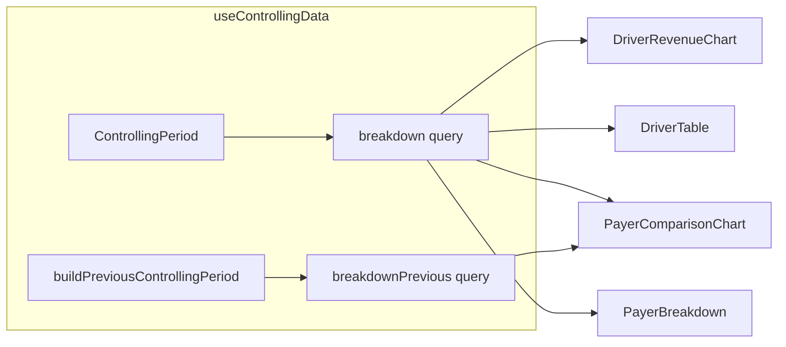

# Driver & Payer Controlling Charts

## Context

The [driver-payer-charts-audit](docs/plans/driver-payer-charts-audit.md) confirmed:
- `buildPreviousControllingPeriod` already exists in [`controlling-utils.ts`](src/features/controlling/lib/controlling-utils.ts)
- `operationalPrevious` is the template for `breakdownPrevious` (same RPC, shifted period, excluded from global `isLoading`)
- Breakdown rows are **driver × payer × billing** slices — client-side roll-up is required
- `ControllingDriverSummary` is **already exported** from [`controlling.types.ts`](src/features/controlling/types/controlling.types.ts) (lines 87–96) — no type move needed for drivers



---

## Step 1 — Query key

**File:** [`src/query/keys/controlling.ts`](src/query/keys/controlling.ts)

Add after `breakdown`:

```ts
breakdownPrevious: (period: ControllingPeriod) =>
  [
    'controlling',
    'breakdown-previous',
    period.dateFrom,
    period.dateTo
  ] as const,
```

Mirror [`operationalPrevious`](src/query/keys/controlling.ts) — key uses **selected** period bounds, not shifted dates.

**Build gate:** `bun run build`

---

## Step 2 — Hook query

**File:** [`src/features/controlling/hooks/use-controlling-data.ts`](src/features/controlling/hooks/use-controlling-data.ts)

- Reuse existing `previousPeriod` (line 25) — do not call `buildPreviousControllingPeriod` again
- Add `breakdownPrevious` query calling `fetchControllingBreakdown(previousPeriod)` with `controllingKeys.breakdownPrevious(period)` and `CONTROLLING_STALE_TIME_MS`
- Return `breakdownPrevious` from hook
- **Do not** add to `isLoading` / `isError` aggregates (same as `operationalPrevious`)
- Add why-comment: prior-period breakdown is section-scoped; global page skeleton should not wait on it

**Build gate:** `bun run build`

---

## Step 3 — Shared aggregations

**File:** [`src/features/controlling/lib/controlling-utils.ts`](src/features/controlling/lib/controlling-utils.ts)

### `aggregateDrivers`
- Copy **exact** logic from [`DriverTable.tsx`](src/features/controlling/components/DriverTable.tsx) lines 41–68 (`Map`, `__unassigned__` key, first-row `active_days`)
- Export as `(rows: ControllingBreakdownRow[]) => ControllingDriverSummary[]`
- Why-comment: `active_days` is driver-level (repeated per slice) — must not be summed

### `aggregatePayers` + type
- Add `ControllingPayerSummary` to [`controlling.types.ts`](src/features/controlling/types/controlling.types.ts) (alongside `ControllingDriverSummary`):

```ts
export interface ControllingPayerSummary {
  payer_id: string;
  payer_name: string;
  revenue_net: number;
  revenue_gross: number;
  trip_count: number;
  total_km: number;
}
```

- Implement flat roll-up in utils: group by `payer_id` (null → `'__unknown__'`, name `'Unbekannt'`), sum metrics, sort desc by `revenue_net`
- Why-comment: flat list for charts only — not a tree like `buildPayerTree`

**File:** [`src/features/controlling/components/DriverTable.tsx`](src/features/controlling/components/DriverTable.tsx)
- Remove local `aggregateDrivers`
- Import from `../lib/controlling-utils`
- No other behaviour changes

**Build gate:** `bun run build`

---

## Step 4 — `DriverRevenueChart`

**New file:** [`src/features/controlling/components/DriverRevenueChart.tsx`](src/features/controlling/components/DriverRevenueChart.tsx)

| Concern | Implementation |
|---|---|
| Props | `{ breakdown: UseQueryResult<ControllingBreakdownRow[]> }` |
| Data | `aggregateDrivers` → sort ascending by `revenue_net` → `{ name, revenue }` |
| Chart | `ChartContainer` + `BarChart layout="vertical"` (first horizontal-bar chart in codebase) |
| Axes | `XAxis type="number"` + `formatEuro` ticks, `tabular-nums`; `YAxis type="category" dataKey="name" width={140}` |
| Bar | `dataKey="revenue"`, `fill="var(--color-revenue)"`, `radius={[0,4,4,0]}` |
| Tooltip | `ChartTooltip` + `ChartTooltipContent` with euro formatter |
| Height | `style={{ height: Math.max(200, chartData.length * 44) }}` on `ChartContainer` |
| Config | `{ revenue: { label: 'Netto-Umsatz', color: 'var(--chart-1)' } }` |
| States | Skeleton `h-[220px]` while loading; empty text if no data |
| Comment | Why ascending sort: Recharts vertical layout renders categories bottom-to-top |

Reference patterns: [`RevenueTimeSeries.tsx`](src/features/controlling/components/RevenueTimeSeries.tsx), [`bar-graph.tsx`](src/features/overview/components/bar-graph.tsx) — **ChartContainer only**, no `ResponsiveContainer`.

**Build gate:** `bun run build`

---

## Step 5 — `PayerComparisonChart`

**New file:** [`src/features/controlling/components/PayerComparisonChart.tsx`](src/features/controlling/components/PayerComparisonChart.tsx)

| Concern | Implementation |
|---|---|
| Props | `breakdown` + `breakdownPrevious` |
| Data | `aggregatePayers` for current; `previousMap` keyed by `payer_id` from previous aggregate |
| Chart | Standard vertical `BarChart` (default layout) |
| Bars | `current` (`var(--chart-1)`) + `previous` (`var(--chart-2)`) |
| Axes | `XAxis dataKey="name"`; `YAxis` with `formatEuro` + `tabular-nums` |
| Tooltip | Default `ChartTooltipContent` (shows both series) |
| Legend | Inline div legend (same approach as [`bar-graph.tsx`](src/features/overview/components/bar-graph.tsx) lines 184–197) — avoids ChartLegend payload wiring for grouped bars |
| Height | Fixed `280px` on `ChartContainer` |
| Loading | Skeleton while **either** query loading |
| Comment | Why `payer_id` key: names can change; id is stable |

**Build gate:** `bun run build`

---

## Step 6 — Page wiring

**File:** [`src/app/dashboard/controlling/page.tsx`](src/app/dashboard/controlling/page.tsx)

1. Destructure `breakdownPrevious` from `useControllingData`
2. Insert above existing sections:

```tsx
<DriverRevenueChart breakdown={breakdown} />
<DriverTable breakdown={breakdown} />

<PayerComparisonChart breakdown={breakdown} breakdownPrevious={breakdownPrevious} />
<PayerBreakdown breakdown={breakdown} />
```

3. All other component props unchanged

**Build gate:** `bun run build`

---

## Step 7 — Documentation

**File:** [`docs/plans/driver-payer-charts-audit.md`](docs/plans/driver-payer-charts-audit.md)

Append **Implementation Status: complete** section listing all changed files and confirming deferred scope (scatter, driver previous-period, chart→table linking).

---

## Out of scope (hard rules)

- No RPC/migration/`database.types.ts` changes
- No changes to `buildPayerTree` in [`PayerBreakdown.tsx`](src/features/controlling/components/PayerBreakdown.tsx)
- No `ResponsiveContainer`
- `aggregateDrivers` logic must remain byte-identical after extraction

## Verification checklist

- [ ] `breakdownPrevious` mirrors `operationalPrevious` key + fetch pattern
- [ ] DriverTable output unchanged after utils extraction
- [ ] Both charts use `ChartContainer`, `formatEuro`, `tabular-nums` on numeric ticks
- [ ] Mobile-friendly min height 200px on driver chart
- [ ] Final `bun run build` passes
