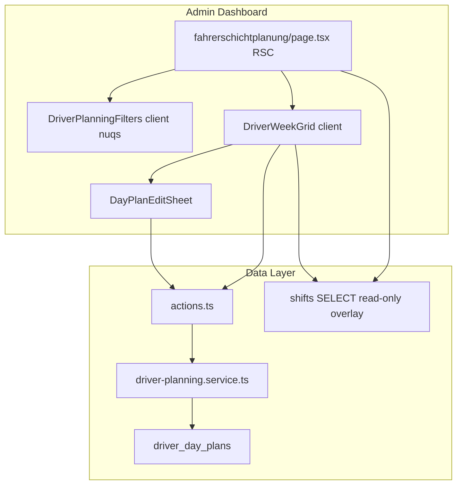

# Driver Planning Module — Phase 1 Implementation Plan

## Pre-read corrections (from repo audit)

| User spec reference | Actual path / finding |
|---|---|
| `services/shift-reconciliations.service.ts` | [`src/features/shift-reconciliations/api/shift-reconciliations.service.ts`](src/features/shift-reconciliations/api/shift-reconciliations.service.ts) |
| `hooks/use-shift-reconciliations.ts` | **Does not exist** — follow [`use-shift-day-summaries.ts`](src/features/shift-reconciliations/hooks/use-shift-day-summaries.ts) + [`use-confirm-shift.ts`](src/features/shift-reconciliations/hooks/use-confirm-shift.ts) mutation/invalidation patterns |
| `requireAdminContext` in `require-admin.ts` | **Local helper** inside shift-reconciliations service (lines 28–51) — duplicate same private helper in driver-planning service; do **not** import from [`require-admin.ts`](src/lib/api/require-admin.ts) (that file exports `requireAdmin()` / `assertAdminOrRedirect()` for Route Handlers / RSC) |

---

## User clarifications (plan iteration)

### 1. Nav icon — use existing key only

[`src/components/icons.tsx`](src/components/icons.tsx) was read in full. **No calendar-family icon is registered** (no `IconCalendarWeek`, `IconCalendarEvent`, etc.).

**Chosen key: `kanban`** (`IconLayoutKanban`)

- Closest semantic match for scheduling/planning among existing keys.
- Already used for [`Regelfahrten`](src/config/nav-config.ts) — acceptable sibling reuse for another schedule-oriented feature.
- **Do not modify `icons.tsx`.**

Nav entry in [`nav-config.ts`](src/config/nav-config.ts) (Account group, directly **above** Schichtzettel-Abgleich):

```ts
{
  title: 'Fahrerschichtplanung',
  url: '/dashboard/fahrerschichtplanung',
  icon: 'kanban',
  shortcut: ['f', 'p']
},
```

(`icon` must be `keyof typeof Icons` per [`src/types/index.ts`](src/types/index.ts).)

### 2. `updated_at` — match existing migration pattern

Grep across all [`supabase/migrations/`](supabase/migrations/) files:

- **No** `handle_updated_at`, `moddatetime`, or `BEFORE UPDATE` triggers for `updated_at`.
- Only unrelated triggers: `ensure_client_number`, `ensure_payer_number` in `05-kundennummer-system.sql`.
- **Established pattern:** column `updated_at timestamptz NOT NULL DEFAULT now()` + **application sets `updated_at = now()` on UPDATE**.

Explicit documentation example — [`20260408120001_pdf_vorlagen.sql`](supabase/migrations/20260408120001_pdf_vorlagen.sql) line 54:

> `updated_at maintained by the application on UPDATE.`

RPC examples: [`20260505180000_manual_km_overrides_foundation.sql`](supabase/migrations/20260505180000_manual_km_overrides_foundation.sql) line 219, [`20260411120000_storno_atomic_rpc.sql`](supabase/migrations/20260411120000_storno_atomic_rpc.sql) line 139.

**Migration decision for `driver_day_plans`:**

- **Keep** `updated_at timestamptz NOT NULL DEFAULT now()` column (matches `letters`, `trip_presets`, `billing_pricing_rules`, etc.).
- **Remove** the spec’s `CREATE TRIGGER driver_day_plans_updated_at` block entirely.
- **No new DB functions or extensions.**
- **Set `updated_at: new Date().toISOString()`** (or let Supabase accept server `now()` via raw update payload) explicitly in `upsertDayPlan` `ON CONFLICT DO UPDATE` alongside other mutable fields.

---

## Architecture



**Hard isolation:** zero writes to `shifts`, `shift_events`, `shift_reconciliations`. No changes under `src/app/driver/**` or `src/features/driver-portal/**`.

**URL state (nuqs):** reuse reconciliation param style:

- `?driver=<uuid>` — selected driver
- `?week=<YYYY-MM-DD>` — Monday of selected week (Europe/Berlin)

Both [`DriverPlanningFilters`](src/features/driver-planning/components/driver-planning-filters.tsx) and [`DriverWeekGrid`](src/features/driver-planning/components/driver-week-grid.tsx) read/write these keys (same distributed pattern as shift-reconciliation filters + day-list). RSC page reads `searchParams` only for **prefetch** matching URL.

---

## Step 1 — Migration

**File:** `supabase/migrations/[timestamp]_add_driver_day_plans.sql`

```sql
CREATE TABLE public.driver_day_plans (
  id              uuid PRIMARY KEY DEFAULT gen_random_uuid(),
  company_id      uuid NOT NULL REFERENCES public.companies(id) ON DELETE CASCADE,
  driver_id       uuid NOT NULL REFERENCES public.accounts(id)  ON DELETE CASCADE,
  plan_date       date NOT NULL,
  status          text NOT NULL,
  planned_start   time,
  planned_end     time,
  vehicle_id      uuid REFERENCES public.vehicles(id) ON DELETE SET NULL,
  notes           text,
  created_by      uuid REFERENCES public.accounts(id) ON DELETE SET NULL,
  created_at      timestamptz NOT NULL DEFAULT now(),
  updated_at      timestamptz NOT NULL DEFAULT now(),
  CONSTRAINT driver_day_plans_company_driver_date_key
    UNIQUE (company_id, driver_id, plan_date),
  CONSTRAINT driver_day_plans_status_check
    CHECK (status IN (
      'working', 'day_off', 'vacation', 'sick',
      'half_day_vacation', 'overtime', 'training', 'special_leave'
    ))
);

COMMENT ON COLUMN public.driver_day_plans.updated_at IS
  'Maintained by the application on UPDATE (same pattern as pdf_vorlagen).';

CREATE INDEX driver_day_plans_company_driver_date_idx
  ON public.driver_day_plans (company_id, driver_id, plan_date);

ALTER TABLE public.driver_day_plans ENABLE ROW LEVEL SECURITY;

CREATE POLICY "admin_all_own_company"
  ON public.driver_day_plans
  FOR ALL TO authenticated
  USING  (company_id = public.current_user_company_id() AND public.current_user_is_admin())
  WITH CHECK (company_id = public.current_user_company_id() AND public.current_user_is_admin());
```

Inline comment in migration: phase 1 admin-only; no driver policy yet; UNIQUE prevents duplicate day rows; policy uses only existing helpers (no cross-table subqueries — [`docs/access-control.md`](docs/access-control.md) rule 3).

**BUILD GATE:** `bun run build`

---

## Step 2 — Types

**Create** [`src/features/driver-planning/types.ts`](src/features/driver-planning/types.ts):

- `PLAN_STATUSES` const → German labels (exact mapping from spec)
- `PlanStatus` union from keys
- `DriverDayPlan` row type (+ optional embedded `vehicle: { id, name, license_plate } | null`)

**Extend** [`src/types/database.types.ts`](src/types/database.types.ts): manual `driver_day_plans` block mirroring [`shift_reconciliations`](src/types/database.types.ts) block (lines 1155–1217).

**BUILD GATE:** `bun run build`

---

## Step 3 — Service layer

**Create** [`src/features/driver-planning/api/driver-planning.service.ts`](src/features/driver-planning/api/driver-planning.service.ts)

Private `requireAdminContext()` — copy from shift-reconciliations service (session Supabase client + role check).

**Exported functions** (spec + two read helpers required by RSC/hook):

| Function | Purpose |
|---|---|
| `getPlanningDrivers()` | Active drivers in company (same query as `getDrivers()` in shift-reconciliations **70–84**) |
| `getDriverWeekPlan(driverId, weekStartYmd)` | Plans Mon–Sun inclusive via `plan_date >= weekStartYmd AND plan_date <= weekEndYmd` |
| `getActualShiftDatesForWeek(driverId, weekStartYmd)` | **Read-only** `shifts` SELECT: `status = 'ended'`, `started_at` in week bounds via [`getZonedDayBoundsIso`](src/features/trips/lib/trip-business-date.ts); return distinct YMD strings via `instantToYmdInBusinessTz` |
| `upsertDayPlan(payload)` | PostgREST upsert on `(company_id, driver_id, plan_date)`; sets `updated_at` explicitly on conflict update |
| `deleteDayPlan(planId)` | Delete by id (RLS scopes) |

**Date rules:**

- Week bounds: derive 7 YMD strings from Monday using `addDays` + `instantToYmdInBusinessTz` / `tz('Europe/Berlin')` — same approach as [`use-upcoming-trips.ts`](src/features/trips/hooks/use-upcoming-trips.ts) (`startOfWeek`, `weekStartsOn: 1`).
- **No** `toISOString()` for calendar date keys; **no** UTC midnight math for `plan_date` filters.

**Select shape for week plan:**

```ts
.select(`
  *,
  vehicle:vehicles(id, name, license_plate)
`)
```

**Why comments:** on each function per Step 9 (Berlin dates, upsert vs insert, admin context placement, read-only shifts).

**BUILD GATE:** `bun run build`

---

## Step 4 — Server actions

**Create** [`src/features/driver-planning/actions.ts`](src/features/driver-planning/actions.ts) — `'use server'`, thin delegates mirroring [`shift-reconciliations/actions.ts`](src/features/shift-reconciliations/actions.ts):

- `getDriverWeekPlanAction(driverId, weekStartYmd)` — **required for React Query** (not in original spec list but necessary)
- `upsertDayPlanAction(payload)`
- `deleteDayPlanAction(planId)`

**BUILD GATE:** `bun run build`

---

## Step 5 — React Query hook

**Create** [`src/features/driver-planning/hooks/use-driver-week-plan.ts`](src/features/driver-planning/hooks/use-driver-week-plan.ts):

- `useDriverWeekPlan(driverId, weekStartYmd)` — queryKey `['driver-week-plan', driverId, weekStartYmd]`, enabled when both set, accepts `initialData` from RSC
- `useUpsertDayPlan()` — mutation → `upsertDayPlanAction`, invalidate week key, success toast
- `useDeleteDayPlan()` — mutation → `deleteDayPlanAction`, invalidate week key

Pattern: [`use-shift-day-summaries.ts`](src/features/shift-reconciliations/hooks/use-shift-day-summaries.ts) + [`use-confirm-shift.ts`](src/features/shift-reconciliations/hooks/use-confirm-shift.ts).

**BUILD GATE:** `bun run build`

---

## Step 6 — UI components

Build order under [`src/features/driver-planning/components/`](src/features/driver-planning/components/):

### 6a `plan-status-badge.tsx`
- Maps each `PlanStatus` → shadcn `Badge` variant
- Label from `PLAN_STATUSES[status]`
- Tint via semantic tokens (`bg-muted`, `text-destructive`, `border-primary/30`, etc.) — no hardcoded hex

### 6b `driver-planning-filters.tsx`
- Adapt driver `<Select>` from [`shift-reconciliation-filters.tsx`](src/features/shift-reconciliations/components/shift-reconciliation-filters.tsx) — **do not import** from shift-reconciliations
- nuqs: `driver`, `week` (Monday YMD)
- DatePicker pick → snap to Monday (`startOfWeek(..., { weekStartsOn: 1, in: tz(...) })`)
- Week label: `Mo DD.MM – So DD.MM.YYYY` (German, `date-fns` + `de` locale)
- Prev/next week chevrons (`Icons.chevronLeft` / `chevronRight` or Lucide — match nearby dashboard usage)

### 6c `day-plan-edit-sheet.tsx`
- shadcn Sheet: status select, conditional time inputs (`working`, `overtime`, `half_day_vacation`, `training`), vehicle select (`useEffect` + browser [`createClient`](src/lib/supabase/client.ts), `vehicles` where `is_active = true`), notes textarea max 500
- Save → `useUpsertDayPlan`; Delete → confirm dialog → `useDeleteDayPlan`
- Inline errors; success toast only

### 6d `day-plan-cell.tsx`
- Day label (`Mo`, `Di`, …) + `DD.MM`
- Plan badge + time range or `–` + ghost `+`
- Today highlight via subtle border/background token
- `Actual` chip when `actualShiftDates` includes date (prop from parent — **no in-cell query**)

### 6e `driver-week-grid.tsx`
- 7-column CSS grid (stack on `< md`)
- `useDriverWeekPlan` + sheet state (single shared `DayPlanEditSheet`)
- Skeleton × 7 while loading
- When driver unset: prompt “Bitte einen Fahrer auswählen.”
- When driver set: always render 7 cells (merge plans into week slots)

**BUILD GATE:** `bun run build`

---

## Step 7 — Page + nav

### 7a [`src/app/dashboard/fahrerschichtplanung/page.tsx`](src/app/dashboard/fahrerschichtplanung/page.tsx)

RSC (`dynamic = 'force-dynamic'`), pattern from [`shift-reconciliations/page.tsx`](src/app/dashboard/shift-reconciliations/page.tsx):

1. `getPlanningDrivers()`
2. Parse `searchParams.driver` / `searchParams.week`; default driver = first alphabetical; default week = current Monday (`todayYmdInBusinessTz` + Monday snap)
3. Prefetch when driver known:
   - `getDriverWeekPlan(driverId, weekStartYmd)` → `initialPlans`
   - `getActualShiftDatesForWeek(driverId, weekStartYmd)` → `actualShiftDates`
4. Render `PageContainer` + filters + grid

Metadata title: `Dashboard: Fahrerschichtplanung`

### 7b [`src/config/nav-config.ts`](src/config/nav-config.ts)

Add entry with `icon: 'kanban'` above Schichtzettel-Abgleich (see clarifications above).

**BUILD GATE:** `bun run build`

---

## Step 8 — Invariant verification (read-only checklist)

Before docs, verify:

- [ ] `src/app/driver/shift/page.tsx` unchanged
- [ ] `ShiftTimeForm`, `ShiftHistoryList`, `shiftsService.createManualShift` / `deleteShift` unchanged
- [ ] Existing shift RLS migrations untouched
- [ ] No UTC midnight / raw `toISOString()` date keys in driver-planning feature
- [ ] Status strings only in `types.ts` `PLAN_STATUSES`
- [ ] `requireAdminContext()` first in every service export
- [ ] RLS policy: only `current_user_company_id()` + `current_user_is_admin()`
- [ ] German UI labels throughout
- [ ] No imports from `driver-portal` or `shift-reconciliations` inside driver-planning components
- [ ] `database.types.ts` block matches migration
- [ ] No DB trigger for `updated_at`; service sets on upsert

**BUILD GATE:** `bun run build` + `bun test` (existing suite — invoices/trips only per [`package.json`](package.json))

---

## Step 9 — Docs and comments (mandatory)

1. **Create** [`docs/driver-planning.md`](docs/driver-planning.md) — purpose, route, table/enum, RLS, folder structure, deferred items, integration touchpoints from audit
2. **Update** [`docs/driver-system.md`](docs/driver-system.md) — fix stale tap-tracker-at-`/driver/shift` text; add `/dashboard/fahrerschichtplanung` row
3. **Update** [`docs/plans/driver-planning-module-audit.md`](docs/plans/driver-planning-module-audit.md) — top section “Phase 1 status: implemented” with step outcomes
4. **Inline why-comments** in service, migration, filters (Monday snap), day-plan-cell (actuals from parent), `PLAN_STATUSES` (const vs reference table phase 1)

**FINAL BUILD GATE:** `bun run build` + `bun test`

---

## Files changed (final list)

| File | Action |
|---|---|
| `supabase/migrations/[timestamp]_add_driver_day_plans.sql` | CREATE |
| `src/types/database.types.ts` | EXTEND |
| `src/features/driver-planning/types.ts` | CREATE |
| `src/features/driver-planning/api/driver-planning.service.ts` | CREATE |
| `src/features/driver-planning/actions.ts` | CREATE |
| `src/features/driver-planning/hooks/use-driver-week-plan.ts` | CREATE |
| `src/features/driver-planning/components/*.tsx` (5 files) | CREATE |
| `src/app/dashboard/fahrerschichtplanung/page.tsx` | CREATE |
| `src/config/nav-config.ts` | EXTEND |
| `docs/driver-planning.md` | CREATE (Step 9) |
| `docs/driver-system.md` | UPDATE (Step 9) |
| `docs/plans/driver-planning-module-audit.md` | UPDATE (Step 9) |

**Explicitly untouched:** `src/app/driver/**`, `src/features/driver-portal/**`, `src/features/shift-reconciliations/**`, `src/components/icons.tsx`, existing migrations.

---

## Deferred (do not implement)

Multi-driver grid, monthly view, driver-facing plan, leave balances, sick attachments, bulk/week copy, recurring templates, dispatch guardrails, payroll export, overtime auto-calc, plan locations, `/driver/shift` plan awareness.
