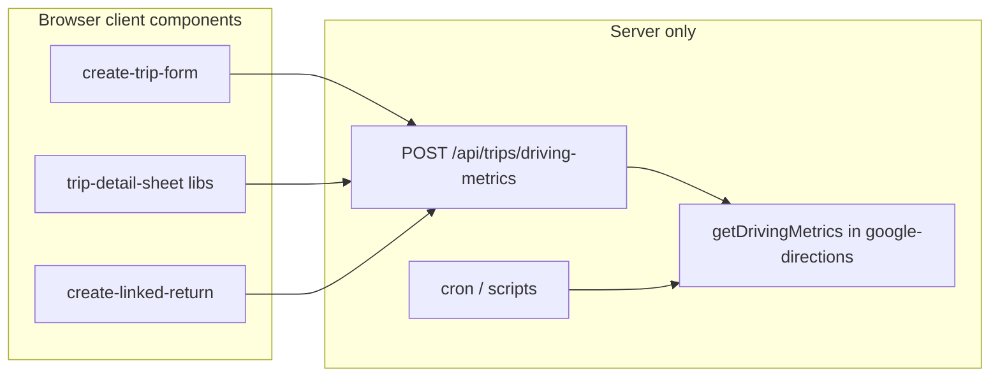

# Server-side driving metrics (Directions) API

## Assessment (production readiness)

**Solid as-is**

- **Server-only API key** via Route Handler — correct; avoids `NEXT_PUBLIC_` leakage.
- **Supabase session + `accounts.company_id`** — matches other trip mutations ([`bulk-delete`](../../src/app/api/trips/bulk-delete/route.ts), [`duplicate`](../../src/app/api/trips/duplicate/route.ts)); prevents anonymous abuse of your Google quota.
- **Zod validation** on coordinates — prevents garbage input and malformed JSON issues.
- **Single client helper** — one URL and contract, easier to maintain.
- **Graceful `metrics: null`** — trip creation should not hard-fail when Directions is down or key missing (align with current UX).

**Gaps addressed below (recommended for “production ready”)**

| Gap | Why it matters | Plan action |
|-----|----------------|-------------|
| **Upstream timeout** | Default `fetch` to Google can hang; ties up serverless duration | Use `AbortSignal.timeout(...)` (e.g. 10–15s) around the Directions `fetch` inside `getDrivingMetrics` or only in the route wrapper |
| **Google quota / 429 / OVER_QUERY_LIMIT** | Paid API; users see silent null without ops signal | Map non-OK HTTP + known `status` values to `metrics: null`; **log structured warning** (no API key, status only) — optional Sentry breadcrumb |
| **Rate limiting** | Authenticated users can still spam the endpoint | **Document** GCP quotas + billing alerts first; **code**: optional lightweight in-memory limiter per user id is fragile on serverless — prefer **Edge middleware / Vercel KV / Upstash** if abuse appears; **MVP**: document + monitor |
| **Parallel burst** | `Promise.all` on many passengers fires many Directions calls at once | No change required for MVP; **document** in `driving-metrics-api.md` (batch behavior, consider sequential or debounce if QPS issues) |
| **Operational hygiene** | Cost surprises | **Docs**: GCP budget alert + Directions API enabled + key restrictions (API + server IP / host) |

**Explicitly out of scope for first ship (optional follow-ups)**

- Response caching (Redis / unstable_cache) for identical O/D pairs — saves money at scale; add when traffic justifies.
- Request signing or CSRF tokens — same-origin cookie POST is standard for dashboard apps; skip unless threat model requires.

---

## Problem

[`src/lib/google-directions.ts`](../../src/lib/google-directions.ts) reads `process.env.GOOGLE_MAPS_API_KEY` and calls the Google **Directions API**. It is imported from **`'use client'`** modules, where the key is never available. Server-only call sites (cron, backfill) work.

---

## Implementation

### 1. Route handler

Add [`src/app/api/trips/driving-metrics/route.ts`](../../src/app/api/trips/driving-metrics/route.ts):

- `export const dynamic = 'force-dynamic'`.
- **Auth + tenant guard** — mirror [`trips/bulk-delete/route.ts`](../../src/app/api/trips/bulk-delete/route.ts).
- **Body**: `originLat`, `originLng`, `destLat`, `destLng` — **Zod** (finite, lat/lng ranges).
- **Call** `getDrivingMetrics` → **200** `{ metrics: DrivingMetrics | null }`.
- **Inline comments**: secret key, Directions API enablement, not for direct browser use.

### 2. Upstream robustness (in `getDrivingMetrics` or route)

- Wrap Google `fetch` with **`AbortSignal.timeout(12000)`** (tune once).
- On timeout / network error: return `null`, log once (no key in logs).

### 3. Client helper

Add [`src/features/trips/lib/fetch-driving-metrics.ts`](../../src/features/trips/lib/fetch-driving-metrics.ts): `POST /api/trips/driving-metrics`, return `DrivingMetrics | null`; **comments**: client-only; server uses `getDrivingMetrics` directly.

### 4. Replace client imports

`create-trip-form.tsx`, `build-trip-details-patch.ts`, `paired-trip-sync.ts`, `create-linked-return.ts` → use `fetchDrivingMetrics`.

**Unchanged**: cron, `scripts/backfill-driving-distance.ts`.

### 5. `google-directions.ts`

- File-level **server-only** JSDoc; point client code to `fetch-driving-metrics.ts`.

---

## Documentation

| File | Updates |
|------|---------|
| **New** `docs/driving-metrics-api.md` | Env, Directions API, auth, request/response, **timeout/quota behavior**, **operational checklist** (GCP billing alert, API restrictions), link from here |
| `docs/address-autocomplete.md` | Env table + cross-link |
| `docs/trip-detail-sheet-editing.md` | One sentence: metrics via server route |
| `AGENTS.md` | Env bullet + link |

---

## Verification

- `bun run lint`
- Manual: with key — metrics populated; without — trips still save, no browser error from `google-directions.ts`

---

## Todos

- [ ] Add POST `/api/trips/driving-metrics` (Zod, auth, company, comments)
- [ ] Add `AbortSignal.timeout` + safe logging for Google failures
- [ ] Add `fetch-driving-metrics.ts`; switch 4 client modules
- [ ] Comments in `google-directions.ts`
- [ ] Docs: new `driving-metrics-api.md` + edits to address-autocomplete, trip-detail-sheet-editing, AGENTS.md
