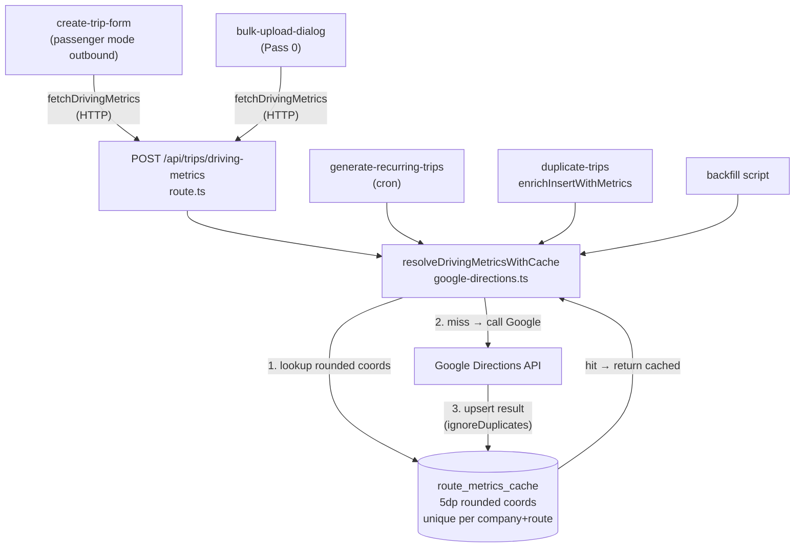

# Driving Metrics Reliability & Deduplication

## Architecture after this plan



## Key invariants

- `COORD_PRECISION = 5` is defined **once** in `google-directions.ts` and imported everywhere. Never hardcoded.
- `route_metrics_cache` upsert uses `ignoreDuplicates: true` — two concurrent requests racing on the same route both attempt to write; the DB unique constraint silently drops the second. No trip save is ever blocked by a metrics failure.
- The old `trips`-table cache query is removed entirely.

---

## Step 1 — SQL (manual, Supabase SQL Editor)

Run this once before touching any code. Verify the table exists in Supabase Table Editor before proceeding.

```sql
CREATE TABLE IF NOT EXISTS public.route_metrics_cache (
  id               uuid         PRIMARY KEY DEFAULT gen_random_uuid(),
  company_id       uuid         NOT NULL REFERENCES public.companies(id) ON DELETE CASCADE,
  origin_lat       decimal(8,5) NOT NULL,
  origin_lng       decimal(8,5) NOT NULL,
  dest_lat         decimal(8,5) NOT NULL,
  dest_lng         decimal(8,5) NOT NULL,
  distance_km      float8       NOT NULL,
  duration_seconds int4         NOT NULL,
  created_at       timestamptz  DEFAULT now(),
  UNIQUE (company_id, origin_lat, origin_lng, dest_lat, dest_lng)
);
CREATE INDEX IF NOT EXISTS idx_route_metrics_lookup
  ON public.route_metrics_cache (company_id, origin_lat, origin_lng, dest_lat, dest_lng);
```

---

## Step 2 — `src/types/database.types.ts`

Add `route_metrics_cache` Row / Insert / Update type definitions following the exact pattern of adjacent tables. Fields: `id`, `company_id`, `origin_lat`, `origin_lng`, `dest_lat`, `dest_lng`, `distance_km`, `duration_seconds`, `created_at`. Build gate: `bun run build` passes.

---

## Step 3 — `src/lib/google-directions.ts` (core rewrite)

This is the change everything else depends on.

**Add at module scope:**
```ts
export const COORD_PRECISION = 5;
function roundCoord(v: number): number {
  return parseFloat(v.toFixed(COORD_PRECISION));
}
```

**New signature** — add `companyId: string` as final parameter:
```ts
export async function resolveDrivingMetricsWithCache(
  originLat: number, originLng: number,
  destLat: number,   destLng: number,
  supabase: SupabaseClient<Database>,
  companyId: string
): Promise<ResolvingMetrics | null>
```

**New body (in order):**
1. Round all four coordinates with `roundCoord`.
2. Query `route_metrics_cache` by `(company_id, origin_lat, origin_lng, dest_lat, dest_lng)` with rounded values. On hit → return `{ distanceKm, durationSeconds, source: 'cache' }`.
3. On miss → call `getDrivingMetrics` with the **original** (un-rounded) coordinates.
4. If null → return null.
5. Upsert result into `route_metrics_cache` using rounded coords and `onConflict: 'company_id,origin_lat,origin_lng,dest_lat,dest_lng'` + `ignoreDuplicates: true`. Log upsert errors but do not throw.
6. Return `{ ...metrics, source: 'google' }`.

Remove the old `trips`-table SELECT entirely. Build gate: `bun run build` passes.

---

## Step 4 — Update all callers of `resolveDrivingMetricsWithCache`

Four callers must be updated to pass `companyId`:

| File | Where `companyId` comes from |
|---|---|
| [`src/app/api/trips/driving-metrics/route.ts`](src/app/api/trips/driving-metrics/route.ts) | `auth.companyId` — already returned by `requireAdmin()` (line 33–36 of route) |
| [`src/features/trips/lib/duplicate-trips.ts`](src/features/trips/lib/duplicate-trips.ts) | `executeDuplicateTrips` receives `companyId: string`; thread it to `enrichInsertWithMetrics(insert, supabase, companyId)` and then to `resolveDrivingMetricsWithCache` |
| [`src/app/api/cron/generate-recurring-trips/route.ts`](src/app/api/cron/generate-recurring-trips/route.ts) | `client.company_id` — available inside `buildTripPayload`; also apply `COORD_PRECISION` rounding to the in-memory Map key |
| [`scripts/backfill-driving-distance.ts`](scripts/backfill-driving-distance.ts) | Add `company_id` to the SELECT query; pass `trip.company_id` per row |

Build gate: `bun run build` passes after all four are updated.

---

## Step 5 — `src/features/trips/components/create-trip/create-trip-form.tsx`

Locate the passenger-mode outbound block (~lines 1406–1437). Replace:
```ts
driving_distance_km: null,
driving_duration_seconds: null
// comment about backfill script
```
with the same guard-and-call pattern used in anonymous mode (~lines 1283–1305): check `pickupHasCoords && dropoffHasCoords`, call `await fetchDrivingMetrics(...)`, assign result or null. Remove the backfill-script comment. No other form logic changes. Build gate: `bun run build` passes.

---

## Step 6 — `src/features/trips/components/bulk-upload-dialog.tsx`

**Fix 1 — `buildReturnTrip` (~lines 500–533):** The function spreads `...outbound`, inheriting `driving_distance_km` and `driving_duration_seconds` from the forward route. Explicitly override both to `null` in the returned object so the reversed route gets its own calculation.

**Fix 2 — Pass 2 in `runBulkInsert` (~lines 1190–1235):** After `buildReturnTrip` produces each payload and before inserting, call `fetchDrivingMetrics` with the return trip's `(pickup_lat, pickup_lng, dropoff_lat, dropoff_lng)`, await the result, and assign it. Guard on all four coordinates being non-null. Null metrics are acceptable; do not block the insert. Build gate: `bun run build` passes.

---

## Step 7 — `scripts/backfill-driving-distance.ts`

Rewrite the processing loop:
- Add `company_id` to the SELECT.
- Add `--dry-run` flag support: log changes but skip DB writes.
- Process in batches of 10 with 200 ms sleep after each batch (instead of 500 ms per-row). Cache-hit rows do not need a per-row pause because no Google call is made.
- At end: log total processed / cache hits / Google calls / errors.

Import `COORD_PRECISION` from `google-directions.ts`. Do not hardcode `5`. Build gate: `bun run build` passes.

---

## Step 8 — Docs

- **[`docs/driving-metrics-api.md`](docs/driving-metrics-api.md):** Document `route_metrics_cache` schema, unique constraint, 5dp rounding rationale, write-back behaviour, `companyId` scoping, bulk upload deduplication strategy, and Known Limitations section.
- **Inline comments** in every changed file explaining *why* (not what): geocoder non-determinism, upsert race safety, why the trips-table cache was removed, why passenger-mode skip was removed, why return trips must not inherit forward metrics.
- **[`docs/plans/driving-metrics-audit.md`](docs/plans/driving-metrics-audit.md):** Mark implemented, add date, note any deviations.

---

## Files changed

| File | Change |
|---|---|
| Supabase SQL Editor | CREATE TABLE `route_metrics_cache` + index (manual) |
| `src/types/database.types.ts` | Add `route_metrics_cache` types |
| `src/lib/google-directions.ts` | `COORD_PRECISION`, `roundCoord`, new cache logic, `companyId` param, write-back |
| `src/app/api/trips/driving-metrics/route.ts` | Pass `auth.companyId` to resolver |
| `src/features/trips/lib/duplicate-trips.ts` | Thread `companyId` to `enrichInsertWithMetrics` |
| `src/app/api/cron/generate-recurring-trips/route.ts` | Pass `client.company_id`; align Map key rounding to `COORD_PRECISION` |
| `scripts/backfill-driving-distance.ts` | Add `company_id` to SELECT, dry-run flag, batch sleep, summary |
| `src/features/trips/components/create-trip/create-trip-form.tsx` | Remove hardcoded null metrics for passenger-mode outbound |
| `src/features/trips/components/bulk-upload-dialog.tsx` | `buildReturnTrip` nulls metrics; Pass 2 recalculates with reversed coords |
| `docs/driving-metrics-api.md` | Updated documentation |
| `docs/plans/driving-metrics-audit.md` | Mark implemented |
