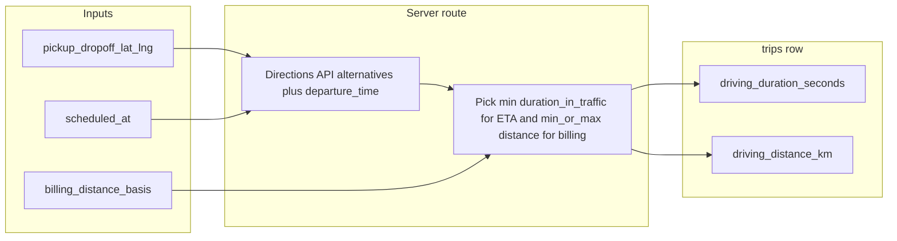

# Driving distance and duration — implementation plan

## Current state (facts from repo)

- Columns `[driving_distance_km](supabase/migrations/20260316090000_add_driving_distance_and_duration_to_trips.sql)`, `[driving_duration_seconds](supabase/migrations/20260316090000_add_driving_distance_and_duration_to_trips.sql)` exist on `trips`.
- `[src/lib/google-directions.ts](src/lib/google-directions.ts)` calls Directions API with **no** `departure_time`, **no** `alternatives` → single default route, **no traffic**.
- Metrics are computed in `[create-trip-form.tsx](src/features/trips/components/create-trip/create-trip-form.tsx)` (anonymous + return legs), `[create-linked-return.ts](src/features/trips/lib/create-linked-return.ts)`, and `[scripts/backfill-driving-distance.ts](scripts/backfill-driving-distance.ts)`. Passenger outbound rows intentionally set metrics to **null** (comment: avoid many sync calls).
- **Security / runtime note:** `create-trip-form.tsx` is a **client** component but imports `getDrivingMetrics`, which reads `process.env.GOOGLE_MAPS_API_KEY` (non-`NEXT_PUBLIC`). In a standard Next.js setup the browser bundle does **not** receive that value, so create-time metrics may be **no-ops in the browser** unless something else is configured. Moving the call **server-side** fixes correctness and protects the key.

## Target behavior (aligned with your strategy)

| Concern                                 | Rule                                                                                                                                                                                                                     |
| --------------------------------------- | ------------------------------------------------------------------------------------------------------------------------------------------------------------------------------------------------------------------------ |
| **ETA (`driving_duration_seconds`)**    | Traffic-aware when possible: use `departure_time` from trip `scheduled_at` (UTC Unix), prefer `**duration_in_traffic`**; pick **minimum** `duration_in_traffic` across returned routes (fastest ETA among alternatives). |
| **Billable km (`driving_distance_km`)** | From **same** Directions response with `alternatives=true`: **shortest** = min leg distance; **longest** = max leg distance among alternatives. If only one route, both collapse to that route.                          |
| **Per-trip choice**                     | New column (e.g. `billing_distance_basis`) on `trips`: `shortest`                                                                                                                                                        |
| **Coords**                              | Always use `pickup_lat/lng` → `dropoff_lat/lng`; never geocode on each metrics call if coords exist.                                                                                                                     |
| **Pairs**                               | When creating/updating a return leg, apply the **same** `billing_distance_basis` as the outbound unless you explicitly decide otherwise later.                                                                           |
| **Freeze**                              | Out of scope for v1; schema can stay ready for a future `billed_`* snapshot.                                                                                                                                             |

## Phase 1 — Core plumbing (backend + library)

1. **Migration** (new SQL under `supabase/migrations/`):
  - `billing_distance_basis` `text` with `CHECK (billing_distance_basis IN ('shortest', 'longest_alternatives'))` **or** a Postgres `enum` (team preference). Default `**shortest`** for backward compatibility.
  - Optional: `driving_metrics_computed_at` `timestamptz` null — set whenever metrics are successfully written (helps debugging and future freeze).
2. **Extend `[google-directions.ts](src/lib/google-directions.ts)`** (or add `google-directions-metrics.ts` if the file grows):
  - New function e.g. `getDrivingRouteInsights(params)` returning:
    - `durationSeconds` (ETA — min traffic duration across routes)
    - `billableDistanceKm` (from `basis`)
    - Raw counts for logging: number of routes, whether `duration_in_traffic` was present
  - Request params: origin/dest lat/lng, `departureTime: Date`, `billingDistanceBasis`.
  - Directions query: `mode=driving`, `units=metric`, `alternatives=true`, `departure_time=<unix>`, `traffic_model=best_guess` (when `departure_time` is set per Google docs).
  - **Pure helpers** (easy to unit test): given an array of `{ distanceMeters, durationInTrafficSeconds?, durationSeconds }`, compute min duration for ETA and min/max distance for billing.
3. **Server Route Handler** — e.g. `[src/app/api/trips/driving-metrics/route.ts](src/app/api/trips/driving-metrics/route.ts)` (POST, authenticated if the rest of dashboard APIs are):
  - Body: `{ pickupLat, pickupLng, dropoffLat, dropoffLng, scheduledAt: ISO string, billingDistanceBasis }`.
  - Calls `getDrivingRouteInsights`, returns JSON or 4xx/5xx on failure.
  - This is the **only** place the browser should call for metrics (key stays server-only).
4. **Regenerate types** — update `[src/types/database.types.ts](src/types/database.types.ts)` after migration (your usual Supabase codegen flow).

## Phase 2 — Wire into product flows

1. **Create trip** — `[create-trip-form.tsx](src/features/trips/components/create-trip/create-trip-form.tsx)`:
  - Add UI control for `billing_distance_basis` (per trip), default shortest.
  - Replace direct `getDrivingMetrics` with `fetch('/api/trips/driving-metrics', …)` when coords + `scheduled_at` exist; map response to insert payload.
  - **Passenger mode:** either (a) one POST per created row with small concurrency limit + toast if partial failure, or (b) keep null + rely on backfill — recommend **(a)** for parity with anonymous mode if API budget allows.
2. **Linked return** — `[create-linked-return.ts](src/features/trips/lib/create-linked-return.ts)` and `[build-return-trip-insert.ts](src/features/trips/lib/build-return-trip-insert.ts)`:
  - Pass outbound’s `billing_distance_basis` and return leg `scheduled_at` into the metrics step (via shared server helper used by the route handler to avoid duplicating Directions logic in client-only code — `createLinkedReturn` runs in client context today; it should call the **same API** or a shared **server action** if you prefer).
3. **Edits that should invalidate metrics**
  - Trip detail / edit flows that change `scheduled_at`, coords, or billing basis should either **auto-refresh** metrics (debounced) or offer **“Metriken aktualisieren”**. Minimum: when any of those fields change and coords are complete, call the same API and `updateTrip` with new `driving_`* + `driving_metrics_computed_at` (identify patch sites: `[trip-detail-sheet.tsx](src/features/overview/components/trip-detail-sheet.tsx)` time edit, any address edit components).
4. **Scripts** — `[scripts/backfill-driving-distance.ts](scripts/backfill-driving-distance.ts)`:
  - For each trip, read `scheduled_at`, `billing_distance_basis` (default shortest), call shared `getDrivingRouteInsights` (import from lib — script runs in Node with env key), update row + `driving_metrics_computed_at`.

## Phase 3 — Quality and “ensure we implemented it”

1. **Tests**
  - **Unit tests** for the pure “pick min/max from routes” logic (no network).
  - Optional: one **integration** test with mocked `fetch` to Directions if you want regression safety on URL assembly.
2. **Manual QA checklist** (before merge)
  - Trip with coords: shortest vs longest shows different `driving_distance_km` when Google returns 2+ routes (pick a known city pair that often yields alternatives).
    - Trip without coords: metrics stay null; UI does not error.
    - Change `scheduled_at`: duration updates (traffic bucket changes).
    - Hin + Rückfahrt: both legs get metrics; return uses reversed coords.
    - Passenger multi-create: metrics populated or explicitly documented gap.
3. **Observability**
  - Log Directions `status` and `error_message` server-side on non-OK.
    - Optional: Sentry breadcrumb on failed metrics (already have Sentry).
4. **Routes API**
  - **Not in v1** unless you hit Directions limitations. Document in code comment: re-evaluate **Routes API** when you need Compute Route Matrix batching or Google deprecates a feature you rely on.

## Risk / decision log

- **“Longest” is bounded** by Google’s alternative set (usually up to 3 routes), not every road in Germany — product copy and hospital contract should match that definition.
- **API cost:** one Directions request per (re)compute; alternatives do not multiply billable requests. Cache is optional later (same coords + 15-minute `departure` bucket).

