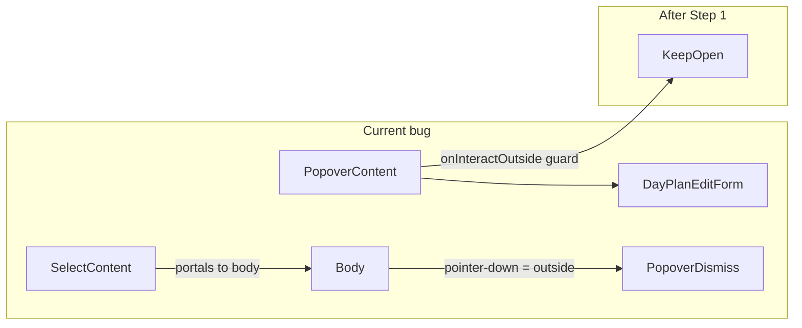

# Fahrerschichtplanung Phase 3A

## Context

Three bugs/gaps on [`/dashboard/fahrerschichtplanung`](src/app/dashboard/fahrerschichtplanung/page.tsx), confirmed by [`docs/plans/fahrerschichtplanung-audit.md`](docs/plans/fahrerschichtplanung-audit.md):



**Out of scope:** break field migration, multi-day bulk, admin `shifts` writes / RLS (Phase 3B/4), auto week navigation after create-dialog save (follow-up after Phase 3A is stable).

---

## Shared constants (add before Step 2)

Add [`src/features/driver-planning/lib/planning-url-params.ts`](src/features/driver-planning/lib/planning-url-params.ts) (keeps [`types.ts`](src/features/driver-planning/types.ts) domain-only):

```ts
export const DRIVER_PLANNING_URL_PARAMS = {
  week: 'week',
  driver: 'driver'
} as const;

/** Sentinel for "Alle Fahrer" in filter Select — not a real UUID. */
export const DRIVER_FILTER_ALL = '__all__' as const;
```

Use these in `useQueryState(DRIVER_PLANNING_URL_PARAMS.driver, …)` and week param references in filters + grid — no duplicated string literals.

---

## Step 1 — Fix Popover + nested Select dismiss (P0)

**File:** [`day-plan-edit-popover.tsx`](src/features/driver-planning/components/day-plan-edit-popover.tsx)

Add a shared helper (same file, above component) to avoid duplicating selector logic:

```ts
function isPortaledSelectInteraction(target: EventTarget | null): boolean {
  if (!(target instanceof Element)) return false;
  return Boolean(
    target.closest('[data-slot="select-content"]') || // project shadcn Select
    target.closest('[data-radix-popper-content-wrapper]') ||
    target.closest('[role="listbox"]') ||
    target.closest('[role="option"]')
  );
}
```

Attach to `PopoverContent` (lines 62–75):

- `onInteractOutside={(e) => { if (isPortaledSelectInteraction(e.target)) e.preventDefault(); }}`
- `onPointerDownOutside` — same guard

**Why comment (required):** Radix Popover dismisses on pointer-down outside `PopoverContent`. `SelectContent` portals to `document.body` ([`select.tsx`](src/components/ui/select.tsx) L69–93), so Status/Fahrzeug clicks look "outside" and unmount the form before `onValueChange` persists.

**Do not change:** controlled Select bindings in [`day-plan-edit-form.tsx`](src/features/driver-planning/components/day-plan-edit-form.tsx), or open/close logic in [`driver-roster-grid.tsx`](src/features/driver-planning/components/driver-roster-grid.tsx) L281–293.

**Acceptance:** Open cell popover → change Status to Urlaub → popover stays open → Speichern works. Escape / click outside (not on dropdown) still closes.

**Build gate:** `bun run build`

---

## Step 2 — Restore driver filter (P1)

### 2a. Filters UI + nuqs

**File:** [`driver-planning-filters.tsx`](src/features/driver-planning/components/driver-planning-filters.tsx)

- Extend props: `drivers: PlanningDriverListItem[]`
- Add `[driverParam, setDriverParam] = useQueryState(DRIVER_PLANNING_URL_PARAMS.driver, parseAsString)`
- Add Fahrer `Select` (mirror [`shift-reconciliation-filters.tsx`](src/features/shift-reconciliations/components/shift-reconciliation-filters.tsx) L33–57):
  - `value={driverParam ?? DRIVER_FILTER_ALL}`
  - Options: `DRIVER_FILTER_ALL` → "Alle Fahrer" + one item per driver
  - `onValueChange`: set param to `null` when all, else UUID
- Layout: place driver Select beside week `DatePicker` in the top row (`sm:flex-row sm:items-end`)
- **Why comment:** client-side filter only — reuses RSC `getPlanningDrivers()` result; no extra Supabase call

### 2b. Grid filtering

**File:** [`driver-roster-grid.tsx`](src/features/driver-planning/components/driver-roster-grid.tsx)

- Read same nuqs param: `useQueryState(DRIVER_PLANNING_URL_PARAMS.driver, parseAsString)`
- Derive `visibleDrivers`:

```ts
const visibleDrivers = useMemo(() => {
  if (!driverParam) return drivers;
  return drivers.filter((d) => d.id === driverParam);
}, [drivers, driverParam]);
```

- Replace `drivers.map` / empty-state checks with `visibleDrivers` (tbody L171–248, skeleton L181, footer guard L251)
- **Leave `workingCountByDate` unchanged** — still company-wide counts from full `plans` (matches pre-filter semantics; document in Phase 3A section)

### 2c. Page wiring

**File:** [`page.tsx`](src/app/dashboard/fahrerschichtplanung/page.tsx)

```tsx
<DriverPlanningFilters defaultWeekYmd={defaultWeekYmd} drivers={drivers} />
<DriverRosterGrid drivers={drivers} … />
```

Grid keeps full `drivers` prop; filtering is internal via URL.

**Acceptance:** `?driver=<uuid>` shows one row; clear filter restores all; week chevrons work with active filter; URL is bookmarkable.

**Build gate:** `bun run build`

---

## Step 3 — Quick-create Dialog (P1/P2)

### 3a. New component

**File:** [`day-plan-create-dialog.tsx`](src/features/driver-planning/components/day-plan-create-dialog.tsx) (NEW)

**File header comment:** Dialog (not Popover) is the correct shell for forms with driver + date pickers and nested Selects — Dialog backdrop dismiss does not conflict with portaled Select dropdowns the way Popover outside-click does.

**Props:**

```ts
type DayPlanCreateDialogProps = {
  drivers: PlanningDriverListItem[];
  open: boolean;
  onOpenChange: (open: boolean) => void;
};
```

**State (reset when `open` → false):**

- `selectedDriverId: string | null` — starts `null` (no driver pre-selected)
- `selectedPlanDate: string` — initialized to `todayYmdInBusinessTz()` on open

**Render order and gating (explicit):**

1. shadcn `Dialog` + `DialogContent` (`sm:max-w-lg`)
2. `DialogHeader` / `DialogTitle`: "Planung hinzufügen"
3. **Fahrer `Select`** — always visible first; placeholder "Fahrer wählen…"; required. Track `driverTouched` or equivalent if validation hint is needed on premature interaction.
4. **Datum `DatePicker`** — **renders immediately** on dialog open, pre-filled with `selectedPlanDate` (today). User can change date before or after picking a driver.
5. **Form body below the pickers:**
   - When `selectedDriverId == null`: show a muted placeholder (e.g. "Bitte zuerst einen Fahrer wählen.") — **do not** mount `DayPlanEditForm`. This prevents filling status/times before a driver is chosen.
   - When `selectedDriverId` is non-null: render [`DayPlanEditForm`](src/features/driver-planning/components/day-plan-edit-form.tsx) with:
     - `driverId={selectedDriverId}`
     - `planDate={selectedPlanDate}`
     - `plan={null}`
     - `weekStartYmd={snapYmdToWeekStart(selectedPlanDate)}`
     - `onSaved` / `onDeleted` / `onCancel` → `onOpenChange(false)`
6. **Fahrer validation hint:** If the user interacts with the form area or triggers save without a driver (edge case — form should not be mounted), show inline text under the Fahrer Select: "Fahrer ist erforderlich." Do not mount `DayPlanEditForm` until `selectedDriverId` is set — the hint is a guard on the shell, not a change to `DayPlanEditForm` internals.

**No changes to `DayPlanEditForm` props or upsert logic** — existing `useUpsertDayPlan` + query invalidation handles grid refresh for the **current visible week**.

**Deferred (not Phase 3A):** Auto-navigate `?week=` after save when `snapYmdToWeekStart(selectedPlanDate) !== currentWeek`. That requires `useRouter` + nuqs write + `router.refresh()` coordination; if React Query cache and week URL desync, the grid can show a stale week silently. Base case is sufficient: save → dialog closes → grid updates via existing invalidation **when the plan date falls in the currently displayed week**. Add week navigation on save in a follow-up ticket once Phase 3A is stable.

**Nested AlertDialog:** `DayPlanEditForm` already nests delete `AlertDialog` — same as popover path; no change needed.

### 3b. Toolbar button

**File:** [`driver-planning-filters.tsx`](src/features/driver-planning/components/driver-planning-filters.tsx)

- Local `createOpen` state
- `Button` with `Plus` icon in week navigation row (right side, `variant="default"` or `outline`):
  - Mobile: icon + `sr-only` "Planung hinzufügen"
  - `md+`: icon + label
- Render `<DayPlanCreateDialog drivers={drivers} open={createOpen} onOpenChange={setCreateOpen} />`

**Acceptance:**

- Dialog opens → Datum shows today immediately; Fahrer is empty; form body shows "choose driver first" placeholder (no status/times fields).
- Select Fahrer → `DayPlanEditForm` appears; user can adjust Datum before or after.
- Save → dialog closes → grid cell updates **for the current week** via existing React Query invalidation.
- Save with a date outside the visible week: dialog closes and data persists, but grid may not show the new cell until admin navigates week manually — **expected for Phase 3A** (auto week jump is deferred).

**Build gate:** `bun run build`

---

## Step 4 — Docs + inline comments (mandatory)

### 4a. [`docs/driver-planning.md`](docs/driver-planning.md)

Add **Phase 3A** section covering:

| Change | Detail |
|--------|--------|
| Popover fix | `onInteractOutside` / `onPointerDownOutside` guard for portaled Select |
| Driver filter | Restored `?driver=<uuid>`; client-side row filter |
| Quick-create | Toolbar "+" → `DayPlanCreateDialog` |
| URL params table | Add `?driver=` alongside `?week=` |
| Deferred | Break field, bulk multi-day, admin shifts (Phase 3B/4); auto week jump after create-dialog save (follow-up) |

Update feature structure tree to include `day-plan-create-dialog.tsx` and `lib/planning-url-params.ts`.

Update Behaviour bullet: edit paths = cell popover **or** toolbar dialog.

### 4b. Inline comments (why, not what)

| File | Location |
|------|----------|
| `day-plan-edit-popover.tsx` | Above dismiss guard helper |
| `driver-planning-filters.tsx` | Above nuqs driver param |
| `day-plan-create-dialog.tsx` | File-level + Dialog choice |

---

## Files touched (summary)

| File | Change |
|------|--------|
| [`day-plan-edit-popover.tsx`](src/features/driver-planning/components/day-plan-edit-popover.tsx) | Dismiss guard on `PopoverContent` |
| [`driver-planning-filters.tsx`](src/features/driver-planning/components/driver-planning-filters.tsx) | `drivers` prop, `?driver=`, "+" button, hosts create dialog |
| [`driver-roster-grid.tsx`](src/features/driver-planning/components/driver-roster-grid.tsx) | `visibleDrivers` from nuqs `?driver=` |
| [`day-plan-create-dialog.tsx`](src/features/driver-planning/components/day-plan-create-dialog.tsx) | **NEW** Dialog shell |
| [`planning-url-params.ts`](src/features/driver-planning/lib/planning-url-params.ts) | **NEW** URL param constants |
| [`page.tsx`](src/app/dashboard/fahrerschichtplanung/page.tsx) | Pass `drivers` to filters |
| [`docs/driver-planning.md`](docs/driver-planning.md) | Phase 3A documentation |

**Not changed:** [`day-plan-edit-form.tsx`](src/features/driver-planning/components/day-plan-edit-form.tsx) internals, week navigation logic, Supabase services/RLS, `shifts` tables.

---

## Hard rules checklist

- `bun run build` after Steps 1, 2, 3
- Cell-click popover behaviour unchanged except Select dismiss fix (additive props only)
- No new driver-list Supabase queries
- No magic strings for URL keys — use `planning-url-params.ts`
- No FAB — toolbar placement only

## Manual test plan

1. **P0:** Cell edit → Status Urlaub → Fahrzeug pick → popover stays open → save → cell shows Urlaub
2. **P1 filter:** Select one driver → one row; Alle Fahrer → full roster; reload preserves `?driver=`
3. **P1 create:** "+" → Datum pre-filled today, form gated until Fahrer selected → save → cell populated (same week); cancel closes dialog; date outside current week persists but grid unchanged until manual week nav
4. **Regression:** Week prev/next, cell delete, existing plan edit via cell still work
