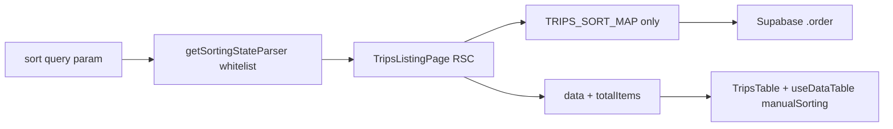

# Fahrten table: sort hardening + price columns

## Architecture (unchanged)

No change to the RSC shell, `DataTable`, or `DataTableColumnHeader`. **No change to** [`src/lib/searchparams.ts`](src/lib/searchparams.ts) (shared `sort` param; other list pages rely on it). No new dependencies.

---

## 1) Single source of truth: [`src/features/trips/trips-sort-map.ts`](src/features/trips/trips-sort-map.ts) (new)

- Export **`TRIPS_SORT_MAP`**: for each **sortable** column id (URL/TanStack `id`), the exact `{ column, foreignTable? }` used in PostgREST `order()`.
- Export **`TRIPS_SORTABLE_IDS`** as a `Set` or `readonly string[]` derived from the map keys (and any **legacy** alias keys you keep—see below).
- **Column names and FK hints** must match what already works in [`trips-listing.tsx`](src/features/trips/components/trips-listing.tsx) and [`database.types.ts`](src/types/database.types.ts) `public.Tables['trips']['Row']`:
  - **Fahrgast:** `client_name` (not `name` on `trips`—current RSC already maps `id === 'name'` → `client_name`).
  - **Datum / Zeit** (and legacy `date` if you keep bookmarks): all → `scheduled_at` on `trips` (use separate map entries for `scheduled_at`, `time`, and optionally `date` so old URLs still sort).
  - **Embeds:** keep **`payer`**, **`driver`**, **`billing_variant`** as `foreignTable` values (as today), not `driver_accounts!…`—those aliases already work with the existing `select()`.
  - **Direct `trips` columns:** e.g. `status`, `pickup_address`, `dropoff_address`, `billing_calling_station`, `billing_betreuer`, `kts_document_applies`, `gross_price`, `net_price`, `tax_rate`—names must match `Row` exactly.
- **Omit** from the map: `invoice_status`, `fremdfirma`, `fremdfirma_abrechnung` (deferred per your spec).
- **Inline comment** in file: why the map exists (no unmapped `order(id)` to PostgREST) and that absent keys mean “not a scalar trips column or deferred embed sort”.

**ID naming (important):** Your draft used keys like `scheduledat` / `pickupaddress`. The app today uses **snake_case** ids (e.g. `scheduled_at`, `name`, `driver_id`, `fremdfirma_abrechnung`). The plan should **use ids that match existing `columns.tsx` and historical URLs** where possible: e.g. `pickup_address` and `dropoff_address` as explicit `id` values (not `pickupaddress`) to avoid breaking `?sort=pickup_address...` and to match DB naming. If product insists on new ids, document the one-time URL break in audit “Resolution”.

**Build:** `bun run build` before step 2.

---

## 2) RSC: replace generic fallback in [`src/features/trips/components/trips-listing.tsx`](src/features/trips/components/trips-listing.tsx)

- Import `TRIPS_SORT_MAP` (and `TRIPS_SORTABLE_IDS` if needed for parsing only in step 3).
- Replace the current `if/else` + `else order(sortRule.id)` block with a **`for` loop** over `sorting` (preserve multi-sort order), per your pseudocode: resolve `mapping = TRIPS_SORT_MAP[rule.id]`, **`if (!mapping) continue`**, else `query = query.order(mapping.column, { ascending: !rule.desc, ...foreignTable })`.
- If `sorting.length === 0`, keep the existing default: `order('scheduled_at', { ascending: true })`.
- **Comment** why unmapped ids are skipped (stale/malicious URLs; never 500 the page).

**Build** before step 3.

---

## 3) Unify `getSortingStateParser` whitelist (client + RSC)

**Hard constraint — do not touch [`src/lib/searchparams.ts`](src/lib/searchparams.ts):**  
That file is **shared** by other list pages (clients, drivers, etc.). The `sort` key stays **`parseAsString` with no Fahrten-specific logic**. **Cursor / implementer must not edit `searchparams.ts` for this work.** Whitelist narrowing happens **only** at trips-specific call sites:

1. **RSC:** [`trips-listing.tsx`](src/features/trips/components/trips-listing.tsx) — pass `TRIPS_SORTABLE_IDS` into `getSortingStateParser(TRIPS_SORTABLE_IDS).parseServerSide(...)` (same import used nowhere else in that file for other features).
2. **Client:** [`trips-tables/index.tsx`](src/features/trips/components/trips-tables/index.tsx) — pass `sortParserValidKeys={TRIPS_SORTABLE_IDS}` (or equivalent) into `useDataTable`.

- **RSC:** change  
  `getSortingStateParser().parseServerSide(...)`  
  to  
  `getSortingStateParser(TRIPS_SORTABLE_IDS).parseServerSide(...)`  
  (or pass the same `Set`/`string[]` exported from the sort map module).  
- The shared `searchParams` cache does **not** get a per-route parser; the **argument** to `getSortingStateParser` is the only place the trips whitelist is applied. Note: there is no `search-params.ts` in this repo (name is `searchparams.ts`).

**Conflict with your “do not change `useDataTable`” rule (must be resolved):**  
Today [`useDataTable`](src/hooks/use-data-table.ts) passes **`getSortingStateParser(columnIds)`** where `columnIds` is **every** column’s `id` (including `invoice_status`, `select`, `actions`, …). That is **wider** than `TRIPS_SORTABLE_IDS` and is exactly the bug (invoice sort id accepted, then RSC 500s or we skip now).

To make client and RCS **identical** to **`TRIPS_SORTABLE_IDS` only** without forking the hook, add a **small optional** field to the **public** `UseDataTableProps` + destructuring, e.g. `sortParserValidKeys?: string[] | Set<string>`, and use:

`getSortingStateParser(props.sortParserValidKeys ?? columnIds)`

- **If omitted**, behaviour is unchanged (other list pages).
- **TripsTable** [`index.tsx`](src/features/trips/components/trips-tables/index.tsx) passes `sortParserValidKeys={TRIPS_SORTABLE_IDS}` (or a stable export).

This is a **surgical** API addition, not a rewrite of table state. If you want **zero** edits to `use-data-table.ts`, the alternative is a trips-only wrapper hook (duplication)—not recommended.

**Build** before step 4.

---

## 4) [`columns.tsx`](src/features/trips/components/trips-tables/columns.tsx) — ids + `enableSorting: false`

- **4a — Abholung / Ziel:** add explicit `id: 'pickup_address'` and `id: 'dropoff_address'` (or the exact strings present in `TRIPS_SORT_MAP` and `TRIPS_SORTABLE_IDS`). No cell/logic change.
- **4b — Deferred / unmappable without server work:** set **`enableSorting: false`** on:
  - `invoice_status`
  - `fremdfirma` (id as in file today)
  - `fremdfirma_abrechnung` (your “abrechnung_fremdfirma” string is not the current id; use the real `id` from the file).
- **4c —** Ensure **`select`** stays `enableSorting: false`**;** **`actions`** should not be sortable (set `enableSorting: false` if the column currently allows sort UI).
- **No** changes to cell renderers for existing columns beyond the above.

**Build** before step 5.

---

## 5) Price columns in [`columns.tsx`](src/features/trips/components/trips-tables/columns.tsx)

- Add three column defs with ids aligned to **`TRIPS_SORT_MAP`** (e.g. `gross_price` / `net_price` / `tax_rate` as ids, or `grossprice` if you add those exact keys in the map—**keep id, map key, and whitelist in sync**).
- **Null handling:** `gross_price` and `tax_rate` are `number | null` on `Row`; `net_price` is typed as `number` but treat **null/undefined** defensively in the cell for real-world rows.
- **Formatting (corrected vs your sample):**  
  - Brutto/Netto: `Intl.NumberFormat('de-DE', { style: 'currency', currency: 'EUR' })`.  
  - **MwSt.:** the codebase stores `tax_rate` as a **decimal** (e.g. `0.07`, `0.19`)—see [`trip-price-engine.test.ts`](src/features/trips/lib/__tests__/trip-price-engine.test.ts). Use **`new Intl.NumberFormat('de-DE', { style: 'percent', maximumFractionDigits: 0 }).format(value)`** when `value` is 0.07/0.19. **Do not** divide by 100. Add a one-line “why” comment next to the formatter.
- **`tabular-nums`** on the `` for alignment.

**5b Column visibility (default hidden)**

- Toolbar uses `showViewOptions={false}`; **column show/hide** lives in [`trips-filters-bar.tsx`](src/features/trips/components/trips-filters-bar.tsx) (hidable columns from the table). New columns are picked up automatically if they have accessors and can hide.
- In **`TripsTable`**’s `useDataTable` call, pass `initialState: { columnVisibility: { [grossId]: false, [netId]: false, [taxId]: false } }` so the **first** paint hides them; users enable via the existing filters bar column popover. **No** new filter bar UI or filter params; **no** changes to `trips-filters-bar` behaviour beyond what falls out of new column defs.
- **Verify** the filters bar has **no** hardcoded price field filters (grep for `gross_price` / `net_price` / `tax_rate` in that file); only adjust if a mistake would pull them in.

**Build** before step 6.

---

## 6) Manual verification

Follow your checklist (Datum ASC/DESC, Abholung, no sort on Rechnungsstatus, Brutto sort, hard reload, navigate away). Note: after hardening, a bookmark with **only** unmapped or deferred sort ids may reset to default ordering.

---

## 7) Documentation and comments (last)

- **[`docs/plans/fahrten-table-audit.md`](docs/plans/fahrten-table-audit.md):** add a **Resolution** section: what was fixed, what is deferred and why, URL/legacy notes.
- **[`docs/trips-date-filter.md`](docs/trips-date-filter.md) / [`docs/kts-architecture.md`](docs/kts-architecture.md):** only if sort behaviour is user-visible in those docs; otherwise a one-line cross-link to the sort map is enough.
- **Inline “why”** only on new/changed code paths (map, RSC loop, `sortParserValidKeys`, new columns, `enableSorting: false`).

---

## Deferred (explicitly out of scope)

- `invoice_status` and **fremdfirma** family server sorts (view/RPC/FK `order` discovery later).
- Price **filters** in the URL.
- `columnVisibility` **persistence** (localStorage) — not in this plan; default hidden is in-session initial state only.

## Risk / follow-up

- **Optional prop on `useDataTable`:** align naming with the team; keep default path unchanged for non-trips pages.
- **Tax display:** if any legacy row has `tax_rate` &gt; 1 (e.g. `19` meaning 19%), add a small guard in the cell (document if discovered)—otherwise stick to decimal fraction.
