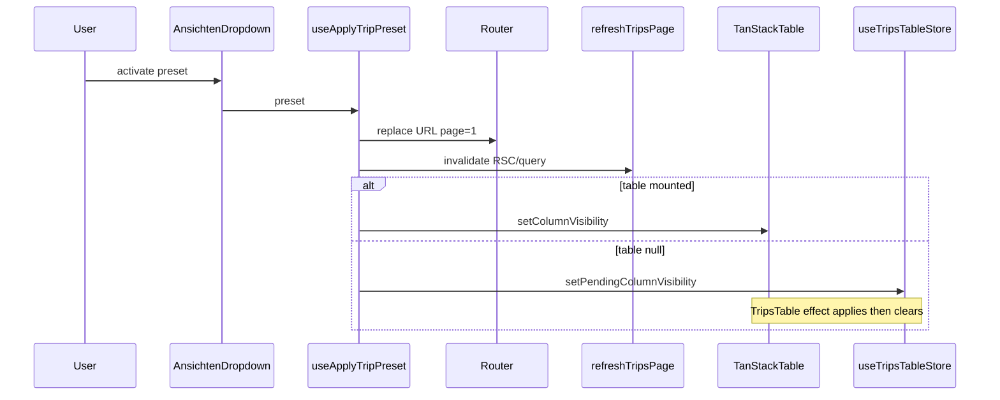

# Implementation Plan D — Fahrten Preset System (“Ansichten”)

## Preconditions (verified in repo)

- **RLS helpers:** Existing migrations use `public.current_user_is_admin()` and `company_id = public.current_user_company_id()` (e.g. [`20260413120000_angebot_flexible_table.sql`](supabase/migrations/20260413120000_angebot_flexible_table.sql), [`20260409170000_add_missing_rls.sql`](supabase/migrations/20260409170000_add_missing_rls.sql)). Mirror the **`public.`** prefix for consistency.
- **Inserts with RLS:** `trip_presets` has `company_id NOT NULL`; `WITH CHECK` requires it to match the current user’s company. Client **`insert` must include `company_id`** resolved the same way as elsewhere (e.g. [`create-trip-form.tsx`](src/features/trips/components/create-trip/create-trip-form.tsx): `auth.getUser()` → `accounts.company_id`). The plan’s service sketch that omits `company_id` on read is fine; **create must set it**.
- **`@dnd-kit/sortable`:** Already in [`package.json`](package.json) — reorder in the management sheet may use it (optional; up/down buttons also acceptable per plan).
- **UI references:** `DropdownMenu` pattern e.g. [`src/features/driver-management/components/drivers-table/cell-action.tsx`](src/features/driver-management/components/drivers-table/cell-action.tsx); Sheet e.g. [`src/features/recurring-rules/components/create-recurring-rule-sheet.tsx`](src/features/recurring-rules/components/create-recurring-rule-sheet.tsx) or [`src/features/payers/components/payer-details-sheet.tsx`](src/features/payers/components/payer-details-sheet.tsx).
- **Latest migration timestamp in tree:** [`20260514130000_trips_performance_indexes.sql`](supabase/migrations/20260514130000_trips_performance_indexes.sql) — new file **`20260514150000_trip_presets.sql`** is chronologically consistent.

## Step 1 — Migration

- Add [`supabase/migrations/20260514150000_trip_presets.sql`](supabase/migrations/20260514150000_trip_presets.sql) exactly as specified (table, index, RLS, four policies). Optional hardening (not required if you keep spec minimal): `UNIQUE (company_id, name)` to avoid duplicate names per tenant — **deferred unless product asks**.
- **`updated_at`:** Many tables rely on app updates; if you want auto-touch, add a small `BEFORE UPDATE` trigger consistent with other tables (grep shows no shared trigger name — app-level `update … updated_at = now()` in `updateTripPreset` is enough).

**Build gate:** `bun run build`.

## Step 2 — TypeScript types

- **[`src/types/database.types.ts`](src/types/database.types.ts):** Add `trip_presets` under `public.Tables` with `Row` / `Insert` / `Update`. For **`params`** and **`column_visibility`**, prefer **`Json`** (or the existing `Json` + narrow casts in app) to match Supabase-generated style and avoid lying to the compiler if values are empty objects. Alternatively run **`bun run db:types`** after applying migration locally and merge — project script exists in [`package.json`](package.json).
- **New [`src/features/trips/types/trip-preset.types.ts`](src/features/trips/types/trip-preset.types.ts):** Re-export row types from `Database`; define **`TripPresetParams`** as in the prompt; add runtime helpers if needed: `normalizeParamsForUrl`, `normalizeVisibilityForCompare` (for active detection).

**Build gate:** `bun run build`.

## Step 3 — Service, query key, hooks

- **New [`src/features/trips/api/trip-presets.service.ts`](src/features/trips/api/trip-presets.service.ts):** Use [`createClient`](src/lib/supabase/client.ts), [`toQueryError`](src/lib/supabase/to-query-error.ts), same ergonomics as [`trips.service.ts`](src/features/trips/api/trips.service.ts).
  - `fetchTripPresets`: `.from('trip_presets').select('*').order('sort_order').order('created_at')`.
  - `createTripPreset`: **insert `{ company_id, name, params, column_visibility, sort_order }`** — resolve `company_id` inside this function or require it in the payload from hooks.
  - `updateTripPreset`, `deleteTripPreset`, `reorderTripPresets` (Promise.all per-row `sort_order` updates).
  - Serialize **`params`** / **`column_visibility`** as plain objects acceptable to PostgREST JSON columns.
- **[`src/query/keys/trips.ts`](src/query/keys/trips.ts):** Add  
  `presets: () => [...tripKeys.all, 'presets'] as const`  
  (no `companyId`; RLS scopes data).
- **New [`src/features/trips/hooks/use-trip-presets.ts`](src/features/trips/hooks/use-trip-presets.ts):** `useTripPresets` (`staleTime: 5 * 60 * 1000`), mutations invalidating `tripKeys.presets()` on success; reorder may use optimistic updates following patterns in [`use-update-trip-mutation.ts`](src/features/trips/hooks/use-update-trip-mutation.ts) / invoice hooks.

**Build gate:** `bun run build`.

## Step 4 — `pendingColumnVisibility` in Zustand

- **[`src/features/trips/stores/use-trips-table-store.ts`](src/features/trips/stores/use-trips-table-store.ts):** Add `pendingColumnVisibility: VisibilityState | null` and `setPendingColumnVisibility`. Initial `null`.
- **[`src/features/trips/components/trips-tables/index.tsx`](src/features/trips/components/trips-tables/index.tsx):** Subscribe to pending slice; **`useEffect`** when `table` exists **and** `pendingColumnVisibility != null`: call **`table.setColumnVisibility(pendingColumnVisibility)`**, then **`setPendingColumnVisibility(null)`**. Do **not** run when pending is null (preserves default `initialState` for `net_price` / `tax_rate`). Comment **why** (Kanban → list: table instance absent).

**Build gate:** `bun run build`.

## Step 5 — `useApplyTripPreset`

- **New [`src/features/trips/hooks/use-apply-trip-preset.ts`](src/features/trips/hooks/use-apply-trip-preset.ts):** Implement as specified: build `URLSearchParams` from **`preset.params`** (truthy string values only), **`params.set('page','1')`**, omit `perPage` override unless preset explicitly stores it (prefer **omit** so nuqs defaults apply). `router.replace(pathname + '?' + params.toString())`, then **`void refreshTripsPage()`** (match [`TripsFiltersBar.updateFilters`](src/features/trips/components/trips-filters-bar.tsx)). Column branch: if `useTripsTableStore.getState().table` **non-null**, **`table.setColumnVisibility`**; else **`setPendingColumnVisibility`**. Use **`useCallback`** with stable deps; reading **`table`** inside callback avoids stale closure if you subscribe to store.getState() inside the callback instead of a hook selector for the table reference (recommended).

**Build gate:** `bun run build`.

## Step 6 — `useCurrentTripViewSnapshot`

- **New [`src/features/trips/hooks/use-current-trip-view-snapshot.ts`](src/features/trips/hooks/use-current-trip-view-snapshot.ts):** Exclude `page` and `perPage`. **Whitelist keys** aligned with [`searchparams.ts`](src/lib/searchparams.ts) / preset contract so random query keys are not saved. Return `{ params: TripPresetParams, column_visibility: VisibilityState }` from Zustand mirror.

**Build gate:** `bun run build`.

## Step 7 — `AnsichtenDropdown`

- **New [`src/features/trips/components/ansichten-dropdown.tsx`](src/features/trips/components/ansichten-dropdown.tsx):** Dropdown sections per spec; **active preset** = normalized deep-compare of whitelist params + visibility JSON (sort keys, compare stringified stable objects). Inline save: name max 60, `useCreateTripPreset`, error state. “Spalten (N sichtbar)”: count columns where visibility !== `false` (and treat missing as visible per TanStack defaults — align with `columns.tsx` / `getIsVisible()` semantics).
- **List view only — “Aktuelle Ansicht speichern”:** When `view === 'kanban'` (read `view` from URL search params, same as filters bar), render the item **disabled** and wrap with **`Tooltip`** (or `title` if you use native only — prefer shadcn Tooltip for consistency) with exact copy: **`Ansichten sind nur in der Listenansicht verfügbar.`** Do not open the save popover from Kanban. Applying an existing preset from the dropdown remains allowed on Kanban (URL + queued columns); only **save current** is disabled.
- **Dropdown + save Popover (focus trap):** Track whether the inline save **`Popover`** is open. On **`DropdownMenu`**, set **`modal={!isSavePopoverOpen}`** (or equivalent: when save popover is open, `modal` must be **`false`**). When save is closed, **`modal` may be `true`** (default) for normal menu behavior. Add a short **why** comment next to this prop Radix/shadcn).

**Build gate:** `bun run build`.

## Step 8 — `AnsichtenSheet`

- **New [`src/features/trips/components/ansichten-sheet.tsx`](src/features/trips/components/ansichten-sheet.tsx):** Sheet list with reorder (dnd-kit **allowed** — already a dependency), rename inline, Übernehmen, delete with confirm, empty state copy as specified. Controlled `open` from dropdown.

**Build gate:** `bun run build`.

## Step 9 — Wire header

- **[`src/app/dashboard/trips/trips-header-actions.tsx`](src/app/dashboard/trips/trips-header-actions.tsx):** `dynamic(..., { ssr: false })` for **`AnsichtenDropdown`** (same as other actions). Order: Print, CSV, Bulk, **Ansichten** (rightmost). Do not alter the three existing dynamics.

**Build gate:** `bun run build`.

## Step 10 — Docs + comments

- **New [`docs/trips-presets.md`](docs/trips-presets.md):** Preset payload, atomic apply, pending queue, active detection, deferred scope (per-user, Kanban column presets, Plan E). Document explicitly: **“Aktuelle Ansicht speichern” is disabled on Kanban** with the tooltip copy above. Style: short sections like [`docs/trips-performance.md`](docs/trips-performance.md) / skim [`docs/kts-architecture.md`](docs/kts-architecture.md).
- **Inline “why” comments** at: Zustand pending slice, TripsTable consume effect, snapshot exclusions, active detection, dynamic import, **`DropdownMenu` `modal` + save popover**, Kanban-disabled save.

---

## Architecture snapshot

## Risks / gotchas

- **Compare semantics:** URL param equality must match `searchParams` string forms (e.g. `scheduled_at` shape). **Column visibility** must normalize TanStack’s partial state vs JSON from DB.
- **Saving on Kanban:** **Explicit product rule** — “Aktuelle Ansicht speichern” is **disabled** when `view=kanban` with tooltip **„Ansichten sind nur in der Listenansicht verfügbar.“** (see Step 7).
- **Dropdown + Popover:** Mitigate focus trap with **`modal={!isSavePopoverOpen}`** on `DropdownMenu` (see Step 7); still verify keyboard dismissal (Escape) manually.
