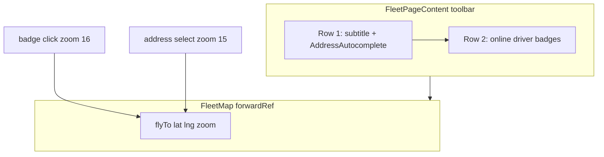

# Fleet page — driver badges, address search, layout

## Context

Per [docs/plans/fleet-ui-audit.md](docs/plans/fleet-ui-audit.md): subtitle lives in `PageContainer` today; online count is a single pill; `FleetMap` has no external control; `FleetPageContent` already holds full `drivers[]` from `useFleetMap()`.



---

## 1. Page shell — [`src/app/dashboard/fleet/page.tsx`](src/app/dashboard/fleet/page.tsx)

Remove `pageDescription` from `PageContainer`; keep `scrollable={false}` and `pageTitle='Flottenübersicht'`.

Subtitle text moves to client toolbar (Change 3).

---

## 2. Map imperative API — [`src/components/fleet/fleet-map.tsx`](src/components/fleet/fleet-map.tsx)

Add exported handle type:

```typescript
export interface FleetMapHandle {
  flyTo: (lat: number, lng: number, zoom?: number) => void;
}
```

Refactor default export to `forwardRef<FleetMapHandle, FleetMapProps>`:

- Import `forwardRef`, `useImperativeHandle`
- `useImperativeHandle(ref, () => ({ flyTo: (lat, lng, zoom = 15) => { mapRef.current?.flyTo([lat, lng], zoom, { animate: true, duration: 0.8 }) } }))`
- Set `displayName` on forwarded component (ESLint)

**Do not change:** marker loop, `createDriverIcon` colours, auto-`fitBounds` on online count change, Oldenburg fallback, popup HTML.

---

## 3. Fleet page content — [`src/features/fleet/components/fleet-page-content.tsx`](src/features/fleet/components/fleet-page-content.tsx)

### 3a. Ref + dynamic import

```typescript
import { useRef, useState } from 'react';
import type { FleetMapHandle } from '@/components/fleet/fleet-map';
import { AddressAutocomplete } from '@/features/trips/components/address-autocomplete';

const fleetMapRef = useRef<FleetMapHandle>(null);
const [searchValue, setSearchValue] = useState('');
```

Keep `dynamic(() => import('@/components/fleet/fleet-map'), { ssr: false, loading: … })`. Next.js **should** forward refs when the loaded default export is a `forwardRef` component — pass `ref={fleetMapRef}` to `<FleetMap />`. **Verify in smoke testing; do not assume.**

Import `FleetMapHandle` as a **type-only** import from [`fleet-map.tsx`](src/components/fleet/fleet-map.tsx) (not through dynamic).

#### Watch — dynamic import + forwardRef

`?.flyTo()` prevents crashes if the ref is null, but badge/search would **fail silently** (no pan). During smoke testing, temporarily log when `flyTo` is called with a null ref:

```typescript
if (!fleetMapRef.current) {
  console.warn('[FleetPage] fleetMapRef not ready — flyTo skipped');
  return;
}
fleetMapRef.current.flyTo(lat, lng, zoom);
```

Remove the `console.warn` before merge once ref forwarding is confirmed working.

**If `fleetMapRef.current` stays null after map mounts**, switch the dynamic loader to an explicit default export:

```typescript
const FleetMap = dynamic(
  () => import('@/components/fleet/fleet-map').then((mod) => mod.default),
  { ssr: false, loading: () => <Skeleton … /> }
);
```

Alternative fallback (if ref still broken): drop `dynamic()` and static-import `FleetMap` in this already-client component — Leaflet is client-only either way.

#### AddressAutocomplete `onChange`

Audit confirms typing emits `{ address: string }`, select emits full `AddressResult`. The `typeof val === 'string' ? val : val.address` guard is the correct defensive pattern (handles both shapes).

### 3b. Toolbar (replaces current single-row pill)

Outer wrapper: `flex flex-col gap-3` (replaces `gap-4` on toolbar section only; map area unchanged).

**Row 1** — subtitle + search:

```tsx
<div className='flex items-center justify-between gap-4'>
  <p className='text-muted-foreground shrink-0 text-sm'>
    Aktuelle Positionen Ihrer Fahrer (ca. 2 Sek. Aktualisierung).
  </p>
  <AddressAutocomplete … className='w-72' />
</div>
```

**`onChange` note:** `AddressAutocomplete` passes `{ address: string }` while typing, not a plain string. Use:

```typescript
onChange={(val) => {
  setSearchValue(typeof val === 'string' ? val : val.address);
}}
```

**`onSelectCallback`:**

```typescript
onSelectCallback={(result) => {
  if (result.lat != null && result.lng != null) {
    setSearchValue(result.address);
    fleetMapRef.current?.flyTo(result.lat, result.lng, 15);
  }
}}
```

Placeholder: `'Adresse auf Karte suchen...'`

**Row 2** — driver badges:

- `const onlineDrivers = drivers.filter((d) => d.is_online)`
- Empty: `"Keine Fahrer online"` (muted text)
- Else: map to `<button>` chips per spec (green = free, red = busy; dot + name)
- Click: `fleetMapRef.current?.flyTo(driver.lat, driver.lng, 16)`

Keep `{error && …}` — place at end of Row 1 or below toolbar (minimal: append to Row 1 `justify-between` row as today).

### 3c. Remove old aggregate badge

Delete `{onlineCount} Fahrer online` pill and remove unused `onlineCount` variable.

### Layout structure (final)

```tsx
<div className='flex min-h-0 flex-1 flex-col gap-4'>
  <div className='flex flex-col gap-3 px-1'>
    {/* Row 1 + Row 2 + optional error */}
  </div>
  <div className='min-h-0 flex-1'>
    {isLoading ? <Skeleton … /> : <FleetMap ref={fleetMapRef} drivers={drivers} />}
  </div>
</div>
```

---

## 4. Docs — [`docs/modules/driver-tracking.md`](docs/modules/driver-tracking.md)

- Add **Fleet map imperative API**: `FleetMapHandle.flyTo(lat, lng, zoom?)` — smooth pan, default zoom 15
- Update fleet page / architecture section:
  - Toolbar: subtitle + `AddressAutocomplete` + per-driver badges
  - Badge row: online only; green/red = free/busy; click zoom 16
  - Address select: zoom 15
  - Offline drivers: grey pins on map only, not in badge row
- Update code layout table entry for `fleet-page-content.tsx` and `fleet-map.tsx`

---

## 5. Verification

```bash
bun run build
```

Manual smoke:

1. Fleet page shows title only in header; subtitle in toolbar Row 1
2. Online drivers appear as green/red badges; offline absent from row
3. Badge click pans map to driver (zoom 16) — **confirm no `[FleetPage] fleetMapRef not ready` warn in console**
4. Address search selects → map flies to location (zoom 15) — same ref check
5. Auto-fitBounds on online count change still works
6. `fleetMapRef.current?.flyTo` safe when map still loading (Skeleton shown — ref null, no crash; warn acceptable only while loading)
7. If ref null **after** map visible: apply `.then(mod => mod.default)` dynamic loader or static import fallback

---

## Hard rules checklist

| Rule | How |
| --- | --- |
| Map behaviour unchanged | Only add forwardRef + useImperativeHandle |
| AddressAutocomplete barrel import | `@/features/trips/components/address-autocomplete` |
| Badge zoom 16 / address zoom 15 | As specified |
| No hook/constants/driver changes | Touch only files listed + docs |
| Build passes | `bun run build` |

## Files touched

| File | Change |
| --- | --- |
| [`fleet/page.tsx`](src/app/dashboard/fleet/page.tsx) | Remove `pageDescription` |
| [`fleet-map.tsx`](src/components/fleet/fleet-map.tsx) | `FleetMapHandle`, forwardRef |
| [`fleet-page-content.tsx`](src/features/fleet/components/fleet-page-content.tsx) | Toolbar, badges, search, ref |
| [`driver-tracking.md`](docs/modules/driver-tracking.md) | Architecture + flyTo docs |

No changes to [`use-fleet-map.ts`](src/lib/tracking/use-fleet-map.ts), [`constants.ts`](src/lib/tracking/constants.ts), or API routes.
