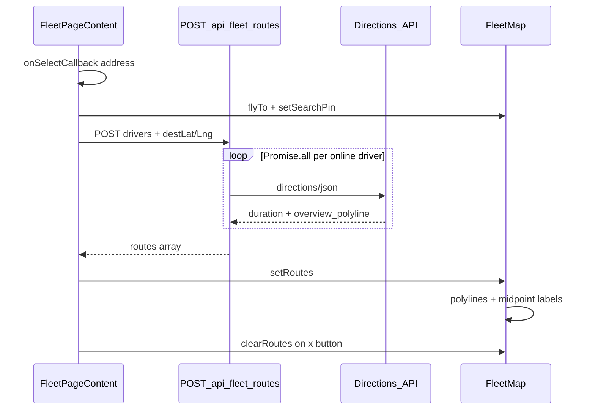

# Fleet map — driver routing lines + travel time

## Architecture



**Data source:** [`use-fleet-map.ts`](src/lib/tracking/use-fleet-map.ts) already exposes full `drivers[]` with `is_online`, `lat`, `lng`, `name`. No hook changes — [`fleet-page-content.tsx`](src/features/fleet/components/fleet-page-content.tsx) filters `drivers.filter(d => d.is_online)` at request time (busy and free both included).

**Key constraint:** Do not modify [`getDrivingMetrics`](src/lib/google-directions.ts) or [`resolveDrivingMetricsWithCache`](src/lib/google-directions.ts). Add parallel `getRoutePolyline` only.

---

## Step 1 — Extend [`src/lib/google-directions.ts`](src/lib/google-directions.ts)

Add exports:

```typescript
export interface RouteResult {
  durationSeconds: number;
  polylinePoints: Array<{ lat: number; lng: number }>;
}

export async function getRoutePolyline(...): Promise<RouteResult | null>
```

**Implementation details:**

- Private `decodePolyline(encoded: string)` — inline algorithm from spec (no new dependency).
- Extend internal `DirectionsRoute` type with `overview_polyline?: { points?: string }`.
- Duplicate the existing fetch URL construction from `getDrivingMetrics` (same endpoint, `GOOGLE_MAPS_API_KEY`, `mode=driving`, `units=metric`, `AbortSignal.timeout(15_000)`).
- Parse `routes[0].legs[0].duration.value` and `routes[0].overview_polyline.points`.
- Return `null` on missing key, HTTP error, `status !== 'OK'`, missing duration, or empty/missing polyline.
- Update file header comment to mention `getRoutePolyline` as fleet-map polyline entry point.

**Out of scope:** No DB cache for fleet polylines (spec does not request it; keeps diff minimal).

---

## Step 2 — New route [`src/app/api/fleet/routes/route.ts`](src/app/api/fleet/routes/route.ts)

Mirror [`src/app/api/trips/driving-metrics/route.ts`](src/app/api/trips/driving-metrics/route.ts):

| Concern | Pattern |
| --- | --- |
| Auth | `requireAdmin()` first line |
| Validation | Zod schema (add beyond spec for safety) |
| Dynamic | `export const dynamic = 'force-dynamic'` |
| Google call | Import `getRoutePolyline` only |

**Zod body schema:**

```typescript
{
  drivers: z.array(z.object({
    driver_id: z.string().min(1),
    name: z.string(),
    lat: z.number().finite().gte(-90).lte(90),
    lng: z.number().finite().gte(-180).lte(180),
  })).min(1).max(20),  // soft cap; typical fleet is single-digit
  destLat: z.number().finite().gte(-90).lte(90),
  destLng: z.number().finite().gte(-180).lte(180),
}
```

**Handler logic:** `Promise.all(drivers.map(...))` → `{ routes: results }` per spec. Per-driver Google failure yields `{ durationSeconds: null, polylinePoints: [] }` (partial success, not 500).

**Errors:** 401/403 from `requireAdmin`; 400 on invalid JSON/body; 500 `{ error: 'Internal Server Error' }` on unexpected catch.

---

## Step 3 — Extend [`src/components/fleet/fleet-map.tsx`](src/components/fleet/fleet-map.tsx)

### New exported type

```typescript
export interface DriverRoute {
  driver_id: string;
  name: string;
  durationSeconds: number | null;
  polylinePoints: Array<{ lat: number; lng: number }>;
}
```

### Extend `FleetMapHandle`

Add `setRoutes(routes: DriverRoute[])` and `clearRoutes()`.

### New ref + constants

- `routeLayersRef = useRef<Array<L.Polyline | L.Marker>>([])`
- `ROUTE_COLORS` array (6 colours from spec)

### `clearRoutes`

Remove all layers in `routeLayersRef`, reset array.

### `setRoutes`

1. Call clear internally first (no accumulation).
2. For each route, use **one early return per driver** when geometry is missing:

```typescript
routes.forEach((route, index) => {
  if (!route.polylinePoints.length) return  // skip entire driver — no polyline, no label

  const color = ROUTE_COLORS[index % ROUTE_COLORS.length]
  // draw polyline …
  // then, if durationSeconds != null, draw midpoint label …
})
```

**Important:** Do **not** split into separate guards (e.g. draw label when `durationSeconds` is set but polyline is empty). The API partial-failure shape `{ durationSeconds: null, polylinePoints: [] }` must produce **no map layers** for that driver. A label without a visible route would be misleading.

3. When polyline exists:
   - `L.polyline(..., { color, weight: 4, opacity: 0.75 })` → push to `routeLayersRef`.
   - If `durationSeconds != null`: midpoint label marker with `L.divIcon` pill HTML (nested inside the same branch, after polyline is drawn).
4. **Label text fix:** Spec template `${route.name.split(' ')}` stringifies an array — use **first name token**: `` `${route.name.split(' ')[0]} · ${minutes} Min.` ``.
5. **DivIcon anchor:** Use inner `transform: translate(-50%, -50%)` on the pill div + `iconAnchor: [0, 0]` so variable-width labels center on the midpoint (spec left `iconAnchor` blank).

### Cleanup

Map unmount `useEffect` return: also `routeLayersRef.current.forEach(layer => layer.remove())`.

**Unchanged:** Driver marker loop, search pin, auto-`fitBounds`, pin colours.

---

## Step 4 — Wire [`src/features/fleet/components/fleet-page-content.tsx`](src/features/fleet/components/fleet-page-content.tsx)

### State + fetch

- `isLoadingRoutes` state.
- `fetchAndDrawRoutes(destLat, destLng)` — filter online drivers, `POST /api/fleet/routes` with `credentials: 'include'`, on success `fleetMapRef.current?.setRoutes(data.routes)`.

### Integrate

| Trigger | Action |
| --- | --- |
| `onSelectCallback` | Existing flyTo + setSearchPin + **call `fetchAndDrawRoutes`** |
| Clear `×` button | Existing clearSearchPin + **`clearRoutes()`** |

### Loading UI

Below toolbar rows, above map:

```tsx
{isLoadingRoutes && (
  <span className='text-muted-foreground text-xs px-1'>
    Routen werden berechnet…
  </span>
)}
```

**Edge cases (minimal handling):**

- No online drivers → `fetchAndDrawRoutes` returns early (no API call).
- Stale response: if admin clears search before fetch completes, `clearRoutes` on × removes layers; optional guard `if (!searchValue) return` before `setRoutes` in fetch callback — low priority, not in spec.

---

## Step 5 — Docs [`docs/modules/driver-tracking.md`](docs/modules/driver-tracking.md)

Update **Fleet page UI** and **Fleet map imperative API** sections:

- Document `setRoutes` / `clearRoutes` on `FleetMapHandle`.
- Document `POST /api/fleet/routes` request/response shape.
- Note: routes computed for **all online drivers** (busy + free).
- Note: routes + search pin clear on × button; map view is **not** reset on clear.
- Update address-select action table: select → flyTo + search pin + route fetch.

---

## Files touched

| File | Change |
| --- | --- |
| [`src/lib/google-directions.ts`](src/lib/google-directions.ts) | `getRoutePolyline`, `decodePolyline`, `RouteResult` |
| [`src/app/api/fleet/routes/route.ts`](src/app/api/fleet/routes/route.ts) | **New** batch proxy |
| [`src/components/fleet/fleet-map.tsx`](src/components/fleet/fleet-map.tsx) | `DriverRoute`, route layers, handle methods |
| [`src/features/fleet/components/fleet-page-content.tsx`](src/features/fleet/components/fleet-page-content.tsx) | fetch, loading, clear wiring |
| [`docs/modules/driver-tracking.md`](docs/modules/driver-tracking.md) | Architecture docs |

**Not touched:** `use-fleet-map.ts`, `constants.ts`, `address-autocomplete.tsx`, driver-facing files.

---

## Verification

```bash
bun run build
```

Manual smoke on `/dashboard/fleet`:

1. Select address → indigo search pin + coloured polylines from each online driver + midpoint time labels.
2. Busy (red) and free (green) online drivers both get routes.
3. Press × → search field empty, pin gone, all polylines/labels gone; map position unchanged.
4. Re-select address → previous routes replaced (no stacking).
5. Network tab: `POST /api/fleet/routes` returns 401 when logged out; 200 with admin session.
6. **Partial failure:** If any driver in the response has `polylinePoints: []` (Google failure for that driver), confirm **no polyline and no time label** appears for that driver — other drivers with valid geometry still render normally.
