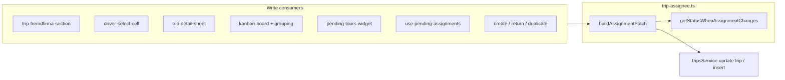

# Fremdfirma Assignment — Canonical Write Model (Option B)

## Context

Audits ([`fremdfirma-status-audit.md`](docs/plans/fremdfirma-status-audit.md), [`fremdfirma-callgraph-audit.md`](docs/plans/fremdfirma-callgraph-audit.md)) identified a write-path bug: Fremdfirma assign from `pending` never promotes `status` to `assigned`. Read-side assignee work already lives in [`trip-assignee.ts`](src/features/trips/lib/trip-assignee.ts); this plan adds the **write model** and removes the driver-only helper from [`trip-status.ts`](src/features/trips/lib/trip-status.ts).



## Scope

**In scope:** canonical write helpers, migrate **all** `getStatusWhenDriverChanges` call sites (11 files + definition), dispatch inbox via `buildAssignmentPatch`, SQL backfill migration, unit tests, docs.

**Out of scope:** Controlling RPC SQL, create-trip/CSV Fremdfirma product support, driver portal, terminal status flows.

## Critical gap in original step list (addressed here)

`getStatusWhenDriverChanges` appears in **10 call sites** across **9 consumer files** (plus its definition). Steps 3–7 only listed 6 UI update paths. **Step 8** below migrates the remaining insert builders so hard rule #1 (“zero references”) is satisfied:

| File | Calls | Migration approach |
|------|-------|-------------------|
| [`create-trip-form.tsx`](src/features/trips/components/create-trip/create-trip-form.tsx) | 3 | `buildAssignmentPatch({ status:'pending', driver_id:null, fremdfirma_id:null }, { driver_id })` → spread `status`, `driver_id`, `needs_driver_assignment` into insert |
| [`build-return-trip-insert.ts`](src/features/trips/lib/build-return-trip-insert.ts) | 1 | Same pattern with `params.driverId` |
| [`duplicate-trips.ts`](src/features/trips/lib/duplicate-trips.ts) | 1 | Same with `{ driver_id: null }` → defaults `pending` |

No Fremdfirma fields added to these flows — only helper swap.

---

## Step 1 — Write model in [`trip-assignee.ts`](src/features/trips/lib/trip-assignee.ts)

Add without modifying existing exports:

**Type**
```ts
export type AssignmentPatchInput = {
  driver_id?: string | null;
  fremdfirma_id?: string | null;
  fremdfirma_payment_mode?: string | null;
  fremdfirma_cost?: number | null;
};
```

Import `Trip` from [`trips.service.ts`](src/features/trips/api/trips.service.ts) for `buildAssignmentPatch` signature.

**Constants** (hard rule #5 — status strings live here only for write logic):
```ts
const TERMINAL_STATUSES = new Set(['in_progress','driving','completed','cancelled','scheduled']);
const ADMIN_OPEN = 'pending';
const ADMIN_ASSIGNED = 'assigned';
```

**`getStatusWhenAssignmentChanges(currentStatus, next)`**

- Return `undefined` immediately if `currentStatus` is terminal.
- Resolve effective `{ driver_id, fremdfirma_id }` by merging `next` over `current` (treat omitted keys as “unchanged”).
- Implement matrix from spec:
  - `pending` + (driver set OR fremdfirma set) → `'assigned'`
  - `pending` + both null → `undefined`
  - `assigned` + both null → `'pending'`
  - `assigned` + driver set OR fremdfirma set → `undefined`
- Inline comment: terminal guard prevents Kanban/detail saves from downgrading in-progress trips.

**`buildAssignmentPatch(current, next)`**

1. Merge `next` into resolved assignee state.
2. **Mutual exclusion** (comment: enforced once here so call sites cannot forget):
   - `fremdfirma_id` set → force `driver_id: null`, `needs_driver_assignment: false`
   - `driver_id` set (and no fremdfirma) → clear `fremdfirma_id`, `fremdfirma_payment_mode`, `fremdfirma_cost`, `needs_driver_assignment: false`
   - both null → `needs_driver_assignment: true`
3. Call `getStatusWhenAssignmentChanges`; include `status` only when non-undefined.
4. Spread Fremdfirma billing fields from `next` when provided.

**Tests:** add [`src/features/trips/lib/__tests__/trip-assignee-write.test.ts`](src/features/trips/lib/__tests__/trip-assignee-write.test.ts) covering matrix rows + mutual exclusion + terminal guard.

**Gate:** `bun run build` passes; no other files touched.

---

## Step 2 — Delete helper from [`trip-status.ts`](src/features/trips/lib/trip-status.ts)

- Remove `getStatusWhenDriverChanges` and the `isTripUnassignedForDispatch` import from this file (that import exists only to support the deleted function).
- **`isTripUnassignedForDispatch` remains in [`trip-assignee.ts`](src/features/trips/lib/trip-assignee.ts) and is not deleted** — only its import into `trip-status.ts` is removed. It continues to be used directly by [`pending-tours-widget.tsx`](src/features/dashboard/components/pending-tours-widget.tsx) for the `ohne Fahrer` count.
- Add file header comment: `// Assignment-to-status derivation lives in trip-assignee.ts`
- Leave `TripStatus`, `tripStatusLabels`, `tripStatusBadge`, `tripStatusRow` untouched.

**Expected:** build fails at all consumer imports — record error list in commit message / plan notes, then proceed.

---

## Step 3 — [`trip-fremdfirma-section.tsx`](src/features/fremdfirmen/components/trip-fremdfirma-section.tsx)

- Delete `applyFremdfirmaPayload`.
- Assign: `buildAssignmentPatch(trip, { fremdfirma_id, fremdfirma_payment_mode, fremdfirma_cost })`
- Remove: `buildAssignmentPatch(trip, { fremdfirma_id: null, fremdfirma_payment_mode: null, fremdfirma_cost: null })`
- `persist()` unchanged except patch source.

**Gate:** build passes.

---

## Step 4 — [`driver-select-cell.tsx`](src/features/trips/components/trips-tables/driver-select-cell.tsx)

- Replace manual payload + `getStatusWhenDriverChanges` with:
  ```ts
  const patch = buildAssignmentPatch(trip, { driver_id: newDriverId });
  ```
- Spread into Supabase `.update()`. Fremdfirma branch (badge only) unchanged.

**Gate:** build passes.

---

## Step 5 — [`trip-detail-sheet.tsx`](src/features/trips/trip-detail-sheet/trip-detail-sheet.tsx)

- Same as Step 4 in `handleDriverChange` → `tripsService.updateTrip`.
- Keep `disabled={!!trip.fremdfirma_id}` on Fahrer select.

**Gate:** build passes.

---

## Step 6 — Kanban: [`kanban-board.tsx`](src/features/trips/components/kanban/kanban-board.tsx) + [`kanban-grouping.ts`](src/features/trips/lib/kanban-grouping.ts)

**`kanban-board.tsx` `handleSave` — assignment patch guard (no silent driver clear):**

- **Only call `buildAssignmentPatch` when `change.driver_id !== undefined`.** If `driver_id` is not in the staged change object, do not call `buildAssignmentPatch` at all — leave `driver_id`, `status`, and `needs_driver_assignment` out of the payload entirely.
- Rationale: `buildAssignmentPatch` always resolves and writes assignee fields. Calling it for a time-only or payer-only staged change would merge `current` state and could emit `driver_id: null`, silently clearing an existing driver.
- When `change.driver_id !== undefined`:
  ```ts
  const assignmentPatch = buildAssignmentPatch(trip, { driver_id: change.driver_id });
  Object.assign(payload, assignmentPatch);
  ```
- Then apply non-assignment staged fields separately (`payer_id`, `scheduled_at`, `group_id`, `stop_order`). Prefer staged `change.status` when already set by drag-end staging; otherwise use `assignmentPatch.status` if present.
- Keep Fremdfirma exclusion upstream unchanged.

**`kanban-grouping.ts` `deriveStatusForPending`:** replace with:
```ts
getStatusWhenAssignmentChanges(currentStatus, {
  driver_id: newDriverId ?? serverTrip?.driver_id ?? null,
  fremdfirma_id: serverTrip?.fremdfirma_id ?? null,
})
```
Return `?? currentStatus` as today.

**Gate:** build passes.

---

## Step 7 — [`pending-tours-widget.tsx`](src/features/dashboard/components/pending-tours-widget.tsx)

In `handleSetTime`, replace status derivation with:
```ts
const assignmentPatch = buildAssignmentPatch(trip, { driver_id: driverId });
Object.assign(updatePayload, assignmentPatch);
```
Keep `isTripUnassignedForDispatch` count logic unchanged.

**Gate:** build passes.

---

## Step 8 — Insert builders (remaining `getStatusWhenDriverChanges` sites)

Minimal swap — no Fremdfirma on create/duplicate/return:

```ts
const INITIAL = { status: 'pending' as const, driver_id: null, fremdfirma_id: null };
const { status, driver_id, needs_driver_assignment } = buildAssignmentPatch(INITIAL, { driver_id: driverId ?? null });
```

Apply in:
- [`create-trip-form.tsx`](src/features/trips/components/create-trip/create-trip-form.tsx) (3 sites)
- [`build-return-trip-insert.ts`](src/features/trips/lib/build-return-trip-insert.ts)
- [`duplicate-trips.ts`](src/features/trips/lib/duplicate-trips.ts)

**Gate:** build passes; `rg getStatusWhenDriverChanges` returns zero hits.

---

## Step 9 — [`use-pending-assignments.ts`](src/features/trips/components/pending-assignments/use-pending-assignments.ts)

Per user confirmation:

1. Extend `TRIP_FIELDS` to include `driver_id, fremdfirma_id` (already has `status` + Fremdfirma join).
2. Extend `DispatchTrip` / `toTrip` to carry `status`, `driver_id`, `fremdfirma_id` for `buildAssignmentPatch` input.
3. In `handleAssign`, when `driverId` is set, replace:
   ```ts
   updates.driver_id = driverId;
   updates.needs_driver_assignment = false;
   ```
   with:
   ```ts
   Object.assign(updates, buildAssignmentPatch(trip, { driver_id: driverId }));
   ```
   (`trip` must be the full row with status/FKs — use raw query row before `toTrip` mapping or store on `DispatchTrip`.)

Time-only updates (no driver) remain unchanged — no assignment patch.

**Gate:** build passes.

---

## Step 10 — Migration

Create [`supabase/migrations/20260619120000_fix_fremdfirma_status.sql`](supabase/migrations/20260619120000_fix_fremdfirma_status.sql):

```sql
UPDATE trips
SET status = 'assigned'
WHERE fremdfirma_id IS NOT NULL
  AND status IN ('pending', 'open')
  AND driver_id IS NULL;
```

- Apply via Supabase MCP `apply_migration` (not ad-hoc SQL).
- Verify post-count query returns **0** rows with `fremdfirma_id IS NOT NULL AND status IN ('pending','open')`.

**Gate:** `bun run build` + `bun test` pass.

---

## Step 11 — Manual smoke-check (list findings only)

1. Fremdfirma assign on `Offen` trip → badge **Zugewiesen**
2. Remove Fremdfirma (no driver) → **Offen**
3. Assign internal driver on `Offen` → **Zugewiesen**
4. Remove driver (no Fremdfirma) → **Offen**
5. `/fahrten` filter **Zugewiesen** includes Fremdfirma trips (post-migration)
6. Kanban drag to driver column → DB `assigned`
7. Pending tours widget time + driver → DB `assigned`
8. Dispatch inbox assign driver → DB `assigned` + `needs_driver_assignment: false`

Do not fix failures in this step — document only.

---

## Step 12 — Docs (mandatory)

1. **Update** [`docs/features/trips/trip-assignee.md`](docs/features/trips/trip-assignee.md) (existing path; do not duplicate at `docs/trips/`):
   - Write model section: `AssignmentPatchInput`, `getStatusWhenAssignmentChanges`, `buildAssignmentPatch`
   - Full status transition table
   - DB invariants (mutual exclusion, `needs_driver_assignment`, status vs assignee)
   - **Consumer list** including all write paths:

   | Consumer | API used |
   |----------|----------|
   | `trip-fremdfirma-section.tsx` | `buildAssignmentPatch` |
   | `driver-select-cell.tsx` | `buildAssignmentPatch` |
   | `trip-detail-sheet.tsx` | `buildAssignmentPatch` |
   | `kanban-board.tsx` | `buildAssignmentPatch` |
   | `kanban-grouping.ts` | `getStatusWhenAssignmentChanges` |
   | `pending-tours-widget.tsx` | `buildAssignmentPatch` |
   | `use-pending-assignments.ts` | `buildAssignmentPatch` |
   | `create-trip-form.tsx` | `buildAssignmentPatch` (insert) |
   | `build-return-trip-insert.ts` | `buildAssignmentPatch` (insert) |
   | `duplicate-trips.ts` | `buildAssignmentPatch` (insert) |
   | Read/filter surfaces | `resolveTripAssignee`, `parseAssigneeParam`, etc. |

   - Note: `getStatusWhenDriverChanges` removed; display labels remain in [`trip-status.ts`](src/lib/trip-status.ts)

2. Create [`docs/plans/fremdfirma-assignment-canonical.md`](docs/plans/fremdfirma-assignment-canonical.md) — status table marked complete with date.

3. Inline “why” comments on terminal guard, mutual exclusion in `buildAssignmentPatch`, migration `driver_id IS NULL` predicate, and the Kanban `change.driver_id !== undefined` guard (why assignment patch is skipped for non-driver saves).

---

## Hard rules checklist

- Zero `getStatusWhenDriverChanges` after Step 8
- All status derivation via `getStatusWhenAssignmentChanges` inside `buildAssignmentPatch` (Kanban staging may call `getStatusWhenAssignmentChanges` directly in `deriveStatusForPending`)
- Terminal statuses never modified by write helpers
- [`src/lib/trip-status.ts`](src/lib/trip-status.ts) display-only
- Build gate after every step
- UI visually unchanged

## Deferred

| Item | Reason |
|------|--------|
| Controlling `unassigned_trips` double-count | SQL RPC, separate plan |
| Fremdfirma in create-trip / CSV | Product scope |
| `resolveTripDisplayStatus` | Unnecessary once writes fixed |
