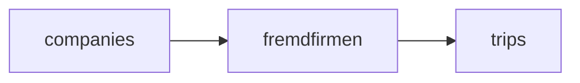

# Fremdfirma modality (MVP)

## Why SQL + comments

Yes—you **should** ship a migration with `**COMMENT ON TABLE` / `COMMENT ON COLUMN`**. The repo already uses this pattern (e.g. `[supabase/migrations/20260326120000_billing_families_and_variants.sql](supabase/migrations/20260326120000_billing_families_and_variants.sql)`, `[supabase/migrations/20260330120000_trips_billing_calling_station_betreuer.sql](supabase/migrations/20260330120000_trips_billing_calling_station_betreuer.sql)`). It keeps Supabase Studio self-documenting and matches how billing behavior is explained in German domain terms.

---

## Data model

- `**fremdfirmen**` (mirror `[payers](src/types/database.types.ts)` shape): `id`, `company_id` → `companies`, `name`, optional `number`/`sort_order`, `is_active`, `created_at`, `**settlement_mode**` `text` with `CHECK (settlement_mode IN ('per_trip','monthly'))` default `'per_trip'` (supports your future reconciliation; no extra UI required in v1 beyond optional display or edit).
- `**trips.fremdfirma_id**` `uuid` `REFERENCES fremdfirmen(id) ON DELETE SET NULL`, index `(company_id, fremdfirma_id)` where useful for reporting (partial index optional).

**Semantics:** A trip is “Fremdfirma” when `fremdfirma_id IS NOT NULL`. **Kostenträger / billing** stays unchanged (out of scope except preserving fields).

**Driver field:** You asked for **driver = Fremd** without necessarily creating a fake login. Recommended MVP approach:

1. **Do not** require a sentinel `accounts` row in v1 (avoids `auth.users` coupling).
2. When Fremdfirma is active, set `**driver_id` to `null`** and rely on `**fremdfirma_id`** as the execution source of truth.
3. **Extend** `[getStatusWhenDriverChanges](src/features/trips/lib/trip-status.ts)` (or add a thin wrapper used only from the detail sheet / Fremdfirma updates) so that **unassigning the internal driver does not force `assigned → pending` when `fremdfirma_id` is set**—treat “extern zugewiesen” as assigned for workflow purposes. Document this in code comments (this is the subtlest part of the feature).

Optional **phase 1b** (if you later need literal `driver_id` for every report): add `companies.fremd_placeholder_driver_id` → `accounts` and set it once per company via admin UI; when toggling Fremdfirma on, set `driver_id` to that UUID. Not required for a coherent MVP if status logic + list display are fixed.

---

## SQL migration file (deliverables)

Single new migration, e.g. `supabase/migrations/YYYYMMDD000000_fremdfirmen_and_trips_fremdfirma_id.sql`, containing:

- `CREATE TABLE public.fremdfirmen (...)` with constraints and `**COMMENT ON`** for table and columns (DE/EN short, same tone as billing migrations).
- `ALTER TABLE public.trips ADD COLUMN fremdfirma_id ...`; index; `**COMMENT ON COLUMN`**.
- **RLS**: enable RLS on `fremdfirmen`; policies scoped by `**company_id = current_user_company_id()`** (same helper as in `[supabase/migrations/20260318100000_add_users_driver_profiles_rls.sql](supabase/migrations/20260318100000_add_users_driver_profiles_rls.sql)`) for `SELECT/INSERT/UPDATE/DELETE` as appropriate for **admin** users—align with how `payers` are secured in your deployed project (if payers policies live only remotely, document “apply same pattern” in the feature doc).
- **GRANT**s consistent with `[billing_variants` migration](supabase/migrations/20260326120000_billing_families_and_variants.sql).

After applying: regenerate `[src/types/database.types.ts](src/types/database.types.ts)` via your usual Supabase codegen command.

---

## App architecture (maintainability)

| Area                                         | Location                                                                                                                                                                                                                            |
| -------------------------------------------- | ----------------------------------------------------------------------------------------------------------------------------------------------------------------------------------------------------------------------------------- |
| Feature module (vendor CRUD + hooks + types) | `**src/features/fremdfirmen/`** (parallel to `[src/features/payers/](src/features/payers/)`)                                                                                                                                        |
| Trip UI only                                 | `**src/features/fremdfirmen/components/trip-fremdfirma-section.tsx`** (or under `trip-detail-sheet/components/`) imported by `[trip-detail-sheet.tsx](src/features/trips/trip-detail-sheet/trip-detail-sheet.tsx)`                  |
| Status / assignment rules                    | `[src/features/trips/lib/trip-status.ts](src/features/trips/lib/trip-status.ts)` (+ call sites if signature changes)                                                                                                                |
| Trip fetch / patch                           | `[src/features/trips/api/trips.service.ts](src/features/trips/api/trips.service.ts)` (`getTripById` select adds `fremdfirma:fremdfirmen(*)`)                                                                                        |
| Reference data                               | Extend `[src/features/trips/api/trip-reference-data.ts](src/features/trips/api/trip-reference-data.ts)` + `[use-trip-reference-queries.ts](src/features/trips/hooks/use-trip-reference-queries.ts)` with `fetchActiveFremdfirmen()` |

**Service layer:** `FremdfirmenService` in `src/features/fremdfirmen/api/fremdfirmen.service.ts` mirroring `PayersService` patterns (`createClient`, `toQueryError`, `company_id` from same source as payers page—reuse existing org/company resolution used when creating payers).

**Navigation:** New item under Account next to Kostenträger in `[src/config/nav-config.ts](src/config/nav-config.ts)`; route `**src/app/dashboard/fremdfirmen/page.tsx`** rendering a list + add/edit dialog (reuse shadcn patterns from payers).

**Query keys:** If the project uses a central query key factory for trips/payers, add keys for `fremdfirmen` list (see `[src/query/README.md](src/query/README.md)`).

---

## Trip detail sheet behavior (UX contract)

Implement next to the existing **Fahrer** block in `[trip-detail-sheet.tsx](src/features/trips/trip-detail-sheet/trip-detail-sheet.tsx)` (~lines 1205–1238):

- **Switch** “Fremdfirma”: when **on**, show **required** `Select` of active `fremdfirmen` for the company; when **off**, clear `fremdfirma_id` and restore driver handling to normal.
- **Driver control:** When `fremdfirma_id` is set: show driver as **read-only label** e.g. “Extern (Fremdfirma)” + vendor name; **disable** the driver `Select` (per your spec). When turning **off**, re-enable driver select.
- **Save path:** Single `updateTrip` payload including `fremdfirma_id`, `driver_id` (null when external), `needs_driver_assignment` (set **false** when external, similar to `[duplicate-trips.ts](src/features/trips/lib/duplicate-trips.ts)`), and **status** via updated helper so Fremdfirma assignment does not incorrectly revert to `pending`.
- **Recurring trips:** Wrap updates in existing `**runWithRecurringScope`** like `handleDriverChange` so series edits stay consistent.

**Linked Hin/Rück:** No automatic copy of `fremdfirma_id` from partner leg (aligned with [trips-rueckfahrt-detail-sheet.md](docs/trips-rueckfahrt-detail-sheet.md): schedule/driver are leg-specific).

---

## Trips list / table (minimal “production ready”)

Kanban explicitly **out of scope**, but the **table** currently shows driver via `driver_id` (`[trips-listing.tsx](src/features/trips/components/trips-listing.tsx)`, `[columns.tsx](src/features/trips/components/trips-tables/columns.tsx)`). Add:

- Join `fremdfirma:fremdfirmen(name)` in the listing query when feasible.
- Display rule: if `fremdfirma_id` present, show **“Extern · {name}”** (or similar) instead of empty driver.
- Optional filter `**fremdfirma_id` or `external=1`** in `[trips-filters-bar.tsx](src/features/trips/components/trips-filters-bar.tsx)` / URL params—small scope, high value for “all outsourced trips.”

---

## Documentation

- `**docs/fremdfirma.md`**: Problem, data model, UX rules, Hin/Rück independence, what is **not** in v1 (Barzahler, Kanban, inbound Fremd invoices, margin dashboard), and **how to extend** settlement modes.
- `**src/features/fremdfirmen/README.md`**: Short pointer to the doc + folder map (same pattern as `[src/features/trips/trip-reschedule/README.md](src/features/trips/trip-reschedule/README.md)`).

**Inline comments:** Keep to **non-obvious** spots: `trip-status` extension, recurring save, and one block in the trip section explaining the driver-disabled rule.

---

## Out of scope (explicit)

- Barzahler / cash behavior.
- Kanban badges/columns.
- Fremdfirma inbound invoice upload / monthly bundle allocation.
- Changing invoice PDF generation (you said internal-only for subcontractor naming).

---

## Duplicate / bulk / create-trip follow-ups (defer or light touch)

- **Duplicate trips:** Clear `fremdfirma_id` when clearing `driver_id` (consistent with manual reassignment).
- **Bulk upload / create-trip form:** No change in v1 unless you want parity; otherwise document “set in detail sheet only” in `docs/fremdfirma.md`.

