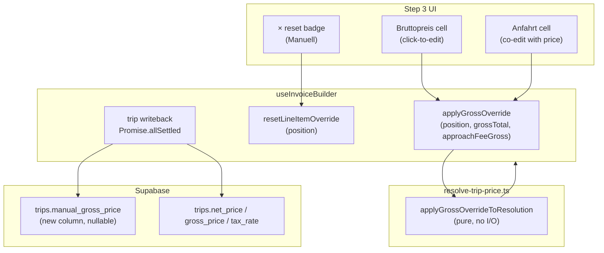

# Invoice Inline Price Override — Gross-First, Step 3

## Architecture overview



---

## Key formula correction (per-km strategies)

The spec's `applyGrossOverrideToResolution` has one formula that must be adjusted. `unit_price_net` in `PriceResolution` is **per-unit** (net per km for tiered strategies). Dividing by `quantity` is required so that `insertLineItems`' existing formula `(unit_price × quantity + approach_fee_net) × (1 + tax_rate)` yields exactly `grossTotal`:

```
unit_price_net = (grossTotal - approachFeeGross) / (1 + taxRate) / quantity
net            = (grossTotal - approachFeeGross) / (1 + taxRate)   // total transport net
approach_fee_net = approachFeeGross / (1 + taxRate)
gross          = grossTotal                                         // preserve exactly
```

For quantity = 1 (all flat-price strategies) the division by quantity is a no-op.

---

## Step 1 — DB migration

**New file:** `supabase/migrations/[timestamp]_add_trip_manual_gross_price.sql`

```sql
ALTER TABLE public.trips
  ADD COLUMN IF NOT EXISTS manual_gross_price numeric(12, 4) DEFAULT NULL;

COMMENT ON COLUMN public.trips.manual_gross_price IS
  'Admin-set gross override price (taxameter amount) set during invoice creation.
   Null = use normal rule-based pricing. P0.5 priority in resolveTripPrice deferred.';
```

No existing data touched. Build gate: `bun run build` before Step 2.

---

## Step 2 — Type updates

### [`src/types/database.types.ts`](src/types/database.types.ts)

Add `manual_gross_price: number | null` to `trips.Row`, `trips.Insert`, `trips.Update`.

### [`src/features/invoices/types/invoice.types.ts`](src/features/invoices/types/invoice.types.ts)

Extend `BuilderLineItem` with five new fields (all optional/nullable — no existing code breaks):

```typescript
/** Gross representation of approach_fee_net × (1 + tax_rate); pre-computed at build time. */
approach_fee_gross: number | null;
/** Snapshot of the engine-computed resolution before any admin override; used for reset. */
originalPriceResolution: PriceResolution;
/** Admin-entered gross total (transport + Anfahrt). null = not overridden. */
manualGrossTotal: number | null;
/** Admin-entered Anfahrtskosten gross. null = not overridden. */
manualApproachFeeGross: number | null;
/** true when admin has committed a gross override via applyGrossOverride. */
isManualOverride: boolean;
```

Build gate: `bun run build` before Step 3.

---

## Step 3 — Engine helper

### [`src/features/invoices/lib/resolve-trip-price.ts`](src/features/invoices/lib/resolve-trip-price.ts)

Add after the existing exports (no changes to `resolveTripPrice` cascade):

```typescript
/**
 * Back-calculates unit_price_net and approach_fee_net from admin-entered gross values.
 * approach_fee_gross is INCLUDED in grossTotal (not additive).
 *
 * For per-km strategies (quantity > 1), unit_price_net is per-km so that the
 * existing insertLineItems formula (unit_price × quantity + approach_fee_net) × (1+r)
 * yields exactly grossTotal — no rounding drift.
 */
export function applyGrossOverrideToResolution(
  base: PriceResolution,
  grossTotal: number,
  approachFeeGross: number,
  taxRate: number
): PriceResolution {
  const qty = base.quantity;
  const approachFeeNet = approachFeeGross / (1 + taxRate);
  const transportNet   = (grossTotal - approachFeeGross) / (1 + taxRate);
  const unitPriceNet   = qty > 1 ? transportNet / qty : transportNet;
  const prevNote = base.note;
  const overrideNote = 'Manuell überschrieben (Bruttoeingabe)';
  const note = prevNote && !prevNote.includes(overrideNote)
    ? `${prevNote} · ${overrideNote}`
    : overrideNote;
  return {
    ...base,
    unit_price_net: unitPriceNet,
    net: transportNet,
    gross: grossTotal,          // preserve exactly — no rounding
    tax_rate: taxRate,
    approach_fee_net: approachFeeNet,
    strategy_used: 'manual_trip_price',
    note
  };
}
```

Build gate: `bun run build` + `bun test` before Step 4.

---

## Step 4 — Hook

### [`src/features/invoices/api/invoice-line-items.api.ts`](src/features/invoices/api/invoice-line-items.api.ts)

In `buildLineItemsFromTrips`, add initialization of new fields to each raw item:

```typescript
approach_fee_gross:
  priceResolution.approach_fee_net != null
    ? Math.round(priceResolution.approach_fee_net * (1 + taxRate) * 100) / 100
    : null,
originalPriceResolution: priceResolution,
manualGrossTotal: null,
manualApproachFeeGross: null,
isManualOverride: false,
```

No changes to `insertLineItems` or `calculateInvoiceTotals` — existing formulas produce the correct `total_price` with the corrected `unit_price_net`.

### [`src/features/invoices/hooks/use-invoice-builder.ts`](src/features/invoices/hooks/use-invoice-builder.ts)

**4a. Replace `updateLineItemPrice`** (remove) **with `applyGrossOverride`:**

```typescript
const applyGrossOverride = useCallback(
  (position: number, grossTotal: number, approachFeeGross: number) => {
    setLineItems((prev) =>
      prev.map((item) => {
        if (item.position !== position) return item;
        const nextRes = applyGrossOverrideToResolution(
          item.price_resolution,
          grossTotal,
          approachFeeGross,
          item.tax_rate
        );
        const patched: BuilderLineItem = {
          ...item,
          unit_price: nextRes.unit_price_net,
          approach_fee_net: nextRes.approach_fee_net ?? null,
          approach_fee_gross: approachFeeGross,
          price_resolution: nextRes,
          kts_override: false,
          price_source: null,
          manualGrossTotal: grossTotal,
          manualApproachFeeGross: approachFeeGross,
          isManualOverride: true
        };
        return { ...patched, warnings: validateLineItem(patched) };
      })
    );
  },
  []
);
```

> **Note — `approach_fee_net = 0` vs `null` in frozen snapshot:** When the admin sets `approachFeeGross = 0`, `applyGrossOverrideToResolution` returns `approach_fee_net = 0 / (1 + taxRate) = 0` (a valid number, not `null`). If the original trip had a non-zero approach fee, the frozen `PriceResolution` will therefore contain `approach_fee_net: 0` rather than the original positive value. This is intentional and safe:
>
> - `insertLineItems` computes `total_price` using `(approach_fee_net ?? 0)` — `0` and `null` produce identical results.
> - `frozenPriceResolutionForInsert` compares `pr.unit_price_net` vs `item.unit_price` — `approach_fee_net` is not part of this guard.
> - The admin explicitly set the approach fee to zero; zeroing it in the snapshot correctly reflects their intent.
>
> Do not change `approach_fee_net` from `0` to `null` in the patch. Leave it as `0`.

**4b. Add `resetLineItemOverride`:**

```typescript
const resetLineItemOverride = useCallback(
  (position: number) => {
    setLineItems((prev) =>
      prev.map((item) => {
        if (item.position !== position) return item;
        const orig = item.originalPriceResolution;
        const patched: BuilderLineItem = {
          ...item,
          unit_price: orig.unit_price_net,
          approach_fee_net: orig.approach_fee_net ?? null,
          approach_fee_gross:
            orig.approach_fee_net != null
              ? Math.round(orig.approach_fee_net * (1 + item.tax_rate) * 100) / 100
              : null,
          price_resolution: orig,
          kts_override: orig.strategy_used === 'kts_override',
          price_source: legacyPriceSourceFromResolution(orig.source),
          manualGrossTotal: null,
          manualApproachFeeGross: null,
          isManualOverride: false
        };
        return { ...patched, warnings: validateLineItem(patched) };
      })
    );
  },
  []
);
```

**4c. Trip writeback in `createMutation` `mutationFn` (after `await insertLineItems`):**

```typescript
// Fire-and-forget: failed writeback must never block the invoice.
// net_price = total transport net (not per-km unit); gross_price = total gross incl. Anfahrt.
void Promise.allSettled(
  lineItems
    .filter((item) => item.trip_id !== null)
    .map((item) =>
      tripsService.updateTrip(item.trip_id!, {
        net_price:   item.price_resolution.net,  // total transport net
        gross_price: item.manualGrossTotal ?? item.price_resolution.gross,
        tax_rate:    item.tax_rate,
        ...(item.isManualOverride && item.manualGrossTotal !== null
          ? { manual_gross_price: item.manualGrossTotal }
          : {})
      })
    )
);
```

`shouldRecalculatePrice` does NOT include `net_price`, `gross_price`, `tax_rate`, or `manual_gross_price` in `PRICING_RELEVANT_FIELDS`, so the engine does NOT re-run on these writes — no unintended side effects.

**Return from hook:** replace `updateLineItemPrice` with `applyGrossOverride`, add `resetLineItemOverride`.

Build gate: `bun run build` before Step 5.

---

## Step 5 — UI

### [`src/features/invoices/components/invoice-builder/index.tsx`](src/features/invoices/components/invoice-builder/index.tsx)

- Destructure `applyGrossOverride` and `resetLineItemOverride` from `useInvoiceBuilder`.
- Replace `onUpdatePrice={updateLineItemPrice}` with `onApplyGrossOverride={applyGrossOverride}` and `onResetOverride={resetLineItemOverride}` on `<Step3LineItems>`.

### [`src/features/invoices/lib/line-item-net-display.ts`](src/features/invoices/lib/line-item-net-display.ts)

Add one new export (keep existing exports for backward compat):

```typescript
/**
 * Total gross for display in the Bruttopreis column.
 * For admin overrides: returns exactly what the admin typed (manualGrossTotal).
 * For engine-priced items: returns pr.gross directly — the engine already
 * includes approach_fee_net in the gross total, so no addition is needed.
 */
export function lineItemGrossTotalForDisplay(item: BuilderLineItem): number | null {
  if (item.manualGrossTotal !== null && item.manualGrossTotal !== undefined)
    return item.manualGrossTotal;
  return item.price_resolution.gross ?? null;
}
```

### [`src/features/invoices/components/invoice-builder/step-3-line-items.tsx`](src/features/invoices/components/invoice-builder/step-3-line-items.tsx)

**Props interface change:**

```typescript
interface Step3LineItemsProps {
  // ...existing fields...
  onApplyGrossOverride: (position: number, grossTotal: number, approachFeeGross: number) => void;
  onResetOverride: (position: number) => void;
  // remove: onUpdatePrice
}
```

**Local state:**

```typescript
type EditingState = { position: number; grossValue: string; approachValue: string } | null;
const [editing, setEditing] = useState<EditingState>(null);
```

**`startEdit`**: pre-fills both inputs from `lineItemGrossTotalForDisplay` and `item.approach_fee_gross ?? (item.approach_fee_net ?? 0) × (1 + item.tax_rate)`.

> **Null pre-fill rule:** `lineItemGrossTotalForDisplay` returns `null` for trips that land on P4 (`no_price` / `missing_price`) because `pr.gross` is `null` for unresolved lines. When `lineItemGrossTotalForDisplay` returns `null`, `startEdit` must pre-fill `grossValue` with `''` (empty string) — never `'0'` or `'null'`. An empty string forces the admin to consciously type a value. Pre-filling `'0'` would allow the admin to accidentally commit a zero-price line item by pressing Enter without noticing. The same applies to `approachValue` when `item.approach_fee_gross` is `null` — pre-fill with `''`.
>
> Concretely:
> ```typescript
> grossValue:    lineItemGrossTotalForDisplay(item)?.toString() ?? '',
> approachValue: (item.approach_fee_gross ?? '').toString(),
> ```

**`commitEdit`**: parses both strings, calls `onApplyGrossOverride(position, gross, approach)`.

**Table columns (reordered):** Trip info → Strategy badge → **Bruttopreis** → **Anfahrt (brutto)** → MwSt% → Warnings

**Default row (not editing):**
- Bruttopreis cell: shows `lineItemGrossTotalForDisplay(item)` formatted as EUR; hover shows `Pencil` icon. Cursor pointer. When `item.isManualOverride = true`, badge shows amber `Manuell` with a `×` icon button (`aria-label="Preis zurücksetzen"`) that calls `onResetOverride(position)`.
- Anfahrt cell: shows `item.approach_fee_gross` as EUR (muted if zero, `—` if null).

**Edit row (admin clicks Bruttopreis cell):**
- Both Bruttopreis and Anfahrt cells replaced simultaneously:
  - Bruttopreis: `<Input autoFocus type="number" step="0.01" min="0">` (pre-filled with total gross)
  - Anfahrt: `<Input type="number" step="0.01" min="0">` (pre-filled with approach fee gross)
  - Live derived net displayed below both inputs in `text-muted-foreground text-xs`: `Netto: {formatEur((grossValue - approachValue) / (1 + item.tax_rate))}` (recalculated on each keystroke)
  - `Enter` on either input: commits both directly — no timer needed for keyboard commit
  - `Escape` on either: cancels, restores display state, clears any pending commit timer (does NOT call reset — reset is the × button)
  - **onBlur guard (required — two co-edited inputs):** When the admin moves focus from the Bruttopreis input to the Anfahrt input (or vice versa), `onBlur` fires on the first input before focus lands on the second. Without a guard this triggers a premature commit with the Anfahrt field still holding its pre-filled value, not the admin's edit. Implement with a `setTimeout(0)` guard — the standard React pattern for inter-input focus transitions:
    ```typescript
    const commitTimerRef = useRef<ReturnType<typeof setTimeout> | null>(null);

    const handleBlur = () => {
      commitTimerRef.current = setTimeout(() => {
        // Only commit if focus has left both inputs entirely.
        // If focus moved to the sibling input, this timer fires but
        // the sibling's onFocus will cancel it via clearTimeout.
        commitEdit();
      }, 0);
    };

    const handleFocus = () => {
      // Cancel any pending commit triggered by the sibling input's blur.
      if (commitTimerRef.current) clearTimeout(commitTimerRef.current);
    };
    ```
    Attach `onBlur={handleBlur}` and `onFocus={handleFocus}` to **both** inputs. Clean up `commitTimerRef` in the `Escape` cancel path via `clearTimeout`.

**Strategy badge:** existing `priceResolutionBadge` logic unchanged. When `isManualOverride = true`, badge label forced to `'Manuell'`, className to amber.

**Table footer:** unchanged (shows Netto / MwSt / Brutto).

---

## Files touched

| File | Change |
|------|--------|
| `supabase/migrations/[ts]_add_trip_manual_gross_price.sql` | New — adds `manual_gross_price` column |
| [`src/types/database.types.ts`](src/types/database.types.ts) | `manual_gross_price` on trips Row/Insert/Update |
| [`src/features/invoices/types/invoice.types.ts`](src/features/invoices/types/invoice.types.ts) | 5 new fields on `BuilderLineItem` |
| [`src/features/invoices/lib/resolve-trip-price.ts`](src/features/invoices/lib/resolve-trip-price.ts) | New export `applyGrossOverrideToResolution` |
| [`src/features/invoices/api/invoice-line-items.api.ts`](src/features/invoices/api/invoice-line-items.api.ts) | Init new fields in `buildLineItemsFromTrips` only |
| [`src/features/invoices/hooks/use-invoice-builder.ts`](src/features/invoices/hooks/use-invoice-builder.ts) | `applyGrossOverride`, `resetLineItemOverride`, writeback |
| [`src/features/invoices/components/invoice-builder/index.tsx`](src/features/invoices/components/invoice-builder/index.tsx) | Prop rename on `Step3LineItems` |
| [`src/features/invoices/lib/line-item-net-display.ts`](src/features/invoices/lib/line-item-net-display.ts) | Add `lineItemGrossTotalForDisplay` |
| [`src/features/invoices/components/invoice-builder/step-3-line-items.tsx`](src/features/invoices/components/invoice-builder/step-3-line-items.tsx) | Full edit-mode redesign |

## Files verified, no change needed

| File | Reason |
|------|--------|
| `insertLineItems` / `calculateInvoiceTotals` | Net-anchor formula produces exact `grossTotal` when `unit_price_net` divides by `quantity` |
| `trips.service.ts` / `shouldRecalculatePrice` | `net_price`, `gross_price`, `tax_rate`, `manual_gross_price` not in `PRICING_RELEVANT_FIELDS` — writeback bypasses engine |
| PDF templates (`InvoicePdfDocument`, `invoice-pdf-appendix`) | Read `unit_price`, `approach_fee_net`, `total_price` from persisted `InvoiceLineItemRow` — no builder state |
| `frozenPriceResolutionForInsert` | Returns `pr` unchanged when `unit_price_net === item.unit_price` (guaranteed by corrected formula) |
