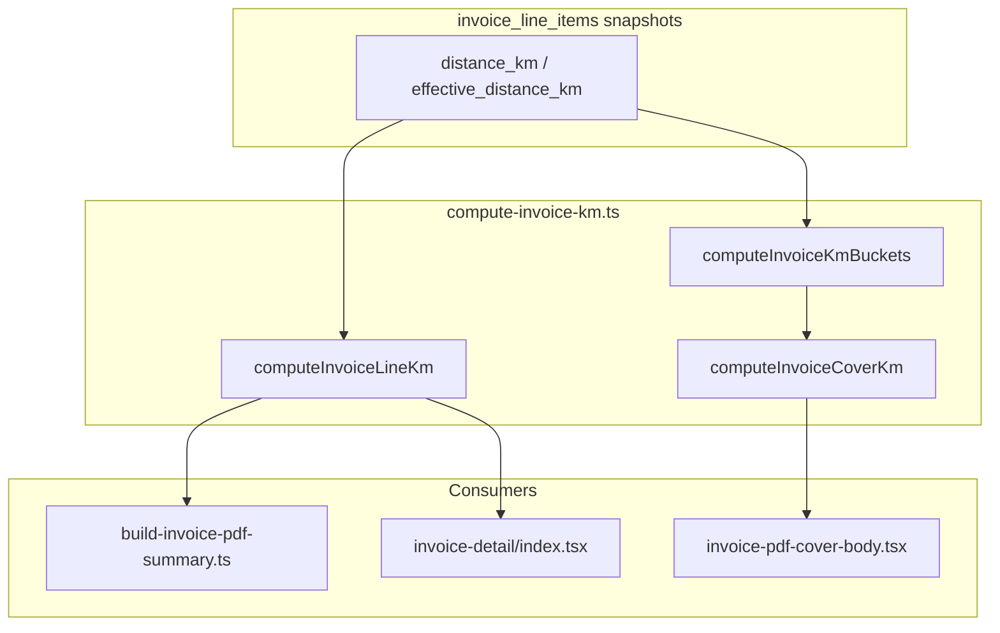

# Invoice KM consistency — implementation plan

## Current state (from audits + code)

| Surface | KM field today | Row filter for totals |
|---------|----------------|----------------------|
| [invoice-detail/index.tsx](src/features/invoices/components/invoice-detail/index.tsx) | `distance_km` (routing) | none |
| PDF cover table | `effective_distance_km ?? distance_km` via [build-invoice-pdf-summary.ts](src/features/invoices/components/invoice-pdf/lib/build-invoice-pdf-summary.ts) | `mainCoverLineItems` (billing-included, non-cancelled) |
| Builder preview | same as PDF | pre-filters with `billingIncludedLineItems` in [use-invoice-builder-pdf-preview.tsx](src/features/invoices/components/invoice-builder/use-invoice-builder-pdf-preview.tsx) |

**Inclusion SSOT:** [billing-inclusion.ts](src/features/invoices/lib/billing-inclusion.ts) (`isBillingIncludedRow`, `mainCoverLineItems`, `billingIncludedLineItems`). KM helpers must **reuse** `isBillingIncludedRow` for `billing_included` semantics—do not duplicate `!== false` logic.

**Step 4 UI** lives in [step-4-vorlage.tsx](src/features/invoices/components/invoice-builder/step-4-vorlage.tsx) (not `step-4-document-settings.tsx`). Display flags already persist in `invoices.pdf_column_override` JSON via [pdf-vorlage.types.ts](src/features/invoices/types/pdf-vorlage.types.ts) (`show_cancelled_trips`, `show_excluded_trips`). The new toggle follows the same pattern—**no migration**.



---

## Files changed (expected)

| File | Role |
|------|------|
| [src/features/invoices/lib/compute-invoice-km.ts](src/features/invoices/lib/compute-invoice-km.ts) | **New** — central KM helpers + named constants (`DEFAULT_SHOW_CANCELLED_BILLED_KM_ON_COVER = false`) |
| [src/features/invoices/lib/__tests__/compute-invoice-km.test.ts](src/features/invoices/lib/__tests__/compute-invoice-km.test.ts) | **New** — unit tests for all bucket/line cases |
| [src/features/invoices/components/invoice-pdf/lib/build-invoice-pdf-summary.ts](src/features/invoices/components/invoice-pdf/lib/build-invoice-pdf-summary.ts) | Replace inline `effective_distance_km ?? distance_km` accumulation with `computeInvoiceLineKm` |
| [src/features/invoices/components/invoice-pdf/lib/__tests__/build-invoice-pdf-summary-inclusion.test.ts](src/features/invoices/components/invoice-pdf/lib/__tests__/build-invoice-pdf-summary-inclusion.test.ts) | Extend assertions; keep `mainCoverLineItems` filter tests |
| [src/features/invoices/components/invoice-pdf/InvoicePdfDocument.tsx](src/features/invoices/components/invoice-pdf/InvoicePdfDocument.tsx) | Compute cover buckets from full `invoice.line_items`; pass to cover body |
| [src/features/invoices/components/invoice-pdf/invoice-pdf-cover-body.tsx](src/features/invoices/components/invoice-pdf/invoice-pdf-cover-body.tsx) | Render invoice-level **Gesamtstrecke** block + optional cancelled line |
| [src/features/invoices/types/pdf-vorlage.types.ts](src/features/invoices/types/pdf-vorlage.types.ts) | Add `show_cancelled_billed_km_on_cover` to Zod schema + `PdfColumnProfile` |
| [src/features/invoices/lib/resolve-pdf-column-profile.ts](src/features/invoices/lib/resolve-pdf-column-profile.ts) | Default new flag from override JSON |
| [src/features/invoices/components/invoice-builder/step-4-vorlage.tsx](src/features/invoices/components/invoice-builder/step-4-vorlage.tsx) | Checkbox UI (German label per spec) |
| [src/features/invoices/hooks/use-invoice-builder.ts](src/features/invoices/hooks/use-invoice-builder.ts) | Hydrate/persist toggle; branch inherited-exclusion tagging |
| [src/features/invoices/components/invoice-builder/index.tsx](src/features/invoices/components/invoice-builder/index.tsx) | Thread `show_cancelled_billed_km_on_cover` into preview profile |
| [src/features/invoices/components/invoice-builder/use-invoice-builder-pdf-preview.tsx](src/features/invoices/components/invoice-builder/use-invoice-builder-pdf-preview.tsx) | Ensure preview profile includes new flag |
| [src/features/invoices/components/invoice-detail/index.tsx](src/features/invoices/components/invoice-detail/index.tsx) | Show billed km via helper; **KM bucket summary** (normal + cancelled) |
| [src/features/invoices/types/invoice.types.ts](src/features/invoices/types/invoice.types.ts) | Optional builder-only `exclusionInherited?: boolean` on `BuilderLineItem` |
| [src/features/invoices/components/invoice-builder/step-3-line-items.tsx](src/features/invoices/components/invoice-builder/step-3-line-items.tsx) | Badge “Ausgeschlossen (Ursprungsrechnung)” |
| [docs/invoices-module.md](docs/invoices-module.md) | KM semantics section |
| [docs/manual-km-overrides.md](docs/manual-km-overrides.md) | Link helpers + `effective_distance_km` flow |
| [docs/invoice-km-behaviour.md](docs/invoice-km-behaviour.md) | **New** — invariants K1–K7 summary |
| [docs/plans/invoice-km-mismatch-audit.md](docs/plans/invoice-km-mismatch-audit.md) | Status: implemented |
| [docs/plans/invoice-trip-optout-audit.md](docs/plans/invoice-trip-optout-audit.md) | Status: Step 6 UX only |

**Out of scope:** `src/components/ui/`, Supabase RPCs, `trips` table, tax/money snapshot logic.

---

## Step 1 — Design and add central KM helper(s)

### What and why

Create [compute-invoice-km.ts](src/features/invoices/lib/compute-invoice-km.ts) as the **only** place that defines billed km from line-item snapshots.

**Proposed API:**

```ts
// Minimal row shape — matches InvoiceLineItemRow distance + inclusion fields
export type InvoiceKmLineItem = {
  effective_distance_km?: number | null;
  distance_km?: number | null;
  billing_included?: boolean | null;
  is_cancelled_trip?: boolean | null;
};

export const DEFAULT_SHOW_CANCELLED_BILLED_KM_ON_COVER = false;

/** Billed km for one row — never reads live trips. */
export function computeInvoiceLineKm(item: InvoiceKmLineItem): number | null;

/** Invoice-wide buckets from full line_items array (not pre-filtered). */
export function computeInvoiceKmBuckets(items: InvoiceKmLineItem[]): {
  normalBilledKm: number | null;
  cancelledBilledKm: number | null;
};

/** Alias for cover — same buckets; separate export documents intent. */
export function computeInvoiceCoverKm(items: InvoiceKmLineItem[]): ReturnType<typeof computeInvoiceKmBuckets>;
```

**Rules (encode in JSDoc “why” comments):**

- `computeInvoiceLineKm`: `effective_distance_km ?? distance_km` (matches pricing/PDF billed semantics in [manual-km-overrides.md](docs/manual-km-overrides.md)).
- `normalBilledKm`: sum `computeInvoiceLineKm` where `isBillingIncludedRow(item)` && `!item.is_cancelled_trip`.
- `cancelledBilledKm`: sum where `isBillingIncludedRow(item)` && `item.is_cancelled_trip === true`.
- Exclude `billing_included = false` and manual non-trip positions (no `is_cancelled_trip`, not included — already excluded by inclusion helper).
- **Null propagation (match existing PDF group behaviour):** if any contributing row in a bucket has `null` billed km, that bucket’s total is `null` (not a partial sum). Export a small internal `sumBilledKmWithNullPropagation` to share with summary builders.

### Invariants

- Pure functions only — no Supabase, no `trips` joins, no PDF layout knowledge.
- Import `isBillingIncludedRow` from [billing-inclusion.ts](src/features/invoices/lib/billing-inclusion.ts).

### Build gate

```bash
bun test src/features/invoices/lib/__tests__/compute-invoice-km.test.ts
```

**Test matrix:** only-normal; only-cancelled-billed; mix; `effective_distance_km` vs `distance_km` fallback; all `billing_included` × `is_cancelled_trip` combos; null km propagation; legacy `billing_included` undefined ⇒ included.

---

## Step 2 — Refactor PDF summary builders to use helpers

### What and why

In [build-invoice-pdf-summary.ts](src/features/invoices/components/invoice-pdf/lib/build-invoice-pdf-summary.ts), replace every inline:

```ts
const lineKm = item.effective_distance_km ?? item.distance_km;
```

with `computeInvoiceLineKm(item)` in:

- `buildInvoicePdfSummary` (grouped by route)
- `buildInvoicePdfSingleRow`
- `buildInvoicePdfGroupedByBillingType`

**Input arrays stay filtered by callers** (`mainCoverLineItems` in [InvoicePdfDocument.tsx](src/features/invoices/components/invoice-pdf/InvoicePdfDocument.tsx) L352–353) — helpers do not re-apply cover filters for per-group `total_km`. That preserves today’s behaviour: per-group **Gesamtstrecke** column = normal billed only.

Also export a typed helper or re-use `computeInvoiceKmBuckets` result from Document for invoice-level cover lines (Step 3)—summary builders do **not** need to embed cancelled km.

### Invariants

- Money aggregation (`lineNetEurForPdfLineItem`, gross, approach fees) unchanged.
- `total_km: null` when any line in group has null km — preserved via shared null-propagation helper.
- All three layouts (`grouped`, `grouped_by_billing_type`, `single_row`) + flat row cells (via catalog `effective_distance_km` binding) use the same line-km function.

### Build gate

```bash
bun run build && bun test src/features/invoices
```

---

## Step 3 — Update PDF cover for two KM lines + toggle prop

### What and why

**Invoice-level KM block** (new, all `main_layout` values share [invoice-pdf-cover-body.tsx](src/features/invoices/components/invoice-pdf/invoice-pdf-cover-body.tsx)):

1. In [InvoicePdfDocument.tsx](src/features/invoices/components/invoice-pdf/InvoicePdfDocument.tsx):  
   `const coverKm = computeInvoiceCoverKm(invoice.line_items)` on the **full** snapshot array (includes opted-out and cancelled rows still present in DB).
2. Pass to `InvoicePdfCoverBody`:
   - `normalBilledKm`, `cancelledBilledKm`
   - `showCancelledBilledKmOnCover` from `effectiveProfile.show_cancelled_billed_km_on_cover`
3. In cover body, **between main table and money totals section** (~L295), add rows styled like existing `totalsRow`:
   - **Gesamtstrecke:** `normalBilledKm` (format e.g. `X,X km`; show `—` when `null`)
   - When toggle is **on**, **always** render the second line (even when sum is zero): **Strecke stornierte, abgerechnete Fahrten** → `0,0 km` (or `—` only when `cancelledBilledKm === null` due to null propagation). Do **not** hide the line when the bucket is 0 — admins must see that the toggle is active and the bucket is empty.

**Why separate from table `total_km` column:** grouped layouts show per-route/per-billing-type partials; invoice-level lines are the single cross-template SSOT for “how much km is on this invoice” per audit K1–K3.

### Invariants

- Toggle **off** ⇒ PDF looks like today except helper-driven bug fixes; **no** cancelled km in Gesamtstrecke.
- Cancelled billed km **never** added to `normalBilledKm` or per-group `total_km`.
- Appendix passive cancelled listing (`show_cancelled_trips`) unchanged.

### Build gate

```bash
bun run build && bun test src/features/invoices/components/invoice-pdf
```

Add a small pure test (e.g. in `compute-invoice-km.test.ts` or new `invoice-pdf-cover-km.test.ts`) asserting identical bucket values for the same fixture across layout modes (layouts share cover block; no react-pdf render needed).

---

## Step 4 — Step 4 switch and state threading

### What and why

**Field name:** `show_cancelled_billed_km_on_cover: boolean` in `pdf_column_override` (snake_case, consistent with `show_cancelled_trips`).

**Changes:**

1. [pdf-vorlage.types.ts](src/features/invoices/types/pdf-vorlage.types.ts): extend `pdfColumnOverrideSchema` + `PdfColumnProfile`; default `false` via Zod `.optional().default(false)`.
2. [resolve-pdf-column-profile.ts](src/features/invoices/lib/resolve-pdf-column-profile.ts): `show_cancelled_billed_km_on_cover: override?.show_cancelled_billed_km_on_cover ?? DEFAULT_SHOW_CANCELLED_BILLED_KM_ON_COVER`.
3. [step-4-vorlage.tsx](src/features/invoices/components/invoice-builder/step-4-vorlage.tsx): checkbox below existing PDF options:
   - Label: **Stornierte, abgerechnete Fahrten als eigene Strecke auf dem Deckblatt anzeigen**
   - Helper text: explains €0 appendix listing vs billed km line (distinct from `show_cancelled_trips`).
4. [use-invoice-builder.ts](src/features/invoices/hooks/use-invoice-builder.ts): hydrate from parsed override; include in `onPdfColumnOverrideChange` payload (mirror `show_cancelled_trips` pattern ~L139–147).
5. [index.tsx](src/features/invoices/components/invoice-builder/index.tsx) + [use-invoice-builder-pdf-preview.tsx](src/features/invoices/components/invoice-builder/use-invoice-builder-pdf-preview.tsx): merge flag into `builderColumnProfile` passed to `InvoicePdfDocument`.

**Issued invoices:** [enrich-invoice-detail-column-profile.ts](src/features/invoices/lib/enrich-invoice-detail-column-profile.ts) already uses `resolvePdfColumnProfile` — no extra work if resolver updated.

### Invariants

- Display-only flag — does not alter `invoice_line_items`, header totals, or Storno snapshots.
- Default `false` for new invoices and new branch drafts (RPC copies `pdf_column_override` verbatim — inherited setting from original is OK and expected).
- Persisted via existing `createInvoice` / draft save paths in [invoices.api.ts](src/features/invoices/api/invoices.api.ts) (Zod validation on `pdf_column_override`).

### Build gate

```bash
bun run build
```

---

## Step 5 — Align invoice detail (HTML) KM display

### What and why

**Recommended option (a)** from spec in [invoice-detail/index.tsx](src/features/invoices/components/invoice-detail/index.tsx):

- Change km column from `item.distance_km` to `computeInvoiceLineKm(item)`.
- Rename header **km** → **Abgerechnete km** (or keep “km” with `title` tooltip “Abgerechnete Strecke (Snapshot)”).
- For excluded rows (`billing_included === false`): keep row visible; km still shown for audit but row styling/badge should indicate exclusion (reuse existing patterns if any; otherwise muted text).
- For cancelled rows: show km if billed; badge already implied by row context.

**KM bucket summary (strongly recommended — implement in Step 5):** Add a compact block below notes or above the line table using `computeInvoiceKmBuckets(invoice.line_items)` so admins get one-glance parity with the PDF cover:

- **Gesamtstrecke (normal):** `normalBilledKm`
- **Strecke stornierte, abgerechnete Fahrten:** `cancelledBilledKm` — always show both lines on the detail page (not gated by the PDF toggle; detail is an audit surface). Format `—` when bucket is `null`.

This is not optional for implementation — it closes the “detail vs PDF” gap called out in the KM mismatch audit.

### Invariants

- No manual `distance_km` summation for totals.
- Detail totals match PDF bucket semantics for the same `invoice_line_items` rows.

### Build gate

```bash
bun run build && bun test src/features/invoices
```

---

## Step 6 — Branch draft excluded-trip UX (no DB rewrite)

### What and why

Per [invoice-trip-optout-audit.md](docs/plans/invoice-trip-optout-audit.md): `create_branch_draft_from_invoice` copies **all** lines including `billing_included = false`. **Do not change RPC this iteration.**

**UX fix:**

1. On edit hydration in [use-invoice-builder.ts](src/features/invoices/hooks/use-invoice-builder.ts), when `detail.replaces_invoice_id` is set:
   - **Reuse existing `getInvoiceDetail`** ([invoices.api.ts](src/features/invoices/api/invoices.api.ts)) — do **not** add a new API route or ad-hoc Supabase query.
   - Add a **second TanStack Query** keyed with `invoiceKeys.full(replaces_invoice_id)` (same key as the invoice detail page). Benefits: shares React Query cache if the admin already opened the original invoice; `staleTime: Infinity` + no refetch-on-focus matches the branch-draft hydration query pattern.
   - Gate hydration seeding on both queries settled (branch draft + original), same pattern as `editRulesQuery` / `editWheelchairQuery` today.
   - From the original `line_items`, build `Map<trip_id, billing_included>` only — discard the rest of the payload.
   - For each `BuilderLineItem` with `!billingInclusion.included` and matching `trip_id` where original was also excluded ⇒ set `exclusionInherited: true`.
2. [step-3-line-items.tsx](src/features/invoices/components/invoice-builder/step-3-line-items.tsx): when `exclusionInherited`, extend badge from “Ausgeschlossen” to **Ausgeschlossen (Ursprungsrechnung)** (keep reason subtext).

**Cost note:** One extra `getInvoiceDetail` per branch-draft edit session (cached thereafter). Acceptable; avoid a third bespoke fetch.

**Deferred (document only, do not implement):** Option A from opt-out audit — branch seeds only `billing_included = true` rows — requires explicit sign-off + RPC migration.

### Invariants

- Tagging is builder-only; not persisted to DB.
- KM helpers ignore `exclusionInherited`; only `billing_included` / `is_cancelled_trip` matter.
- No snapshot distance recomputation.

### Build gate

```bash
bun run build
```

---

## Step 7 — Tests, docs, and “why” comments (mandatory)

### Tests to add/extend

| Area | Coverage |
|------|----------|
| `compute-invoice-km.test.ts` | Full matrix (Step 1) |
| `build-invoice-pdf-summary-inclusion.test.ts` | Still passes; optionally assert helper equivalence |
| New: cover bucket parity test | Same fixture → identical `normalBilledKm` / `cancelledBilledKm` regardless of `main_layout` |
| Toggle behaviour | Pure test: toggle off ⇒ no second line; toggle on ⇒ second line always present (including `0,0 km` fixture) |
| Preview vs issued | Fixture through `buildDraftInvoiceDetailForPdf` + direct `InvoiceDetail` → same `computeInvoiceCoverKm` (unit-level, no PDF binary) |

### Documentation

- [docs/invoices-module.md](docs/invoices-module.md): new **Kilometre (Snapshots)** section — Gesamtstrecke definition, cancelled-billed line, snapshot-only rule, link to helpers.
- [docs/manual-km-overrides.md](docs/manual-km-overrides.md): `effective_distance_km` → `computeInvoiceLineKm` pipeline.
- [docs/invoice-km-behaviour.md](docs/invoice-km-behaviour.md): invariants K1–K7 from [invoice-km-mismatch-audit.md](docs/plans/invoice-km-mismatch-audit.md).
- Plan audits: add “**Status:** addressed by KM consistency work (2026-06)” sections.

### Inline “why” comments (required locations)

- [compute-invoice-km.ts](src/features/invoices/lib/compute-invoice-km.ts) — why `effective` wins; why cancelled billed is separate bucket.
- [invoice-pdf-cover-body.tsx](src/features/invoices/components/invoice-pdf/invoice-pdf-cover-body.tsx) — why invoice-level block sits above money totals; why toggle on always shows second line (including `0,0 km`).
- [invoice-detail/index.tsx](src/features/invoices/components/invoice-detail/index.tsx) — why billed km shown instead of routing `distance_km`.

### Final build gate

```bash
bun run build && bun test
```

---

## Hard rules checklist

- Named export for default toggle: `DEFAULT_SHOW_CANCELLED_BILLED_KM_ON_COVER`.
- No live `trips` reads for invoice KM display after creation.
- No destructive migrations; `pdf_column_override` JSON extension only.
- Tax snapshots (`unit_price`, `quantity`, `subtotal`, distance columns on insert) untouched.
- Minimal diff outside `src/features/invoices/**` and docs.
