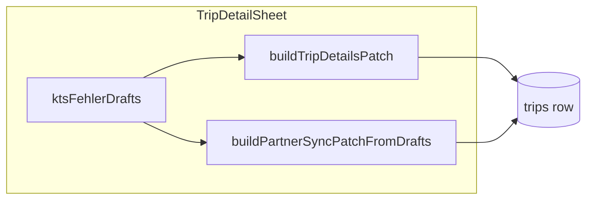

# KTS-Fehler (trip-level error flag + description)

## Context from codebase

- **Trip detail sheet** ([`trip-detail-sheet.tsx`](src/features/trips/trip-detail-sheet/trip-detail-sheet.tsx)): `ktsDocumentAppliesDraft` + `ktsUserLockedRef` mirror Neue Fahrt: catalog `useEffect` only updates KTS when `!ktsUserLockedRef.current` and billing changed; loading a trip resets `ktsUserLockedRef` to `false` and seeds drafts from `trip`. KTS UI is a `col-span-2` dashed row: label/hint left, `Switch` right (~1601–1621).
- **Primary PATCH** is built in [`build-trip-details-patch.ts`](src/features/trips/trip-detail-sheet/lib/build-trip-details-patch.ts); **partner leg** uses [`buildPartnerSyncPatchFromDrafts`](src/features/trips/trip-detail-sheet/lib/paired-trip-sync.ts) + [`PAIRED_SYNC_COLUMN_KEYS`](src/features/trips/trip-detail-sheet/lib/paired-trip-sync.ts) for dialog eligibility and mirrored columns.
- **Print/PDF cards** share [`PrintTripGroupsList`](src/features/trips/components/print-trip-groups-list.tsx); [`TripData`](src/features/trips/components/mobile-print-template.tsx) is the narrow type passed from [`print-trips-button.tsx`](src/features/trips/components/print-trips-button.tsx) (`select('*')` already loads all trip columns).
- **Types regen**: [`package.json`](package.json) script `db:types` → `src/types/database.types.ts`; [`UpdateTrip`](src/features/trips/api/trips.service.ts) is inferred from `Tables['trips']['Update']`.
- **Zod** ([`schema.ts`](src/features/trips/components/create-trip/schema.ts)): today ends at `no_invoice_required`; extending it requires **defaultValues** + [`buildTripFormValuesFromDraft`](src/features/trips/lib/create-trip-draft.ts) branches so Neue Fahrt / drafts stay valid — **without** adding fields to [`payer-section.tsx`](src/features/trips/components/create-trip/sections/payer-section.tsx) (per your deferral).

## 1. Database

- New migration after latest timestamp (`20260504120000_*`): e.g. [`supabase/migrations/20260504130000_kts_fehler.sql`](supabase/migrations/20260504130000_kts_fehler.sql) with your exact `ALTER TABLE` (boolean `NOT NULL DEFAULT false`, `kts_fehler_beschreibung` `text` nullable).
- Optional: `COMMENT ON COLUMN` for both (matches style in [`20260504120000_add-place-ids-to-trips.sql`](supabase/migrations/20260504120000_add-place-ids-to-trips.sql)).
- **Gate:** `bun run supabase db push` (or your local equivalent), then `bun run db:types`, then `bun run build`.

## 2. Zod + Neue Fahrt (schema only, no payer UI)

- In [`schema.ts`](src/features/trips/components/create-trip/schema.ts): add `kts_fehler` and `kts_fehler_beschreibung` with safe defaults.
- **Validation:** replace the no-op refine from the spec with a real rule: when `kts_fehler` is false, `kts_fehler_beschreibung` must be null, empty, or whitespace-only (use `superRefine` + `addIssue` on `kts_fehler_beschreibung`). When `kts_fehler` is true, description remains optional (no `.min(1)`).
- [`create-trip-form.tsx`](src/features/trips/components/create-trip/create-trip-form.tsx): add `defaultValues` (`kts_fehler: false`, description `null` or `''` consistent with Zod).
- [`create-trip-draft.ts`](src/features/trips/lib/create-trip-draft.ts): add the same defaults in **all three** return branches of `buildTripFormValuesFromDraft`.
- Optionally extend `handleRhfInvalid` field order array if you want sensible focus order for new fields.

**Submit payload:** ensure trip insert paths map description to DB `null` when empty (if the form keeps `''` in state, normalize on submit where other optional strings are handled — follow existing `kts_document_applies` patterns in the same file).

## 3. Trip detail sheet + PATCH + paired sync

**Draft state**

- Add `ktsFehlerDraft` / `ktsFehlerBeschreibungDraft` (fix spec typo `ktsFehllerDraft`).
- On `trip?.id` hydration effect (~474–525): seed from `trip.kts_fehler` / `trip.kts_fehler_beschreibung` (use `?? false` / `?? ''` for textarea UX).
- When **KTS switch turns off** (`ktsDocumentAppliesDraft` → false): clear error draft (`false` + empty string) so hidden UI cannot leave stale dirty state; saving must still persist `kts_fehler: false` and `kts_fehler_beschreibung: null` when applicable.

**Dirty + save**

- Extend `detailsDirty` to compare drafts vs `trip` for both new fields (normalize description: trim; treat DB `null` vs `''` as equal for dirty checks).
- [`buildTripDetailsPatch`](src/features/trips/trip-detail-sheet/lib/build-trip-details-patch.ts): extend `BuildTripDetailsPatchInput` with the two drafts; add diff logic:
  - `kts_fehler` when boolean changed vs trip.
  - `kts_fehler_beschreibung`: trimmed string → `null` if empty; **whenever** `ktsFehlerDraft` is false, patch must set `kts_fehler_beschreibung: null` (clears stale DB text even if boolean unchanged).
- Pass new args from `handleSaveTripDetails` / `applyDetailsPatch` call sites.

**Paired Gegenfahrt**

- Add `kts_fehler` and `kts_fehler_beschreibung` to `PAIRED_SYNC_COLUMN_KEYS`.
- Extend `PartnerSyncDrafts` + [`buildPartnerSyncPatchFromDrafts`](src/features/trips/trip-detail-sheet/lib/paired-trip-sync.ts) with the same semantics (beschreibung `null` when error flag false).
- Thread drafts into `buildPartnerSyncPatchFromDrafts({ ... })` in [`trip-detail-sheet.tsx`](src/features/trips/trip-detail-sheet/trip-detail-sheet.tsx) (~789) and add to `applyDetailsPatch` dependency array.

## 4. UI layout (detail sheet only)

- Keep the existing **single** `col-span-2` dashed container for the KTS row (~1601–1621).
- **Conditional block:** when `payerDraft` **and** `ktsDocumentAppliesDraft`, show inline **next to** the main KTS switch:
  - Use a **Checkbox** (per spec) for `kts_fehler`; label e.g. „KTS-Fehler“.
  - **`Textarea`** for description; enable when `ktsFehlerDraft` is true (or allow typing only when true to avoid confusion).
  - Use `flex flex-wrap items-start gap-3` (or a small inner grid) so on narrow sheets the block wraps without breaking the whole section — aligned with the existing payer grid (~1474+).
- **Accessibility:** associate `Label` + `htmlFor` / `aria-label` for checkbox and textarea.

## 5. Fahrten table

- In [`columns.tsx`](src/features/trips/components/trips-tables/columns.tsx): add two columns after the existing `kts_document_applies` column (~474–497) to keep KTS fields grouped:
  - **KTS-Fehler:** e.g. badge or „Ja“ / em dash when false; tooltip optional.
  - **KTS-Fehler (Text):** truncated text + `title` / `Tooltip` for full description; em dash when null/empty.

Deferred per your note: column presets / saved views.

## 6. Print / ZIP templates

- Extend [`TripData`](src/features/trips/components/mobile-print-template.tsx) with optional `kts_fehler?: boolean | null` and `kts_fehler_beschreibung?: string | null`.
- Implement the **warning block** in [`print-trip-groups-list.tsx`](src/features/trips/components/print-trip-groups-list.tsx) (covers **MobilePrintTemplate**, **BoardLandscapeOnlyPrintTemplate**, and board overview — all use the same list):
  - **Single-trip card:** if `trip.kts_fehler`, render a distinct block (e.g. red/rose border, „KTS-Fehler“ label) above or below the amber **Hinweis** block; include trimmed description when present.
  - **Grouped card:** if **any** trip in the group has `kts_fehler`, show a merged block (similar to grouped notes — dedupe descriptions with `•` or list per leg if needed; simplest v1: show any non-empty descriptions joined).
- [`board-landscape-only-print-template.tsx`](src/features/trips/components/board-landscape-only-print-template.tsx): likely **no structural change** if only `TripData` + shared list change.

## 7. Documentation (mandatory)

- [`docs/kts-architecture.md`](docs/kts-architecture.md): extend §3 trip persistence table with the two columns, semantics (error flag independent of catalog cascade; description optional; clear-on-false), and where they are edited (detail sheet only in UI v1).
- [`docs/trip-detail-sheet-editing.md`](docs/trip-detail-sheet-editing.md): note new mirrored keys in paired sync.
- [`docs/print-trips-export.md`](docs/print-trips-export.md): one bullet under shared card logic for the KTS-Fehler print block.

## Notes / non-goals

- **`resolveKtsDefault`** ([`resolve-kts-default.ts`](src/features/trips/lib/resolve-kts-default.ts)): unchanged — error fields are trip-level operational metadata, not catalog defaults.
- **RLS:** additive columns on `trips` inherit existing policies (verify only if you have column-specific policies; none expected from this pattern).

