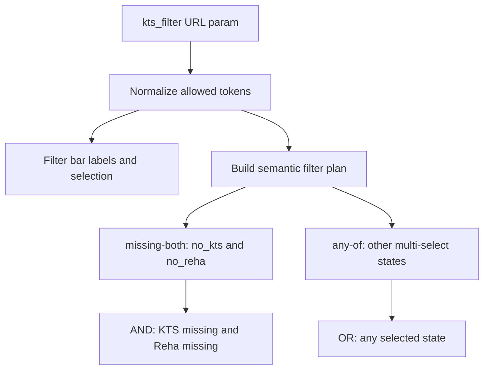

# KTS Filter Fix Plan

## Scope

Implement a surgical KTS-only change across:

- [`src/features/trips/lib/kts-filter.ts`](src/features/trips/lib/kts-filter.ts) as the new shared helper.
- [`src/features/trips/components/trips-filters-bar.tsx`](src/features/trips/components/trips-filters-bar.tsx) to consume shared constants, labels, normalization, and trigger label logic.
- [`src/features/trips/components/trips-listing.tsx`](src/features/trips/components/trips-listing.tsx) to consume shared token normalization and an explicit server-side filter plan.
- [`src/features/trips/lib/__tests__/kts-filter.test.ts`](src/features/trips/lib/__tests__/kts-filter.test.ts) for focused Bun unit coverage.
- [`docs/plans/kts-filter-reconciliation-audit.md`](docs/plans/kts-filter-reconciliation-audit.md) and relevant KTS/filter docs to reflect implemented status and semantics.

The public contract remains exactly `kts_filter` with tokens `kts`, `kts_fehler`, `no_kts`, `no_reha`, `reha`.

Hard invariant: when both `no_kts` and `no_reha` are selected, the result must include only trips where both values are missing (`kts_document_applies = false` and `reha_schein = false`), even if other multi-select combinations continue using broader “any selected state” semantics.

## Design

Create a pure trip-domain helper in [`src/features/trips/lib/kts-filter.ts`](src/features/trips/lib/kts-filter.ts) with:

- `KTS_FILTER_VALUES` and exported `KtsFilterValue`.
- `KTS_FILTER_OPTION_ROWS` or token-to-label helpers for the current German labels.
- `normalizeKtsFilterValues(raw: readonly string[] | null | undefined): KtsFilterValue[]` to strip crafted/legacy tokens and dedupe while preserving selection order.
- `parseKtsFilterParam(param: string | null): KtsFilterValue[]` for the filter bar’s URL read path.
- `getKtsFilterTriggerLabel(values: readonly KtsFilterValue[]): string` for the existing trigger text.
- A server-facing function, for example `buildKtsTripFilterPlan(values)`, returning a deliberately small semantic discriminated union: `{ mode: 'none' }`, `{ mode: 'single'; token: KtsFilterValue }`, `{ mode: 'missing-both' }`, or `{ mode: 'any-of'; tokens: KtsFilterValue[]; includeMissingBoth?: true }`.

The helper must not expose raw PostgREST string fragments as its primary API. It should describe business intent with only the modes above; do not build a generic filter DSL or larger abstract planner. [`src/features/trips/components/trips-listing.tsx`](src/features/trips/components/trips-listing.tsx) remains responsible for translating that small semantic plan into Supabase query calls or PostgREST expressions where unavoidable.

The important semantic rule will live in the helper, not in the component:

For `no_kts + no_reha`, the helper should produce a `missing-both` intersection plan. Other mixed multi-selects should keep current “match any selected state” behavior unless they include that negative pair, where the plan should preserve that pair as one semantic unit and let `trips-listing.tsx` translate it into the necessary grouped query expression.

## Implementation Steps

1. Add [`src/features/trips/lib/kts-filter.ts`](src/features/trips/lib/kts-filter.ts) with the shared contract, labels, parsing/normalization, trigger-label helper, and semantic server filter-plan builder. Add a short “why” comment around the negative-pair rule so future changes do not flatten it back into two independent OR branches.

2. Refactor [`src/features/trips/components/trips-filters-bar.tsx`](src/features/trips/components/trips-filters-bar.tsx) to import `KTS_FILTER_OPTION_ROWS`, `KtsFilterValue`, `parseKtsFilterParam`, and `getKtsFilterTriggerLabel`. Keep the existing popover markup, URL key `kts_filter`, labels, reset behavior, and non-KTS filter code unchanged.

3. Refactor [`src/features/trips/components/trips-listing.tsx`](src/features/trips/components/trips-listing.tsx) to remove `TRIPS_KTS_FILTER_QUERY_VALUES` and inline condition construction. Use `normalizeKtsFilterValues(searchParamsCache.get('kts_filter') ?? [])`, then switch on the helper’s semantic server filter plan and translate it into Supabase query calls locally. Preserve the current single-token `.eq(...)` shape for `kts`, `kts_fehler`, `no_kts`, `no_reha`, and `reha`.

4. Add [`src/features/trips/lib/__tests__/kts-filter.test.ts`](src/features/trips/lib/__tests__/kts-filter.test.ts) using the existing `bun:test` pattern from neighboring trip lib tests. Cover normalization, label derivation, single-token plans, `no_kts + no_reha` as AND, invalid token stripping, and one mixed case such as `kts + no_kts + no_reha` preserving broader any-of semantics while keeping the negative pair grouped.

5. Update docs after code changes. At minimum, update [`docs/plans/kts-filter-reconciliation-audit.md`](docs/plans/kts-filter-reconciliation-audit.md) with implementation status, helper location, and exact multi-select semantics. Also update stale/relevant docs discovered during research, especially [`docs/plans/kts-filter-audit.md`](docs/plans/kts-filter-audit.md) and [`docs/plans/trips-filters-multi-select-audit.md`](docs/plans/trips-filters-multi-select-audit.md), where current line references and pre-refactor KTS behavior are no longer reliable.

## Validation

Run these after implementation:

- `bun test src/features/trips/lib/__tests__/kts-filter.test.ts`
- `bun test`
- `bun run build`
- `ReadLints` on changed TypeScript files

If full `bun test` or `bun run build` fails from unrelated pre-existing issues, capture the exact failure and still verify the targeted KTS test passes.