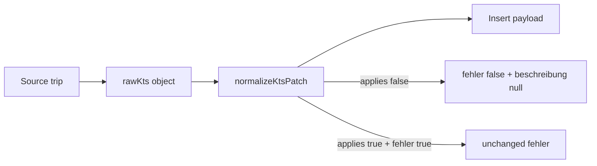

# KTS Copy-Path Sanitization (PR1.5)

## Goal

Prevent corrupt source state (`kts_document_applies: false` + `kts_fehler: true`) from propagating into duplicated or return trips, while preserving valid intentional copies (`kts_document_applies: true` + `kts_fehler: true`). No schema changes. Three files only.

## Why this is safe

[`normalizeKtsPatch`](src/features/kts/kts.service.ts) rule 1 only fires when `kts_document_applies` is **explicitly `false`** in the input object. Valid open-correction copies pass `kts_document_applies: true` — fehler and beschreibung are untouched.



---

## Fix 1 — [`duplicate-trips.ts`](src/features/trips/lib/duplicate-trips.ts)

**Location:** `copyRouteAndPassengerFields` return object (lines 298–301).

1. Add import: `import { normalizeKtsPatch } from '@/features/kts/kts.service';`
2. Before the `return { ... }`, build and normalize:

```ts
const rawKts = {
  kts_document_applies: !!source.kts_document_applies,
  kts_fehler: !!source.kts_fehler,
  kts_fehler_beschreibung: source.kts_fehler_beschreibung ?? null,
  kts_source: 'manual' as const
};
// why: sanitize corrupt source (KTS off + fehler on); valid KTS+fehler copies unchanged.
const normalizedKts = normalizeKtsPatch(rawKts);
```

3. Replace the four inline KTS fields with `...normalizedKts`.
4. Remove or relocate the existing `// why: duplicate inherits...` comment — the new normalize comment supersedes it at the call site.

**Invariants:** `kts_source: 'manual'` stays in `rawKts` (rule 3 does not override because key is present). No other fields touched. Function signature unchanged.

---

## Fix 2 — [`build-return-trip-insert.ts`](src/features/trips/lib/build-return-trip-insert.ts)

**Location:** `buildReturnTripInsert` return object (lines 96–100).

1. Add import: `import { normalizeKtsPatch } from '@/features/kts/kts.service';`
2. After `derivedStatus`, before `return {`:

```ts
const rawKts = {
  kts_document_applies: outbound.kts_document_applies,
  kts_fehler: outbound.kts_fehler ?? false,
  kts_fehler_beschreibung: outbound.kts_fehler_beschreibung ?? null,
  kts_source: outbound.kts_source ?? 'manual'
};
// why: sanitize corrupt outbound; intentional fehler inheritance when KTS applies is preserved.
const normalizedKts = normalizeKtsPatch(rawKts);
```

3. Replace lines 96–100 with `...normalizedKts` (keep `reha_schein` and following fields as-is).

**Invariants:** Valid outbound with KTS on + fehler on copies unchanged. No other fields touched. Function signature unchanged.

---

## Docs — [`docs/kts-architecture.md`](docs/kts-architecture.md) §10 only

Per user constraint: **only edit the code map section** (§10).

Update the **KTS write service (PR1)** row to:

- Add `duplicate-trips.ts` and `build-return-trip-insert.ts` as insert-payload consumers of `normalizeKtsPatch`.
- Note **PR1.5 (shipped):** copy-path sanitization on duplicate + Rückfahrt insert.

Do not modify §7.1, §7.2, §9, changelog, or other sections.

---

## Verification

```bash
bun run build
bun test
```

Manual grep check:

- `duplicate-trips.ts` and `build-return-trip-insert.ts` import only `normalizeKtsPatch` from `@/features/kts/kts.service` (no React/hooks).
- No other files modified.

Existing tests in [`duplicate-trips.test.ts`](src/features/trips/lib/__tests__/duplicate-trips.test.ts) should continue to pass — behavior unchanged for consistent source rows.
