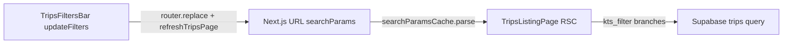

# Plan — KTS filter in trips filter bar

## Preconditions (verified)

- [`src/lib/searchparams.ts`](src/lib/searchparams.ts): `searchParamsCache` is `createSearchParamsCache(searchParams)` (**L27** on the live object). Adding `kts_filter` to **`searchParams`** is sufficient — no parallel registration.
- [`trips-filters-bar.tsx`](src/features/trips/components/trips-filters-bar.tsx): “Advanced” controls are a single fragment **`advancedFilterSelects`** (**L338–L442**) rendered inside both layouts (narrow grid **L509–L510**, wide **L549–L551**). **One insertion** after the **Status** `<Select>` (after **L382**, before **Payer** **L384**) satisfies “both branches” without duplicating JSX.
- **Select UI:** Existing selects use `<SelectValue placeholder='…' />` without conditional children (**Radix-friendly**). Prefer **labels on `SelectItem`** (e.g. `KTS: Alle`, `KTS: Nur KTS`, `KTS: Nur Fehler`) plus the same **`SelectTrigger` className** as Status (**L372**) for row height/consistency; avoid the snippet’s custom children inside `SelectValue` unless you verify Radix behavior.

## Step 1 — Parser

**File:** [`src/lib/searchparams.ts`](src/lib/searchparams.ts)

- In `searchParams`, under the trip filter comment block (after `invoice_status` or before `scheduled_at`), add:

```ts
/** KTS list filter: `kts` | `kts_fehler`; absent = all trips. */
kts_filter: parseAsString,
```

- **Gate:** `bun run build`

## Step 2 — RSC read + Supabase apply

**File:** [`src/features/trips/components/trips-listing.tsx`](src/features/trips/components/trips-listing.tsx)

1. **Read** next to other trip filters (**~L52–L59**):

```ts
const ktsFilter = searchParamsCache.get('kts_filter') ?? 'all';
```

2. **Apply** in the `// Apply filters` block, **after** the existing `.eq` filters and **before** `search` / date logic is fine; group with other simple `.eq` conditions (**~L113–L133**):

- If `ktsFilter === 'kts'`: `query = query.eq('kts_document_applies', true)`
- Else if `ktsFilter === 'kts_fehler'`: `query = query.eq('kts_document_applies', true).eq('kts_fehler', true)`
- Else (`all` or unknown): no extra conditions (unknown URL values behave like `all`).

3. **Deferred (per spec):** do **not** add `kts_filter` to `kanbanKey` (**~L282–L291**).

- **Gate:** `bun run build`

## Step 3 — Filter bar

**File:** [`src/features/trips/components/trips-filters-bar.tsx`](src/features/trips/components/trips-filters-bar.tsx)

1. **Read param** next to other `useSearchParams` reads (**~L74–L81**):

```ts
const ktsFilter = searchParams.get('kts_filter') ?? 'all';
```

2. **`hasAdvancedFilters`** (**~L133–L141**): add `|| ktsFilter !== 'all'` so narrow collapsible expands when KTS filter is active.

3. **New `<Select>`** inside **`advancedFilterSelects`**, **immediately after** the Status `Select` (before Payer):

- `value={ktsFilter}` where `ktsFilter` is `'all' | 'kts' | 'kts_fehler'` for known values (URL-only unknowns rare; optional: normalize if needed).
- `onValueChange`: `updateFilters({ kts_filter: value === 'all' ? null : value })` — **never** write string `'all'` to the URL.
- `SelectItem` values: `all`, `kts`, `kts_fehler` with German labels (prefix “KTS:” on items or trigger-friendly wording per product).
- Reuse **`SelectTrigger`** / **`SelectContent`** / **`text-xs`** patterns from Status (**L372–L380**).

4. **Reset** (`onClick` **~L457–L466**): add `kts_filter: null` to the `updateFilters` payload.

- **Gate:** `bun run build` **and** `bun test`

## Data flow



## Hard rules checklist

| Rule | Implementation |
|------|----------------|
| Param key `kts_filter` | Literal key everywhere |
| `all` = param absent | `null` via `updateFilters` |
| `kts_fehler` | Both `.eq('kts_document_applies', true)` and `.eq('kts_fehler', true)` |
| Reset | `kts_filter: null` in reset object |
| Both layouts | Single fragment `advancedFilterSelects` |
| Scope | Only the three files listed; no deps |
