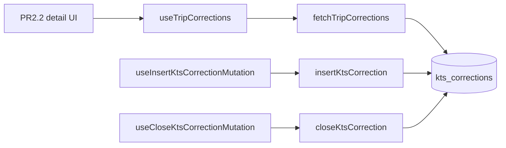

# KTS PR2.1 — Correction CRUD service + hooks

## Scope

| In | Out |
|----|-----|
| [`kts.service.ts`](src/features/kts/kts.service.ts) — 3 functions + `KtsCorrection` export | UI, detail sheet, `columns.tsx` |
| [`use-kts-corrections.ts`](src/features/kts/hooks/use-kts-corrections.ts) — query + 2 mutations | `TripKtsCorrectionSummariesProvider` (PR2.1.1) |
| [`tripKeys`](src/query/keys/trips.ts) — `ktsCorrections` | Barrel `index.ts` (none exists — skip Step 4) |
| [`docs/kts-architecture.md`](docs/kts-architecture.md) — §7.2, §9, §10 only | Unit tests (deferred — no Supabase mock pattern in repo yet) |

**Reference patterns (read before coding):**

- Supabase param injection: [`fetchTripInvoiceStatuses`](src/features/trips/api/trips.service.ts) (`supabase` arg, `.from().select()`)
- Query hook + `createClient()` inside `queryFn`: [`use-trip-invoice-statuses.ts`](src/features/trips/hooks/use-trip-invoice-statuses.ts)
- Mutation invalidation (no optimistic UI): [`use-invoice-text-blocks.ts`](src/features/invoices/hooks/use-invoice-text-blocks.ts) — `onSuccess` → `invalidateQueries` only; **no toast** (PR2.2 form handles errors)
- Cache invalidation shape: [`use-update-kts-mutation.ts`](src/features/kts/hooks/use-update-kts-mutation.ts) — `tripKeys` prefix; corrections use **only** `tripKeys.ktsCorrections(tripId)` per spec (not `tripKeys.all`)

Note: [`use-invoice-mutations.ts`](src/features/invoices/hooks/use-invoice-mutations.ts) does not exist; use `use-invoice.ts` / `use-invoice-text-blocks.ts` instead.

### Pre-flight: `SupabaseClient` import (verified)

[`kts.service.ts`](src/features/kts/kts.service.ts) today imports **only** from `trips.service` — no Supabase types yet. This PR adds the first Supabase import.

**Use exactly** (same as [`fetchTripInvoiceStatuses`](src/features/trips/api/trips.service.ts) line 1 + param line 49):

```typescript
import type { SupabaseClient } from '@supabase/supabase-js';
```

All three new functions take `supabase: SupabaseClient` as the first argument.

**Why this type (not a project-local alias):**

| Pattern | Where | PR2.1? |
|---------|-------|--------|
| `SupabaseClient` from `@supabase/supabase-js` | `trips.service.ts` (`fetchTripInvoiceStatuses`), `lib/supabase/client.ts` (`createClient(): SupabaseClient`) | **Yes** — hooks call `createClient()` and pass the instance straight through |
| `SupabaseClient<Database>` | `duplicate-trips.ts`, `payers.service.ts` static helpers, server libs | No — those are server/injected paths; browser `createClient()` is typed as plain `SupabaseClient` |
| `Awaited<ReturnType<typeof createClient>>` | `driver-planning.service.ts` (server `createClient`) | No — different client factory |

There is **no** shared `TypedSupabaseClient` wrapper in `src/lib/supabase/`. Using `SupabaseClient<Database>` on the service functions would still accept `createClient()` at runtime, but would diverge from the established injectable-client pattern beside `fetchTripInvoiceStatuses` and risks unnecessary generic friction in hooks.

**Do not** import `createClient` in `kts.service.ts` — service stays pure; hooks own client instantiation (same split as `fetchTripInvoiceStatuses` + `use-trip-invoice-statuses`).



---

## Step 1 — Query key ([`src/query/keys/trips.ts`](src/query/keys/trips.ts))

Add after `invoiceStatuses` (same `tripKeys.all` prefix pattern as `presets`):

```typescript
/** Per-trip KTS correction rounds (detail timeline — PR2.1). */
ktsCorrections: (tripId: string) =>
  [...tripKeys.all, 'kts_corrections', tripId] as const,
```

**Invariant:** Do not change existing keys.

**Gate:** `bun run build`

---

## Step 2 — Service ([`src/features/kts/kts.service.ts`](src/features/kts/kts.service.ts))

Add imports:

```typescript
import type { SupabaseClient } from '@supabase/supabase-js';
import type { Database } from '@/types/database.types';
```

Append section `// --- Correction rounds ---` after `updateTripKts`.

### Types

```typescript
export type KtsCorrection =
  Database['public']['Tables']['kts_corrections']['Row'];
type KtsCorrectionInsert =
  Database['public']['Tables']['kts_corrections']['Insert'];
```

Export **`KtsCorrection` only** (for hook consumers). Keep `KtsCorrectionInsert` module-private.

### `fetchTripCorrections(supabase, tripId)`

- `why:` Loads full round history for the detail timeline (PR2.2); list summary RPC stays separate (PR2.1.1).
- `.from('kts_corrections').select('*').eq('trip_id', tripId).order('sent_at', { ascending: false }).order('created_at', { ascending: false })`
- On error: `throw new Error('Korrekturen konnten nicht geladen werden.')`
- Empty: `return []`

### `insertKtsCorrection(supabase, payload)`

Payload: `{ tripId, companyId, sentTo, sentAt, notes? }`

- `why:` Opens a new append-only correction round when admin dispatches a KTS document.
- Validate `sentTo.trim()` — empty → `throw new Error('Empfänger darf nicht leer sein.')`
- `created_by`: `(await supabase.auth.getUser()).data.user?.id ?? null`
- Insert shape matches [`KtsCorrectionInsert`](src/types/database.types.ts) (lines 1847–1857)
- `.insert({...}).select().single()`
- On error: `throw new Error('Korrektur konnte nicht gespeichert werden.')`

### `closeKtsCorrection(supabase, correctionId, receivedAt)`

- `why:` Records return of corrected document; `received_at IS NULL` guard prevents double-close.
- `.update({ received_at: receivedAt.toISOString() }).eq('id', correctionId).is('received_at', null).select().single()`
- No row (`data` null, no error): `throw new Error('Korrektur wurde bereits abgeschlossen oder existiert nicht.')`
- Other error: `throw new Error('Korrektur konnte nicht abgeschlossen werden.')`

**Invariants:** Do not modify `normalizeKtsPatch`, `buildKtsPatchFromDrafts`, or `updateTripKts`.

**Gate:** `bun run build`

---

## Step 3 — Hooks ([`src/features/kts/hooks/use-kts-corrections.ts`](src/features/kts/hooks/use-kts-corrections.ts))

File header: `'use client';`

Imports: `useQuery`, `useMutation`, `useQueryClient`, `createClient`, `tripKeys`, service functions, `type KtsCorrection`.

### `useTripCorrections(tripId: string | undefined)`

```typescript
return useQuery({
  queryKey: tripKeys.ktsCorrections(tripId!),
  queryFn: async () => {
    const supabase = createClient();
    return fetchTripCorrections(supabase, tripId!);
  },
  enabled: !!tripId?.trim(),
  staleTime: 0
});
```

Re-export `KtsCorrection` from this file for PR2.2 convenience: `export type { KtsCorrection } from '../kts.service';`

### `useInsertKtsCorrectionMutation()`

```typescript
mutationFn: async (payload: Parameters<typeof insertKtsCorrection>[1]) => {
  const supabase = createClient();
  return insertKtsCorrection(supabase, payload);
},
onSuccess: (_data, payload) => {
  void queryClient.invalidateQueries({
    queryKey: tripKeys.ktsCorrections(payload.tripId)
  });
}
```

No `onError` handler (caller surfaces errors).

### `useCloseKtsCorrectionMutation()`

Variables: `{ correctionId: string; tripId: string; receivedAt: Date }`

```typescript
onSuccess: (_data, { tripId }) => {
  void queryClient.invalidateQueries({
    queryKey: tripKeys.ktsCorrections(tripId)
  });
}
```

**Invariants:** `createClient()` inside each hook callback, not module scope. No optimistic updates.

**Gate:** `bun run build`

---

## Step 4 — Barrel

No [`src/features/kts/index.ts`](src/features/kts/index.ts) — **skip** (only `kts.service.ts` + `hooks/use-update-kts-mutation.ts` today).

---

## Step 5 — Tests

**Skipped in this PR** (per decision): no Supabase mock pattern in repo yet. Backlog: `kts-corrections.service.test.ts` alongside copy-path tests from PR1.5.

**Gate:** `bun run build && bun test` (224 existing tests must pass)

---

## Step 6 — Docs ([`docs/kts-architecture.md`](docs/kts-architecture.md))

Targeted edits only:

**§7.2** — Change PR2.1 row to **(shipped)**; scope: `fetchTripCorrections`, `insertKtsCorrection`, `closeKtsCorrection`, `use-kts-corrections.ts`. PR2.2 remains next for UI.

**§9** — Add line:

`PR2.1 (2026-06): correction CRUD in kts.service.ts + useTripCorrections / insert / close mutations.`

**§10** — Extend KTS corrections row (or add PR2.1 row):

- Service: `fetchTripCorrections`, `insertKtsCorrection`, `closeKtsCorrection`
- Hooks: `useTripCorrections`, `useInsertKtsCorrectionMutation`, `useCloseKtsCorrectionMutation`
- Key: `tripKeys.ktsCorrections(tripId)`

Do not edit §7.1, §3.3, §8, or changelog footer.

---

## Files touched (exact)

| File | Action |
|------|--------|
| [`src/query/keys/trips.ts`](src/query/keys/trips.ts) | Extend |
| [`src/features/kts/kts.service.ts`](src/features/kts/kts.service.ts) | Extend |
| [`src/features/kts/hooks/use-kts-corrections.ts`](src/features/kts/hooks/use-kts-corrections.ts) | Create |
| [`docs/kts-architecture.md`](docs/kts-architecture.md) | Update §7.2, §9, §10 |

---

## PR2.2 consumer cheat sheet

**Import path (canonical — do not import hooks from `kts.service.ts`):**

```typescript
import {
  useTripCorrections,
  useInsertKtsCorrectionMutation,
  useCloseKtsCorrectionMutation,
  type KtsCorrection
} from '@/features/kts/hooks/use-kts-corrections';
```

**Usage in detail sheet / timeline component:**

```typescript
const { data: rounds = [], isLoading } = useTripCorrections(tripId);
const insertMutation = useInsertKtsCorrectionMutation();
const closeMutation = useCloseKtsCorrectionMutation();

// Open round
await insertMutation.mutateAsync({
  tripId: trip.id,
  companyId: trip.company_id!, // required on insert row; from trip embed
  sentTo: form.sentTo,
  sentAt: form.sentAt,
  notes: form.notes
});

// Close round
await closeMutation.mutateAsync({
  correctionId: round.id,
  tripId: trip.id,
  receivedAt: new Date()
});
```

- `KtsCorrection` row shape: `id`, `sent_to`, `sent_at`, `received_at` (null = open), `notes`, `created_at`, etc.
- Service functions (`fetchTripCorrections`, …) are for hooks/tests only — PR2.2 UI does **not** call them directly.
- Errors surface via mutation `error` / `mutateAsync` reject — German messages from `kts.service.ts`.
