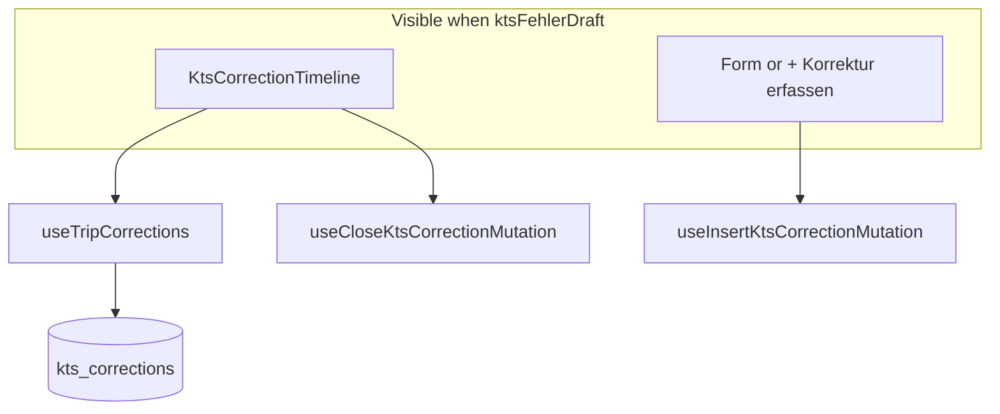

# KTS PR2.2 — Correction timeline + form (trip detail sheet)

## Scope

| In | Out |
|----|-----|
| [`kts-correction-timeline.tsx`](src/features/trips/trip-detail-sheet/components/kts-correction-timeline.tsx) — read + close rounds | `kts.service.ts`, hooks, schema |
| [`kts-correction-form.tsx`](src/features/trips/trip-detail-sheet/components/kts-correction-form.tsx) — open round form | PR3 accountant gate, PR2.1.1 list badges |
| [`trip-detail-sheet.tsx`](src/features/trips/trip-detail-sheet/trip-detail-sheet.tsx) — wire + `showCorrectionForm` state | Toast errors, react-hook-form/zod |
| [`docs/kts-architecture.md`](docs/kts-architecture.md) — §7.2, §9, §10 only | Any file beyond the four above |



---

## Key codebase facts (from read-through)

### KTS block location

In [`trip-detail-sheet.tsx`](src/features/trips/trip-detail-sheet/trip-detail-sheet.tsx) (~lines 1665–1724), inside the dashed `col-span-2` box when `payerDraft` is set:

- KTS switch on the right
- When `ktsDocumentAppliesDraft`: checkbox `ktsFehlerDraft` + `ktsFehlerBeschreibungDraft` textarea (~1679–1707)

**Wire point:** immediately after the `Textarea` (line ~1707), still inside the `ktsDocumentAppliesDraft` column — **before** the closing `</div>` of that flex column.

**Draft variable:** spec says `drafts.kts_fehler`; codebase uses **`ktsFehlerDraft`** — use that name everywhere.

### `company_id`

`Trip.company_id` is `string | null` ([`database.types.ts`](src/types/database.types.ts) trips Row). Pass `companyId={trip.company_id!}` to the form (real tenant rows always have it; same as PR2.1 cheat sheet). No auth/profile fetch in this PR.

### Patterns to mirror

| Concern | Source |
|---------|--------|
| Sheet loading skeleton | `Skeleton` rows in sheet loading state (~1078–1086): `h-24 w-full rounded-xl` — timeline uses **2×** smaller (`h-16`) |
| Date/time display | `format` from `date-fns` + `{ locale: de }` — [`linked-partner-callout.tsx`](src/features/trips/trip-detail-sheet/components/linked-partner-callout.tsx) uses `'dd.MM.yyyy'`; combine as **`'dd.MM.yyyy HH:mm'`** |
| Section card chrome | `bg-muted/40 border-border rounded-lg border px-2 py-1.5` — [`grouped-trip-hint.tsx`](src/features/trips/trip-detail-sheet/components/grouped-trip-hint.tsx) |
| Secondary button | `Button variant='outline' size='sm' className='text-xs h-8'` — footer/outline actions |
| Pending spinner | `Loader2` + `animate-spin` — [`print-trips-button.tsx`](src/features/trips/components/print-trips-button.tsx) |
| Status badges | **No** `warning` Badge variant in [`badge.tsx`](src/components/ui/badge.tsx) — use `Badge variant='outline'` + Tailwind: **Offen** = amber (`border-amber-200 bg-amber-50 text-amber-800 dark:…`), **Erhalten** = green (match route timeline ~2279: `border-green-100 bg-green-50 text-green-600`) |

### `kts_fehler` onChange (extend, do not replace)

```1683:1687:src/features/trips/trip-detail-sheet/trip-detail-sheet.tsx
onCheckedChange={(c) => {
  const on = c === true;
  setKtsFehlerDraft(on);
  if (!on) setKtsFehlerBeschreibungDraft('');
}}
```

Add `setShowCorrectionForm(false)` in the `if (!on)` branch. Optionally also reset when KTS document switch turns off (~1715–1718) for consistency (already clears `ktsFehlerDraft`).

---

## Step 1 — `KtsCorrectionTimeline`

**File:** [`kts-correction-timeline.tsx`](src/features/trips/trip-detail-sheet/components/kts-correction-timeline.tsx)

- `'use client'`
- Props: `{ tripId: string }`
- Hooks: `useTripCorrections(tripId)`, `useCloseKtsCorrectionMutation()`
- **Why comment** on `useTripCorrections`: detail sheet remounts per open; `staleTime: 0` in hook ensures open/closed badge matches DB after close or external insert
- **Why comment** on inline errors: field-level context (which round failed) — toast would be easy to miss in a scrollable sheet

### Loading

```tsx
<div className="space-y-2">
  <Skeleton className="h-16 w-full rounded-lg" />
  <Skeleton className="h-16 w-full rounded-lg" />
</div>
```

### Empty

Return `null` (parent shows “+ Korrektur erfassen”).

### Entry layout

For each `KtsCorrection` in `data` (server order — no re-sort):

- Card: `rounded-lg border border-border bg-muted/30 p-3 space-y-1.5`
- Header row: bullet + `sent_to` (font-medium) + status badge right
- Lines: `Gesendet: {formatKtsCorrectionDate(sent_at)}`, `Erhalten: {received_at ? format… : '—'}`
- Optional `notes` in `text-muted-foreground text-[11px]`
- If `received_at == null`: `Button variant='outline' size='sm'` “Korrektur erhalten”
  - `mutateAsync({ correctionId, tripId, receivedAt: new Date() })`
  - Track `closingId` + `closeErrors: Record<string, string>` — clear error for id on retry; set on catch (`err.message`)
  - Set `closingId` to `round.id` **before** `mutateAsync`; clear in `finally` so the next close starts clean
  - Disabled + `Loader2` **only** when `closeMutation.isPending && closingId === round.id` — **not** bare `isPending` (shared mutation would otherwise lock every open round’s button)
  - **Invariant:** with two+ open rounds on one trip, closing round A must leave round B’s “Korrektur erhalten” enabled and clickable while A is in flight

Helper (file-local):

```typescript
function formatKtsCorrectionDate(iso: string): string {
  return format(new Date(iso), 'dd.MM.yyyy HH:mm', { locale: de });
}
```

---

## Step 2 — `KtsCorrectionForm`

**File:** [`kts-correction-form.tsx`](src/features/trips/trip-detail-sheet/components/kts-correction-form.tsx)

- `'use client'`
- Props: `tripId`, `companyId`, `onSuccess`, `onCancel`
- **Why comment:** `useState` only — two required fields + optional notes; no schema/RHF overhead
- Hook: `useInsertKtsCorrectionMutation()`

### Initial state

```typescript
const defaultSentAt = () => format(new Date(), "yyyy-MM-dd'T'HH:mm");
```

Reset to defaults in `handleCancel` before `onCancel()`.

### Fields

| Field | Control | Validation |
|-------|---------|------------|
| `sentTo` | `Label` + `Input` | Inline “Empfänger darf nicht leer sein.” if empty after trim on submit |
| `sentAt` | `Label` + `input type='datetime-local'` | Required (browser + non-empty) |
| `notes` | `Label` + `Textarea rows={2}` | Optional |

### Actions

- `Abbrechen` — `variant='outline'`, calls reset + `onCancel`
- `Speichern` — `variant='default'`, `mutateAsync({ tripId, companyId, sentTo: trim, sentAt: new Date(sentAt), notes: trim \|\| undefined })`
- Pending: both buttons `disabled`, Speichern shows `Loader2` or “Speichern…”
- Success: `onSuccess()`
- Error: `setSubmitError(err.message)` below buttons (service throws German strings)

Container: `mt-3 space-y-3 rounded-lg border border-dashed border-border p-3` (visually nested under KTS fehler block).

---

## Step 3 — Wire [`trip-detail-sheet.tsx`](src/features/trips/trip-detail-sheet/trip-detail-sheet.tsx)

### Imports

```typescript
import { KtsCorrectionTimeline } from './components/kts-correction-timeline';
import { KtsCorrectionForm } from './components/kts-correction-form';
```

### State (with other draft state ~272)

```typescript
const [showCorrectionForm, setShowCorrectionForm] = useState(false);
```

### Insert block (after textarea, ~1707)

```tsx
{ktsFehlerDraft ? (
  <div className="mt-2 space-y-2 border-t border-border/60 pt-3">
    {/* why: correction workflow only when KTS-Fehler aktiv — avoids fetching kts_corrections for every trip that opens the sheet */}
    <KtsCorrectionTimeline tripId={trip.id} />
    {showCorrectionForm ? (
      <KtsCorrectionForm
        tripId={trip.id}
        companyId={trip.company_id!}
        onSuccess={() => setShowCorrectionForm(false)}
        onCancel={() => setShowCorrectionForm(false)}
      />
    ) : (
      <Button
        type="button"
        variant="outline"
        size="sm"
        className="h-8 text-xs"
        onClick={() => setShowCorrectionForm(true)}
      >
        + Korrektur erfassen
      </Button>
    )}
  </div>
) : null}
```

**Invariants:** Do not edit switch, checkbox handler body (except add `setShowCorrectionForm(false)`), or textarea props/logic beyond the single line in `onCheckedChange`.

---

## Step 4 — Docs ([`docs/kts-architecture.md`](docs/kts-architecture.md))

Targeted only:

- **§7.2:** PR2.2 → **(shipped)** — `KtsCorrectionTimeline`, `KtsCorrectionForm` in trip detail sheet
- **§9:** `PR2.2 (2026-06): correction timeline + inline form in trip detail sheet (kts_fehler gate).`
- **§10:** Extend KTS corrections row with UI paths:
  - `src/features/trips/trip-detail-sheet/components/kts-correction-timeline.tsx`
  - `src/features/trips/trip-detail-sheet/components/kts-correction-form.tsx`
  - Wired from `trip-detail-sheet.tsx`

Do not edit §3.3, §7.1, §8, changelog footer.

---

## Step 5 — Verification

```bash
bun run build && bun test
```

224 tests must pass. Manual QA per spec checklist (§ Step 4 in user brief):

- `kts_fehler` false → section absent, no layout shift
- true + no rounds → timeline empty, only “+ Korrektur erfassen”
- Form open/close/submit/close-round/error paths
- Toggle `kts_fehler` off while form open → section unmounts
- **Multi-open rounds (browser):** trip with ≥2 open corrections — click “Korrektur erhalten” on one entry; only that entry shows spinner/disabled; other open entries’ buttons stay enabled (verify `closingId === round.id` guard, not global `isPending`)

---

## Files touched (exact — hard rule)

| File | Action |
|------|--------|
| `src/features/trips/trip-detail-sheet/components/kts-correction-timeline.tsx` | Create |
| `src/features/trips/trip-detail-sheet/components/kts-correction-form.tsx` | Create |
| `src/features/trips/trip-detail-sheet/trip-detail-sheet.tsx` | Modify |
| `docs/kts-architecture.md` | Update §7.2, §9, §10 |
