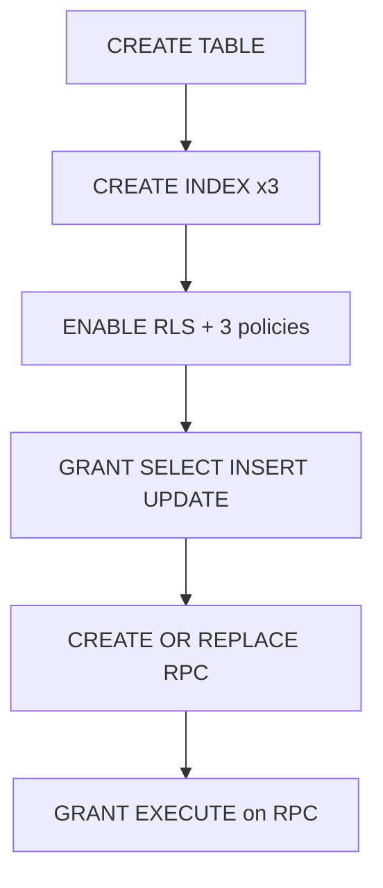

# KTS PR2 — Schema-only migration

## Scope

| In scope | Out of scope |
|----------|--------------|
| One new migration file | TypeScript / UI / `kts.service.ts` |
| Post-verify docs touch in [`docs/kts-architecture.md`](docs/kts-architecture.md) | `database.types.ts` (regenerate separately) |
| `bun run build` + `bun test` smoke | PR2.1 CRUD, PR2.2 detail UI |

**PR sequence context:** PR1 + PR1.5 shipped; this PR is schema foundation for correction rounds (one row per round; `received_at` null = open).

---

## Migration file

**Path:** [`supabase/migrations/20260610120000_kts_corrections.sql`](supabase/migrations/20260610120000_kts_corrections.sql)

**Timestamp rationale:** Latest existing file is `20260608140100_update_shift_day_summaries.sql`; use `20260610120000` (today, after all prior migrations). Convention: `YYYYMMDDHHMMSS_description.sql`.

**Down migration:** Not required — project convention is forward-only; occasional `-- ROLLBACK` comment blocks exist but are not executed.

### Section order (strict)



#### 1. Table

Exact DDL from spec:

- `public.kts_corrections` with FKs: `company_id → companies(id) ON DELETE CASCADE`, `trip_id → trips(id) ON DELETE CASCADE`, `created_by → auth.users(id) ON DELETE SET NULL`
- Columns: `id`, `company_id`, `trip_id`, `sent_to` (NOT NULL), `sent_at` (NOT NULL), `received_at` (nullable), `notes`, `created_at`, `created_by`

Aligns with existing tenant model: [`trips.company_id`](src/types/database.types.ts) references `companies`; `trips.created_by` is `text` but correction audit uses `uuid → auth.users` per spec.

#### 2. Indexes (unnamed — Postgres auto-names)

```sql
CREATE INDEX ON public.kts_corrections (trip_id);
CREATE INDEX ON public.kts_corrections (company_id);
CREATE INDEX ON public.kts_corrections (trip_id, created_at DESC);
```

Composite `(trip_id, created_at DESC)` supports `DISTINCT ON (trip_id) … ORDER BY trip_id, created_at DESC` in the RPC.

#### 3. RLS

```sql
ALTER TABLE public.kts_corrections ENABLE ROW LEVEL SECURITY;
```

Three policies — **no DELETE policy** (append-only; rows removed only via `ON DELETE CASCADE` from `trips` / `companies`).

**Subquery style:** Match [`20260405100000_billing_pricing_rules.sql`](supabase/migrations/20260405100000_billing_pricing_rules.sql) / [`20260404103000_no_invoice_fremdfirma_recurring.sql`](supabase/migrations/20260404103000_no_invoice_fremdfirma_recurring.sql) — aliased accounts lookup:

```sql
company_id = (SELECT a.company_id FROM public.accounts a WHERE a.id = auth.uid())
```

Policies (names from spec):

| Policy | Operation | Clause |
|--------|-----------|--------|
| `kts_corrections_select` | SELECT | `USING (...)` |
| `kts_corrections_insert` | INSERT | `WITH CHECK (...)` |
| `kts_corrections_update` | UPDATE | `USING (...)` only (same as `billing_pricing_rules_update_own`) |

Note: [`trip_presets`](supabase/migrations/20260514150000_trip_presets.sql) adds `current_user_is_admin()`; this migration follows **company-scoped** pattern (like `fremdfirmen`), not admin-only — per your spec.

#### 4. Table GRANT (user-confirmed addition)

After RLS policies, **before** the RPC:

```sql
GRANT SELECT, INSERT, UPDATE ON public.kts_corrections TO authenticated, service_role;
```

No `DELETE` grant — matches append-only RLS design.

#### 5. Summary RPC

`CREATE OR REPLACE FUNCTION public.trip_kts_correction_summaries(p_trip_ids uuid[])` — body exactly as specified (CTEs `latest` + `counts`, `DISTINCT ON` for latest round, join for count).

**Function attributes** — match [`20260530120000_controlling_rpcs.sql`](supabase/migrations/20260530120000_controlling_rpcs.sql):

```sql
LANGUAGE sql
STABLE
SECURITY DEFINER
SET search_path = public
```

**Trust model (document in kts-architecture.md):** Caller passes `trip_ids` from the RLS-protected trips list; function bypasses RLS on `kts_corrections` reads. Unlike controlling RPCs, no in-function `current_user_company_id()` guard — same class as deferred badge fetch described in [`docs/plans/kts-pr2-columns-audit.md`](docs/plans/kts-pr2-columns-audit.md). Optional hardening (JOIN `trips` + company filter) deferred to PR2.1 if needed.

**Empty input:** `p_trip_ids = '{}'` → zero rows (PostgreSQL `ANY` on empty array).

#### 6. RPC GRANT

Match invoice/controlling convention:

```sql
GRANT EXECUTE ON FUNCTION public.trip_kts_correction_summaries(uuid[])
  TO authenticated;
```

No `REVOKE FROM PUBLIC` — consistent with [`20260411140000_trip_ids_matching_invoice_effective_status.sql`](supabase/migrations/20260411140000_trip_ids_matching_invoice_effective_status.sql).

---

## Verification

### 1. Smoke (no TS changes)

```bash
bun run build
bun test   # expect 224 pass
```

### 2. Apply migration locally

```bash
supabase db push
# or: supabase migration up
```

### 3. SQL checks

```sql
-- Table + columns
\d public.kts_corrections

-- Indexes (expect 3)
SELECT indexname FROM pg_indexes WHERE tablename = 'kts_corrections';

-- RLS on, 3 policies, no DELETE
SELECT policyname, cmd FROM pg_policies WHERE tablename = 'kts_corrections';

-- RPC exists + empty array
SELECT * FROM public.trip_kts_correction_summaries(ARRAY[]::uuid[]);
```

### 4. Grants

```sql
SELECT grantee, privilege_type
FROM information_schema.role_table_grants
WHERE table_name = 'kts_corrections';
-- Expect SELECT, INSERT, UPDATE for authenticated + service_role; no DELETE
```

---

## Docs update (after migration verified)

**File:** [`docs/kts-architecture.md`](docs/kts-architecture.md) — **targeted edits only:**

### A. Data model (new subsection under §3 Trip persistence, or new §3.x)

Add `kts_corrections` satellite table:

- Purpose: one row per correction round; append-only history
- Column list (match migration)
- Indexes: `trip_id`, `company_id`, `(trip_id, created_at DESC)`
- RLS: SELECT / INSERT / UPDATE by `accounts.company_id`; no DELETE policy; cascade delete via trips/companies

### B. §7.2 roadmap row

Update PR2 line from pending to **shipped (schema)** — scope: table + RLS + `trip_kts_correction_summaries` RPC. Note CRUD/UI remain PR2.1 / PR2.2.

### C. §9 Implementation status

Add one line: **PR2 (2026-06):** `kts_corrections` migration + summary RPC.

### D. §10 Code map

New row:

- **KTS corrections (PR2):** `public.kts_corrections`; RPC `trip_kts_correction_summaries(uuid[])` → `(trip_id, correction_count, latest_sent_to, latest_sent_at, latest_received_at)`; `SECURITY DEFINER` + `SET search_path = public` for efficient aggregation when client passes visible trip IDs.

**Do not modify:** §7.1, §8, changelog footer, or other sections unless a single PR2 status word must align in §7.2 only.

---

## Files touched

| File | Action |
|------|--------|
| `supabase/migrations/20260610120000_kts_corrections.sql` | **Create** |
| `docs/kts-architecture.md` | **Update** (post-verify, sections above only) |

No other files.
