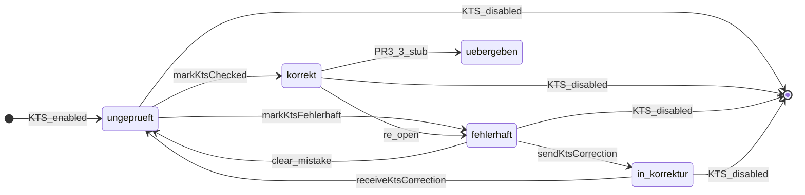

# KTS PR3.1 — `kts_status` enum implementation

## Context

Physical KTS document workflow needs an explicit current-state column on `trips`. [`docs/plans/kts-pr3-1-status-audit.md`](docs/plans/kts-pr3-1-status-audit.md) defines the schema, backfill, index, and service-layer sync strategy. This PR is **schema + service + insert paths + docs only** — PR3.2 (page UI) and PR3.3 (`kts_handovers`) are deferred.



**Sync invariant:** `kts_fehler = true` iff `kts_status IN ('fehlerhaft','in_korrektur')`; `null` status when KTS off.

---

## Step 1 — Migration (DB only)

Create [`supabase/migrations/20260610140000_kts_status.sql`](supabase/migrations/20260610140000_kts_status.sql):

1. `CREATE TYPE public.kts_status AS ENUM (...)` — five values including `uebergeben` for PR3.3
2. `ALTER TABLE trips ADD COLUMN kts_status public.kts_status DEFAULT NULL` + column comment
3. Backfill `UPDATE` (audit SQL): `NULL` when KTS off; `in_korrektur` when `kts_fehler` + open correction; `fehlerhaft` when `kts_fehler` only; else `ungeprueft` — **never** `korrekt` or `uebergeben`
4. Align `kts_fehler` with backfilled status
5. Partial index (matches [`20260514130000_trips_performance_indexes.sql`](supabase/migrations/20260514130000_trips_performance_indexes.sql) + [`20260404103000`](supabase/migrations/20260404103000_no_invoice_fremdfirma_recurring.sql) pattern):

```sql
CREATE INDEX IF NOT EXISTS idx_trips_company_kts_status
  ON public.trips (company_id, kts_status)
  WHERE kts_document_applies = true;
```

**No CHECK constraint** (per spec — pairing enforced in service).

**Transaction safety:** Supabase runs each migration file in a **single transaction** by default. Keep enum creation, `ALTER TABLE`, both backfill `UPDATE`s, and index creation in one file with no `COMMIT` splits — if the align step fails, enum + column roll back cleanly. The second `UPDATE` (align `kts_fehler`) scans all `kts_document_applies = true` rows; safe but potentially slow on large tables — acceptable for a one-time migration.

**Build gate:** `bun run build` (types unchanged; must still pass).

Apply locally if needed: `supabase db reset` or `supabase migration up`.

---

## Step 2 — Regenerate types

Run `bun run db:types` ([`package.json`](package.json) → `npx supabase gen types typescript --local`).

If CLI unavailable, manually patch [`src/types/database.types.ts`](src/types/database.types.ts):
- Add `kts_status` to `trips` Row / Insert / Update (nullable)
- Populate `Database['public']['Enums']['kts_status']` (currently empty `[ _ in never: never ]`)

**Build gate:** `bun run build`.

---

## Step 3 — Core service ([`kts.service.ts`](src/features/kts/kts.service.ts))

Read full file first. All changes extend existing exports; **do not alter behavior** for callers that omit `kts_status`.

### 3a. Type alias

```typescript
export type KtsStatus = Database['public']['Enums']['kts_status'];
```

Optionally export named constants (`KTS_STATUS_UNGEPRUEFT`, etc.) typed as `KtsStatus` to satisfy "no hardcoded strings" in transition functions.

### 3b. Extend `normalizeKtsPatch` — rules A–D **after** existing rules

Use the existing `result` object pattern (not mutating input `patch`):

| Rule | Trigger | Effect |
|------|---------|--------|
| **A** | KTS **enable-only** patch (see below) | `result.kts_status = 'ungeprueft'` |
| **B** | `kts_document_applies: false` | `result.kts_status = null` |
| **C** | `kts_status` non-null in patch | `result.kts_fehler = status ∈ {fehlerhaft, in_korrektur}` |
| **D** | `kts_status: null` in patch | `result.kts_fehler = false`, `result.kts_fehler_beschreibung = null` |

**Rule A — verified diff behaviour + refined trigger (pre-Step-3 gate):**

[`buildKtsPatchFromDrafts`](src/features/kts/kts.service.ts) uses a **proper diff**, not a naive “include all KTS fields” dump:

```109:115:src/features/kts/kts.service.ts
  if (
    ktsAppliesNext !== ktsAppliesWas ||
    input.ktsSourceForSave !== ktsSourceWas
  ) {
    rawPatch.kts_document_applies = ktsAppliesNext;
    rawPatch.kts_source = input.ktsSourceForSave;
  }
```

- **Detail sheet save, KTS already ON, no applies/source change:** `kts_document_applies` is **not** in `rawPatch` → Rule A does **not** fire → status untouched. **Correct.**
- **Fehler / beschreibung / patient ID only:** same — applies absent → Rule A silent. **Correct.**
- **`KtsSwitchCell` ON:** patch is `{ kts_document_applies: true }` only → Rule A should fire. **Correct.**

**Two edge cases require Rule A refinement (implement in Step 3b, not optional):**

1. **Source-only change while KTS stays ON:** the combined `|| ktsSourceForSave` condition puts `kts_document_applies: true` in the patch even when applies did not change → naive Rule A would reset status to `ungeprueft`. **Fix in `buildKtsPatchFromDrafts`:** split into two conditions — set `kts_document_applies` only when `ktsAppliesNext !== ktsAppliesWas`; set `kts_source` when applies **or** source changed.
2. **`paired-trip-sync.ts`** calls `normalizeKtsPatch({ kts_document_applies, kts_fehler, kts_fehler_beschreibung, kts_source })` on every partner sync (always includes applies). **Fix Rule A** to fire only on **enable-only** patches:

```typescript
// Rule A — KTS enable default; not every patch that happens to include applies:true
if (
  'kts_document_applies' in patch &&
  patch.kts_document_applies === true &&
  !('kts_status' in patch) &&
  !('kts_fehler' in patch) &&
  !('kts_fehler_beschreibung' in patch)
) {
  result.kts_status = KTS_STATUS_UNGEPRUEFT;
}
```

This matches `KtsSwitchCell` (applies only) and KTS-OFF→ON from detail sheet (applies + source, no fehler keys). Partner sync includes `kts_fehler` → Rule A skipped → partner status preserved unless fehler draft changes (PR3.2 will drive status via transition hooks instead).

Add required **why** comments (Rule A enable-only guard, Rule C ~40 read paths, etc.).

### 3c. `normalizeKtsInsert<T>(payload)`

Reset workflow fields on new rows; preserve `kts_document_applies`, `kts_source`, `kts_patient_id`:

- KTS off → `kts_status: null`, `kts_fehler: false`, `kts_fehler_beschreibung: null`
- KTS on → `kts_status: 'ungeprueft'`, `kts_fehler: false`, `kts_fehler_beschreibung: null`

### 3d. Transition functions

| Function | Patch / actions |
|----------|-----------------|
| `markKtsChecked(tripId)` | `{ kts_status: 'korrekt' }` via `updateTripKts` — does **not** clear beschreibung |
| `markKtsFehlerhaft(tripId, beschreibung)` | `{ kts_status: 'fehlerhaft', kts_fehler_beschreibung: trimmed }` |
| `sendKtsCorrection(supabase, payload)` | `insertKtsCorrection` then `updateTripKts({ kts_status: 'in_korrektur' })` — rethrow on trip failure after insert |
| `receiveKtsCorrection(supabase, payload)` | `closeKtsCorrection` then `updateTripKts({ kts_status: 'ungeprueft' })` |
| `markKtsUebergeben(tripId, handoverId)` | **Stub — throws** `"not implemented until PR3.3"` |

**Valid-from comments (no hard throws in PR3.1):** DB does not enforce the state machine. Transition functions get JSDoc noting **intended** source states; callers in PR3.2 must respect these. No runtime guard/throw yet (deferred to KTS-TEST-01 / PR3.2 UI).

| Function | Valid from (intended) | Invalid example |
|----------|----------------------|-----------------|
| `markKtsChecked` | `ungeprueft` | `in_korrektur` — paper is with issuer; must `receiveKtsCorrection` first |
| `markKtsFehlerhaft` | `ungeprueft`, `korrekt` (re-open) | `in_korrektur` |
| `sendKtsCorrection` | `fehlerhaft` | `ungeprueft` (use `markKtsFehlerhaft` first) |
| `receiveKtsCorrection` | `in_korrektur` (open round) | `fehlerhaft` (nothing sent yet) |

Document the full valid/invalid matrix in §3.4. **`markKtsChecked` on `in_korrektur` would silently write `korrekt`** — PR3.2 UI must not expose that action; comment warns future maintainers.

`insertKtsCorrection` / `closeKtsCorrection` remain unchanged.

### 3e. `buildKtsPatchFromDrafts` split (same Step 3)

Split applies vs source diff (see Rule A verification above) so source-only catalog re-resolution does not put unchanged `kts_document_applies: true` in the patch.

---

## Step 4 — Hooks + query keys

### [`src/query/keys/trips.ts`](src/query/keys/trips.ts)

Add (reserved for PR3.2; hooks invalidate `detail` + `all` today):

```typescript
ktsStatus: (tripId: string) =>
  [...tripKeys.detail(tripId), 'kts-status'] as const,
```

### New [`src/features/kts/hooks/use-kts-status.ts`](src/features/kts/hooks/use-kts-status.ts)

Four mutations mirroring [`use-kts-corrections.ts`](src/features/kts/hooks/use-kts-corrections.ts) structure:

- `useMarkKtsCheckedMutation`
- `useMarkKtsFehlerhaftMutation`
- `useSendKtsCorrectionMutation` — uses composed `sendKtsCorrection`
- `useReceiveKtsCorrectionMutation` — uses composed `receiveKtsCorrection`

Invalidate on success: `tripKeys.detail(tripId)`, `tripKeys.all`; correction hooks also `tripKeys.ktsCorrections(tripId)`.

### Update [`use-kts-corrections.ts`](src/features/kts/hooks/use-kts-corrections.ts)

Add `tripKeys.all` invalidation to `useInsertKtsCorrectionMutation` and `useCloseKtsCorrectionMutation` `onSuccess` (legacy hooks — status unchanged until callers migrate to composed hooks).

**Build gate:** `bun run build`.

---

## Step 5 — Detail sheet patch path

**Clarification vs spec:** [`build-trip-details-patch.ts`](src/features/trips/trip-detail-sheet/lib/build-trip-details-patch.ts) has **no** `kts_status` draft and must not change its signature (no UI in this PR). KTS persistence already flows through:

```97:107:src/features/trips/trip-detail-sheet/lib/build-trip-details-patch.ts
  Object.assign(
    patch,
    buildKtsPatchFromDrafts({ ... })
  );
```

**Action:** No functional change to `build-trip-details-patch.ts`. KTS ON/OFF cascades are handled by rules A/B when `buildKtsPatchFromDrafts` includes `kts_document_applies` in the raw patch. [`paired-trip-sync.ts`](src/features/trips/trip-detail-sheet/lib/paired-trip-sync.ts) already calls `normalizeKtsPatch` — same cascade applies to partner leg.

When PR3.2 adds status UI, extend `buildKtsPatchFromDrafts` + sheet drafts (not this PR).

**Build gate:** `bun run build`.

---

## Step 6 — Insert path normalization

Replace copy-and-sanitize with `normalizeKtsInsert` where new trip rows are created:

| File | Change |
|------|--------|
| [`duplicate-trips.ts`](src/features/trips/lib/duplicate-trips.ts) | In `copyRouteAndPassengerFields`, replace `normalizeKtsPatch(rawKts)` copy with `normalizeKtsInsert({ kts_document_applies, kts_source: 'manual', kts_patient_id: source.kts_patient_id ?? null })` — **stop copying** source `kts_fehler`/beschreibung/status |
| [`build-return-trip-insert.ts`](src/features/trips/lib/build-return-trip-insert.ts) | Replace `normalizeKtsPatch(rawKts)` with `normalizeKtsInsert` preserving outbound `kts_document_applies`, `kts_source`, `kts_patient_id` |
| [`recurring-trip-generator.ts`](src/lib/recurring-trip-generator.ts) | After `buildTripPayload` KTS fields (~L289), apply `normalizeKtsInsert` on payload or set via helper when `kts_document_applies` |
| [`create-trip-form.tsx`](src/features/trips/components/create-trip/create-trip-form.tsx) | Wrap KTS slice of `baseTrip` (~L1319–1322) with `normalizeKtsInsert` — replaces inline `ktsFehlerForDb` logic |
| [`bulk-upload-dialog.tsx`](src/features/trips/components/bulk-upload-dialog.tsx) | Apply `normalizeKtsInsert` at row insert (~L1020) where `kts_document_applies` is set |

Add **why** comments on duplicate/return (new document = fresh workflow).

**Build gate:** `bun run build`.

---

## Step 7 — Documentation (mandatory)

### [`docs/kts-architecture.md`](docs/kts-architecture.md)

- New **§3.4** — state machine (German labels, full transition table, `kts_fehler` sync, `kts_corrections` vs status, backfill rules, ON/OFF rules)
- Update §3 table, §3.2 duplicate/Rückfahrt, §7.1 service exports + rules A–D + `normalizeKtsInsert`, §7.2 roadmap (PR3.1 / PR3.2 / PR3.3), §9 status, §10 code map

### [`docs/plans/kts-pr3-1-status-audit.md`](docs/plans/kts-pr3-1-status-audit.md)

Mark complete; link to this implementation.

---

## Final verification

```bash
bun run build
bun test   # existing suite; KTS-TEST-01 unit tests deferred
```

Manual smoke (optional): apply migration → verify backfill counts per status; toggle KTS ON via list switch → row gets `ungeprueft`; duplicate KTS trip with fehler → duplicate starts `ungeprueft`.

---

## Hard rules checklist

- Enum values via `KtsStatus` type / typed constants — not bare strings in transition functions
- Do **not** remove or stop writing `kts_fehler` / `kts_fehler_beschreibung`
- Do **not** implement `kts_handovers`, page UI, or remove `KtsFehlerSwitchCell`
- `markKtsUebergeben` must throw
- Existing `normalizeKtsPatch` behavior preserved when `kts_status` omitted from patch

---

## Deferred (out of scope)

- `kts_handovers` + `kts_handover_id` (PR3.3)
- `/dashboard/kts` UI + filter tabs (PR3.2)
- Remove list `KtsFehlerSwitchCell` (post PR3.2)
- DB trigger safety net (post KTS-TEST-01)
- Unit tests for transitions (KTS-TEST-01)
- Partial unique index on open corrections
