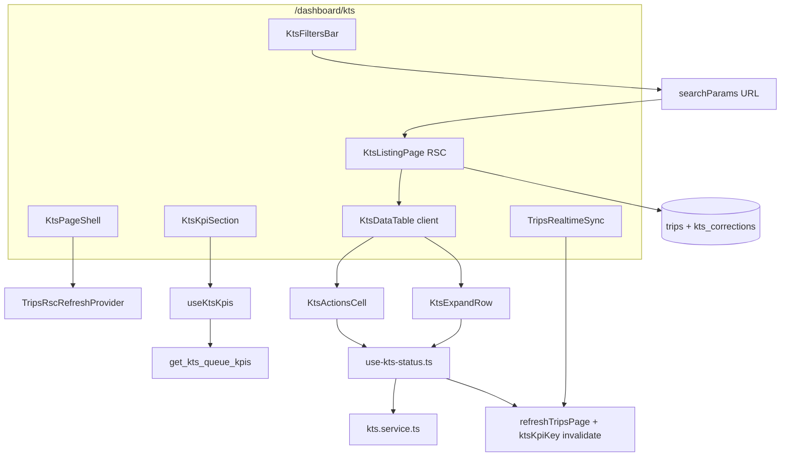

# KTS PR3.2 — Processing Queue Page

## Architecture



**Data flow:** URL params drive RSC query in [`kts-listing-page.tsx`](src/features/kts/components/kts-listing-page.tsx). Client table receives props; inline mutations call hooks → service → `refreshTripsPage()` + KPI invalidation.

**Locked product decisions (confirmed):**
- Single expand: `expandedRow: { id, mode } | null`
- Send inline: `sent_to` only; `sent_at` defaults in [`sendKtsCorrection`](src/features/kts/kts.service.ts)
- **Default filter:** `kts_status=ungeprueft` on first visit (mount effect like Fahrten `scheduled_at=today`)
- No date filter; sort `scheduled_at ASC` (oldest first)
- Überfällig KPI via mandatory RPC only

**Locked layout decision (confirmed):**
- **`page.tsx`** renders only `KtsKpiSection` + `Suspense(<KtsListingPage>)` (+ shell/realtime)
- **`KtsListingPage`** renders `KtsFiltersBar` + `KtsTable` — mirrors [`trips-listing.tsx`](src/features/trips/components/trips-listing.tsx) exactly so the RSC refresh cycle (`refreshTripsPage` → re-fetch listing → new table props) works identically to Fahrten

---

## Step 1 — Migration: `get_kts_queue_kpis`

**File:** [`supabase/migrations/20260610150000_kts_queue_kpis.sql`](supabase/migrations/20260610150000_kts_queue_kpis.sql)

Use the user-provided SQL body with these **required hardening** additions (mirror [`20260610125000_kts_rpc_tenant_guard.sql`](supabase/migrations/20260610125000_kts_rpc_tenant_guard.sql)):

- `SET search_path = public`
- Guard: `p_company_id = public.current_user_company_id()` AND `public.current_user_is_admin()` — return empty row or raise if unauthorized
- SQL comment referencing `KTS_OVERDUE_DAYS = 10` (constant lives in TS, not duplicated as magic number in comments only)

Add `KTS_OVERDUE_DAYS = 10` export to [`src/features/kts/kts.service.ts`](src/features/kts/kts.service.ts) in this step (single source for TS filters + docs).

**Types:** Manually extend [`src/types/database.types.ts`](src/types/database.types.ts) with RPC signature for `get_kts_queue_kpis` (same approach as PR3.1 enum patch if `bun run db:types` unavailable).

**Build gate:** `bun run build`

---

## Step 2 — `src/lib/kts-status.ts`

Create badge cva + `KTS_STATUS_LABELS` exactly as spec — mirror [`src/lib/trip-status.ts`](src/lib/trip-status.ts) cva pattern; import `KtsStatus` from [`kts.service.ts`](src/features/kts/kts.service.ts).

**Build gate:** `bun run build`

---

## Step 3 — URL parsers in [`src/lib/searchparams.ts`](src/lib/searchparams.ts)

Add to existing `searchParams` object (less invasive than separate cache):

| Param | Parser | Default |
| ----- | ------ | ------- |
| `kts_status` | `parseAsArrayOf(parseAsString, ',')` | no default (absent = parsed as empty) |
| `overdue` | `parseAsBoolean.withDefault(false)` | `false` |

Import `parseAsBoolean` from `nuqs/server` (first usage in repo). Reuse existing `search` parser unchanged.

**Build gate:** `bun run build`

---

## Step 4 — KPI hook + mutation invalidation

### [`src/features/kts/hooks/use-kts-kpis.ts`](src/features/kts/hooks/use-kts-kpis.ts)

- Export `ktsKpiKey = ['kts', 'kpis'] as const`
- `useKtsKpis()`: client Supabase `.rpc('get_kts_queue_kpis', { p_company_id })`
- **Company ID:** add small helper in same file or [`src/features/kts/hooks/use-kts-company-id.ts`](src/features/kts/hooks/use-kts-company-id.ts) — query `accounts.company_id` for `auth.uid()` (pattern from [`use-payers.ts`](src/features/payers/hooks/use-payers.ts) `getCompanyId`)

### Extend [`src/features/kts/kts.service.ts`](src/features/kts/kts.service.ts)

Add **`clearKtsMistake(tripId)`** — thin wrapper per architecture §3.4:

```typescript
return updateTripKts(tripId, {
  kts_status: KTS_STATUS_UNGEPRUEFT,
  kts_fehler: false,
  kts_fehler_beschreibung: null,
});
```

Do **not** change [`markKtsFehlerhaft`](src/features/kts/kts.service.ts) (empty beschreibung would still set `fehlerhaft`).

### Extend [`src/features/kts/hooks/use-kts-status.ts`](src/features/kts/hooks/use-kts-status.ts)

- Add `useClearKtsMistakeMutation()` calling `clearKtsMistake`
- In **all five** mutation hooks' `onSuccess`: `invalidateQueries({ queryKey: ktsKpiKey })` alongside existing `tripKeys` invalidation
- Add optional `useOptionalTripsRscRefresh()` + call `refreshTripsPage()` when context exists (keeps detail sheet safe outside KTS route)

**Six service transitions:** wire 5 in UI; `markKtsUebergeben` remains stub (PR3.3).

**Build gate:** `bun run build`

---

## Step 5 — [`src/features/kts/components/kts-kpi-section.tsx`](src/features/kts/components/kts-kpi-section.tsx)

Four [`StatsCard`](src/features/dashboard/components/stats-card.tsx) in `grid grid-cols-2 lg:grid-cols-4 gap-4` (match invoice layout). Props per spec; `useKtsKpis()`.

---

## Step 6 — [`src/features/kts/components/kts-table/kts-expand-row.tsx`](src/features/kts/components/kts-table/kts-expand-row.tsx)

Client component; modes `fehler` | `send`:

- **`fehler`:** `useMarkKtsFehlerhaftMutation` → trim validation → `onClose()` on success
- **`send`:** `useSendKtsCorrectionMutation` with `{ tripId, companyId, sentTo }` only
- Enter confirms, Escape cancels; spinner + inline error; dashed panel styling
- After success: `refreshTripsPage()` if provider present

Define shared **`KtsTripRow`** type in [`src/features/kts/types/kts-trip-row.ts`](src/features/kts/types/kts-trip-row.ts) (trip + corrections embed shape).

---

## Step 7 — [`src/features/kts/components/kts-table/kts-actions-cell.tsx`](src/features/kts/components/kts-table/kts-actions-cell.tsx)

| Status | Actions |
| ------ | ------- |
| `ungeprueft` | ✓ `markKtsChecked` direct; ✗ open expand `fehler` |
| `fehlerhaft` | Send → expand `send`; clear → `clearKtsMistake` |
| `in_korrektur` | Erhalten → `receiveKtsCorrection` (see invariant below) |
| `korrekt` | Re-open → open expand `fehler` (needs description) |
| `uebergeben` | read-only |

Use lucide icons directly (Check, X, Send, RotateCcw, AlertCircle) + Tooltip — no new `icons.tsx` keys required.

### Hard invariant — `receiveKtsCorrection` requires open correction ID

[`receiveKtsCorrection`](src/features/kts/kts.service.ts) takes `{ tripId, correctionId, receivedAt? }` and calls `closeKtsCorrection` — it **cannot** succeed without a correction row id.

**RSC contract:** [`kts-listing-page.tsx`](src/features/kts/components/kts-listing-page.tsx) select **must** embed:

```typescript
kts_corrections(id, sent_at, received_at, sent_to)
```

**Actions cell contract:**

```typescript
const openRound = trip.kts_corrections?.find((r) => r.received_at == null);
// Guard before mutation — disable button or toast if missing:
if (!openRound?.id) return; // do not call receiveKtsCorrection
await receiveMutation.mutateAsync({
  tripId: trip.id,
  correctionId: openRound.id,
});
```

If embed is missing or no open round exists, the **Erhalten** button must be **disabled** with a tooltip (e.g. "Keine offene Korrektur") — never fire the mutation with a null/undefined `correctionId`.

---

## Step 8 — [`src/features/kts/components/kts-table/kts-columns.tsx`](src/features/kts/components/kts-table/kts-columns.tsx)

Export **`createKtsColumns(ctx)`** factory accepting `{ expandedRow, setExpandedRow }` since column defs need expand state.

Columns: `scheduled_at`, `client_name` (fallback `kts_patient_id`), `kts_patient_id`, route (`pickup_address` → `dropoff_address` via [`parseTripAddressForDataTable`](src/features/trips/lib/format-trip-address-display-line)), `kts_status` badge + aging days for `in_korrektur`, `actions`.

Aging: compute days from open correction `sent_at` in embed (client-side pick open round).

---

## Step 9 — [`src/features/kts/components/kts-table/kts-data-table.tsx`](src/features/kts/components/kts-table/kts-data-table.tsx)

Fork [`data-table.tsx`](src/components/ui/table/data-table.tsx) with these changes:

1. **`expandedRow` state** at table level; pass to `createKtsColumns`
2. After each data `<TableRow>`, conditional expand `<TableRow><TableCell colSpan={...}><KtsExpandRow /></TableCell></TableRow>`
3. Table-level Escape handler (when focus not in input)
4. **Remove DnD** (`DndContext`, `DraggableTableHeader`, `DragAlongCell`) — use plain `TableHead`/`TableCell` for fixed KTS columns
5. Keep ScrollArea, pagination, row hover, `data-table-row-id`

Wire [`useDataTable`](src/hooks/use-data-table.ts) with `pageCount`, `getRowId: (row) => row.id`, `shallow: false`, manual pagination (same as [`TripsTable`](src/features/trips/components/trips-tables/index.tsx)).

Add thin wrapper [`kts-table/index.tsx`](src/features/kts/components/kts-table/index.tsx) exporting `KtsTable` (client) accepting `data`, `totalItems`.

**Do not modify** original `data-table.tsx`.

---

## Step 10 — [`src/features/kts/components/kts-filters-bar.tsx`](src/features/kts/components/kts-filters-bar.tsx)

Mirror [`trips-filters-bar.tsx`](src/features/trips/components/trips-filters-bar.tsx) URL pattern:

- `useSearchParams` + `URLSearchParams` + `router.replace` + `refreshTripsPage()`
- **Mount default:** if `kts_status` absent, set `kts_status=ungeprueft` + `page=1` (one-time, empty deps like Fahrten lines 163–173)
- Multi-select status badges/toggles → `kts_status` comma array
- Debounced search → `search` param
- Overdue Switch → `overdue=true`
- Reset clears all three + refresh

Props: `{ totalItems: number }` for count display (optional label).

---

## Step 11 — [`src/features/kts/components/kts-listing-page.tsx`](src/features/kts/components/kts-listing-page.tsx)

RSC — fork pattern from [`trips-listing.tsx`](src/features/trips/components/trips-listing.tsx).

### Layout (locked)

`KtsListingPage` owns the full list shell — same as Fahrten:

```tsx
return (
  <div className='flex min-h-0 min-w-0 flex-1 flex-col space-y-4 overflow-hidden'>
    <KtsFiltersBar totalItems={totalTrips} />
    <KtsTable data={trips} totalItems={totalTrips} />
  </div>
);
```

`page.tsx` does **not** render `KtsFiltersBar` — only `KtsKpiSection` + `Suspense(<KtsListingPage>)`.

### Select string (required fields)

```typescript
const ktsListSelect = `
  *,
  kts_corrections(id, sent_at, received_at, sent_to)
`;
```

The `kts_corrections.id` embed is **mandatory** — used by the actions cell for `receiveKtsCorrection` and by the status column for aging. Do not omit or slim down this embed.

**Always:** `.eq('kts_document_applies', true)`

**Filters from `searchParamsCache`:**
- `kts_status` non-empty → `.in('kts_status', values)`
- `search` → `.or('client_name.ilike...,kts_patient_id.ilike...')` (escape quotes like trips)

### Overdue filter — two-query approach (primary; do not rely on embed)

PostgREST embed filters with date conditions on related tables (`!inner` + `sent_at < cutoff`) are **unreliable across Supabase/PostgREST versions**. An incorrect embed filter silently returns **all** `in_korrektur` rows instead of only overdue ones — unacceptable for a filter toggle.

**Implement the overdue branch as a two-query pattern:**

```typescript
if (overdue) {
  const cutoff = new Date(
    Date.now() - KTS_OVERDUE_DAYS * 24 * 60 * 60 * 1000
  ).toISOString();

  // Query 1: distinct overdue trip IDs from kts_corrections (source of truth for sent_at)
  const { data: overdueRows, error: overdueError } = await supabase
    .from('kts_corrections')
    .select('trip_id')
    .is('received_at', null)
    .lt('sent_at', cutoff);

  if (overdueError) throw toQueryError(overdueError);

  const overdueTripIds = [
    ...new Set((overdueRows ?? []).map((r) => r.trip_id))
  ];

  // Empty set → skip main query (same pattern as invoice filter in trips-listing)
  if (overdueTripIds.length === 0) {
    trips = [];
    totalTrips = 0;
    // ... render empty table
  } else {
    // Query 2: trips constrained to overdue IDs + in_korrektur status
    query = query
      .eq('kts_status', 'in_korrektur')
      .in('id', overdueTripIds);
  }
}
```

**Do not** attempt `.not('kts_corrections', 'is', null)` or embed date filters as the primary path. If a future RPC/view is added (e.g. `kts_overdue_trip_ids()`), it can replace Query 1 — but PR3.2 ships with the two-query fallback above.

**Sort:** `.order('scheduled_at', { ascending: true })` default

**Pagination:** `page` + `perPage` `.range(from, to)` with `{ count: 'exact' }`

**No `company_id` filter** — RLS only (matches trips listing).

---

## Step 12 — Page route

### [`src/app/dashboard/kts/kts-page-shell.tsx`](src/app/dashboard/kts/kts-page-shell.tsx)

Identical to [`fahrten-page-shell.tsx`](src/app/dashboard/trips/fahrten-page-shell.tsx) — wraps `TripsRscRefreshProvider`.

### [`src/app/dashboard/kts/page.tsx`](src/app/dashboard/kts/page.tsx)

Follow [`trips/page.tsx`](src/app/dashboard/trips/page.tsx):

```tsx
export const dynamic = 'force-dynamic';
export const metadata = { title: 'Dashboard: KTS' };
```

Structure (locked — filters live in listing, not here):

```tsx
<KtsPageShell>
  <PageContainer
    scrollable={false}
    pageTitle='KTS'
    pageDescription='Belegprüfung und Korrekturverwaltung'
  >
    <KtsKpiSection />
    <Suspense fallback={<DataTableSkeleton columnCount={6} rowCount={10} filterCount={2} />}>
      <KtsListingPage searchParams={searchParams} />
    </Suspense>
    <TripsRealtimeSync />
  </PageContainer>
</KtsPageShell>
```

- `KtsFiltersBar` is **inside** `KtsListingPage` only (Fahrten parity)
- Use `PageContainer` `pageTitle`/`pageDescription` — no duplicate manual `<h1>`

---

## Step 13 — Nav entry

In [`src/config/nav-config.ts`](src/config/nav-config.ts), insert after Fahrten:

```typescript
{
  title: 'KTS',
  url: '/dashboard/kts',
  icon: 'post',        // valid in icons.tsx (IconFileText)
  shortcut: ['k', 's'], // unused
  isActive: false,
  items: []
}
```

---

## Step 14 — Realtime

Mount [`TripsRealtimeSync`](src/features/trips/components/trips-realtime-sync.tsx) in `page.tsx` inside `KtsPageShell` — reuses `trips` INSERT/UPDATE channel + debounced `refreshTripsPage()`.

---

## Step 15 — Documentation (mandatory)

### [`docs/kts-architecture.md`](docs/kts-architecture.md)

- New **§3.5 PR3.2 page** — shell, RSC listing, KPI RPC, table, single-expand invariant, default `ungeprueft` filter rationale, no date filter rationale
- **§7.2 roadmap:** PR3.2 complete, PR3.3 next
- **§10 code map:** all new files

### [`docs/plans/kts-pr3-2-page-shell-audit.md`](docs/plans/kts-pr3-2-page-shell-audit.md)

Mark complete; link to this plan.

### Required inline comments

| File | Comment topic |
| ---- | ------------- |
| `kts-data-table.tsx` | single `expandedRow` not Set |
| `kts-expand-row.tsx` | one send field |
| `kts-listing-page.tsx` | corrections embed (incl. `id` for receive); no date filter; two-query overdue filter |
| `kts-actions-cell.tsx` | guard `correctionId` before `receiveKtsCorrection` |
| `kts-page-shell.tsx` | reuse TripsRscRefreshProvider |
| `use-kts-status.ts` | ktsKpiKey invalidation |
| `kts-filters-bar.tsx` | default ungeprueft on mount |

---

## Hard rules checklist

- Do **not** modify [`data-table.tsx`](src/components/ui/table/data-table.tsx), [`trips-listing.tsx`](src/features/trips/components/trips-listing.tsx), [`trips-filters-bar.tsx`](src/features/trips/components/trips-filters-bar.tsx), Fahrten inline cells
- All writes via [`kts.service.ts`](src/features/kts/kts.service.ts) + hooks only
- `KTS_OVERDUE_DAYS = 10` named constant — used in listing overdue two-query filter + RPC SQL comment
- Overdue list filter uses **two-query pattern** (kts_corrections → trip ids → trips `.in('id', …)`); never embed-only date filter
- RSC select **must** include `kts_corrections(id, …)`; actions cell **must** guard null open round before `receiveKtsCorrection`
- `KtsFiltersBar` only in `KtsListingPage`; `page.tsx` only KPI + Suspense listing
- `markKtsUebergeben` not wired; `uebergeben` rows read-only
- Final gate: **`bun run build`** (+ `bun test` if quick)

---

## File summary

| New | Purpose |
| --- | ------- |
| `supabase/migrations/20260610150000_kts_queue_kpis.sql` | KPI RPC |
| `src/lib/kts-status.ts` | Badge cva + labels |
| `src/app/dashboard/kts/page.tsx` | Route |
| `src/app/dashboard/kts/kts-page-shell.tsx` | Provider wrapper |
| `src/features/kts/components/kts-listing-page.tsx` | RSC query |
| `src/features/kts/components/kts-kpi-section.tsx` | KPI grid |
| `src/features/kts/components/kts-filters-bar.tsx` | URL filters |
| `src/features/kts/hooks/use-kts-kpis.ts` | KPI query |
| `src/features/kts/components/kts-table/*` | Table fork + columns + expand + actions |
| `src/features/kts/types/kts-trip-row.ts` | Row type |

| Modified | Change |
| -------- | ------ |
| `src/config/nav-config.ts` | KTS leaf |
| `src/lib/searchparams.ts` | `kts_status`, `overdue` |
| `src/features/kts/kts.service.ts` | `KTS_OVERDUE_DAYS`, `clearKtsMistake` |
| `src/features/kts/hooks/use-kts-status.ts` | `useClearKtsMistakeMutation`, KPI + refresh invalidation |
| `src/types/database.types.ts` | RPC types |
| `docs/kts-architecture.md` | §3.5, roadmap, code map |
| `docs/plans/kts-pr3-2-page-shell-audit.md` | complete |
