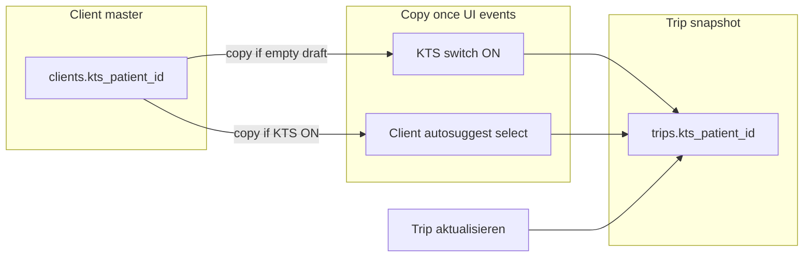

# KTS PR3 — Patient ID (`kts_patient_id`)

## Goal

Stable external patient identifier on **clients** (master) and **trips** (immutable snapshot for PR4 CSV matching). Snapshot is copied once at KTS enable or client selection—not read live on every render. **KTS OFF must never clear** `trips.kts_patient_id`.

## Architecture



Aligns with [`docs/trip-client-linking.md`](docs/trip-client-linking.md) (`client_name` / `client_phone` snapshots) and [`docs/plans/kts-module-b-patient-id-audit.md`](docs/plans/kts-module-b-patient-id-audit.md).

---

## Step 1 — Migration

**File:** [`supabase/migrations/20260610130000_kts_patient_id.sql`](supabase/migrations/20260610130000_kts_patient_id.sql) (next after `20260610120000_kts_corrections.sql`)

```sql
ALTER TABLE public.clients
  ADD COLUMN IF NOT EXISTS kts_patient_id text;

ALTER TABLE public.trips
  ADD COLUMN IF NOT EXISTS kts_patient_id text;

COMMENT ON COLUMN public.clients.kts_patient_id IS
  'External KTS patient ID from the accountant billing system; master value for client profile.';

COMMENT ON COLUMN public.trips.kts_patient_id IS
  'Snapshot of patient ID at KTS enable / client link time — stable for PR4 CSV matching; not cleared when KTS is turned off.';
```

**Gate:** `bun run build` (migration-only commit).

---

## Step 2 — Types

Run [`package.json`](package.json) script after applying migration locally:

```bash
bun run db:types
```

If CLI unavailable, manually add `kts_patient_id: string | null` to `clients` and `trips` **Row / Insert / Update** in [`src/types/database.types.ts`](src/types/database.types.ts) (same pattern as `kts_fehler_beschreibung`).

**Gate:** `bun run build`.

---

## Step 3 — ClientForm KTS section

**File:** [`src/features/clients/components/client-form.tsx`](src/features/clients/components/client-form.tsx)

- Add `kts_patient_id: z.string().optional()` to Zod schema; `defaultValues`: `initialData?.kts_patient_id ?? ''`.
- In `onSubmit`, trim like phone: `kts_patient_id: values.kts_patient_id?.trim() ? values.kts_patient_id.trim() : null` in payload spread.
- New section **between** “Weitere Angaben” and “Bezugszeichen” (after `relation`/`notes`, before `reference_field_rows`):
  - `SectionLabel`: **KTS**
  - `FormInput` with `name='kts_patient_id'`, label **KTS Patienten-ID**, placeholder `z. B. 123456`, `description` **Wird automatisch auf Fahrten übernommen, wenn KTS aktiv ist.**
  - Inline comment: why KTS sits between operational notes and invoice reference fields.
- Use existing `FormInput` + `description` prop (already renders `FormDescription` internally)—no new component imports.

**Gate:** `bun run build`.

---

## Step 4 — Client persistence

[`src/features/clients/api/clients.service.ts`](src/features/clients/api/clients.service.ts) is **pass-through** (`insert`/`update` accept `InsertClient` / `UpdateClient`). No service code change required once types + ClientForm payload include `kts_patient_id`.

**Verify:** create/update round-trip persists the field via existing `clientsService.updateClient` / `createClient`.

**Gate:** `bun run build`.

---

## Step 5 — KTS patch service

**File:** [`src/features/kts/kts.service.ts`](src/features/kts/kts.service.ts)

Extend `KtsDraftInput`:

```ts
ktsPatientIdDraft: string | null;
```

Add `normalizeKtsPatientIdStored()` (trim; empty → `null`) mirroring `normalizeKtsFehlerBeschreibungStored`.

In `buildKtsPatchFromDrafts`:

- Diff `normalizeKtsPatientIdStored(input.ktsPatientIdDraft)` vs `normalizeKtsPatientIdStored(trip.kts_patient_id)`.
- If different, set `rawPatch.kts_patient_id`.
- Include when `kts_document_applies` is true **or** transitioning to true **or** draft differs while snapshot should persist (covers: auto-populated draft + user toggles KTS off before save—snapshot must still save per hard rule).

In `normalizeKtsPatch`:

- If `'kts_patient_id' in patch`, trim empty → `null`.
- **Do not** add `kts_patient_id` to the `kts_document_applies === false` cascade (comment: PR4 CSV stability).
- Inline comment on why OFF does not clear patient ID.

**Out of scope:** `kts_corrections` insert path unchanged.

**Gate:** `bun run build`.

---

## Step 6 — Detail patch builder

**File:** [`src/features/trips/trip-detail-sheet/lib/build-trip-details-patch.ts`](src/features/trips/trip-detail-sheet/lib/build-trip-details-patch.ts)

- Add `ktsPatientIdDraft: string | null` to `BuildTripDetailsPatchInput`.
- Pass through to `buildKtsPatchFromDrafts`.

**Gate:** `bun run build`.

---

## Step 7 — Trip detail sheet

**File:** [`src/features/trips/trip-detail-sheet/trip-detail-sheet.tsx`](src/features/trips/trip-detail-sheet/trip-detail-sheet.tsx)

### 7a — Draft state + hydration

```ts
const [ktsPatientIdDraft, setKtsPatientIdDraft] = useState('');
```

In existing trip hydration `useEffect`: `setKtsPatientIdDraft(trip.kts_patient_id ?? '')`.

Add to `detailsDirty` (after KTS fehler checks):

```ts
normalizeNotes(ktsPatientIdDraft) !== normalizeNotes(trip.kts_patient_id ?? '')
```

Pass `ktsPatientIdDraft` into both `buildTripDetailsPatch` call sites (~lines 1014 and paired-sync path if it uses `buildKtsPatchFromDrafts` indirectly—paired sync does **not** include patient ID; leave unchanged).

### 7b — Client search support (required, not in original file list)

[`src/features/trips/types/trip-form-reference.types.ts`](src/features/trips/types/trip-form-reference.types.ts): add `kts_patient_id: string | null` to `ClientOption`.

[`src/features/trips/hooks/use-trip-form-data.ts`](src/features/trips/hooks/use-trip-form-data.ts): append `kts_patient_id` to `.select(...)` in `searchClients`, `searchClientsByFirstName`, `searchClientsByLastName`, `searchClientsById`.

### 7c — Auto-populate

**`handleTripClientSelect`:** after existing assignments:

```ts
if (ktsDocumentAppliesDraft && client?.kts_patient_id) {
  setKtsPatientIdDraft(client.kts_patient_id);
}
```

**KTS switch `onCheckedChange`**, when `c === true`:

```ts
const embed = trip?.clients;
const embedId =
  embed && typeof embed === 'object' && !Array.isArray(embed) && 'id' in embed
    ? (embed as ClientOption).id
    : null;
if (
  clientIdDraft &&
  embedId === clientIdDraft &&
  (embed as ClientOption).kts_patient_id &&
  !ktsPatientIdDraft.trim()
) {
  setKtsPatientIdDraft((embed as ClientOption).kts_patient_id!);
}
```

Comment: copy at operational moment, not on render; guard `embedId === clientIdDraft` so unsaved client changes do not copy wrong embed.

### 7d — UI placement (user-confirmed)

Inside `{ktsDocumentAppliesDraft ? ( ... )}`, order:

1. KTS-Fehler switch
2. `kts_fehler_beschreibung` textarea (if `ktsFehlerDraft`)
3. **`kts_patient_id` block** (always when KTS ON—not gated on fehler)
4. `KtsCorrectionTimeline` + form (existing `ktsFehlerDraft` gate unchanged)

**STATE A** (`clientIdDraft` set): read-only text + `Link` from `next/link` (add import—file does not have it today; same pattern as [`recurring-rules-columns.tsx`](src/features/recurring-rules/components/recurring-rules-columns.tsx)):

- Empty: muted “Keine Patienten-ID hinterlegt” + link **Patienten-ID im Kundenprofil hinterlegen →** → `/dashboard/clients/${clientIdDraft}`
- Non-empty: value + **Kundenprofil öffnen →**

Classes: `text-sm text-muted-foreground hover:underline`.

**STATE B** (`clientIdDraft` empty): editable `Input`, label **KTS Patienten-ID**, placeholder **Patienten-ID eingeben**.

### 7e — Save path

`handleSaveTripDetails` → `buildTripDetailsPatch({ ..., ktsPatientIdDraft: ktsPatientIdDraft.trim() || null })`.

**Gate:** `bun run build`.

---

## Step 8 — Documentation (mandatory)

### [`docs/kts-architecture.md`](docs/kts-architecture.md)

- New §3.x: `clients.kts_patient_id` (master) + `trips.kts_patient_id` (snapshot).
- Snapshot rationale for PR4 CSV.
- UI rules: linked client = read-only + profile link; name-only = editable.
- Update §7.2 roadmap: **PR3 shipped** (patient ID); renumber/replace old “accountant gate” PR3 row—move accountant gate to deferred/future PR if still planned; **PR4 next** (CSV import per product context).

### [`docs/plans/kts-module-b-patient-id-audit.md`](docs/plans/kts-module-b-patient-id-audit.md)

- Mark audit **complete**; link to this PR3 implementation.

### Step 8c — Track deferred RPC tenant guard (security backlog)

**Why now:** PR2 shipped `trip_kts_correction_summaries` as `SECURITY DEFINER` without an in-function `current_user_company_id()` guard ([`kts_pr2_schema` plan](.cursor/plans/kts_pr2_schema_51cbc82c.plan.md) line 116: “deferred to PR2.1 if needed”). PR2.1 shipped CRUD without hardening. The RPC is **not yet called from app code** (PR2.1.1 list badges), but once wired—or if any caller passes `trip_ids` not sourced from an RLS-scoped trips query—a malicious client could aggregate correction metadata across tenants.

**Create** [`docs/plans/kts-rpc-tenant-guard-deferred.md`](docs/plans/kts-rpc-tenant-guard-deferred.md) with:

| Field | Value |
| ----- | ----- |
| **ID** | `KTS-SEC-01` |
| **Status** | Open (deferred) |
| **Target PR** | Before PR2.1.1 (list badges) or any bulk caller — **not** optional “if needed” |
| **RPC** | `public.trip_kts_correction_summaries(p_trip_ids uuid[])` |
| **Migration** | `20260610120000_kts_corrections.sql` |
| **Risk** | `SECURITY DEFINER` reads `kts_corrections` without RLS; input `p_trip_ids` is caller-controlled |
| **Fix** | Mirror [`20260530120000_controlling_rpcs.sql`](supabase/migrations/20260530120000_controlling_rpcs.sql): guard with `current_user_is_admin()` + `current_user_company_id()`; filter via `JOIN public.trips t ON t.id = kc.trip_id AND t.company_id = current_user_company_id()` (or equivalent `company_id` match on `kts_corrections.company_id`) |
| **Call-site contract** | Document that callers must still pass IDs from RLS-visible trips; defense-in-depth is the RPC guard |
| **Related** | [`docs/plans/kts-pr2-columns-audit.md`](docs/plans/kts-pr2-columns-audit.md) §RPC summary; [`docs/access-control.md`](docs/access-control.md) tenant guard pattern |

### Step 8d — Architecture doc deferred section

In [`docs/kts-architecture.md`](docs/kts-architecture.md), add **§7.3 Deferred / security backlog** (or extend §3.3 RPC notes):

- One-row table entry: `KTS-SEC-01` → link to `docs/plans/kts-rpc-tenant-guard-deferred.md`
- State explicitly: **do not ship PR2.1.1** (or bulk correction queries) until `KTS-SEC-01` is closed

**Process rule (for all future KTS plans):** Any deferred **security** item gets an ID + row in `docs/plans/*-deferred.md` and a pointer in `kts-architecture.md` §7.3 — not only a migration-plan comment.

---

## Explicitly out of scope

- `kts_corrections` changes
- PR4 CSV / `kts_invoice_imports`
- “Vom Kundenprofil übernehmen” sync button
- Unit tests (deferred)
- **RPC tenant guard implementation** (`KTS-SEC-01`) — tracked in Step 8c/8d; migration not in this PR
- [`paired-trip-sync.ts`](src/features/trips/trip-detail-sheet/lib/paired-trip-sync.ts) — do not sync `kts_patient_id` to partner leg
- Moving `KtsCorrectionTimeline` outside `kts_fehler` gate (PR2.2 behaviour preserved)

---

## Verification checklist

After all steps:

```bash
bun run build
bun test
```

Manual smoke:

1. Client form: save `kts_patient_id`, reload, value persists.
2. Trip with linked client + KTS ON: toggle ON copies ID; read-only display + profile link.
3. Name-only trip + KTS ON: editable field saves on **Trip aktualisieren**.
4. KTS OFF: `kts_patient_id` remains on trip row after save (DB + re-open sheet).
5. Edit client `kts_patient_id` after trip saved: trip snapshot unchanged.
