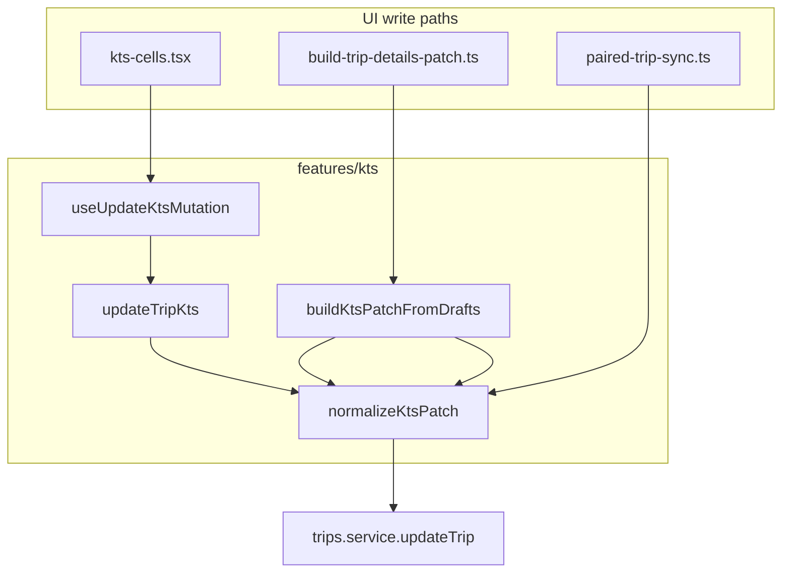

# KTS Service Layer (PR1) — Implementation Plan

## Goal

Single write authority for KTS trip columns (`kts_document_applies`, `kts_source`, `kts_fehler`, `kts_fehler_beschreibung`). No schema changes. No layout changes. One **intentional** behaviour fix: inline KTS switch **on** will persist `kts_source: 'manual'` (today [`kts-cells.tsx`](src/features/trips/components/trips-tables/inline-cells/kts-cells.tsx) line 210 only sets `kts_document_applies: true`).

## Architecture (after PR1)



**Out of scope (unchanged this PR):** [`create-trip-form.tsx`](src/features/trips/components/create-trip/create-trip-form.tsx), [`duplicate-trips.ts`](src/features/trips/lib/duplicate-trips.ts), [`build-return-trip-insert.ts`](src/features/trips/lib/build-return-trip-insert.ts), [`recurring-trip-generator.ts`](src/lib/recurring-trip-generator.ts), bulk upload.

---

## Adaptation vs spec (read before coding)

### 1. `updateTripKts` signature

[`tripsService.updateTrip`](src/features/trips/api/trips.service.ts) is `(id: string, trip: UpdateTrip)` and calls `createClient()` internally (lines 108–109). It does **not** accept a `SupabaseClient`, and [`trips.service.ts`](src/features/trips/api/trips.service.ts) is **not** in the files-changed table.

**Implement:**

```ts
export async function updateTripKts(
  tripId: string,
  patch: Partial<UpdateTrip>
): Promise<Trip>
```

- Calls `normalizeKtsPatch(patch)` then `tripsService.updateTrip(tripId, normalized as UpdateTrip)`.
- Throws via existing `toQueryError` chain (same as today).

The hook will **not** pass `supabase`; this matches [`invoices.api.ts`](src/features/invoices/api/invoices.api.ts) (service owns the client).

### 2. `buildKtsPatchFromDrafts` line range

In [`build-trip-details-patch.ts`](src/features/trips/trip-detail-sheet/lib/build-trip-details-patch.ts), KTS logic is **two blocks**, not contiguous 101–140:

| Lines | Content |
|-------|---------|
| 101–110 | `kts_document_applies` + `kts_source` diff |
| 111–122 | **no_invoice / reha** — stay in patch builder |
| 123–140 | `kts_fehler` + `kts_fehler_beschreibung` diff |

Move only 101–110 and 123–140 into the service. Move private helper `normalizeKtsFehlerBeschreibungStored` (lines 77–82) into `kts.service.ts`.

### 3. Partner sync is snapshot, not diff

[`buildPartnerSyncPatchFromDrafts`](src/features/trips/trip-detail-sheet/lib/paired-trip-sync.ts) (lines 261–266) assigns **full draft values** to the partner leg—it does not diff against the partner row.

**Do not** call `buildKtsPatchFromDrafts` there (that function diffs against `trip`).

**Do** replace lines 261–266 with spreading the result of:

```ts
normalizeKtsPatch({
  kts_document_applies: input.ktsDocumentAppliesDraft,
  kts_fehler: input.ktsFehlerDraft,
  kts_fehler_beschreibung: input.ktsFehlerBeschreibungDraft, // cascade + trim inside normalize
  kts_source: input.ktsSourceForSave
})
```

`PAIRED_SYNC_COLUMN_KEYS` (lines 53–56) stays unchanged—only construction moves to the service.

### 4. Types

Use existing exports from [`trips.service.ts`](src/features/trips/api/trips.service.ts):

- `UpdateTrip` (not `TripUpdate`)
- `Trip` (not `TripRow`)

Define `KTS_SOURCE_MANUAL = 'manual' as const` in `kts.service.ts` (reuse [`TripKtsSource`](src/features/trips/lib/resolve-kts-default.ts) where helpful).

---

## Step 1 — Create [`src/features/kts/kts.service.ts`](src/features/kts/kts.service.ts)

**Exports (exactly three):**

### `normalizeKtsPatch(patch: Partial<UpdateTrip>): Partial<UpdateTrip>`

Pure, immutable (spread into new object). Rules:

1. If `'kts_document_applies' in patch` and value is `false` → add `kts_fehler: false`, `kts_fehler_beschreibung: null`.
2. If `'kts_fehler' in patch` and value is `false` → add `kts_fehler_beschreibung: null`.
3. If `'kts_document_applies' in patch` and value is `true` and `'kts_source' not in patch` → add `kts_source: KTS_SOURCE_MANUAL`.
4. If `'kts_fehler_beschreibung' in patch` → trim; empty string → `null`.

Use `'key' in patch` (not truthiness) so explicit `false`/`null` trigger cascades.

### `buildKtsPatchFromDrafts(input: KtsDraftInput): Partial<UpdateTrip>`

Local type (service file only):

```ts
interface KtsDraftInput {
  trip: Trip;
  ktsDocumentAppliesDraft: boolean;
  ktsFehlerDraft: boolean;
  ktsFehlerBeschreibungDraft: string;
  ktsSourceForSave: string;
}
```

Port diff logic from patch builder (current 101–110, 123–140): only include keys that changed vs `trip`; then `return normalizeKtsPatch(rawPatch)`.

### `updateTripKts(tripId, patch)`

As adapted above.

**Imports allowed:** `tripsService`, `UpdateTrip`, `Trip` from trips API; no React, no hooks.

**Inline comments:** why pure normalize (testable, single cascade SSOT); why `manual` on user toggle-on; why trim→null on beschreibung.

**Gate:** `bun run build`

---

## Step 2 — Create [`src/features/kts/hooks/use-update-kts-mutation.ts`](src/features/kts/hooks/use-update-kts-mutation.ts)

Mirror [`use-update-trip-mutation.ts`](src/features/trips/hooks/use-update-trip-mutation.ts) exactly:

| Concern | Match existing |
|---------|----------------|
| `mutationFn` | `({ id, patch }) => updateTripKts(id, patch)` |
| `onMutate` | optimistic merge into `tripKeys.detail(id)` |
| `onError` | rollback `previousTrip` |
| `onSettled` | invalidate `tripKeys.detail(id)` + `tripKeys.all` |

Not consumed until Step 3.

**Gate:** `bun run build`

---

## Step 3 — Wire [`kts-cells.tsx`](src/features/trips/components/trips-tables/inline-cells/kts-cells.tsx)

| Cell | Change |
|------|--------|
| `KtsSwitchCell` on | `useUpdateKtsMutation` with `{ kts_document_applies: true }` only; normalize adds `kts_source` |
| `KtsSwitchCell` off | `useUpdateKtsMutation` with `{ kts_document_applies: false }` only; remove manual cascade object (lines 215–218) |
| `KtsFehlerSwitchCell` | `useUpdateKtsMutation` with `{ kts_fehler: true/false }`; remove inline `kts_fehler_beschreibung: null` (lines 257) |
| `KtsFehlerTextCell` | Keep `useTripFieldUpdate` + 1500ms debounce; in `debouncedPersist`, `const { kts_fehler_beschreibung } = normalizeKtsPatch({ kts_fehler_beschreibung: v \|\| null })` then `updateField(..., kts_fehler_beschreibung)` |

Remove unused `useUpdateTripMutation` / `useTripFieldUpdate` imports where no longer needed (`KtsSwitchCell` may drop `useTripFieldUpdate` entirely).

**Do not touch** `KtsCellGroupProvider` / `useSyncExternalStore` optimistic stores.

**Gate:** `bun run build && bun test` (existing suite under `src/features/trips/lib/__tests__` + invoices paths per [`package.json`](package.json))

---

## Step 4 — Wire patch builder + paired sync

### [`build-trip-details-patch.ts`](src/features/trips/trip-detail-sheet/lib/build-trip-details-patch.ts)

Replace KTS blocks with:

```ts
Object.assign(patch, buildKtsPatchFromDrafts({
  trip,
  ktsDocumentAppliesDraft: input.ktsDocumentAppliesDraft,
  ktsFehlerDraft: input.ktsFehlerDraft,
  ktsFehlerBeschreibungDraft: input.ktsFehlerBeschreibungDraft,
  ktsSourceForSave: input.ktsSourceForSave
}));
```

Delete local `normalizeKtsFehlerBeschreibungStored`. Add delegation comment at call site.

Detail sheet still saves via `useUpdateTripMutation` (full patch)—only **construction** moves; dirty checks in [`trip-detail-sheet.tsx`](src/features/trips/trip-detail-sheet/trip-detail-sheet.tsx) unchanged.

### [`paired-trip-sync.ts`](src/features/trips/trip-detail-sheet/lib/paired-trip-sync.ts)

Replace lines 261–266 with `...normalizeKtsPatch({ ... })` as in §Adaptation #3.

**Gate:** `bun run build && bun test`

---

## Step 5 — Documentation ([`docs/kts-architecture.md`](docs/kts-architecture.md))

1. **Code map (§10):** add row for `src/features/kts/kts.service.ts` + `use-update-kts-mutation.ts` with consumers listed.
2. **New subsection — KTS write service:** document all four `normalizeKtsPatch` rules as canonical reference.
3. **New subsection — Module A–C roadmap:** PR1 service → PR2 `kts_corrections` → PR3 accountant gate → PR4 `kts_external_invoices` → PR5 bank reconciliation → PR6 Module D dashboard (future). Reference [`docs/plans/kts-module-a-architecture-audit.md`](docs/plans/kts-module-a-architecture-audit.md).
4. **§9 status:** note PR1 service layer in progress / shipped when done.

---

## Verification checklist

- [ ] Grep: `kts_fehler: false` + `kts_fehler_beschreibung: null` cascade only in `kts.service.ts` (not in cells or patch builder)
- [ ] Inline KTS on persists `kts_source: 'manual'` (DB or network tab)
- [ ] Detail sheet save + paired Gegenfahrt: same KTS fields as before
- [ ] `bun run build` clean
- [ ] `bun test` clean
- [ ] No files outside the files-changed table modified

## Risk notes

- **Pricing:** `kts_document_applies` changes still flow through `shouldRecalculatePrice` inside `tripsService.updateTrip`—unchanged.
- **Optimistic UI:** list rows may not optimistically update KTS fields until RSC refresh (same as before for `useUpdateTripMutation` on list—only `tripKeys.detail` merges optimistically). No change intended.
- **Partner sync:** `normalizeKtsPatch` on full snapshot may add cascade fields when `kts_document_applies: false` in drafts—equivalent to today's explicit null/false assignments.
