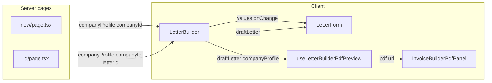

# Letter builder — split-panel live PDF preview

## Preconditions (already read)

Key references: [`invoice-builder-pdf-panel.tsx`](src/features/invoices/components/invoice-builder/invoice-builder-pdf-panel.tsx) (gates at lines 37–47), [`use-angebot-builder-pdf-preview.tsx`](src/features/angebote/components/angebot-builder/use-angebot-builder-pdf-preview.tsx) (logo resolution + debounced `updatePdf`), [`letter-form.tsx`](src/features/letters/components/letter-form.tsx), [`types.ts`](src/features/letters/types.ts), letter pages, [`letter-pdf-document.tsx`](src/features/letters/components/letter-pdf/letter-pdf-document.tsx) (`LetterPdfDocumentProps`).

## Critical correction: `InvoiceBuilderPdfPanel` adapter

The panel short-circuits when **`lineItemCount === 0`** even if `section2Complete` is true (lines 37–47: `if (!section2Complete || lineItemCount === 0)`). The spec’s `lineItemCount={0}` would **never** reach the iframe.

**Adapter (do not change the panel):** use the same synthetic `draftInvoice` + `section2Complete` pattern as [`angebot-builder/index.tsx`](src/features/angebote/components/angebot-builder/index.tsx) (lines 559–564), but set **`lineItemCount={1}`** whenever the letter preview should be eligible (e.g. when `draftLetter` and `companyProfile` are both non-null), else `0`. Add an inline **why** comment: “Letters have no trip line items; `lineItemCount` is a synthetic non-zero value to satisfy the shared panel’s gate without modifying `InvoiceBuilderPdfPanel`.”

Use `isLoadingTrips={false}` unchanged.

## Step 1 — `useLetterBuilderPdfPreview`

Create [`src/features/letters/components/letter-builder/use-letter-builder-pdf-preview.ts`](src/features/letters/components/letter-builder/use-letter-builder-pdf-preview.ts) (`.ts` is fine if the file has no JSX; if you keep `updatePdf(<LetterPdfDocument …/>)` in this file, use `.tsx`).

- Top of file: `const PDF_PREVIEW_DEBOUNCE_MS = 600` (single named constant; use it in `setTimeout`).
- Mirror [`use-angebot-builder-pdf-preview.tsx`](src/features/angebote/components/angebot-builder/use-angebot-builder-pdf-preview.tsx): `usePDF` from `@react-pdf/renderer`, `resolveCompanyAssetUrl` from `@/features/storage/resolve-company-asset-url`, `useEffect` + `useMemo` for `companyProfileForDraft` (spread `logo_url` when signed URL resolves).
- Props: `companyProfile: LetterPdfDocumentProps['companyProfile'] | null` and `draftLetter: Letter | null` — import `LetterPdfDocumentProps` from [`letter-pdf-document.tsx`](src/features/letters/components/letter-pdf/letter-pdf-document.tsx) (or duplicate the company profile type from `InvoiceDetail['company_profile']` if circular).
- **`updatePdf` guard:** if `!draftLetter || !companyProfileForDraft`, return early from the debounced effect (do not call `updatePdf` with incomplete data). `companyProfileForDraft` is null when `companyProfile` is null (same as angebot memo chain).
- Return `{ pdf }` only (no `livePreviewActive` required unless you find it useful internally).

File header: state that this mirrors the Angebot hook and that **`resolveCompanyAssetUrl`** is required for private-bucket logo parity with one-shot `pdf()` downloads.

**Build:** `bun run build`.

## Steps 2 and 3 — controlled `LetterForm` + `LetterBuilder` shell (**one commit**)

**Do not** land controlled `LetterForm` without `LetterBuilder` in the same change. Skip the “thin wrapper” or “routes still render `LetterForm` with new props until Step 3” intermediate state — it leaves `bun run build` broken or forces dead code. Implement **types + `LetterForm` refactor + `LetterBuilder` + `buildDraftLetter` location** together, then **`bun run build`** once.

### 2a — Types and `LetterForm`

Add **`LetterFormValues`** to [`src/features/letters/types.ts`](src/features/letters/types.ts): explicit fields matching current `useState` in `letter-form.tsx` (lines 64–76): `letterDate`, `letterNumber`, `status`, `subject`, recipient fields, `bodyHtml`.

Refactor [`letter-form.tsx`](src/features/letters/components/letter-form.tsx):

- **Props:** `mode`, `letterId?`, `companyId`, `companyProfile`, `values: LetterFormValues`, `onChange: (patch: Partial<LetterFormValues>) => void`, `draftLetter: Letter` (for PDF download), `onSave`, optional `onDelete`, `isSaving`, optional `isDeleting` for delete button disabled state.
- **Remove:** local field state, `useLetter`, mutations (`useCreateLetter` / `useUpdateLetter` / `useDeleteLetter`), `buildDraftLetter`, hydration `useEffect`, and inline delete handler.
- **Loading / not-found:** move to **`LetterBuilder`** only; `LetterForm` renders the editor UI when the parent shows it (mirror angebot step components).
- **PDF download:** keep `handlePdf` in the form; use prop **`draftLetter`** from parent (no duplicated `buildDraftLetter` in the form).
- **Field wiring:** replace `setX` with `onChange({ … })` (same pattern as [`step-1-empfaenger.tsx`](src/features/angebote/components/angebot-builder/step-1-empfaenger.tsx) `values` + `onChange` patch).
- **Visual invariant:** keep the same root classes (`mx-auto max-w-3xl space-y-8`), grid structure, labels, placeholders, buttons, and Tiptap field props.

### 2b — `LetterBuilder` (same commit as 2a)

Create [`src/features/letters/components/letter-builder/index.tsx`](src/features/letters/components/letter-builder/index.tsx):

- **Props:** `mode`, `letterId?`, `companyId`, `companyProfile` (same type as today’s form).
- **Outer layout:** match Angebot: `flex min-h-0 flex-1 overflow-hidden flex-row gap-0` on the builder root; left column `border-border flex w-full shrink-0 flex-col overflow-hidden border-r lg:w-[480px]`; inner scroll `flex-1 overflow-y-auto` wrapping the form (mirror [`angebot-builder/index.tsx`](src/features/angebote/components/angebot-builder/index.tsx) lines 433–436, 550–556).
- **Right column:** `hidden h-full min-w-0 flex-1 flex-col overflow-hidden lg:flex` with [`InvoiceBuilderPdfPanel`](src/features/invoices/components/invoice-builder/invoice-builder-pdf-panel.tsx) using **`lineItemCount` ≥ 1** when preview is active (see section above), `section2Complete={!!draftLetter && !!companyProfile}`, `draftInvoice={… ? ({} as InvoiceDetail) : null}`, `pdf={{ loading: pdf.loading, url: pdf.url ?? null }}`, `isLoadingTrips={false}`.
- **State:** `useState` for `LetterFormValues` with create defaults (reuse `todayYmd` helper — can live in builder or small util).
- **Edit:** `useLetter(letterId)` in builder; hydrate `values` when `existing` resolves (effect keyed on `existing`); show same loading / error copy as current form.
- **Mutations:** `useCreateLetter` / `useUpdateLetter` / `useDeleteLetter` in builder; `handleSave` uses `createClient` + `getUser` for `createdBy` exactly as current `letter-form.tsx` (lines 135–177); wire `onSave` / `onDelete` / `isSaving` / delete pending to form.
- **`draftLetter`:** `useMemo` from `values` + `existing` + ids (same semantics as current `buildDraftLetter`).
- **`buildDraftLetter`:** colocate in [`letter-builder/index.tsx`](src/features/letters/components/letter-builder/index.tsx) or [`src/features/letters/lib/build-draft-letter.ts`](src/features/letters/lib/build-draft-letter.ts) with a short why comment (single place for preview + PDF + save payload).
- **Preview:** `useLetterBuilderPdfPreview({ companyProfile, draftLetter })` — pass **`draftLetter: null`** when `!companyProfile` to match skip rules.

Inline comments: why state is lifted; why the panel is reused with synthetic invoice props and synthetic `lineItemCount`.

**Routes:** Changing `LetterForm` props breaks [`letters/new/page.tsx`](src/app/dashboard/letters/new/page.tsx) and [`letters/[id]/page.tsx`](src/app/dashboard/letters/[id]/page.tsx) until they render `LetterBuilder`. **Include the Step 4 route swap (and flex shell for iframe height) in the same commit as Steps 2–3** so `bun run build` stays green. Step 1 (hook-only) can remain a separate prior commit if desired.

**Build:** `bun run build` after that combined commit.

## Step 4 — Page routes

**Prefer:** done in the **same commit as Steps 2–3** (see above) so call sites and `LetterForm` stay in sync.

If Step 4 is tracked separately: update [`src/app/dashboard/letters/new/page.tsx`](src/app/dashboard/letters/new/page.tsx) and [`src/app/dashboard/letters/[id]/page.tsx`](src/app/dashboard/letters/[id]/page.tsx):

- Replace `LetterForm` with `LetterBuilder` and the same props (`mode`, `companyId`, `companyProfile`, `letterId` on edit).
- **Height chain:** replace the outer `overflow-y-auto` wrapper with a layout that gives the builder a bounded height (mirror [`angebot/new/page.tsx`](src/app/dashboard/angebote/new/page.tsx): `flex min-h-0 flex-1 flex-col overflow-hidden`). Keep the `<h2>` as a **shrink-0** header row, then **`flex-1 min-h-0 overflow-hidden`** wrapping `LetterBuilder` so the right iframe column can fill viewport height. Do not change Supabase prefetch selects.

**Build + test:** `bun run build` and `bun run test`.

## Step 5 — Exports and docs

- [`src/features/letters/index.ts`](src/features/letters/index.ts): export `LetterBuilder` (and optionally `LetterFormValues` if useful externally).
- [`docs/letters-module.md`](docs/letters-module.md): add **Builder architecture** (split panel, `LetterBuilder` vs `LetterForm`, preview hook, `InvoiceBuilderPdfPanel` adapter including synthetic `lineItemCount`), **logo / `resolveCompanyAssetUrl`**, and **Deferred** (mobile Sheet, `BuilderSplitShell`, `db:types`).

## Deferred (out of scope)

- Mobile preview Sheet; shared `BuilderSplitShell`; `bun run db:types`.

## Mermaid — data flow

