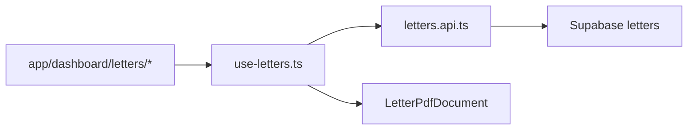

# Letters module (`letters` / `/dashboard/letters`)

## Preconditions (read-only review done)

- Nav uses **`icon?: keyof typeof Icons`** string keys ([`src/types/index.ts`](src/types/index.ts)); there is **no** `MailIcon` import in nav-config.
- **Step 6 icon key — verified (2026-05-03):** In [`src/components/icons.tsx`](src/components/icons.tsx) the `Icons` object includes **`post`** (`IconFileText`, line ~63) and **`page`** (`IconFile`, line ~64). There is **no** `mail` or `envelope` key today—using those strings would fail TypeScript (`keyof typeof Icons`). Prefer **`icon: 'post'`** for Letters; **`'page'`** is the fallback document glyph. Re-run `rg "^\s+(post|page|mail):" src/components/icons.tsx` before Step 6 if `icons.tsx` has changed on your branch.
- [`pdf-layout-constants.ts`](src/features/invoices/lib/pdf-layout-constants.ts) exports **`PDF_PAGE`**, **`PDF_ZONES`**, **`PDF_DIN5008`** (not a single `PDF_LAYOUT_CONSTANTS` object).
- **`InvoicePdfCoverHeaderBrief` only renders branding + meta**; DIN Brief layout also requires **page-level fold marks + absolute `InvoicePdfRecipientBlock`**, copied from the **`renderMode === 'brief'`** branch of [`AngebotPdfDocument.tsx`](src/features/angebote/components/angebot-pdf/AngebotPdfDocument.tsx) (lines 147–196). Hard rule still holds: **do not edit** `AngebotPdfDocument.tsx`—**mirror that structure inside `LetterPdfDocument`** using the same imports (`Document`, `Page`, `View`, `PDF_COLORS`, `PDF_DIN5008`, `PDF_PAGE`, `styles` from [`pdf-styles.ts`](src/features/invoices/components/invoice-pdf/pdf-styles.ts), `InvoicePdfRecipientBlock`, `InvoicePdfCoverHeaderBrief`, `InvoicePdfFooter`).
- Angebote list/detail hooks are thin ([`use-angebote.ts`](src/features/angebote/hooks/use-angebote.ts)); mutations live beside API usage ([`use-angebot-builder.ts`](src/features/angebote/hooks/use-angebot-builder.ts) + [`angebote.api.ts`](src/features/angebote/api/angebote.api.ts)). For letters, implement **`letters.api.ts`** (Supabase + row map + throw on error) and **`use-letters.ts`** (queries/mutations calling the API) so hooks stay small and testable.
- Query keys: follow [`src/query/keys/angebote.ts`](src/query/keys/angebote.ts) and export from [`src/query/keys/index.ts`](src/query/keys/index.ts) (add `letterKeys` / `letters.ts`); avoid ad-hoc inline keys except inside factories.
- Tiptap: **reuse** [`AngebotTiptapField`](src/features/angebote/components/angebot-builder/angebot-tiptap-field.tsx) by **import** (allowed by “do not modify angebote”; importing is not editing).
- PDF download: repo today uses **`PDFDownloadLink`** / **`usePDF`** for Angebote ([`angebot-detail-view.tsx`](src/features/angebote/components/angebot-detail-view.tsx), [`use-angebot-builder-pdf-preview.tsx`](src/features/angebote/components/angebot-builder/use-angebot-builder-pdf-preview.tsx)). At implementation, **prefer `import { pdf } from '@react-pdf/renderer'`** for one-shot blob download if the installed v4 export exists; **if not available or typings fail**, fall back to the same **`usePDF`** debounced pattern as the builder (document the choice in `letter-form.tsx` “why” comment). Do not add dependencies.

## Step 1 — Migration `public.letters`

- New file: `supabase/migrations/<timestamp>_create_letters.sql`.
- **RLS must mirror Angebote exactly** ([`20260409150000_create_angebote.sql`](supabase/migrations/20260409150000_create_angebote.sql) lines 72–102): every policy **`FOR … TO authenticated`** with **`USING` / `WITH CHECK`** including **`public.current_user_is_admin()` AND `company_id = public.current_user_company_id()`** for **SELECT/INSERT/UPDATE/DELETE** (the draft in your spec that SELECTs only by `company_id` is **incorrect** for this codebase).
- **No global `updated_at` trigger** was found for `angebote`; keep `updated_at timestamptz NOT NULL DEFAULT now()` and **set `updated_at` in the app** on UPDATE (same pragmatic pattern as other tables).
- **`created_by`**: prefer **`text` nullable** (matches [`invoices.created_by`](supabase/migrations/20260331120000_create_invoices.sql)) storing `auth.uid()::text` from the client on insert—avoid `REFERENCES auth.users(id)` unless you confirm that FK is standard in this project.
- Schema tweaks vs your sketch (keep intent):
  - `letter_number text` **nullable** (no RPC; optional uniqueness **not** enforced in DB unless product requires it).
  - Align recipient naming with PDF mapper: store salutation as values compatible with [`InvoicePdfRecipientBlock`](src/features/invoices/components/invoice-pdf/invoice-pdf-cover-header.tsx) (`anrede` expects display tokens—map **`recipient_salutation` → `recipient.anrede`** as `'Herr' | 'Frau' |` trimmed free text).
  - `recipient_country`: PDF window has no dedicated country line—**append to `city` or `addressLine2` in the mapper** when building the `recipient` object (document in module doc).

**Build gate:** `bun run build`.

## Step 2 — Types [`src/features/letters/types.ts`](src/features/letters/types.ts)

- Implement domain types as specified; **do not import** [`src/types/database.types.ts`](src/types/database.types.ts).
- Tighten `LetterInsert` / `LetterUpdate` so they reflect what the API actually sends (e.g. omit server-generated fields, make `companyId` required on insert from session).

**Build gate:** `bun run build`.

## Step 3 — Data layer

- Add [`src/features/letters/api/letters.api.ts`](src/features/letters/api/letters.api.ts): `listLetters`, `getLetter`, `createLetter`, `updateLetter`, `deleteLetter` using `createClient()` + `toQueryError()` (mirror [`angebote.api.ts`](src/features/angebote/api/angebote.api.ts) error style).
- Add [`src/query/keys/letters.ts`](src/query/keys/letters.ts) + export from [`src/query/keys/index.ts`](src/query/keys/index.ts).
- Add [`src/features/letters/hooks/use-letters.ts`](src/features/letters/hooks/use-letters.ts): `useLetters`, `useLetter`, `useCreateLetter`, `useUpdateLetter`, `useDeleteLetter` with invalidation of **`letterKeys.all`** (and `letterKeys.detail(id)` where applicable).

**Build gate:** `bun run build`.

## Step 4 — PDF

- [`letter-pdf-document.tsx`](src/features/letters/components/letter-pdf/letter-pdf-document.tsx):
  - Single A4 `Page`, **`renderMode` fixed to `'brief'`** internally (letters are DIN-style business mail).
  - Replicate **Brief page shell** from Angebot: fold marks + absolute address `View` + `InvoicePdfRecipientBlock` (same numeric layout tokens: `PDF_DIN5008.*`, `PDF_PAGE.marginLeft`, etc.).
  - Then `InvoicePdfCoverHeaderBrief` with **`metaConfig`** (e.g. heading „Briefdaten“, number label „Brief-Nr.“ / „Referenz“, date label „Datum“, `showTaxIds: false`, period row repurposed e.g. „Status“ + `draft|sent` **or** hide via `periodValue` hack—prefer **single `periodValue`** string to avoid misleading “Leistungszeitraum” label).
  - Map letter → `InvoicePdfCoverHeaderProps`: `invoiceNumber` ← `letter_number ?? '—'`, `invoiceCreatedAtIso` ← `letter_date` ISO, `periodFromIso`/`periodToIso` ← same date (meta grid date formatting uses `invoiceCreatedAtIso` for the date row—keep consistent), `customerNumber` ← `''` or em dash.
  - `InvoicePdfFooter` with `notes={null}`.
  - **`senderFit`**: reuse `buildInvoicePdfSenderOneLine` + `fitSenderLine` like Angebot.
- [`letter-pdf-cover-body.tsx`](src/features/letters/components/letter-pdf/letter-pdf-cover-body.tsx):
  - Subject (`styles.subject`), greeting (reuse salutation logic pattern from [`AngebotPdfCoverBody`](src/features/angebote/components/angebot-pdf/AngebotPdfCoverBody.tsx) `buildSalutation`—**copy the small helper into letters** to avoid importing angebot internals), then **single** `<Html>` body using **`react-pdf-html`** with a **local** `LETTER_HTML_STYLESHEET` duplicated from the prose portion of `ANGEBOT_HTML_STYLESHEET` (do **not** export/import from angebot file per hard rule).
  - Spacing: only **`PDF_ZONES`**, **`PDF_PAGE`** as needed—no raw magic numbers.
  - Optional closing line (“Mit freundlichen Grüßen,”) using existing text styles from [`pdf-styles.ts`](src/features/invoices/components/invoice-pdf/pdf-styles.ts) where possible.

**Invariant check:** invoice PDF + angebot PDF unchanged (no edits to shared primitives).

**Build gate:** `bun run build`.

## Step 5 — UI + routes

- Components:
  - [`letter-list.tsx`](src/features/letters/components/letter-list.tsx): table + empty state + link to `/dashboard/letters/new`.
  - [`letter-form.tsx`](src/features/letters/components/letter-form.tsx): client form; fields per spec; Tiptap via **`AngebotTiptapField`** for `body_html`; status toggle `draft|sent`; save/create/delete; PDF preview/download control.
- Routes:
  - [`src/app/dashboard/letters/page.tsx`](src/app/dashboard/letters/page.tsx) → `<LetterList />` (client) inside the usual dashboard shell padding pattern used by [`angebote/page.tsx`](src/app/dashboard/angebote/page.tsx) or similar.
  - [`src/app/dashboard/letters/new/page.tsx`](src/app/dashboard/letters/new/page.tsx) → create mode (`LetterForm` without id) + prefetch `company_profiles` like [`angebote/new/page.tsx`](src/app/dashboard/angebote/new/page.tsx).
  - [`src/app/dashboard/letters/[id]/page.tsx`](src/app/dashboard/letters/[id]/page.tsx) → edit mode (`await params`; pass `id`).

**Build gate:** `bun run build` + `bun run test`.

## Step 6 — Navigation

- **Pre-check (30s):** Confirm `icon` value is still a key of `Icons` in [`src/components/icons.tsx`](src/components/icons.tsx) (see precondition note: **`post`** verified; no **`mail`**/**`envelope`**). If a dedicated mail icon is added later, switch the nav entry to that key in one line.
- Update [`src/config/nav-config.ts`](src/config/nav-config.ts): append **one** child under Account `items` (after existing entries; **do not reorder** others):

```ts
{
  title: 'Letters',
  url: '/dashboard/letters',
  icon: 'post',
  shortcut: ['l', 't'] // verify no collision in nav-config; adjust if lint/product complains
}
```

**Build gate:** `bun run build`.

## Step 7 — Documentation (mandatory)

1. Create [`docs/letters-module.md`](docs/letters-module.md): purpose, folder map, DB schema + RLS, PDF composition diagram (reuse vs owned), hook/API flow, deferred items.
2. Update [`docs/navigation.md`](docs/navigation.md): add an **Account** subsection bullet for `/dashboard/letters` (English title as in nav).
3. Add concise **“why”** comments (not “what”) in every new/changed file, explicitly in:
   - `letter-pdf-document.tsx` (why Brief shell + `HeaderBrief`)
   - `letter-pdf-cover-body.tsx` (why HTML + no table)
   - `use-letters.ts` / `letters.api.ts` (why inline mapping vs `database.types.ts`)
   - `nav-config.ts` (why Account vs Abrechnung—operational correspondence, not billing artifacts)

---

## Mermaid — runtime data flow



## Risks / follow-ups

- Regenerate [`src/types/database.types.ts`](src/types/database.types.ts) after migration lands (explicitly deferred).
- `pdf()` imperative API: verify at implementation time; otherwise `usePDF` is an acceptable documented fallback.
