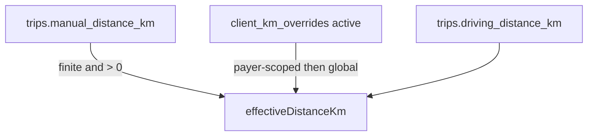

# Manual KM override — Phase 1 (foundation)

## Scope alignment

- **In scope:** DB + pure resolver + `buildLineItemsFromTrips` / `insertLineItems` + types + storno parity + documentation + `// why` comments. No UI; no writes to `trips.driving_distance_km`; `clientKmOverrides` defaults to `[]` at call sites.
- **Out of scope:** Phase 2/3 items from your spec (Step 3 KM UI, writeback, payer toggle, override CRUD, wiring overrides from Supabase into the builder).

## Resolution chain (reference)

## 1. Migration (single new file)

- **Filename:** [`supabase/migrations/20260505180000_manual_km_overrides_foundation.sql`](supabase/migrations/20260505180000_manual_km_overrides_foundation.sql) (adjust timestamp if you prefer another “now”; keep `YYYYMMDDHHMMSS_` convention).
- **Header/comments:** Match the narrative block style from [`supabase/migrations/20260316090000_add_driving_distance_and_duration_to_trips.sql`](supabase/migrations/20260316090000_add_driving_distance_and_duration_to_trips.sql) (section dividers, WHAT/ROLLBACK-style explanation where appropriate).
- **1a–1d:** Apply your exact `ALTER TABLE` / `COMMENT` / `CREATE INDEX` SQL for `payers.manual_km_enabled`, `trips.manual_distance_km`, `invoice_line_items.effective_distance_km` + `original_distance_km`, and `client_km_overrides`.
- **Idempotency (your hard rules):** Use `CREATE TABLE IF NOT EXISTS public.client_km_overrides (...)` (your snippet used bare `CREATE TABLE`; align with rule 5).
- **Security (required parity with [`20260412140000_client_price_tags.sql`](supabase/migrations/20260412140000_client_price_tags.sql)):** After creating the table, `ENABLE ROW LEVEL SECURITY`, add an admin+`company_id` policy mirroring `client_price_tags_admin`, and `GRANT SELECT, INSERT, UPDATE, DELETE ON public.client_km_overrides TO authenticated, service_role`.
- **Storno RPC (correctness gap):** [`create_storno_invoice`](supabase/migrations/20260411120000_storno_atomic_rpc.sql) lists explicit `invoice_line_items` columns. Extend **the same foundation migration** with `CREATE OR REPLACE FUNCTION public.create_storno_invoice(...)` so the `INSERT INTO public.invoice_line_items` includes `effective_distance_km` and `original_distance_km`, reading from JSON keys (e.g. `NULLIF(TRIM(item->>'effective_distance_km'), '')::DOUBLE PRECISION` and same for `original_distance_km`). Copy the existing function body and GRANT/REVOKE/COMMENT pattern; fix only what is necessary for the two new columns (note: the current file has a typo `çTEXT` in a GRANT line — only change if you touch that line, to keep the migration valid).

## 2. [`src/types/database.types.ts`](src/types/database.types.ts)

- **`payers`:** Add `manual_km_enabled` to `Row`, `Insert`, `Update` in **alphabetical** order with the rest of the block (same nullable/required style as neighbours).
- **`trips`:** Add `manual_distance_km` to `Row`, `Insert`, `Update` in alphabetical order (near other `manual_*` fields).
- **`client_km_overrides`:** New `Tables` entry **immediately after** `client_price_tags`, mirroring its `Row` / `Insert` / `Update` / `Relationships` shape (`distance_km` as `number` in TS to match `numeric` usage elsewhere, or `string` if you standardise numeric-as-string — match how `price_gross` is typed for CPT).
- **Note:** This repo’s `database.types.ts` does **not** currently define `invoice_line_items`. Do **not** invent a partial table there unless you intentionally widen scope; the app’s DB-accurate line-item shape stays in [`InvoiceLineItemRow`](src/features/invoices/types/invoice.types.ts).

## 3. [`src/features/invoices/lib/resolve-effective-distance.ts`](src/features/invoices/lib/resolve-effective-distance.ts) (new)

- Implement `ClientKmOverrideLike` and `resolveEffectiveDistanceKm` exactly as specified (no Supabase imports).
- **Manual KM gate:** Return manual only when `Number.isFinite(n) && n > 0` (domain rule: non-positive is not a usable distance — document as `// why`, not a “magic threshold” constant).
- **Client overrides:** Filter `client_id` + `is_active`; payer-scoped match first, then `payer_id IS NULL`; `Number(row.distance_km)` with NaN → treat as missing and fall through.
- **Inactive / wrong client / non-finite override values:** Fall through per your test matrix.

## 4. [`src/features/invoices/lib/__tests__/resolve-effective-distance.test.ts`](src/features/invoices/lib/__tests__/resolve-effective-distance.test.ts) (new)

- Mirror structure/imports from [`resolve-trip-price.test.ts`](src/features/invoices/lib/__tests__/resolve-trip-price.test.ts).
- Cover all eight cases you listed.

## 5. Types and fetch — [`src/features/invoices/types/invoice.types.ts`](src/features/invoices/types/invoice.types.ts)

- **`TripForInvoice`:** Add `manual_distance_km: number | null` (after `manual_gross_price` or in alphabetical order with trip fields).
- **`BuilderLineItem`:** After `distance_km`, add `effective_distance_km` and `original_distance_km` with your block comments. Leave `distance_km` and its meaning unchanged for Phase 1 display.
- **`InvoiceLineItemRow`:** Add `effective_distance_km` and `original_distance_km` (`number | null`) after `distance_km`, with short comments matching DB comments.
- **Optional doc tweak:** Update the `tax_rate` JSDoc on `BuilderLineItem` so it no longer implies VAT is derived from raw Google km only (now from effective KM).

## 6. API wiring — [`src/features/invoices/api/invoice-line-items.api.ts`](src/features/invoices/api/invoice-line-items.api.ts)

- **Import** `resolveEffectiveDistanceKm` and `ClientKmOverrideLike` from the new module (or re-export `ClientKmOverrideLike` from [`pricing.types.ts`](src/features/invoices/types/pricing.types.ts) only if you need a single shared type — prefer keeping the interface in the resolver file per your spec).
- **`fetchTripsForBuilder`:** Add `manual_distance_km` to the `.select(...)` column list next to `driving_distance_km`.
- **`buildLineItemsFromTrips`:** Add fourth parameter `clientKmOverrides: ClientKmOverrideLike[] = []`. As the **first** step in the map callback, compute `effectiveDistanceKm` with a `// why` comment (tax + pricing must see the same distance the business intends to bill). Then:
  - `resolveTaxRate(effectiveDistanceKm)`
  - `resolveTripPricePure({ ..., driving_distance_km: effectiveDistanceKm, ... })`
  - Set `effective_distance_km` / `original_distance_km` on the returned object; keep `distance_km: trip.driving_distance_km` **unchanged**.
- **`insertLineItems`:** After `distance_km`, add `effective_distance_km` and `original_distance_km` from the builder item.

## 7. Draft PDF + storno parity (not in your table but required for a clean build)

- **[`build-draft-invoice-detail-for-pdf.ts`](src/features/invoices/components/invoice-pdf/build-draft-invoice-detail-for-pdf.ts):** In `builderItemToDraftLineItem`, pass through `effective_distance_km` and `original_distance_km` so the object satisfies `InvoiceLineItemRow`.
- **[`storno.ts`](src/features/invoices/lib/storno.ts):** In `stornoLineItems` mapping, copy `effective_distance_km` and `original_distance_km` from the original line (not negated — same audit snapshots as the cancelled invoice).

## 8. Documentation (mandatory)

- **New:** [`docs/manual-km-overrides.md`](docs/manual-km-overrides.md) — Overview, resolution chain, DB schema summary, phase status table.
- **Edit:** [`docs/pricing-engine.md`](docs/pricing-engine.md) — Section: `buildLineItemsFromTrips` resolves effective KM before `resolveTaxRate` / `resolveTripPrice`; raw `driving_distance_km` is no longer passed directly into pricing/tax for new invoices.
- **Edit:** [`docs/invoices-module.md`](docs/invoices-module.md) — New snapshot columns on `invoice_line_items` and storno mirroring.
- **Edit:** [`docs/clients.md`](docs/clients.md) — `client_km_overrides` exists; UI/CRUD deferred to Phase 3.

## 9. Inline `// why` comments (Steps 3–7)

- Resolver: why manual wins; why payer-scoped beats global; why inactive rows are ignored.
- `buildLineItemsFromTrips`: why effective KM is computed before tax/pricing.
- Insert/storno/draft mappers: one line each if the reason is non-obvious (audit snapshot immutability).

## 10. Gates

- After migration file exists: `bun run build`.
- After types + API: `bun run build`.
- After tests: `bun test` (script already includes [`src/features/invoices/lib/__tests__`](src/features/invoices/lib/__tests__)).
- Final: `bun run build` + `bun test` clean.

## Behaviour verification (Phase 1)

- With all new DB columns NULL / empty overrides / default `clientKmOverrides = []`, **`effectiveDistanceKm` equals `driving_distance_km`**, so tax, pricing, and persisted `effective_distance_km` match today’s behaviour while `distance_km` on line items stays the Google snapshot.
