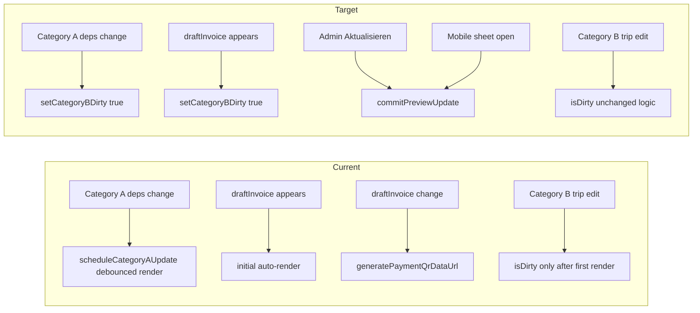

# Manual-only invoice builder PDF preview

## Problem and target behaviour



Silent `@react-pdf` layout on 160+ trips during long sessions caused tab crashes ([`docs/plans/large-invoice-crash-audit.md`](docs/plans/large-invoice-crash-audit.md)). After this change, **no `commitPreviewUpdate` runs unless the admin explicitly triggers it**.

**Exactly 5 files** — no new npm deps, no save-path / edit-mode changes.

---

## File 1: [`use-invoice-builder-pdf-preview.tsx`](src/features/invoices/components/invoice-builder/use-invoice-builder-pdf-preview.tsx)

### Step 1 — Cheap Category B signature

Add a **named const above the hook** (not inside):

```ts
function buildCategoryBSignature(
  included: BuilderLineItem[],
  billed: BuilderCancelledTripRow[],
  passive: BuilderCancelledTripRow[],
  excluded: ExcludedTripRow[]
): string { ... }
```

**Adapt the user’s hash to real types** (not `billing_included`):

| Array | Fields to hash |
|---|---|
| `included` (`BuilderLineItem`) | `position`, `effective_distance_km`, `billingInclusion.included` |
| `billed` / `passive` (`BuilderCancelledTripRow`) | stable `id` (or index fallback), `effective_distance_km`, `billingInclusion.included` |
| `excluded` (`ExcludedTripRow`) | no km/position — hash `client_name` length + `billing_exclusion_reason` char codes (or simple string fold) so exclusion changes still dirty |

Replace the existing `JSON.stringify(...)` block (~L382–387) with `buildCategoryBSignature(...)`. Keep the Category B effect’s baseline / `hasCompletedFirstRenderRef` guard **unchanged** (hard rule #2).

Add the spec’s `why` comment on the function.

### Step 2 — Remove auto-render; Category A → dirty only

**Remove entirely:**

- `PREVIEW_CATEGORY_A_DEBOUNCE_MS`, `PREVIEW_COLUMN_REORDER_DELAY_MS`
- `categoryADebounceTimerRef`, `lastColumnReorderGen`, `initialRenderScheduledRef` (only used by removed effects)
- `scheduleCategoryAUpdate` callback
- Category A auto-render `useEffect` (~L391–416)
- Initial auto-render `useEffect` (~L418–431)
- Timer cleanup inside `requestPreviewUpdate` (keep the function body otherwise identical: immediate `commitPreviewUpdate`, `setCategoryBDirty(false)`)

**Add** Category A accumulate-dirty effect (exact deps from spec + `livePreviewActive` guard) with `why` comment at the old Category A effect location.

**Replace** initial render effect with:

```ts
useEffect(() => {
  if (!draftInvoice || hasCompletedFirstRenderRef.current) return;
  setCategoryBDirty(true);
}, [draftInvoice]);
```

**Keep unchanged:**

- `requestPreviewUpdate` behaviour
- `livePreviewActive → false` reset effect (drop `initialRenderScheduledRef` from reset if ref removed)
- `hasCompletedFirstRenderRef = true` when `pdf.url` first non-null (~L434–438)
- Edit-mode / `isEditMode` — not present in this hook today; no changes elsewhere

**Update** the top-of-file Category A/B comment block to describe manual-only triggers.

### Step 3 — Remove preview QR generation

**Remove:**

- `paymentQrDataUrl` state
- QR `useEffect` on `[draftInvoice]` (~L306–318)
- dynamic import of `generatePaymentQrDataUrl`

**In `commitPreviewUpdate` and `previewPayloadRef`:** always `paymentQrDataUrl: null` with `why` comment.

**Return type:** drop `paymentQrDataUrl` from hook return (or document as always `null` if callers still destructure — check [`index.tsx`](src/features/invoices/components/invoice-builder/index.tsx); likely not passed to panel).

---

## File 2: [`invoice-pdf-cover-body.tsx`](src/features/invoices/components/invoice-pdf/invoice-pdf-cover-body.tsx)

### Step 4 — QR placeholder (preview only)

Current code (~L384–387): QR column only renders when `paymentQrDataUrl` is truthy — **layout collapses when null**.

Change the payment QR block to:

```tsx
{paymentQrDataUrl ? (
  <Image src={paymentQrDataUrl} style={styles.paymentQr} />
) : invoice.id === '__pdf_preview__' ? (
  <View style={[styles.paymentQr, { backgroundColor: PDF_COLORS.lightGray, alignItems: 'center', justifyContent: 'center' }]}>
    <Text style={{ fontSize: PDF_FONT_SIZES.xs, color: PDF_COLORS.muted, textAlign: 'center' }}>
      QR-Code wird beim Speichern generiert
    </Text>
  </View>
) : null}
```

**Why `invoice.id === '__pdf_preview__'`:** draft builder always uses this id ([`build-draft-invoice-detail-for-pdf.ts`](src/features/invoices/components/invoice-pdf/build-draft-invoice-detail-for-pdf.ts) L307). Issued invoices with no QR (missing IBAN) keep today’s behaviour — **no visual change for saved/downloaded PDFs** (hard rule #4).

- Dimensions: reuse `styles.paymentQr` (75×75) and `styles.paymentQrCol` wrapper — **no layout shift**
- Tokens only: `PDF_COLORS.lightGray`, `PDF_FONT_SIZES.xs` (already imported L45)
- `why` comment above placeholder branch

**Do not edit** [`pdf-styles.ts`](src/features/invoices/components/invoice-pdf/pdf-styles.ts) (not in the 5-file list).

---

## File 3: [`invoice-builder-pdf-panel.tsx`](src/features/invoices/components/invoice-builder/invoice-builder-pdf-panel.tsx)

### Step 5 — Never-rendered copy

Branch: `showFirstLoadIdle` = `!iframeSrc && !pdf.loading && !isDirty` (~L57, ~L99–103).

Replace **"Vorschau wird geladen…"** with:

**"Vorschau noch nicht geladen — klicken Sie auf Aktualisieren"**

Optionally add `RefreshCw` icon (already used on Aktualisieren button) for consistency.

**Note:** After Step 2, session start usually has `isDirty === true` (draft + Category A effect), so the admin sees **"Vorschau laden"** button first. The idle branch remains for edge cases (e.g. after `livePreviewActive` reset) — updated copy still matters.

---

## File 4: [`index.tsx`](src/features/invoices/components/invoice-builder/index.tsx)

### Step 6 — Mobile sheet open trigger

Find mobile `Sheet` with `onOpenChange={setPreviewSheetOpen}`. Replace with:

```tsx
onOpenChange={(open) => {
  setPreviewSheetOpen(open);
  if (open) {
    requestPreviewUpdate();
  }
}}
```

Add `why` comment. **Closing must not render.** Optional guard `if (open && (isDirty || !pdf.url))` is not required.

---

## File 5: [`docs/invoices-module.md`](docs/invoices-module.md)

### Step 7 — Rewrite § "Split-trigger preview"

Replace the Category A auto-render table row and "Initial load: one auto-render" bullet with:

- **All renders are manual** (admin-triggered)
- **Why:** main-thread layout, memory accumulation at 160+ trips, tab crash prevention
- **Three triggers:** Aktualisieren (`requestPreviewUpdate`), mobile sheet open, (future: server-side generation — deferred)
- **Category A and B** both set `isDirty`; neither auto-renders
- **QR:** preview passes `null` → placeholder in cover body; real QR on invoice save/detail unchanged
- **Follow-up:** server-side PDF for sub-second preview at scale (explicitly deferred)

Mirror `why` comments in code paths per spec.

---

## Build gates (sequential)

| After step | Gate |
|---|---|
| 1–5, 7 | `bun run build` |
| 6 | `bun run build` + `bun test` (167/167) |

---

## Verification checklist

1. **No silent renders:** edit intro text, reorder columns, blur KM — PDF blob URL must **not** change until Aktualisieren or mobile sheet open.
2. **Aktualisieren:** immediate render, clears dirty banner, iframe updates.
3. **First session:** dirty banner / "Vorschau laden" visible; no auto iframe load on desktop.
4. **Mobile:** opening Sheet triggers one render; closing does not.
5. **QR:** preview PDF shows grey placeholder with label; saved invoice PDF with real QR unchanged.
6. **Category B hash:** changing `effective_distance_km`, `billingInclusion.included`, or `position` on any included row sets dirty after first render.
7. **Save path:** [`generatePaymentQrDataUrl`](src/features/invoices/components/invoice-pdf/generate-payment-qr-data-url.ts) still used only in detail/preview components — untouched.

---

## Out of scope (explicit)

- Server-side PDF / Edge Function
- Trip-count threshold / light preview
- Invoice creation or save path
- Real QR generation on save
- `isEditMode` paths elsewhere
- Changes to [`pdf-styles.ts`](src/features/invoices/components/invoice-pdf/pdf-styles.ts) or any 6th file
