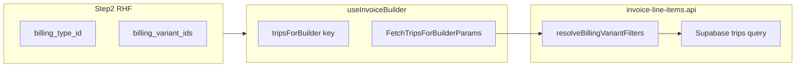

# Monthly invoice Step 2 — multi-variant subset selection

## Context (current code)

- Step 2 form lives in [`src/features/invoices/components/invoice-builder/step-2-params.tsx`](src/features/invoices/components/invoice-builder/step-2-params.tsx) with a **local** `step2Schema` and `onNext` payload; **`per_client`** uses a combined payer+variant `Select` — leave that path unchanged.
- Full builder types/schema: [`src/features/invoices/types/invoice.types.ts`](src/features/invoices/types/invoice.types.ts) (`invoiceBuilderSchema` / `InvoiceBuilderFormValues`).
- Trips query + cancelled trips share [`resolveBillingVariantFilters`](src/features/invoices/api/invoice-line-items.api.ts) → `variantId` vs `variantIdsForType` → `.eq` / `.in` on `trips.billing_variant_id` (lines ~73–208).
- Builder hook: [`src/features/invoices/hooks/use-invoice-builder.ts`](src/features/invoices/hooks/use-invoice-builder.ts) — `Step2Values` `Pick`, `invoiceKeys.tripsForBuilder`, `tripsParams` for both fetches.
- Query key: [`src/query/keys/invoices.ts`](src/query/keys/invoices.ts) `tripsForBuilder`.
- PDF draft snapshot: [`InvoiceBuilderStep2Snapshot`](src/features/invoices/components/invoice-pdf/build-draft-invoice-detail-for-pdf.ts) + [`index.tsx`](src/features/invoices/components/invoice-builder/index.tsx) `step2Snapshot` useMemo.
- Section guards [`src/features/invoices/lib/invoice-builder-section-guards.ts`](src/features/invoices/lib/invoice-builder-section-guards.ts) intentionally omit variant fields — **no change** required for completion rules.
- Reference data: [`useBillingVariantsForPayerQuery`](src/features/trips/hooks/use-trip-reference-queries.ts) + [`fetchBillingVariantsForPayer`](src/features/trips/api/trip-reference-data.ts) returns `BillingVariantOption[]` with `billing_type_id` — **reuse** for the subset picker options (filter client-side by selected `billing_type_id`).

## 1. Schema and types

**File:** [`src/features/invoices/types/invoice.types.ts`](src/features/invoices/types/invoice.types.ts)

- Add `billing_variant_ids` to `invoiceBuilderSchema` as **`z.array(z.string().uuid()).nullable()`** (matches existing “nullable for RHF” note in that file; normalize `undefined` → `null` at boundaries if needed).
- JSDoc: monthly subset only; empty/`null` = all Unterarten under `billing_type_id`; do not replace `billing_variant_id`.

**Files:** snapshot + hook `Pick` lists

- [`InvoiceBuilderStep2Snapshot`](src/features/invoices/components/invoice-pdf/build-draft-invoice-detail-for-pdf.ts): add `billing_variant_ids: string[] | null`.
- [`use-invoice-builder.ts`](src/features/invoices/hooks/use-invoice-builder.ts): extend `Step2Values` `Pick` with `billing_variant_ids`.
- [`index.tsx`](src/features/invoices/components/invoice-builder/index.tsx): include `billing_variant_ids` in `step2Snapshot` (from `step2Values`).

[`use-invoice-builder-pdf-preview.tsx`](src/features/invoices/components/invoice-builder/use-invoice-builder-pdf-preview.tsx): only touch if a local type still duplicates the snapshot shape (prefer importing the extended interface).

## 2. Query key normalization

**File:** [`src/query/keys/invoices.ts`](src/query/keys/invoices.ts)

- Extend `tripsForBuilder` params with `billing_variant_ids?: string[] | null`.
- **Normalize** before building the key object: `null` when missing/empty; otherwise **sorted copy** of UUIDs.
- Inline `// why`: stable key regardless of selection order / empty-array identity.

**File:** [`use-invoice-builder.ts`](src/features/invoices/hooks/use-invoice-builder.ts)

- Pass normalized `billing_variant_ids` into `invoiceKeys.tripsForBuilder` and into both `tripsParams` objects (main + `queryFn`).
- **Invalid subset vs type (boundary):** when assembling fetch params, if `billing_variant_ids` is non-empty but `billing_type_id` is missing, treat that as **invalid UI state** and set `billing_variant_ids` to `null` before the object is passed to the query key and to `fetchTripsForBuilder` / `fetchCancelledTripsForBuilder`. In monthly mode the subset picker only exists after a billing type is chosen, so this pair should not occur in normal flow; if it does (stale state, bugs), drop the subset at the boundary — **do not** treat it as a meaningful backend scope.

## 3. Fetch / resolver precedence

**File:** [`src/features/invoices/api/invoice-line-items.api.ts`](src/features/invoices/api/invoice-line-items.api.ts)

- Extend `FetchTripsForBuilderParams` with `billing_variant_ids?: string[] | null`.
- Refactor **`resolveBillingVariantFilters`** to return one coherent shape (keep `variantId` / `variantIdsForType` / `abortEmpty`):

  1. **Subset branch:** if `billing_variant_ids?.length > 0` **and** `billing_type_id`: query `billing_variants` with `.eq('billing_type_id', …).in('id', …)` (single round-trip). Empty result → `abortEmpty: true`. Else `variantIdsForType` = sorted IDs from DB (wrong-family IDs are **not** returned by this query — they are rejected / normalized to an empty validated set, which hits the existing empty/abort path).
  2. Else **single** `billing_variant_id` (existing).
  3. Else **all variants for type** (existing `select('id').eq('billing_type_id', …)`).
  4. Else no variant filter.

- **`billing_variant_ids` without `billing_type_id`:** considered **invalid** for subset semantics. It must be **normalized to `null` before fetch params are built** (see §2 hook), not interpreted inside the resolver as “no variant filter” or any other implicit scope. **// why:** invalid subset state should be eliminated at the **boundary** (hook / param assembly), not reinterpreted in the resolver.

- **`fetchTripsForBuilder`** / **`fetchCancelledTripsForBuilder`**: unchanged call sites except they pass the new param through `resolveBillingVariantFilters` (already shared).

## 4. Step 2 UI (monthly / standard only)

**File:** [`src/features/invoices/components/invoice-builder/step-2-params.tsx`](src/features/invoices/components/invoice-builder/step-2-params.tsx)

- Extend **local** `step2Schema`, `defaultValues`, and `onNext` prop type with `billing_variant_ids: string[] | null` (same convention as global schema).
- Call **`useBillingVariantsForPayerQuery(selectedPayerId)`** when `mode !== 'per_client'` (enabled only for real payer id).
- Derive `variantsForType = allVariants.filter(v => v.billing_type_id === billingTypeIdNorm)`.
- **Render** new `FormField` **directly under** the existing `billing_type_id` block, only when `mode !== 'per_client'` **and** `billingTypeIdNorm` **and** `variantsForType.length > 0`.
- Control: **Popover + Command + CommandInput + CommandList + CommandItem** with checkmarks, modeled on [`data-table-faceted-filter.tsx`](src/components/ui/table/data-table-faceted-filter.tsx) but state from `field.value` (Set) + `form.setValue` — no TanStack imports.
- **Trigger label (deterministic):**
  - no explicit selection → `Alle Unterarten`
  - exactly one selected → exact variant label (e.g. via `formatBillingVariantOptionLabel`)
  - two or more selected → `N Unterarten gewählt` (with the actual count for `N`)
- Include **clear** action (reset to `null`) and keep popover keyboard behavior from Command.

**Dependent reset** (in `billing_type_id` `onValueChange` handler):

- Set `billing_variant_ids` to `null`.
- Set `billing_variant_id` to `null` (**monthly safety** — spec).
- Inline `// why`: variant IDs must not leak across Abrechnungsfamilie.

**Invariant — payer change (standard / monthly mode, mandatory):** when **`payer_id`** changes, always clear **`billing_type_id`**, **`billing_variant_id`**, and **`billing_variant_ids`**. Billing family and subset selections are payer-dependent and must **never** leak across Kostenträger.

**`per_client`:** when resetting on client change, also reset `billing_variant_ids` to `null` so the field never carries stale state if mode is switched (minimal touch, no new UI).

## 5. Persistence

**File:** [`src/features/invoices/api/invoices.api.ts`](src/features/invoices/api/invoices.api.ts)

- **Do not** add `billing_variant_ids` to the `.insert({ ... })` object.
- Add/extend `// why` near `billing_variant_id`: header is single-Unterart scope; monthly subset is reflected in line items only.

## 6. Documentation

- [`docs/invoices-module.md`](docs/invoices-module.md): document Step 2 subset behavior, empty = all variants under type, fetch precedence, cache key sorting, header `billing_variant_id` stays `null` for multi-variant monthly.
- [`docs/plans/monthly-multi-variant-audit.md`](docs/plans/monthly-multi-variant-audit.md): short status line under §F that Step 2 implementation is done (optional tracking).

## 7. Verification

- `bun run build`
- `bun test`

### Tests (required)

Add automated coverage (extend an existing file if one fits, otherwise create e.g. [`src/features/invoices/api/__tests__/resolve-billing-variant-filters.test.ts`](src/features/invoices/api/__tests__/resolve-billing-variant-filters.test.ts) and/or a small pure helper test next to [`src/query/keys/invoices.ts`](src/query/keys/invoices.ts) — follow local conventions: Vitest/Bun, same style as [`src/features/invoices/api/__tests__/calculate-invoice-totals.test.ts`](src/features/invoices/api/__tests__/calculate-invoice-totals.test.ts)).

**Required cases:**

- **`resolveBillingVariantFilters` subset precedence** (subset → single `billing_variant_id` → all variants for type → no variant filter; align assertions with §3).
- **Wrong-family subset IDs** are rejected or normalized away (no broadened trip scope; e.g. DB-validated `.in` under `billing_type_id` yields empty → existing **abort / empty** path).
- **Empty validated subset** returns the **existing empty / abort** path (same class of behavior as a type with zero variants).
- **No subset + `billing_type_id` set** still means **all variants of that type**.
- **Query key normalization:** the same IDs in **different order** produce the **same** cache key semantics (per sorted / empty → `null` rules in §2).

If the resolver stays async with Supabase, prefer extracting **pure** precedence + normalization helpers that accept pre-fetched rows or mock inputs so tests stay fast and deterministic.

## Hard rules

- In **monthly / standard** mode (`mode !== 'per_client'`), the new subset UI writes only **`billing_variant_ids`**. It must **never** set **`billing_variant_id`**, even when exactly one variant is selected. **`billing_variant_id`** keeps its existing single-Unterart semantics and must not be overloaded by the subset path.

## Out of scope (per your spec)

- `per_client` multi-select UI; persisting subset on `invoices`; PDF header summary changes; cross-family subset without `billing_type_id`.
